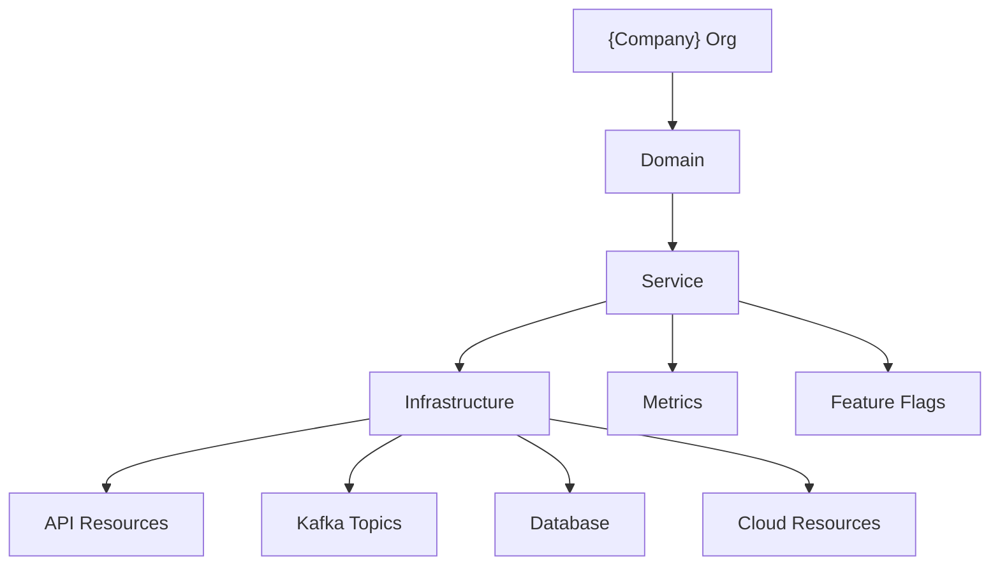

# 🏷️ Naming Conventions

  

---

## 🎯 1. Services & Repositories

Consistent naming across repos, services, and deployment artifacts eliminates guesswork when navigating the platform.

| Resource | Pattern | Example |
|----------|---------|---------|
| **Repository** | `{company}/{domain}-{service-name}` | `{company}/orders-service`, `{company}/customer-bff` |
| **Service name** | lowercase kebab-case `{domain}-{service-type}` | `orders-service`, `provider-bff`, `pricing-worker` |
| **Kubernetes namespace** | same as service name | `orders-service` |
| **Helm release** | same as service name | `orders-service` |
| **Docker image** | `{company}/{service-name}:{semver}-{sha7}` | `{company}/orders-service:1.2.3-a1b2c3d` |

### Allowed Service-Type Suffixes

| Suffix | Meaning |
|--------|---------|
| `-service` | Domain service exposing REST or gRPC APIs |
| `-bff` | Backend-for-Frontend, tailored for a specific client |
| `-worker` | Async consumer processing Kafka events |
| `-gateway` | Edge or API gateway |
| `-job` | Batch or scheduled workload |

---

## ☕ 2. Java Packages

| Layer | Pattern | Example |
|-------|---------|---------|
| **Base** | `com.{company}.{domain}` | `com.{company}.orders`, `com.{company}.pricing` |
| **Domain** | `com.{company}.{domain}.domain` | `com.{company}.orders.domain` |
| **Application** | `com.{company}.{domain}.application` | `com.{company}.orders.application` |
| **Infrastructure** | `com.{company}.{domain}.infrastructure` | `com.{company}.orders.infrastructure` |
| **API** | `com.{company}.{domain}.api` | `com.{company}.orders.api` |

```
com.{company}.orders
├── domain/           # Entities, value objects, domain events
├── application/      # Use cases, command/query handlers
├── infrastructure/   # DB repos, Kafka producers, HTTP clients
└── api/              # REST controllers, gRPC endpoints, DTOs
```

---

## 🌐 3. API & URLs

| Resource | Pattern | Example |
|----------|---------|---------|
| **REST path** | `/v{N}/{resource-plural}/{id}` | `/v1/orders/ord_abc123` |
| **gRPC package** | `{company}.{domain}.v{N}` | `{company}.orders.v1` |
| **Production host** | `api.{company}.com` | `api.{company}.com` |
| **Non-prod host** | `api-{env}.{company}.com` | `api-staging.{company}.com` |
| **Internal DNS** | `{service}.{company}.internal` | `orders-service.{company}.internal` |

### Resource ID Prefixes

Every externally-visible ID should carry a type prefix to avoid ambiguity:

| Entity | Prefix | Example |
|--------|--------|---------|
| Order | `ord_` | `ord_abc123` |
| Customer | `cus_` | `cus_xyz789` |
| Provider | `prv_` | `prv_def456` |
| Payment | `pay_` | `pay_gh1234` |
| Invoice | `inv_` | `inv_mn5678` |

---

## 📨 4. Kafka

| Resource | Pattern | Example |
|----------|---------|---------|
| **Topic** | `{domain}.{entity}.{event-verb}` | `orders.order.completed` |
| **Consumer group** | `{consuming-service}.{topic-short}.consumer` | `fulfillment-service.order-completed.consumer` |
| **Dead letter queue** | `{topic}.dlq` | `orders.order.completed.dlq` |
| **Schema subject** | `{topic}-value` | `orders.order.completed-value` |

### Naming Rules

- Topics use **lowercase dot-separated** names
- Event verbs are **past tense** (e.g., `created`, `completed`, `cancelled`)
- One entity type per topic - never mix `order.created` and `payment.received` in the same topic
- Retry topics: `{topic}.retry.{attempt}` (e.g., `orders.order.completed.retry.1`)

---

## 🗄️ 5. Databases

| Resource | Pattern | Example |
|----------|---------|---------|
| **Aurora cluster** | `{service}-cluster-{env}` | `orders-service-cluster-prod` |
| **Database name** | `{service_name}` (underscores) | `orders_service` |
| **Tables** | snake_case plural | `orders`, `order_events`, `order_line_items` |
| **Columns** | snake_case | `created_at`, `order_status`, `customer_id` |
| **Indexes** | `idx_{table}_{columns}` | `idx_orders_customer_id` |
| **Flyway migrations** | `V{NNN}__{description}.sql` | `V001__create_orders_table.sql` |

### Migration File Conventions

```sql
-- V001__create_orders_table.sql
CREATE TABLE orders (
    id          UUID PRIMARY KEY DEFAULT gen_random_uuid(),
    customer_id UUID        NOT NULL,
    status      VARCHAR(32) NOT NULL DEFAULT 'PENDING',
    total_cents BIGINT      NOT NULL,
    created_at  TIMESTAMPTZ NOT NULL DEFAULT now(),
    updated_at  TIMESTAMPTZ NOT NULL DEFAULT now()
);

CREATE INDEX idx_orders_customer_id ON orders (customer_id);
```

---

## ☁️ 6. Cloud Resources

| Resource | Pattern | Example |
|----------|---------|---------|
| **S3 bucket** | `{company}-{service}-{purpose}-{env}` | `{company}-orders-documents-prod` |
| **IAM role** | `{service}-{purpose}-role` | `orders-service-s3-role` |
| **Secrets Manager** | `{env}/{service}/{secret-name}` | `prod/orders-service/db-credentials` |
| **SSM Parameter** | `/{env}/{service}/{param-name}` | `/prod/orders-service/feature-config` |
| **CloudWatch alarm** | `{service}-{metric}-{threshold}` | `orders-service-error-rate-5pct` |
| **SQS queue** | `{service}-{purpose}-{env}` | `orders-service-notifications-prod` |
| **SNS topic** | `{service}-{purpose}-{env}` | `orders-service-alerts-prod` |

### Tagging Standard

Every AWS resource must carry these tags:

| Tag Key | Example Value |
|---------|---------------|
| `Service` | `orders-service` |
| `Environment` | `prod` |
| `Team` | `team-orders` |
| `CostCenter` | `orders-domain` |
| `ManagedBy` | `terraform` |

---

## 👁️ 7. Observability

| Resource | Pattern | Example |
|----------|---------|---------|
| **Prometheus metric** | `{domain}_{entity}_{metric_type}` | `orders_order_created_total` |
| **Histogram** | `{domain}_{entity}_duration_seconds` | `orders_order_duration_seconds` |
| **Labels** | snake_case | `service`, `method`, `status_code` |
| **Structured log fields** | camelCase | `traceId`, `userId`, `orderId` |
| **Alert name** | `{service}-{condition}-{severity}` | `orders-service-high-error-rate-p1` |
| **Grafana dashboard** | `{service}-overview` | `orders-service-overview` |

### Metric Type Suffixes

| Suffix | Prometheus Type | Usage |
|--------|----------------|-------|
| `_total` | Counter | Monotonically increasing count |
| `_seconds` | Histogram | Duration / latency measurement |
| `_bytes` | Histogram | Size measurement |
| `_ratio` | Gauge | Percentage / proportion (0.0–1.0) |
| `_info` | Gauge (always 1) | Metadata labels |

### Structured Log Example

```json
{
  "timestamp": "2026-03-15T10:23:45.123Z",
  "level": "INFO",
  "logger": "com.{company}.orders.application.CreateOrderUseCase",
  "message": "Order created",
  "traceId": "abc123def456",
  "spanId": "789ghi",
  "userId": "cus_xyz789",
  "orderId": "ord_abc123",
  "service": "orders-service",
  "environment": "prod"
}
```

---

## 🚩 8. Feature Flags

| Resource | Pattern | Example |
|----------|---------|---------|
| **LaunchDarkly key** | `{type}.{team}.{feature}.{yyyy-mm}` | `release.orders.express-checkout.2026-03` |
| **Targeting attribute** | camelCase | `userId`, `region`, `planTier` |

### Flag Type Prefixes

| Type | Purpose | Example |
|------|---------|---------|
| `release` | Gate new feature rollout | `release.orders.express-checkout.2026-03` |
| `experiment` | A/B test variant selection | `experiment.growth.signup-flow.2026-01` |
| `ops` | Operational toggle (circuit breaker, kill switch) | `ops.platform.kafka-fallback.2026-02` |
| `permission` | Entitlement / access control | `permission.billing.premium-reports.2026-04` |

### Lifecycle Rules

- Every flag key includes a **date suffix** - flags older than 6 months trigger a cleanup alert
- `release` flags must be removed within 30 days of full rollout
- `ops` flags are permanent and reviewed quarterly

---

## 📖 9. Quick Reference

| Category | Pattern | Example |
|----------|---------|---------|
| Repository | `{company}/{domain}-{service-name}` | `{company}/orders-service` |
| Service | `{domain}-{service-type}` | `orders-service` |
| Java package | `com.{company}.{domain}.{layer}` | `com.{company}.orders.domain` |
| REST path | `/v{N}/{resource-plural}/{id}` | `/v1/orders/ord_abc123` |
| gRPC package | `{company}.{domain}.v{N}` | `{company}.orders.v1` |
| Kafka topic | `{domain}.{entity}.{event-verb}` | `orders.order.completed` |
| Database table | snake_case plural | `order_events` |
| Flyway migration | `V{NNN}__{description}.sql` | `V001__create_orders_table.sql` |
| S3 bucket | `{company}-{service}-{purpose}-{env}` | `{company}-orders-documents-prod` |
| Prometheus metric | `{domain}_{entity}_{metric_type}` | `orders_order_created_total` |
| Feature flag | `{type}.{team}.{feature}.{yyyy-mm}` | `release.orders.express-checkout.2026-03` |
| Alert name | `{service}-{condition}-{severity}` | `orders-service-high-error-rate-p1` |

---

## 🗺️ 10. Naming Hierarchy



---

---
<div align="center">

⬅️ [Back to section](./README.md) · 🏠 [Back to root](../README.md)

</div>
