# 📁 Repository Standards

  

---

## 🎯 1. Required Files

Every service repository must contain the following files. Missing files are flagged by Backstage Soundcheck and block production readiness review.

| File / Directory | Purpose | Required? |
|-----------------|---------|-----------|
| `README.md` | Service description, quickstart, architecture | Yes |
| `CHANGELOG.md` | [Keep a Changelog](https://keepachangelog.com/) format | Yes |
| `catalog-info.yaml` | Backstage service catalog entry | Yes |
| `CODEOWNERS` | Team ownership for PR auto-assignment | Yes |
| `.github/pull_request_template.md` | Standardized PR checklist | Yes |
| `.github/workflows/` | CI pipeline (build, test, scan, deploy) | Yes |
| `docs/adr/` | Architecture Decision Records | Yes |
| `docs/runbook.md` | Operational runbook for on-call engineers | Yes |
| `AGENTS.md` | AI agent instructions - coding standards, architecture rules, forbidden patterns (see [Context Engineering](../12-ai-engineering/01-context-engineering.md)) | Yes |
| `.cursor/rules/` | Cursor-specific rules scoped by file pattern | Recommended |
| `.github/copilot-instructions.md` | GitHub Copilot workspace instructions | Recommended |
| `Dockerfile` | Container build instructions | Yes |
| `Makefile` | Standard build targets | Yes |
| `.gitignore` | Language-appropriate ignore rules | Yes |

### Makefile Standard Targets

Every `Makefile` must expose a **consistent interface** so any engineer can operate any service with the same commands.

**Required developer workflows** are the outcomes each target must achieve. **Stack-specific commands** are how a repository implements those outcomes (Gradle, npm, pip, Go modules, and so on). The manifesto mandates the interface, not the implementation.

#### Required Makefile Targets

| Target | Required Outcome |
|--------|------------------|
| `make setup` | Install all dependencies and configure local environment |
| `make run` | Start the service locally |
| `make test` | Run unit tests |
| `make lint` | Run linting and static analysis |
| `make build` | Produce a deployable artifact |

Other stacks (Node.js, Python, Go) must expose the same targets. The commands inside each target will differ but the interface remains consistent.

#### Reference implementation (Java/Gradle):

```makefile
.PHONY: setup build test lint run seed clean

setup:           ## Install dependencies and configure local environment
	./gradlew dependencies --no-daemon

build:           ## Compile the service
	./gradlew build -x test

test:            ## Run all tests (unit + integration)
	./gradlew test

lint:            ## Run static analysis and formatting checks
	./gradlew spotlessCheck

run:             ## Start the service locally
	./gradlew bootRun

seed:            ## Seed the local database with test data
	./gradlew flywayMigrate seedData

clean:           ## Remove build artifacts
	./gradlew clean
```

---

## 📝 2. README.md Template

Every service README follows this structure. A Backstage template auto-generates this on repository creation.

### Required Sections

| Section | Content |
|---------|---------|
| **Service Name** | `# {service-name}` with emoji matching the domain |
| **Badge Row** | Build status, coverage %, Backstage link |
| **Description** | One paragraph explaining what the service does and why it exists |
| **Architecture** | Mermaid diagram showing the service in context (dependencies, consumers) |
| **Quick Start** | Three commands maximum to go from clone to running |
| **API Reference** | Link to the OpenAPI spec or proto definitions |
| **Configuration** | Table of environment variables with defaults |
| **Contributing** | Link to this manifesto |
| **Team & On-Call** | Owning team name and PagerDuty escalation policy |

### Example Badge Row

```markdown


[](https://backstage.{company}.com/catalog/default/component/orders-service)
```

### Example Quick Start

```markdown
## 🚀 Quick Start

git clone git@github.com:{company}/orders-service.git
cd orders-service
make run
```

### Example Configuration Table

```markdown
| Variable | Default | Description |
|----------|---------|-------------|
| `SERVER_PORT` | `8080` | HTTP listen port |
| `DB_HOST` | `localhost` | PostgreSQL host |
| `DB_NAME` | `orders_service` | Database name |
| `KAFKA_BROKERS` | `localhost:9092` | MSK broker list |
```

---

## 🔐 3. Branch Protection Rules

The `main` branch is the single source of truth for production deployments. These rules are enforced via GitHub branch protection and cannot be overridden without VP Engineering approval.

| Rule | Setting |
|------|---------|
| Require pull request | Yes |
| Minimum approvals | 1 |
| Require CI passing | Yes (all required status checks) |
| Require branch up-to-date | Yes |
| Allow force push | No |
| Allow deletion | No |
| Dismiss stale reviews on push | Yes |
| Require CODEOWNERS review | Yes |

### Branch Naming

| Branch Type | Pattern | Example |
|-------------|---------|---------|
| Feature | `feat/{ticket}-{short-desc}` | `feat/ORD-123-express-checkout` |
| Bug fix | `fix/{ticket}-{short-desc}` | `fix/ORD-456-null-amount` |
| Chore | `chore/{short-desc}` | `chore/upgrade-spring-boot` |
| Release | `release/{version}` | `release/1.2.0` |
| Hotfix | `hotfix/{ticket}-{short-desc}` | `hotfix/ORD-789-payment-loop` |

---

## 📋 4. PR Template

All repositories must include `.github/pull_request_template.md` with this checklist:

```markdown
## Description

<!-- What does this PR do and why? -->

## Type of Change

- [ ] Feature (new functionality)
- [ ] Bug fix (non-breaking fix)
- [ ] Refactor (no functional change)
- [ ] Dependency update
- [ ] Documentation

## Checklist

- [ ] Tests added or updated
- [ ] Documentation updated (README, ADR, runbook)
- [ ] CHANGELOG.md updated
- [ ] No secrets or credentials in code
- [ ] Feature flag used for risky changes
- [ ] Observability added (metrics, logs, traces)
- [ ] Backward compatible (API, schema, events)
- [ ] Migration is safe (no table locks on large tables)
- [ ] Context files updated if standards changed (AGENTS.md, .cursor/rules/)

## Related Issues

Closes #{issue_number}
```

---

## 🔄 5. Repository Lifecycle

### Creation

All new repositories are created exclusively through Backstage software templates. Manual repository creation is not permitted.

The Backstage template automatically:

| Step | What Happens |
|------|-------------|
| 1. GitHub repo created | With branch protection, CODEOWNERS, and PR template |
| 2. CI pipeline configured | GitHub Actions workflows from golden path |
| 3. ArgoCD application added | GitOps manifest in the deploy repo |
| 4. Backstage entry registered | `catalog-info.yaml` committed and discovered |
| 5. PagerDuty service linked | On-call escalation policy attached |
| 6. Grafana dashboards provisioned | Standard service dashboard from template |
| 7. AI context files created | `AGENTS.md` and `.cursor/rules/` from runtime-specific template |

### Archival

When a service is deprecated:

| Step | Action |
|------|--------|
| 1. Update lifecycle | Set `spec.lifecycle: deprecated` in `catalog-info.yaml` |
| 2. Notify consumers | Post deprecation notice to `#platform-announcements` |
| 3. Remove traffic | Drain all incoming requests and event subscriptions |
| 4. Archive repo | Transfer to `{company}-archive/` GitHub organization |
| 5. Retain for 6 months | Archived repos are read-only for reference |

### Deletion

- Only permitted after 6 months in archive with **zero** incoming traffic
- Requires written approval from the service's original owning VP
- All Terraform resources must be decommissioned before repo deletion

### Lifecycle Flow

```mermaid
flowchart LR
    backstage["Backstage Template"]
    repo["GitHub Repo"]
    ci["CI Configured"]
    argo["ArgoCD Added"]
    catalog["Backstage Registered"]
    ready["Ready for Dev"]
    deprecated["Deprecated"]
    archived["Archived"]
    deleted["Deleted"]

    backstage --> repo
    repo --> ci
    ci --> argo
    argo --> catalog
    catalog --> ready
    ready --> deprecated
    deprecated --> archived
    archived --> deleted
```



---

## 📐 6. Architecture Decision Records

Every significant technical decision must be recorded in `docs/adr/` using the following format:

| Field | Description |
|-------|-------------|
| **Title** | `{NNN}-{short-description}.md` (e.g., `001-use-event-sourcing.md`) |
| **Status** | Proposed, Accepted, Deprecated, Superseded |
| **Context** | What is the problem or situation? |
| **Decision** | What did we decide? |
| **Consequences** | What are the trade-offs? |

### ADR Template

```markdown
# {NNN}. {Title}

**Status:** Accepted
**Date:** 2026-03-15
**Deciders:** @engineer-a, @engineer-b

## Context

<!-- What is the issue that we're seeing that is motivating this decision? -->

## Decision

<!-- What is the change that we're proposing and/or doing? -->

## Consequences

<!-- What becomes easier or harder to do because of this change? -->
```

### When an ADR Is Required

| Scenario | ADR Required? |
|----------|---------------|
| New external dependency (library, service) | Yes |
| Schema migration that is not backward-compatible | Yes |
| Deviation from platform standards | Yes |
| New infrastructure component (new DB, new queue) | Yes |
| Refactoring internal code structure | No |
| Upgrading a dependency to a newer version | No |

---

## 📖 7. CODEOWNERS

The `CODEOWNERS` file ensures the right team reviews every PR. Format:

```
# Default owner for everything in the repo
* @{company}/team-orders

# Platform-managed files require platform team review
.github/          @{company}/platform-engineering
Dockerfile        @{company}/platform-engineering
catalog-info.yaml @{company}/platform-engineering
```

### Rules

- Every repo must have a `CODEOWNERS` file at the repository root
- The default owner must be the team listed in `catalog-info.yaml` → `spec.owner`
- Platform-managed files (CI, Dockerfile, catalog entry) require `@{company}/platform-engineering` as a reviewer
- CODEOWNERS is enforced via branch protection ("Require review from Code Owners")

---

## 🗂️ 8. Documentation-Only Repositories

For documentation-only repositories like this manifesto, not every row in the **Required Files** table in section 1 applies. See [META.md](../META.md) for which standards apply to this repository and which are intentionally out of scope.

---

<div align="center">

⬅️ [Back to section](./README.md) · 🏠 [Back to root](../README.md)

</div>
