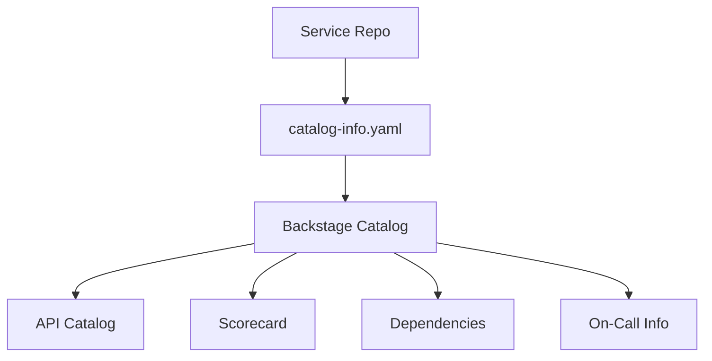

# 📋 Service Catalog Standards

  

---

## 🎯 1. Why a Service Catalog

A service catalog is the **single pane of glass** for every service on the platform. Without it, answering basic questions - who owns this service? what does it depend on? is it healthy? - requires tribal knowledge, Slack archaeology, or guesswork.

| Question | Without Catalog | With Catalog |
|----------|----------------|--------------|
| Who owns this service? | Grep through repos, ask in Slack | One click in Backstage |
| What does this service depend on? | Read source code, trace network calls | Dependency graph in Backstage |
| Is this service production-ready? | Manual checklist in a spreadsheet | Automated scorecard |
| Where is the runbook? | Search Confluence, hope it exists | Linked directly on the service page |
| Who is on-call right now? | Check PagerDuty manually | PagerDuty widget in Backstage |

**Backstage** is the platform for our service catalog. Every service, library, API, and infrastructure resource is registered in Backstage.

---

## 📄 2. catalog-info.yaml Specification

Every repository must contain a `catalog-info.yaml` at the root. This file is the source of truth for Backstage discovery.

### Required Fields

```yaml
apiVersion: backstage.io/v1alpha1
kind: Component
metadata:
  name: orders-service
  description: "Order lifecycle management - creation, fulfillment, cancellation"
  tags:
    - java
    - spring-boot
    - tier-1
    - orders-domain
  annotations:
    github.com/project-slug: "{Company}/orders-service"
    pagerduty.com/service-id: "P1A2B3C"
    grafana/dashboard-url: "https://grafana.{Company}.com/d/orders-service-overview"
    backstage.io/techdocs-ref: dir:.
spec:
  type: service
  lifecycle: production
  owner: team-orders
  system: orders
  dependsOn:
    - component:pricing-service
    - component:fulfillment-service
    - resource:orders-db
    - resource:orders-cache
  providesApis:
    - orders-api
  consumesApis:
    - pricing-api
    - fulfillment-api
```

### Field Reference

| Field | Required | Description |
|-------|----------|-------------|
| `metadata.name` | Yes | Unique identifier, matches repo and service name |
| `metadata.description` | Yes | One-line human-readable purpose |
| `metadata.tags` | Yes | Language, framework, tier, domain (see Section 3) |
| `annotations.github.com/project-slug` | Yes | Links Backstage to the GitHub repo |
| `annotations.pagerduty.com/service-id` | Yes | Links to PagerDuty for on-call display |
| `annotations.grafana/dashboard-url` | Yes | Links to the primary Grafana dashboard |
| `spec.type` | Yes | `service`, `library`, or `website` |
| `spec.lifecycle` | Yes | `experimental`, `production`, or `deprecated` |
| `spec.owner` | Yes | Team entity in Backstage (e.g., `team-orders`) |
| `spec.system` | Yes | The bounded context / domain this belongs to |
| `spec.dependsOn` | Yes | List of components and resources this service depends on |
| `spec.providesApis` | Conditional | Required if the service exposes any API |
| `spec.consumesApis` | Conditional | Required if the service calls other APIs |

### Component Types

| Type | When to Use | Example |
|------|-------------|---------|
| `service` | A deployed, running application | `orders-service`, `pricing-worker` |
| `library` | A shared library published to an artifact registry | `platform-bom`, `common-auth` |
| `website` | A frontend application or documentation site | `customer-portal`, `docs-site` |

---

## 🏷️ 3. Required Tags

Tags enable filtering, grouping, and reporting across the catalog. Every component must include tags from each of the following categories.

### Tier Tags

| Tag | Meaning | SLO Requirement |
|-----|---------|-----------------|
| `tier-1` | Revenue-critical path, customer-facing | 99.95% availability |
| `tier-2` | Important but not directly revenue-impacting | 99.9% availability |
| `tier-3` | Internal tooling, non-critical batch jobs | 99.5% availability |

### Technology Tags

| Tag | When to Apply |
|-----|---------------|
| `java` | Java-based service |
| `typescript` | TypeScript frontend or BFF |
| `python` | Python service or data pipeline |
| `spring-boot` | Uses Spring Boot framework |
| `react` | React frontend |
| `react-native` | React Native mobile app |

### Domain Tags

Apply the domain name as a tag (e.g., `orders-domain`, `pricing-domain`, `fulfillment-domain`). This enables filtering the catalog by business domain.

---

## 🔄 4. Lifecycle States

Every service must declare its lifecycle state in `catalog-info.yaml`. The state determines operational expectations.

| State | Description | SLO Enforced? | New Consumers Allowed? | On-Call Required? |
|-------|-------------|---------------|----------------------|-------------------|
| `experimental` | Pre-production, under active development | No | No | No |
| `production` | Live traffic, serving customers | Yes | Yes | Yes |
| `deprecated` | Sunset in progress, migrating consumers away | Yes (existing) | No | Yes |

### Lifecycle Transitions

| Transition | Trigger | Approval |
|------------|---------|----------|
| `experimental` → `production` | Production Readiness Review (PRR) passed | Platform team + service owner |
| `production` → `deprecated` | Business decision to sunset | VP Engineering + service owner |
| `deprecated` → removal | All consumers migrated, 6 months in archive | Platform team |

---

## 🔌 5. API Registration

Every API exposed by a service must be registered as a separate entity in Backstage, linked to its specification.

### REST APIs

```yaml
apiVersion: backstage.io/v1alpha1
kind: API
metadata:
  name: orders-api
  description: "Order management REST API"
  tags:
    - rest
    - orders-domain
spec:
  type: openapi
  lifecycle: production
  owner: team-orders
  system: orders
  definition:
    $text: ./openapi/orders-api.yaml
```

### gRPC APIs

```yaml
apiVersion: backstage.io/v1alpha1
kind: API
metadata:
  name: pricing-grpc-api
  description: "Real-time pricing calculation gRPC service"
  tags:
    - grpc
    - pricing-domain
spec:
  type: grpc
  lifecycle: production
  owner: team-pricing
  system: pricing
  definition:
    $text: ./proto/pricing/v1/pricing.proto
```

### API Discoverability Rules

| Rule | Detail |
|------|--------|
| Every REST API has an OpenAPI spec | Stored in `openapi/` directory, auto-published to Backstage |
| Every gRPC service has proto definitions | Stored in `proto/` directory, linked in the API entity |
| API specs are versioned | Path includes `/v{N}/`, proto package includes `.v{N}` |
| Breaking changes require a new version | `v1` → `v2`; old version supported for 6 months minimum |
| API entity linked to component | Via `spec.providesApis` in the component's `catalog-info.yaml` |

---

## 📊 6. Service Scorecards

Backstage Soundcheck (or equivalent) continuously evaluates every service against the manifesto standards. Scores are visible on each service's Backstage page.

### Scorecard Dimensions

| Dimension | Checks | Weight |
|-----------|--------|--------|
| **Observability** | SLOs defined, Grafana dashboard exists, alerts configured | 20% |
| **Security** | No critical CVEs, secrets rotated, image signed | 20% |
| **Documentation** | README complete, runbook exists, ADRs present | 20% |
| **Testing** | Coverage > 80%, contract tests passing, E2E tests exist | 20% |
| **Operations** | On-call configured, PRR completed, incident playbook linked | 20% |

### Score Thresholds

| Score | Rating | Consequence |
|-------|--------|-------------|
| 90–100% | Gold | Eligible for reduced review requirements |
| 70–89% | Silver | Standard operating mode |
| 50–69% | Bronze | Improvement plan required within 30 days |
| < 50% | Red | Escalation to VP Engineering, blocked from new feature work |

### Example Scorecard

```
orders-service                          Score: 92% (Gold)
────────────────────────────────────────────────────────
Observability   ██████████████████████  100%  ✅
Security        ██████████████████░░░░   85%  ✅
Documentation   ██████████████████████  100%  ✅
Testing         █████████████████░░░░░   80%  ✅
Operations      ███████████████████████  95%  ✅
```

---

## 👥 7. Ownership Enforcement

Every service must have a clearly defined owning team. Unowned services are a liability - no one responds to incidents, no one reviews PRs, no one maintains dependencies.

### Rules

| Rule | Detail |
|------|--------|
| Every service has an owner | `spec.owner` in `catalog-info.yaml` must reference a valid Backstage team entity |
| Monthly orphan scan | Platform team runs automated scan for services without a valid owner |
| Orphan escalation | Unowned services are escalated to the relevant VP within 5 business days |
| Ownership transfer | Requires a PR to `catalog-info.yaml`, approved by **both** the old and new owning team |

### Ownership Transfer Checklist

| Step | Action |
|------|--------|
| 1 | New owner reviews service scorecard and accepts current state |
| 2 | Update `spec.owner` in `catalog-info.yaml` |
| 3 | Update `CODEOWNERS` file |
| 4 | Transfer PagerDuty escalation policy |
| 5 | Update Grafana dashboard ownership |
| 6 | Knowledge transfer session (architecture, known issues, operational quirks) |

---

## 🗺️ 8. Catalog Architecture



---

---
<div align="center">

⬅️ [Back to section](./README.md) · 🏠 [Back to root](../README.md)

</div>
