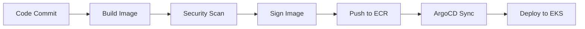

# 🐳 Container & Artifact Standards

  

---

## 🎯 1. Base Images

All container images must use platform-approved base images. The platform team maintains and patches these images monthly, tracked in `platform-bom`.

| Service Type | Base Image | Notes |
|-------------|------------|-------|
| Java services | `amazoncorretto:21-alpine` | Production runtime for all JVM services |
| Node.js (frontend builds) | `node:20-alpine` | Build stage only — not for production runtime |
| Static frontends | `nginx:1.27-alpine` | Serving pre-built SPA bundles |

### Base Image Rules

| Rule | Detail |
|------|--------|
| Never use `:latest` | Tags must be pinned to a specific version |
| Non-root execution | All containers run as a non-root user (UID 1000+) |
| Alpine preferred | Minimal attack surface, smaller image size |
| Monthly updates | Platform team rebuilds base images monthly with latest patches |
| Track in BOM | Approved base image versions listed in `platform-bom` |

---

## 📦 2. Dockerfile Standards

All services must use multi-stage builds. The final image contains only the runtime and the built artifact — never source code, build tools, or test dependencies.

### Reference Dockerfile (Java / Spring Boot)

```dockerfile
# ── Build Stage ──
FROM amazoncorretto:21-alpine AS build
WORKDIR /workspace

COPY gradle/ gradle/
COPY gradlew build.gradle.kts settings.gradle.kts ./
RUN ./gradlew dependencies --no-daemon

COPY src/ src/
RUN ./gradlew bootJar --no-daemon -x test

# ── Runtime Stage ──
FROM amazoncorretto:21-alpine

LABEL org.opencontainers.image.source="https://github.com/{Company}/orders-service"
LABEL org.opencontainers.image.version="1.0.0"

RUN addgroup -S appgroup && adduser -S appuser -G appgroup
WORKDIR /app

COPY --from=build /workspace/build/libs/*.jar app.jar

USER appuser
EXPOSE 8080

HEALTHCHECK --interval=15s --timeout=3s --retries=3 \
  CMD wget -qO- http://localhost:8080/actuator/health || exit 1

ENTRYPOINT ["java", "-jar", "app.jar"]
```

### Dockerfile Checklist

| Requirement | Why |
|-------------|-----|
| Multi-stage build | Keeps build tools out of production image |
| `COPY` only built artifact | No source code, no `.git`, no test files in final image |
| `HEALTHCHECK` instruction | Enables Docker and orchestrator health monitoring |
| OCI labels (`org.opencontainers.image.*`) | Traceability — link image to source repo and version |
| Non-root `USER` | Defense in depth — limits container escape impact |
| `.dockerignore` | Prevents unnecessary files from entering the build context |

### Required .dockerignore

```
.git
.github
.idea
.vscode
*.md
docs/
node_modules/
build/
target/
*.log
.env
.env.*
```

---

## 🏷️ 3. Image Tagging

Immutable, traceable tags are mandatory. Every production image must be traceable back to a specific commit.

| Rule | Detail |
|------|--------|
| **Tag format** | `{major}.{minor}.{patch}-{git-sha-7}` |
| **Example** | `1.2.3-a1b2c3d` |
| **Git tag match** | The git tag `v1.2.3` corresponds to image `1.2.3-a1b2c3d` |
| **Immutable** | Never overwrite a published tag |
| **No `:latest`** | Never push or deploy using `:latest` |

### Versioning Rules

| Scenario | Version Bump |
|----------|-------------|
| Breaking API change (new `/v{N+1}/`) | Major |
| New feature, backward compatible | Minor |
| Bug fix, no API change | Patch |
| Pre-release / release candidate | `1.2.3-rc.1-a1b2c3d` |

### ECR Lifecycle Policy

| Rule | Detail |
|------|--------|
| Keep tagged images | Last 20 tagged images retained |
| Delete untagged images | After 7 days |
| No manual deletion | ECR lifecycle policy handles cleanup |

```json
{
  "rules": [
    {
      "rulePriority": 1,
      "description": "Remove untagged images after 7 days",
      "selection": {
        "tagStatus": "untagged",
        "countType": "sinceImagePushed",
        "countUnit": "days",
        "countNumber": 7
      },
      "action": { "type": "expire" }
    },
    {
      "rulePriority": 2,
      "description": "Keep last 20 tagged images",
      "selection": {
        "tagStatus": "tagged",
        "tagPrefixList": ["v"],
        "countType": "imageCountMoreThan",
        "countNumber": 20
      },
      "action": { "type": "expire" }
    }
  ]
}
```

---

## 📏 4. Image Size Limits

Large images slow down deployments, increase cold-start times, and waste bandwidth. CI enforces size limits.

| Service Type | Maximum Size | How to Achieve |
|-------------|-------------|----------------|
| Java services | < 300 MB | Alpine base + layered JAR + no build tools |
| Node.js frontends | < 200 MB | Multi-stage build + nginx for serving |
| Go binaries | < 50 MB | Scratch or distroless base |

### CI Enforcement

```yaml
# In GitHub Actions workflow
- name: Check image size
  run: |
    IMAGE_SIZE=$(docker image inspect $IMAGE --format='{{.Size}}')
    MAX_SIZE=314572800  # 300MB in bytes
    if [ "$IMAGE_SIZE" -gt "$MAX_SIZE" ]; then
      echo "Image size ${IMAGE_SIZE} exceeds limit ${MAX_SIZE}"
      exit 1
    fi
```

### Size Reduction Techniques

| Technique | Impact |
|-----------|--------|
| Use Alpine base images | ~200 MB smaller than Debian-based |
| Multi-stage builds | Eliminates build tools (Gradle, npm) from final image |
| Spring Boot layered JARs | Separates dependencies into cacheable layers |
| `.dockerignore` | Prevents large files from entering build context |
| Minimize installed packages | No curl, wget, or shells unless required for healthcheck |

---

## 🔍 5. Security Scanning

Every container image is scanned at multiple stages. No image with a critical vulnerability reaches production.

### Scan Pipeline

| Stage | Tool | Trigger | SLA |
|-------|------|---------|-----|
| **Build-time scan** | Snyk Container | Every CI build | Block merge on critical/high |
| **Push-time scan** | ECR Enhanced Scanning | Every image push to ECR | Alert on critical |
| **Weekly re-scan** | Platform team batch job | Cron (Sunday 02:00 UTC) | Critical CVE in base image → patch within 48h |
| **Runtime scan** | ECR continuous monitoring | Continuous | Alert on newly disclosed CVEs |

### Vulnerability SLAs

| Severity | Response Time | Action |
|----------|--------------|--------|
| Critical | 48 hours | Patch and redeploy immediately |
| High | 7 days | Plan patch in current sprint |
| Medium | 30 days | Address in next sprint |
| Low | 90 days | Address when convenient |

### Snyk CI Integration

```yaml
- name: Snyk container scan
  uses: snyk/actions/docker@master
  env:
    SNYK_TOKEN: ${{ secrets.SNYK_TOKEN }}
  with:
    image: ${{ env.IMAGE_TAG }}
    args: --severity-threshold=high --fail-on=all
```

---

## ✍️ 6. Image Signing

All production images must be cryptographically signed. Unsigned images are rejected by the cluster admission controller.

| Aspect | Detail |
|--------|--------|
| **Signing tool** | [cosign](https://github.com/sigstore/cosign) |
| **Signature storage** | ECR repository alongside the image |
| **Signing key** | Managed by platform team in AWS KMS |
| **CI signing** | Automatic after successful scan |
| **Admission controller** | Kyverno policy rejects unsigned images in production namespaces |

### CI Signing Step

```yaml
- name: Sign image with cosign
  run: |
    cosign sign --key awskms:///alias/container-signing \
      $ECR_REGISTRY/$SERVICE_NAME:$IMAGE_TAG
```

### Kyverno Policy (Simplified)

```yaml
apiVersion: kyverno.io/v1
kind: ClusterPolicy
metadata:
  name: require-signed-images
spec:
  validationFailureAction: Enforce
  rules:
    - name: check-signature
      match:
        any:
          - resources:
              kinds: ["Pod"]
              namespaces: ["*-prod"]
      verifyImages:
        - imageReferences: ["*.dkr.ecr.*.amazonaws.com/*"]
          attestors:
            - entries:
                - keys:
                    kms: "awskms:///alias/container-signing"
```

---

## 🏗️ 7. Registry Standards

Amazon ECR is the single approved container registry. No other registry (Docker Hub, GHCR, Quay) may be used for production images.

| Rule | Detail |
|------|--------|
| **Registry** | Amazon ECR (one account per environment) |
| **Repository naming** | `{Company}/{service-name}` |
| **Cross-account access** | ECR pull-through cache for non-prod accounts |
| **Public images** | Prohibited in production — use approved mirrors |
| **Image pull policy** | `IfNotPresent` for tagged images, never `Always` |

### Repository Structure

```
ECR (prod account)
├── {Company}/orders-service
├── {Company}/pricing-service
├── {Company}/fulfillment-worker
├── {Company}/customer-bff
└── {Company}/platform-base-images
    ├── corretto-21-alpine
    └── nginx-1.27-alpine
```

### Mirror Policy

External dependencies (e.g., Redis, PostgreSQL for local dev) must be pulled through an approved ECR pull-through cache — never directly from Docker Hub in CI or production.

| Source | Approved Mirror |
|--------|----------------|
| Docker Hub | `{account-id}.dkr.ecr.{region}.amazonaws.com/docker-hub/` |
| Quay.io | `{account-id}.dkr.ecr.{region}.amazonaws.com/quay/` |
| GitHub Container Registry | `{account-id}.dkr.ecr.{region}.amazonaws.com/ghcr/` |

---

## 🗺️ 8. Build-to-Deploy Pipeline



---

---
<div align="center">

⬅️ [Back to section](./README.md) · 🏠 [Back to root](../README.md)

</div>
