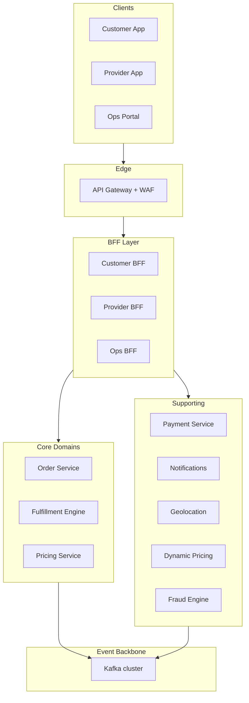
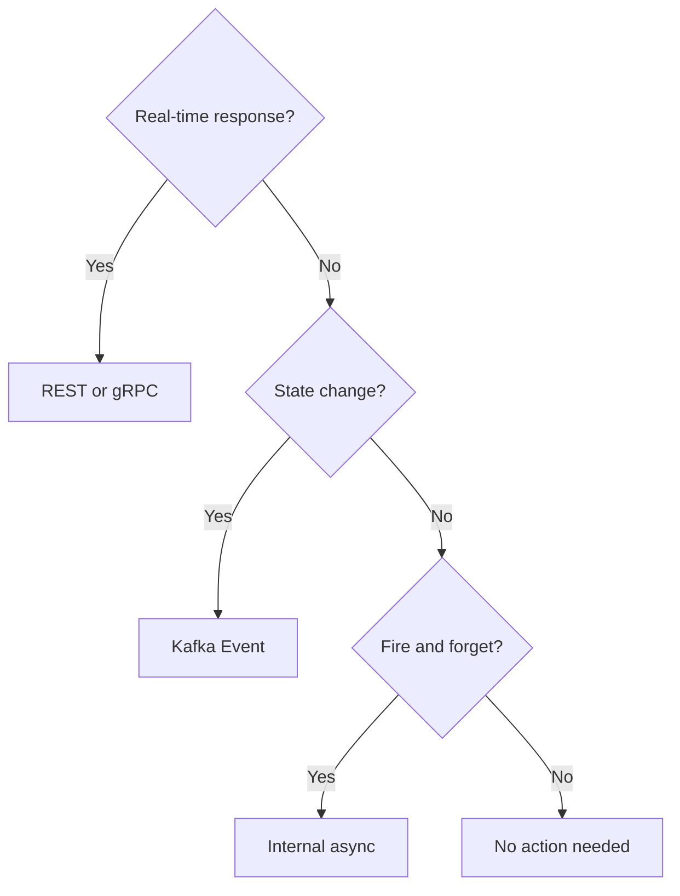

# 🏛️ System Architecture Blueprint

  

---

## 🎯 1. Architectural Philosophy

> **Principle:** Bounded contexts, BFFs, the event backbone, and sync vs async boundaries in this document are **language- and framework-agnostic**. Names of specific products (managed messaging, gateways, data stores, resilience libraries) describe {Company}'s **reference implementation**, not the only allowed stack.

Our architecture is **domain-driven, event-native, and designed for independent deployability**. Every architectural decision should be evaluated against three questions:

1. Can this service be deployed independently without coordinating with another team?
2. Can this service fail without cascading failures across the platform?
3. Can an engineer understand what this service does by reading its code alone?

If the answer to any of these is "no", the design needs to change.

---

## 🧩 2. Domain Decomposition

The platform naturally decomposes into the following bounded contexts. Each domain owns its data, its events, and its API contracts. **No domain may directly access another domain's database.**

```
┌─────────────────────────────────────────────────────────────────┐
│                         API Gateway Layer                        │
│           (API gateway + L7 load balancer per surface)          │
└────────┬──────────┬──────────┬───────────┬──────────────────────┘
         │          │          │           │
    ┌────▼───┐ ┌────▼───┐ ┌───▼────┐ ┌────▼────┐
    │Customer│ │Provider│ │  Ops   │ │ Partner │
    │  BFF   │ │  BFF   │ │  BFF   │ │   BFF   │
    └────┬───┘ └────┬───┘ └───┬────┘ └────┬────┘
         │          │          │           │
         └──────────┴──────────┴───────────┘
                          │
              ┌───────────▼────────────┐
              │     Internal Services  │
              │                        │
  ┌───────────┼────────────────────────┼───────────┐
  │           │                        │           │
┌─▼──────┐ ┌─▼──────┐ ┌──────────┐ ┌──▼─────┐ ┌──▼─────┐
│Fulfill-│ │Pricing │ │  Orders  │ │Provider│ │Customer│
│ment    │ │Service │ │ Service  │ │Profile │ │Profile │
│ Engine │ │        │ │          │ │        │ │        │
└─┬──────┘ └─┬──────┘ └──┬───────┘ └─┬──────┘ └─┬──────┘
  │          │            │            │           │
  └──────────┴────────────┴────────────┴───────────┘
                          │
               ┌──────────▼──────────┐
               │   Supporting Domains │
               │                      │
  ┌────────────┼──────────────────────┼────────────┐
  │            │                      │            │
┌─▼──────┐ ┌──▼─────┐ ┌──────────┐ ┌──▼─────┐ ┌──▼─────┐
│Payment │ │Notific-│ │Geoloc. / │ │Dynamic │ │ Fraud  │
│Service │ │ations  │ │ Routing  │ │Pricing │ │ Engine │
└────────┘ └────────┘ └──────────┘ └────────┘ └────────┘
                          │
               ┌──────────▼──────────┐
               │   Event Backbone     │
               │   (Kafka cluster)    │
               └─────────────────────┘
```

**Visual overview (Mermaid version):**



---

## 🧩 3. Domain Ownership Map

| Domain | Core Responsibility | Key Entities | Owned Data Store |
|--------|--------------------|--------------|--------------------|
| **Fulfillment Engine** | Real-time provider-customer assignment | FulfillmentResult, Assignment | Redis (geospatial) |
| **Pricing Service** | Price calculation, dynamic pricing | Price, PriceEstimate | Aurora PostgreSQL |
| **Orders Service** | Order lifecycle management | Order, OrderEvent | Aurora PostgreSQL |
| **Provider Profile** | Provider onboarding, documents, ratings | Provider, Document, Rating | RDS PostgreSQL |
| **Customer Profile** | Customer account, preferences, history | Customer, PaymentMethod | RDS PostgreSQL |
| **Payment Service** | Payment processing, settlements | Payment, Payout, Wallet | Aurora PostgreSQL |
| **Notifications** | Push, SMS, email dispatch | Notification, Template | RDS PostgreSQL |
| **Geolocation / Routing** | ETA, route calculation, geocoding | Route, ETA | (proxies external APIs) |
| **Dynamic Pricing** | Demand/supply signals, multiplier | PricingZone, PricingMultiplier | Redis + RDS |
| **Fraud Engine** | Real-time fraud signals, blocking | Signal, RiskScore | Aurora PostgreSQL |

---

## 📡 4. Communication Patterns

### 4.1 Synchronous (Request/Response)

Use for: **user-facing requests where a real-time response is required.**

- **External (client → BFF → service):** REST over HTTPS via API Gateway
- **Internal (service → service):** gRPC with mutual TLS
- **Timeout policy:** All synchronous calls must have explicit timeouts (default: 2s for internal, 5s for external dependencies)
- **Retry policy:** Exponential backoff with jitter, max 3 retries, only on idempotent operations
- **Circuit breaker:** Mandatory on all synchronous outbound calls (reference: Resilience4j on the JVM; equivalent policies required on other stacks)

> **Substitution point:** Use your language or mesh-native equivalent for timeouts, retries, circuit breaking, and bulkheads (e.g. Polly on .NET, go-kit resilience, Envoy outlier detection where policy allows).

### 4.2 Asynchronous (Event-Driven)

Use for: **state changes that other domains need to react to, but not in the critical path of a user request.**

- **Platform:** Kafka on a managed cluster (reference: Amazon MSK)
- **Producer rule:** A service publishes events about its own domain - it does not publish commands to other services
- **Consumer rule:** Consumers are responsible for idempotency - the same event may be delivered more than once
- **Schema:** Avro with a governed registry (reference: AWS Glue Schema Registry; alternatives include Confluent Schema Registry, Apicurio) - breaking schema changes are forbidden; use schema evolution rules

### 4.3 Decision Guide

```
Is a real-time response required by the user?
  └─ YES → REST (external) or gRPC (internal)
  └─ NO → Is it a state change other domains care about?
            └─ YES → Kafka event
            └─ NO → Is it fire-and-forget within one service?
                       └─ YES → Internal async (tasks / virtual threads)
```

> **Substitution point:** "Internal async" maps to your runtime's non-blocking or task APIs (e.g. CompletableFuture or virtual threads on the JVM, asyncio in Python, goroutines in Go).

**Visual overview:**



---

## 📨 5. Event Backbone - Kafka Topics

### 5.1 Topic Naming Convention

```
{domain}.{entity}.{event-verb}

Examples:
  orders.order.started
  orders.order.completed
  orders.order.cancelled
  providers.provider.location-updated
  payments.payment.captured
  payments.payment.failed
  customers.customer.registered
  fraud.signal.raised
```

### 5.2 Core Domain Events (Non-Exhaustive)

| Topic | Producer | Key Consumers | Retention |
|-------|----------|---------------|-----------|
| `orders.order.requested` | Orders Service | Fulfillment Engine, Fraud Engine, Analytics | 7 days |
| `orders.order.matched` | Orders Service | Notifications, Analytics | 7 days |
| `orders.order.started` | Orders Service | Dynamic Pricing, Notifications, Analytics | 7 days |
| `orders.order.completed` | Orders Service | Payments, Notifications, Analytics | 30 days |
| `orders.order.cancelled` | Orders Service | Payments, Fulfillment, Notifications | 7 days |
| `fulfillment.assignment.found` | Fulfillment Engine | Orders Service | 7 days |
| `providers.provider.location-updated` | Provider App → Location Service | Fulfillment Engine, Dynamic Pricing | 1 hour |
| `payments.payment.captured` | Payment Service | Orders Service, Notifications | 30 days |
| `providers.provider.status-changed` | Provider Profile | Fulfillment Engine | 7 days |

### 5.3 Consumer Group Naming

```
{consuming-service}.{topic-short-name}.consumer

Example: notifications.order-completed.consumer
```

---

## 🌐 6. API Gateway & BFF Pattern

### 6.1 Why BFF

Each client surface has different data needs. A single API layer serving all clients leads to over-fetching, versioning nightmares, and tight coupling between the platform and app release cycles.

### 6.2 BFF Responsibilities

- Authentication token validation (JWT verification)
- Request aggregation (one BFF call → multiple internal service calls)
- Response shaping per client (mobile needs different payloads than web)
- Rate limiting per client
- Client-specific caching

### 6.3 BFF Anti-Patterns (Forbidden)

- Business logic in BFFs - BFFs orchestrate, they do not calculate
- Direct database access from BFFs
- BFFs calling other BFFs
- Shared BFF across two different client surfaces

---

## 🗄️ 7. Data Architecture Principles

### 7.1 Database-per-Service

Every service owns exactly one logical database. No exceptions.

- Services communicate via APIs or events, never via shared database tables
- Reporting and analytics data is projected into a separate data warehouse (reference: Amazon Redshift) via change data capture (CDC) using Debezium → Kafka → the warehouse sink

### 7.2 CQRS Where Applicable

For read-heavy domains (order history, provider listings), implement CQRS:
- **Write model:** Normalised relational store (Aurora)
- **Read model:** Denormalised projection (OpenSearch or a read replica)
- Projections are rebuilt from events - they are not the source of truth

### 7.3 Eventual Consistency Rules

- Services must explicitly document which of their operations are eventually consistent
- UI must handle eventual consistency gracefully (optimistic updates, polling, or websocket push)
- SLAs for eventual consistency propagation must be defined per event type

---

## 🛡️ 8. Resilience Patterns - Mandatory

Every service must implement the following:

| Pattern | Library (reference) | Applied To |
|---------|---------------------|-----------|
| **Circuit Breaker** | Resilience4j (JVM) | All synchronous outbound calls |
| **Retry with backoff** | Resilience4j (JVM) | Idempotent outbound calls |
| **Bulkhead** | Resilience4j (JVM) | Isolate thread pools per downstream |
| **Timeout** | Resilience4j / Spring WebClient (JVM) | All outbound calls - no unbounded waits |
| **Dead Letter Queue** | Kafka DLQ topic | All Kafka consumers |
| **Idempotency** | Custom (idempotency key in DB) | All payment and mutation operations |

---

## 🔒 9. Security Architecture

> **Reference implementation (cloud / Kubernetes):** The bullets below assume {Company}'s default AWS and Kubernetes posture. Equivalent controls (workload identity, secrets stores, mesh mTLS) are required on any platform.

- **Zero-trust networking:** No service trusts another based on network location alone
- **mTLS:** All service-to-service gRPC calls use mutual TLS (Istio handles this)
- **JWT:** All external API calls carry a signed JWT; BFFs validate and strip before forwarding
- **IRSA:** All AWS API calls from pods use IAM Roles for Service Accounts - no static credentials
- **No secrets in environment variables** - all secrets from AWS Secrets Manager at startup

---

## 📏 10. Architecture Decision Records (ADRs)

Any deviation from this blueprint, or any significant architectural decision, must be recorded as an ADR in `docs/adr/` in the relevant repository.

ADR template:
```
# ADR-NNN: Title

**Date:** YYYY-MM-DD  
**Status:** Proposed | Accepted | Deprecated  
**Deciders:** [names]

## Context
What problem are we solving?

## Decision
What did we decide?

## Consequences
What are the trade-offs?

## Alternatives Considered
What did we not pick, and why?
```

---

## 🛡️ 11. Resilience Ownership Matrix

Clear ownership of resilience concerns prevents two failure modes: gaps (nobody owns it) and conflicts (two layers both retry, both rate-limit, or both timeout with competing configurations).

| Concern | Owner | Tool | Configuration |
|---------|-------|------|---------------|
| **mTLS** | Istio (platform) | Istio `PeerAuthentication` | Platform team manages globally; `STRICT` mode enforced cluster-wide |
| **Outlier detection** | Istio (platform) | `DestinationRule` | Platform provides sensible defaults (consecutive 5xx eviction); teams may override via annotation on their `DestinationRule` |
| **Retries (HTTP/gRPC)** | Application | Resilience4j (reference, JVM) | Application configures per-downstream call; **Istio retries are DISABLED globally** to prevent double-retry amplification |
| **Circuit breaker** | Application | Resilience4j (reference, JVM) | Application configures per-downstream; thresholds tuned based on downstream SLOs |
| **Timeout** | Application | Resilience4j + Spring `WebClient` / `RestClient` (reference, JVM) | Application sets per-call timeout; Istio timeout set to **2× the application timeout** as a safety net only |
| **Rate limiting (inbound)** | API Gateway + BFF | Managed API gateway (reference: AWS) + application logic | Gateway handles global rate limits per tier; BFF handles per-user and per-session limits |
| **Bulkhead** | Application | Resilience4j (reference, JVM) | Thread pool (or semaphore) isolation per downstream dependency; prevents a slow downstream from consuming all threads |

### Anti-Pattern: Double Retries

> **If both Istio and the application retry, a single failure can generate N × M requests.** For example, if the application retries 3 times and Istio retries 3 times, one failed request produces up to 9 downstream requests - turning a minor failure into a self-inflicted DDoS.
>
> **Resolution:** Istio retries are **disabled globally** via mesh-wide configuration. Applications own all retry logic (reference: Resilience4j on the JVM), where they can implement intelligent retry strategies (exponential backoff, jitter, retry budgets) with full awareness of the operation's idempotency and downstream capacity.

### Ownership Boundaries

- **Platform team** owns Istio configuration, mesh-wide policies, and the default `DestinationRule` settings. Changes require a PR to the platform infrastructure repo.
- **Application teams** own all client resilience configuration within their service (reference: Resilience4j in `application.yml` on Spring Boot). Configuration is reviewed as part of the Production Readiness Review (PRR).
- If a resilience concern is not listed in this table, the **application team** owns it by default.

---

## 🧩 12. Read-Your-Own-Writes

### 12.1 The Problem

In a system with read replicas (Aurora reader endpoints), a user who writes data and then immediately reads it back may see stale data - the write has not yet replicated to the reader. This creates confusing UX: "I just updated my profile, but it still shows the old name."

### 12.2 Pattern: Consistency Token

After a write operation, the writing service returns a **consistency token** - typically the last write timestamp or a monotonically increasing sequence number - in the response.

```json
{
  "data": { "profileId": "usr_abc123", "name": "Jane Doe" },
  "meta": {
    "consistencyToken": "2024-11-15T14:30:00.123456Z"
  }
}
```

The client includes this token in subsequent read requests:

```
GET /v1/customers/usr_abc123/profile
X-Consistency-Token: 2024-11-15T14:30:00.123456Z
```

### 12.3 Routing Logic

The BFF (or the service itself) examines the consistency token:

1. If the token indicates a recent write (within the replication lag window, typically < 1 second for Aurora), route the read to the **primary (writer) endpoint**
2. If no token is present, or the token is older than the replication window, route to the **reader endpoint** (replica)

### 12.4 Implementation Options

> **Reference implementation:** The first row below uses Aurora PostgreSQL and JDBC. The pattern (route fresh reads to the writer) applies to any primary/replica database.

| Approach | How It Works | Trade-off |
|----------|-------------|-----------|
| **Aurora `target_session_attrs=read-write` fallback** | JDBC connection property that falls back to the writer endpoint if the reader cannot satisfy the session's consistency requirement | Simple but couples routing to the JDBC driver |
| **Explicit primary routing for N seconds** | After a write, the BFF routes all reads for that user to the primary for a fixed window (e.g., 5 seconds) | Time-based - may over-route to primary, but simple and predictable |
| **Sequence-based routing** | Compare the consistency token (sequence number) against the replica's last applied sequence; route to primary if replica is behind | Most precise but requires querying replica lag per request |

The recommended default is **explicit primary routing for 5 seconds after write** - it is simple, predictable, and sufficient for user-facing flows.

### 12.5 Scope

Read-your-own-writes routing is **only required for user-facing flows where immediate consistency matters**:

- User updates their profile and views it immediately
- Customer places an order and sees it in their order list
- Provider updates their availability and sees the change reflected

It is **not required** for:

- Analytics or reporting queries (eventual consistency is acceptable)
- Background processes consuming events (event-driven, inherently async)
- Admin/ops dashboards (brief staleness is tolerable)

---

## 📦 13. Event Sourcing

### 13.1 Definition

Event sourcing persists the state of a domain entity as a **sequence of immutable events** rather than a mutable current-state row. Instead of storing "order status = COMPLETED", the system stores every event that led to that status: `OrderRequested → ProviderAssigned → OrderStarted → OrderCompleted`. The current state is derived by replaying events in order.

### 13.2 When to Use Event Sourcing

| Scenario | Why Event Sourcing Fits |
|----------|------------------------|
| **Audit-critical domains** (payments, order state machines) | Full, immutable history of every state change - no data is ever lost or overwritten |
| **Complex business rules with undo/compensation** | Reversing a state change is appending a compensating event, not mutating a row |
| **Regulatory compliance requiring full history** | Event log provides a complete, tamper-evident audit trail |
| **Temporal queries** ("what was the order status at 14:32?") | Replay events up to a point in time to reconstruct past state |

### 13.3 When NOT to Use Event Sourcing

| Scenario | Why It's a Poor Fit |
|----------|---------------------|
| **Simple CRUD** (user profile updates, preferences) | The overhead of event replay is not justified when current state is all that matters |
| **High-volume, low-value data** (clickstream, location pings) | Event stores are optimized for correctness, not raw throughput of disposable data |
| **Domains where current-state queries dominate** | Rebuilding state from events on every read is expensive; if you rarely need history, don't pay the cost |

### 13.4 Implementation at {Company}

| Component | Implementation |
|-----------|---------------|
| **Event store** | Aurora PostgreSQL with an append-only `domain_events` table |
| **Outbox pattern** | Events are written to an outbox table in the same transaction as the aggregate update; Debezium CDC publishes them to Kafka |
| **State reconstruction** | Replay all events for an aggregate to rebuild current state |
| **Snapshots** | Store a snapshot of the aggregate state every N events (e.g., every 100) to avoid replaying the full event history on every load |
| **Event schema** | Avro in a schema registry (reference: AWS Glue; see [Event Schema Evolution](./08-event-schema-evolution.md)) - same evolution rules as all other events |

### 13.5 Relationship to CQRS

Event sourcing and CQRS are complementary but independent patterns. When used together:

- **Event sourcing is the write model** - commands produce events that are appended to the event store
- **Projections are the read model** - events are consumed and projected into denormalized read-optimized stores (OpenSearch, read replicas, materialized views)
- Projections can be rebuilt from scratch by replaying the event log - they are disposable and not the source of truth

### 13.6 Anti-Pattern: Event Sourcing Everywhere

Event sourcing adds complexity: event versioning, snapshot management, projection rebuild tooling, and a fundamentally different mental model for data access. **Do not adopt event sourcing for every service.** Use it only where an audit trail, temporal queries, or complex state transitions are genuinely required. For services where current-state CRUD is sufficient, a standard relational model is simpler and correct.

---

## 🔌 14. Smart Endpoints and Dumb Pipes

### 14.1 Principle

Business logic lives in the services (**smart endpoints**), not in the messaging or networking infrastructure (**dumb pipes**). Infrastructure components transport data reliably, enforce security policies, and provide observability - but they do not make business decisions.

### 14.2 What "Dumb Pipe" Means in Our Stack

| Infrastructure Component | Role (Dumb Pipe) | What It Does NOT Do |
|--------------------------|-------------------|---------------------|
| **Kafka (managed cluster)** | Transports events reliably between services with ordering and durability guarantees | Does not transform event payloads, route conditionally based on business rules, or enforce domain logic |
| **API Gateway** | Handles authentication, rate limiting, and request routing to BFFs | Does not contain business logic, validate domain invariants, or orchestrate multi-service workflows |
| **Istio service mesh** | Handles mTLS, retries, observability, and traffic management | Does not encode business routing decisions, transform payloads, or enforce domain-level authorization rules |

### 14.3 Anti-Patterns

| Anti-Pattern | Why It's Wrong |
|--------------|----------------|
| Putting transformation logic in Kafka Streams between services | Creates hidden, hard-to-test business logic outside service boundaries; breaks independent deployability |
| Building business rules in API Gateway request/response transformations | Gateway becomes a deployment bottleneck; business logic is invisible to service tests |
| Encoding domain logic in Istio routing rules (e.g., routing based on order type) | Couples infrastructure configuration to business concepts; changes require platform team involvement |
| Using ESB-style orchestration in middleware | Returns to the integration patterns that microservices architecture was designed to eliminate |

### 14.4 Why This Matters

- **Dumb pipes are replaceable.** Swapping Kafka for another message broker, or replacing the API Gateway, does not require rewriting business logic.
- **Smart endpoints are independently deployable and testable.** All business behavior is inside the service, covered by the service's own test suite, and deployed on the service's own release cadence.
- **Debugging is straightforward.** When business logic lives in one place (the service), tracing a bug does not require inspecting middleware configurations, gateway transformations, and stream processing topologies.

### Related Documents

- [API Standards](./02-api-standards.md) - URL design, versioning, error shapes
- [gRPC Standards](./05-grpc-standards.md) - internal service communication
- [Saga Patterns](./06-saga-patterns.md) - distributed transactions and long-running workflows

---
<div align="center">

⬅️ [Back to section](./README.md) · 🏠 [Back to root](../README.md)

</div>
