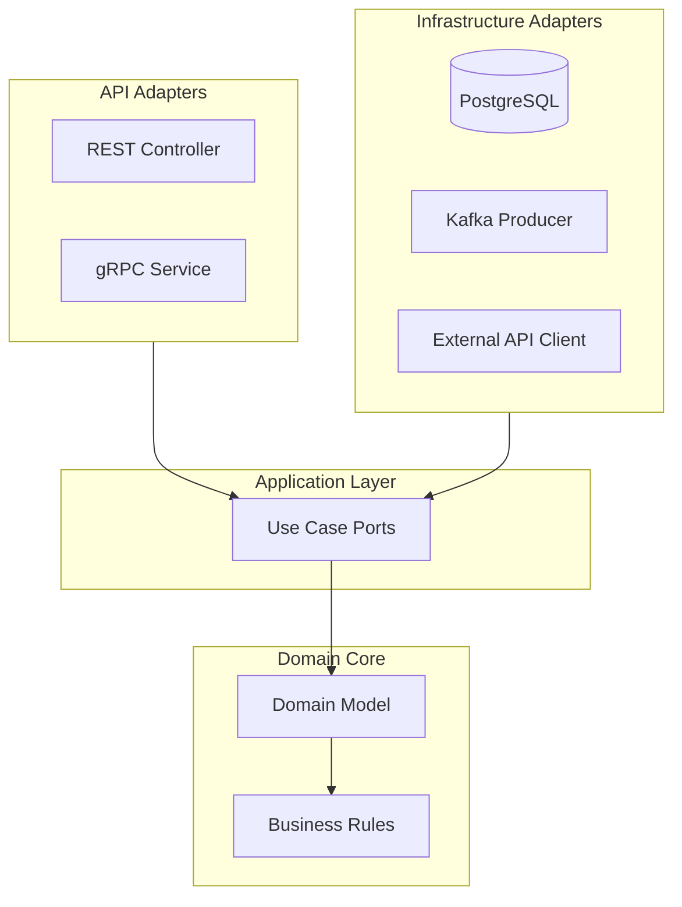

# 🔷 Hexagonal Architecture Guide

  

---

## 🎯 1. What Is Hexagonal Architecture and Why Do We Use It?

Hexagonal architecture (also called "Ports and Adapters") is a way of structuring a service so that **business logic is completely independent of infrastructure** - databases, Kafka, HTTP, AWS SDKs.

**Why it matters for us:**

| Problem Without It | How Hexagonal Solves It |
|-------------------|------------------------|
| Unit tests require a database to run | Domain logic has no DB dependency - tests run in milliseconds |
| Changing from RDS to Aurora requires touching business logic | The DB is an adapter - swap it without touching the domain |
| Kafka details leak into service logic | Kafka is an adapter - domain just calls a port interface |
| Spring annotations spread throughout the codebase | Spring lives in the infrastructure layer only |

The rule is simple: **the domain knows nothing about the outside world.**

---

## 🧩 2. The Three Layers

```
┌──────────────────────────────────────────────────────────┐
│                      API Layer                           │
│   (Controllers, DTOs, OpenAPI, request/response mapping) │
│                   Spring MVC lives here                  │
└────────────────────────┬─────────────────────────────────┘
                         │ calls
┌────────────────────────▼─────────────────────────────────┐
│                    Domain Layer                          │
│   (Entities, Services, Repository interfaces, Events)   │
│              Pure Java - zero framework imports          │
│           This is what you TEST and PROTECT              │
└────────────────────────┬─────────────────────────────────┘
                         │ implements
┌────────────────────────▼─────────────────────────────────┐
│                Infrastructure Layer                      │
│   (JPA repositories, Kafka producers, HTTP clients,      │
│    AWS SDK calls, Spring config, Flyway migrations)      │
│              Framework code lives here only              │
└──────────────────────────────────────────────────────────┘
```

**Visual overview:**



**Dependency rule:** Arrows always point inward. Domain never imports from infrastructure or API.

---

## 🧩 3. Full Worked Example - Orders Service

Let's walk through the complete structure for the Orders Service.

### 3.1 Package Structure

```
com.{company}.orders/
│
├── api/                                    ← API Layer
│   ├── OrderController.java
│   ├── dto/
│   │   ├── OrderRequestDto.java           ← What the caller sends
│   │   ├── OrderResponseDto.java          ← What we return
│   │   └── OrderMapper.java              ← Maps between DTO ↔ Domain
│   └── exception/
│       └── GlobalExceptionHandler.java
│
├── domain/                                 ← Domain Layer (pure Java)
│   ├── model/
│   │   ├── Order.java                     ← Core entity
│   │   ├── OrderId.java                   ← Value object
│   │   ├── OrderStatus.java              ← Enum
│   │   ├── Location.java                  ← Value object
│   │   └── CustomerId.java               ← Value object
│   ├── service/
│   │   └── OrderService.java             ← Business logic
│   ├── port/
│   │   ├── outbound/
│   │   │   ├── OrderRepository.java       ← Port (interface)
│   │   │   ├── OrderEventPublisher.java   ← Port (interface)
│   │   │   └── PricingPort.java           ← Port (interface)
│   │   └── inbound/
│   │       └── OrderUseCase.java          ← Port (interface)
│   └── event/
│       ├── OrderRequestedEvent.java
│       └── OrderCompletedEvent.java
│
└── infrastructure/                         ← Infrastructure Layer
    ├── persistence/
    │   ├── JpaOrderRepository.java        ← Implements OrderRepository
    │   ├── OrderEntity.java               ← JPA entity
    │   └── OrderEntityMapper.java         ← Maps JPA entity ↔ Domain model
    ├── kafka/
    │   └── KafkaOrderEventPublisher.java  ← Implements OrderEventPublisher
    ├── http/
    │   └── PricingServiceClient.java       ← Implements PricingPort
    └── config/
        ├── KafkaConfig.java
        └── PersistenceConfig.java
```

---

### 3.2 Domain Layer - The Heart

#### The Entity: `Order.java`

This is pure Java. Zero Spring. Zero JPA. Zero Kafka. It **enforces its own invariants**.

```java
package com.{company}.orders.domain.model;

import java.time.Instant;
import java.util.Objects;

public class Order {

    private final OrderId id;
    private final CustomerId customerId;
    private final Location dispatch;
    private final Location delivery;
    private OrderStatus status;
    private ProviderId assignedProviderId;
    private PriceAmount priceAmount;
    private Instant requestedAt;
    private Instant startedAt;
    private Instant completedAt;

    public static Order request(CustomerId customerId, Location dispatch, Location delivery) {
        Order order = new Order();
        order.id = OrderId.generate();
        order.customerId = Objects.requireNonNull(customerId);
        order.dispatch = Objects.requireNonNull(dispatch);
        order.delivery = Objects.requireNonNull(delivery);
        order.status = OrderStatus.REQUESTED;
        order.requestedAt = Instant.now();
        return order;
    }

    public void assignProvider(ProviderId providerId) {
        if (status != OrderStatus.REQUESTED) {
            throw new InvalidOrderStateException(
                "Cannot assign provider to order in state: " + status);
        }
        this.assignedProviderId = Objects.requireNonNull(providerId);
        this.status = OrderStatus.MATCHED;
    }

    public void start() {
        if (status != OrderStatus.MATCHED) {
            throw new InvalidOrderStateException(
                "Cannot start order in state: " + status);
        }
        this.status = OrderStatus.IN_PROGRESS;
        this.startedAt = Instant.now();
    }

    public void complete(PriceAmount priceAmount) {
        if (status != OrderStatus.IN_PROGRESS) {
            throw new InvalidOrderStateException(
                "Cannot complete order in state: " + status);
        }
        this.priceAmount = Objects.requireNonNull(priceAmount);
        this.status = OrderStatus.COMPLETED;
        this.completedAt = Instant.now();
    }

    public void cancel(CancellationReason reason) {
        if (status == OrderStatus.COMPLETED) {
            throw new InvalidOrderStateException("Cannot cancel a completed order");
        }
        this.status = OrderStatus.CANCELLED;
    }

    public OrderId getId() { return id; }
    public OrderStatus getStatus() { return status; }
    public boolean isInProgress() { return status == OrderStatus.IN_PROGRESS; }
    public boolean isCompleted() { return status == OrderStatus.COMPLETED; }
    // ... other getters
}
```

#### Value Object: `OrderId.java`

```java
package com.{company}.orders.domain.model;

import java.util.UUID;

public record OrderId(String value) {

    public OrderId {
        if (value == null || value.isBlank()) {
            throw new IllegalArgumentException("OrderId must not be blank");
        }
    }

    public static OrderId generate() {
        return new OrderId(UUID.randomUUID().toString());
    }

    public static OrderId of(String value) {
        return new OrderId(value);
    }

    @Override
    public String toString() { return value; }
}
```

#### Outbound Port: `OrderRepository.java`

This is an **interface in the domain layer**. The domain defines what it needs; infrastructure provides it.

```java
package com.{company}.orders.domain.port.outbound;

import com.{company}.orders.domain.model.Order;
import com.{company}.orders.domain.model.OrderId;
import java.util.Optional;

public interface OrderRepository {
    Order save(Order order);
    Optional<Order> findById(OrderId orderId);
    boolean existsById(OrderId orderId);
}
```

#### Outbound Port: `OrderEventPublisher.java`

```java
package com.{company}.orders.domain.port.outbound;

import com.{company}.orders.domain.event.OrderCompletedEvent;
import com.{company}.orders.domain.event.OrderRequestedEvent;

public interface OrderEventPublisher {
    void publish(OrderRequestedEvent event);
    void publish(OrderCompletedEvent event);
}
```

#### Domain Service: `OrderService.java`

```java
package com.{company}.orders.domain.service;

import com.{company}.orders.domain.model.*;
import com.{company}.orders.domain.port.outbound.*;
import com.{company}.orders.domain.event.*;

public class OrderService {

    private final OrderRepository orderRepository;
    private final OrderEventPublisher eventPublisher;
    private final PricingPort pricingPort;

    public OrderService(OrderRepository orderRepository,
                        OrderEventPublisher eventPublisher,
                        PricingPort pricingPort) {
        this.orderRepository = orderRepository;
        this.eventPublisher = eventPublisher;
        this.pricingPort = pricingPort;
    }

    public Order requestOrder(CustomerId customerId, Location dispatch, Location delivery) {
        Order order = Order.request(customerId, dispatch, delivery);
        Order saved = orderRepository.save(order);
        eventPublisher.publish(new OrderRequestedEvent(saved.getId(), customerId, dispatch, delivery));
        return saved;
    }

    public Order completeOrder(OrderId orderId) {
        Order order = orderRepository.findById(orderId)
            .orElseThrow(() -> new OrderNotFoundException(orderId));

        PriceAmount price = pricingPort.calculateFinalPrice(orderId);
        order.complete(price);

        Order saved = orderRepository.save(order);
        eventPublisher.publish(new OrderCompletedEvent(saved.getId(), price));
        return saved;
    }
}
```

---

### 3.3 Infrastructure Layer - Adapters

#### JPA Adapter: `JpaOrderRepository.java`

This **implements** the domain's `OrderRepository` port. Spring and JPA live here.

```java
package com.{company}.orders.infrastructure.persistence;

import com.{company}.orders.domain.model.Order;
import com.{company}.orders.domain.model.OrderId;
import com.{company}.orders.domain.port.outbound.OrderRepository;
import org.springframework.stereotype.Repository;
import java.util.Optional;

@Repository
public class JpaOrderRepository implements OrderRepository {

    private final SpringDataOrderRepository springRepo;
    private final OrderEntityMapper mapper;

    public JpaOrderRepository(SpringDataOrderRepository springRepo,
                               OrderEntityMapper mapper) {
        this.springRepo = springRepo;
        this.mapper = mapper;
    }

    @Override
    public Order save(Order order) {
        OrderEntity entity = mapper.toEntity(order);
        OrderEntity saved = springRepo.save(entity);
        return mapper.toDomain(saved);
    }

    @Override
    public Optional<Order> findById(OrderId orderId) {
        return springRepo.findById(orderId.value())
            .map(mapper::toDomain);
    }

    @Override
    public boolean existsById(OrderId orderId) {
        return springRepo.existsById(orderId.value());
    }
}

interface SpringDataOrderRepository extends JpaRepository<OrderEntity, String> {}
```

#### Kafka Adapter: `KafkaOrderEventPublisher.java`

```java
package com.{company}.orders.infrastructure.kafka;

import com.{company}.orders.domain.event.OrderCompletedEvent;
import com.{company}.orders.domain.event.OrderRequestedEvent;
import com.{company}.orders.domain.port.outbound.OrderEventPublisher;
import org.springframework.kafka.core.KafkaTemplate;
import org.springframework.stereotype.Component;

@Component
public class KafkaOrderEventPublisher implements OrderEventPublisher {

    private static final String ORDER_REQUESTED_TOPIC = "orders.order.requested";
    private static final String ORDER_COMPLETED_TOPIC = "orders.order.completed";

    private final KafkaTemplate<String, Object> kafkaTemplate;

    public KafkaOrderEventPublisher(KafkaTemplate<String, Object> kafkaTemplate) {
        this.kafkaTemplate = kafkaTemplate;
    }

    @Override
    public void publish(OrderRequestedEvent event) {
        kafkaTemplate.send(ORDER_REQUESTED_TOPIC, event.orderId().value(), event);
    }

    @Override
    public void publish(OrderCompletedEvent event) {
        kafkaTemplate.send(ORDER_COMPLETED_TOPIC, event.orderId().value(), event);
    }
}
```

#### Spring Config: `DomainConfig.java`

This wires together domain services (which have no Spring annotations) with their infrastructure adapters.

```java
package com.{company}.orders.infrastructure.config;

import com.{company}.orders.domain.service.OrderService;
import com.{company}.orders.domain.port.outbound.*;
import org.springframework.context.annotation.Bean;
import org.springframework.context.annotation.Configuration;

@Configuration
public class DomainConfig {

    @Bean
    public OrderService orderService(OrderRepository orderRepository,
                                     OrderEventPublisher eventPublisher,
                                     PricingPort pricingPort) {
        return new OrderService(orderRepository, eventPublisher, pricingPort);
    }
}
```

---

### 3.4 API Layer - The Entry Point

```java
package com.{company}.orders.api;

import com.{company}.orders.domain.model.*;
import com.{company}.orders.domain.service.OrderService;
import com.{company}.orders.api.dto.*;
import org.springframework.http.ResponseEntity;
import org.springframework.web.bind.annotation.*;
import jakarta.validation.Valid;

@RestController
@RequestMapping("/v1/orders")
public class OrderController {

    private final OrderService orderService;
    private final OrderMapper orderMapper;

    public OrderController(OrderService orderService, OrderMapper orderMapper) {
        this.orderService = orderService;
        this.orderMapper = orderMapper;
    }

    @PostMapping
    public ResponseEntity<OrderResponseDto> requestOrder(
            @Valid @RequestBody OrderRequestDto request,
            @AuthenticationPrincipal JwtPrincipal caller) {

        CustomerId customerId = CustomerId.of(caller.getUserId());
        Location dispatch = new Location(request.dispatch().lat(), request.dispatch().lng());
        Location delivery = new Location(request.delivery().lat(), request.delivery().lng());

        Order order = orderService.requestOrder(customerId, dispatch, delivery);

        return ResponseEntity.status(201).body(orderMapper.toResponse(order));
    }

    @PostMapping("/{orderId}/complete")
    public ResponseEntity<OrderResponseDto> completeOrder(@PathVariable String orderId) {
        Order order = orderService.completeOrder(OrderId.of(orderId));
        return ResponseEntity.ok(orderMapper.toResponse(order));
    }
}
```

---

## 🧪 4. How to Test Each Layer

| Layer | Test Type | What You Mock |
|-------|-----------|--------------|
| Domain (entities, services) | Unit tests | Nothing - pure Java, no mocks needed for entities; mock ports for services |
| Infrastructure (JPA, Kafka) | Integration tests | Nothing - use Testcontainers with real DB/Kafka |
| API (controllers) | `@WebMvcTest` slice tests | Mock the domain service |

```java
class OrderServiceTest {

    private final OrderRepository orderRepository = mock(OrderRepository.class);
    private final OrderEventPublisher eventPublisher = mock(OrderEventPublisher.class);
    private final PricingPort pricingPort = mock(PricingPort.class);

    private final OrderService orderService =
        new OrderService(orderRepository, eventPublisher, pricingPort);

    @Test
    void requestOrder_savesAndPublishesEvent() {
        CustomerId customerId = CustomerId.of("customer-1");
        Location dispatch = new Location(25.2, 55.3);
        Location delivery = new Location(25.3, 55.4);
        when(orderRepository.save(any())).thenAnswer(inv -> inv.getArgument(0));

        Order order = orderService.requestOrder(customerId, dispatch, delivery);

        assertThat(order.getStatus()).isEqualTo(OrderStatus.REQUESTED);
        verify(eventPublisher).publish(any(OrderRequestedEvent.class));
    }
}
```

---

## ❌ 5. Common Mistakes to Avoid

| Mistake | Why It's Wrong | Fix |
|---------|---------------|-----|
| `@Entity` on domain model | JPA annotation in domain - breaks separation | Separate `OrderEntity` (infra) from `Order` (domain) |
| `@Autowired` in domain service | Spring in domain | Constructor inject via `DomainConfig` |
| Calling `KafkaTemplate` from domain service | Kafka in domain | Define `OrderEventPublisher` port; inject it |
| Calling another service's repository directly | Cross-domain DB access | Go via API or event |
| Putting business logic in controller | Controller becomes god class | Move to domain service |
| Putting business logic in JPA entity | Anemic domain model | Move to domain model class |

---

## 📏 6. The ArchUnit Rules That Enforce This

These are pre-configured in the platform template:

```java
@AnalyzeClasses(packages = "com.{company}.orders")
class HexagonalArchitectureTest {

    @ArchTest
    static final ArchRule domainMustNotDependOnSpring =
        noClasses().that().resideInAPackage("..domain..")
            .should().dependOnClassesThat()
            .resideInAnyPackage("org.springframework..");

    @ArchTest
    static final ArchRule domainMustNotDependOnJpa =
        noClasses().that().resideInAPackage("..domain..")
            .should().dependOnClassesThat()
            .resideInAnyPackage("jakarta.persistence..", "org.hibernate..");

    @ArchTest
    static final ArchRule infraMustNotBeCalledByApi =
        noClasses().that().resideInAPackage("..api..")
            .should().dependOnClassesThat()
            .resideInAPackage("..infrastructure..");

    @ArchTest
    static final ArchRule controllersMustNotCallRepositories =
        noClasses().that().haveNameMatching(".*Controller")
            .should().dependOnClassesThat()
            .haveNameMatching(".*Repository");
}
```

If you violate the architecture, the build fails. This is intentional.

---

---
<div align="center">

⬅️ [Back to section](./README.md) · 🏠 [Back to root](../README.md)

</div>
