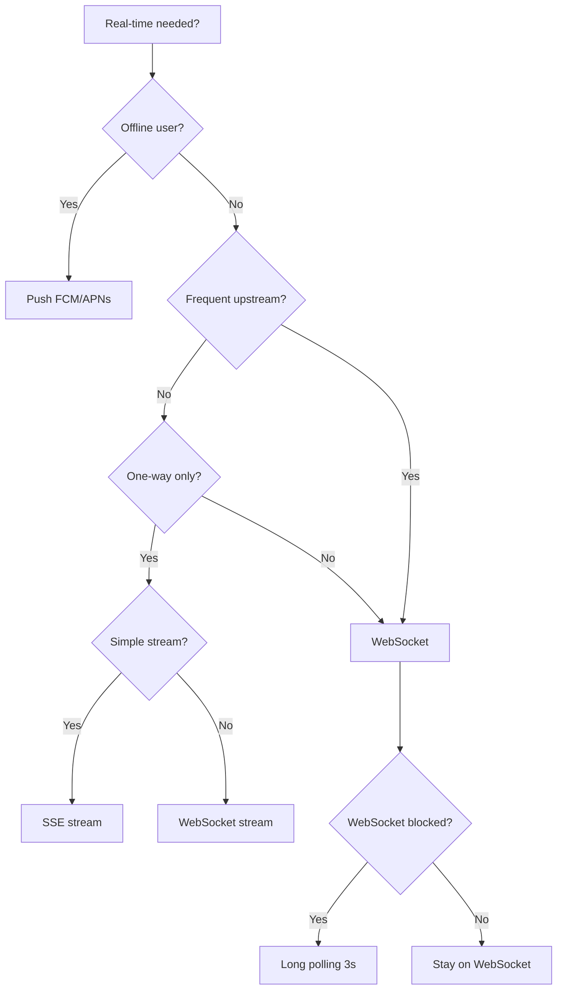
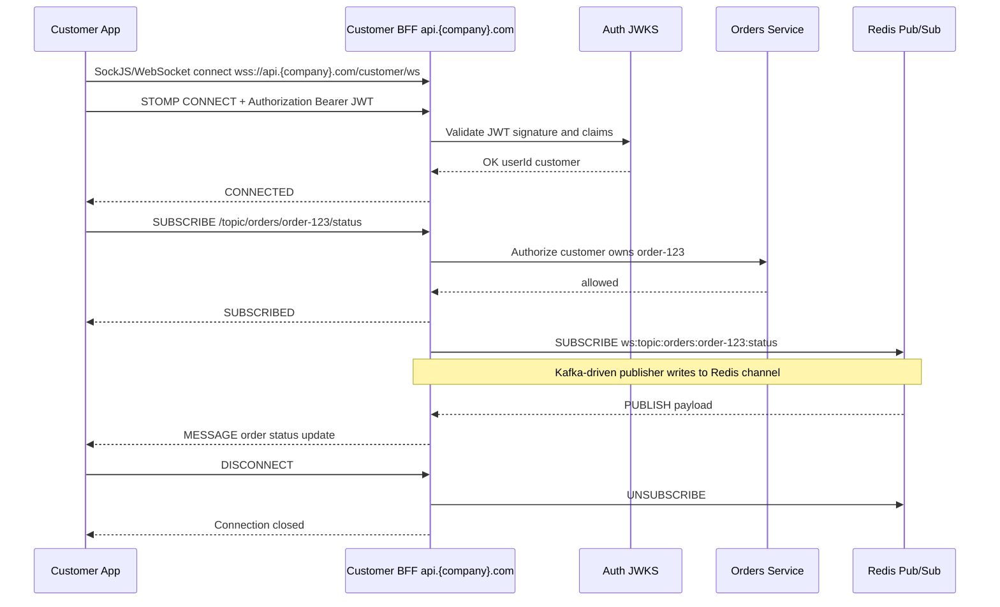
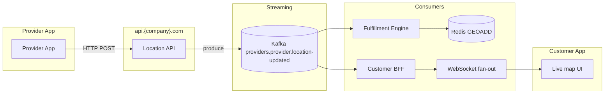
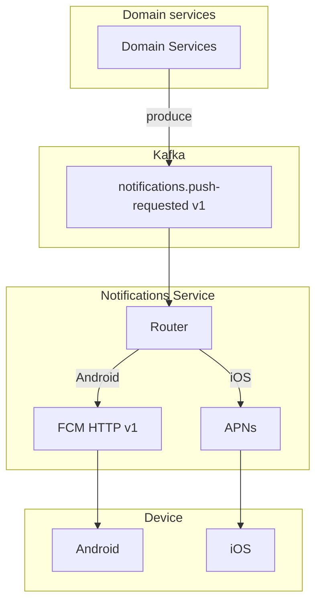
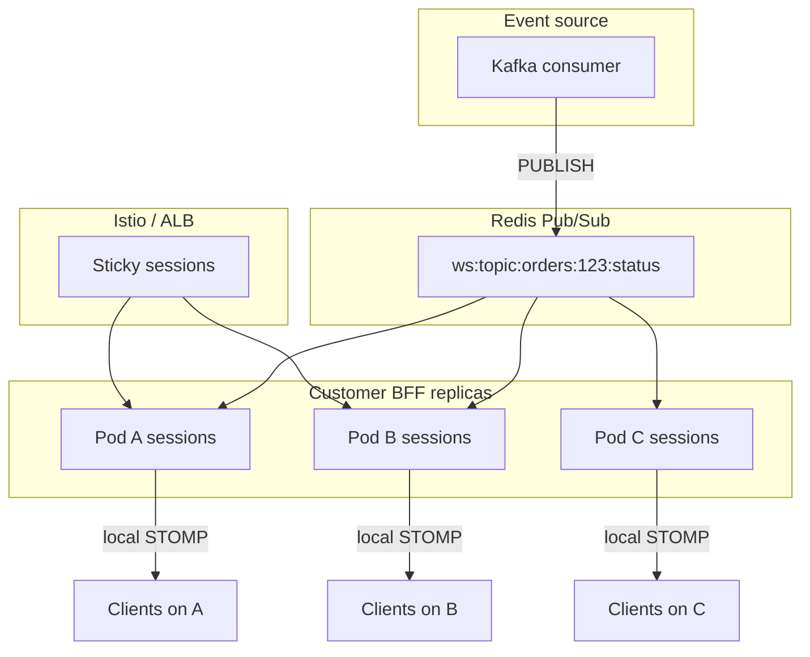
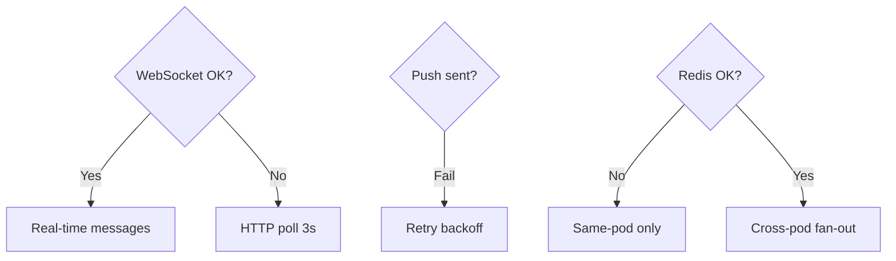
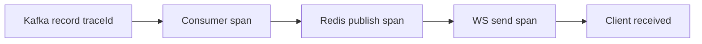

# ⚡ Real-Time Architecture

  

---

## 🎯 1. Why Real-Time Matters

> **Principle:** WebSockets, SSE, push, and long polling are **transport- and framework-agnostic**. STOMP-over-SockJS and Spring APIs below are {Company}'s **reference implementation (Java / Spring Boot)** on the BFF tier.

The platform is inherently real-time. Customers need live provider location, providers need instant order offers, and both need immediate status updates. REST polling wastes bandwidth and battery, increases server load, and delivers stale data under load. This document defines **mandated patterns** for real-time communication across platform surfaces: customer and provider apps (`com.{company}`), internal tools, and partner integrations that consume `api.{company}.com` and related endpoints.

Goals:

- **Low latency** for safety-critical and UX-critical updates (order state, proximity, offers).
- **Efficient transport** on mobile networks (avoid chatty polling where possible).
- **Clear ownership** of channels, topics, and push policies per domain.
- **Operability** at scale: measurable connections, fan-out, and failure modes.

### When NOT to Use This Pattern

- Data freshness requirements are seconds or minutes, not milliseconds (use polling or SSE instead of WebSockets)
- The client is a batch processor or backend service (use Kafka consumers or gRPC streaming)
- Traffic is predominantly unidirectional server-to-client (use SSE - simpler than WebSockets)
- The feature has fewer than 100 concurrent users (long-polling is simpler and sufficient)
- Mobile clients with unreliable connectivity (HTTP with retry is more resilient than persistent connections)
- You need guaranteed delivery (WebSocket is fire-and-forget - use a message queue for reliability)

---

## 🧭 2. Communication Patterns Decision Guide

| Pattern | Direction | Connection | Best for | Avoid when |
|--------|-----------|------------|----------|------------|
| **WebSocket** (reference: STOMP over SockJS on Spring) | Bidirectional | Persistent | Live maps, order status, provider-customer coordination, typing/co-presence | One-off server pushes with no client stream; very simple read-only streams |
| **SSE** (Server-Sent Events) | Server → client | Long-lived HTTP | Live price estimates, single-direction dashboards, progressive logs | You need client→server on the same channel; legacy proxies break chunked responses |
| **Push notifications** (FCM / APNs) | Server → device | Stateless (token-based) | Offline users, high-priority alerts, re-engagement | In-app-only flows where the app is foreground; high-frequency telemetry |
| **Long polling** | Simulated server push | Repeated HTTP | Fallback when WebSocket/SSE blocked; constrained corporate networks | Default choice; battery and latency cost |

**Platform defaults**

- **In-app, interactive:** WebSocket via Customer/Provider BFF (`wss://api.{company}.com/...`).
- **Background / offline:** FCM + APNs through the Notifications service.
- **Simple one-way UI streams:** SSE from the relevant BFF or domain service.
- **Degraded mode:** HTTP long polling (3s interval) when WebSocket cannot be established.

### Decision flowchart

**Visual overview:**



---

## 📡 3. WebSocket Architecture

### Stack

> **Reference implementation (Java / Spring Boot):** Spring WebSocket with **STOMP** and **SockJS** fallback. **Other frameworks:** Socket.IO (Node.js), Gorilla WebSocket or native `net/http` upgrades (Go), SignalR (.NET), or raw WebSockets with your own framing - same auth, authorization, and channel naming rules apply.

- **Spring WebSocket** with **STOMP** as the messaging protocol.
- **SockJS** fallback for environments where raw WebSockets are problematic.
- **BFF layer** (Customer BFF, Provider BFF) terminates connections for mobile clients; internal services publish domain events to Kafka; BFFs subscribe and map to STOMP destinations.

### Connection lifecycle

1. **Connect** - Client opens SockJS/WebSocket to the BFF (e.g. `wss://api.{company}.com/customer/ws`).
2. **Authenticate** - Client sends a STOMP `CONNECT` frame with a **JWT** (header or first message per BFF contract). The server validates issuer, audience, and expiry for `api.{company}.com` APIs.
3. **Subscribe** - Client issues `SUBSCRIBE` frames only to **allowed destinations** derived from identity (order id, provider id, etc.).
4. **Receive** - Server pushes `MESSAGE` frames on subscribed topics.
5. **Heartbeat** - STOMP heart-beating per server config (reference: Spring WebSocket settings); idle connections are closed per policy.
6. **Disconnect** - Client `DISCONNECT` or network drop; server cleans session and Redis subscription mappings if used for cross-pod fan-out.

### Channel naming

Use predictable, hierarchical topics (examples):

| Destination | Purpose |
|-------------|---------|
| `/topic/orders/{orderId}/status` | Order lifecycle: requested, matched, en_route, completed, cancelled |
| `/topic/orders/{orderId}/provider-location` | Throttled provider position for the active order |
| `/topic/providers/{providerId}/location` | Provider app live location stream (authorization: provider self or ops) |
| `/topic/providers/{providerId}/offers` | Incoming order offers for the provider |
| `/user/queue/notifications` | Per-user private queue (reference: Spring STOMP convention) |

Prefix with environment if needed in non-prod; production uses standard host routing.

### Authentication

- **JWT validated on the `CONNECT` frame** before any `SUBSCRIBE` is accepted.
- Claims must include `sub` (user id), `role` (customer | provider | ops), and optional `tenant` / region for multi-region rollout.
- Invalid or expired tokens: close connection with a STOMP ERROR frame and log a structured security event.

### Per-user authorization

- **Customers** may subscribe only to `/topic/orders/{orderId}/*` where `orderId` belongs to that customer's active or recent orders (verified against Orders service or cached entitlement).
- **Providers** may subscribe to their own `/topic/providers/{providerId}/*` and to order topics for orders they are assigned to.
- **Middleware** (channel interceptor) rejects `SUBSCRIBE` frames that fail the entitlement check; do not rely on client-supplied topic names alone.

### Sequence: full lifecycle

**Visual overview:**



---

## 📡 4. Location Streaming Pipeline

### Flow

1. **Provider app** sends **HTTP POST** location updates to the Provider BFF or Location ingestion API (target **5 updates per second** per active provider; server-side throttling may coalesce).
2. **Location service** validates and writes to Kafka topic **`providers.provider.location-updated`** with **1 hour retention** (tune per region; compliance may require shorter PII retention in metadata).
3. **Fulfillment Engine** consumes the topic and updates **geospatial indexes** via **`Redis GEOADD`** (and related structures) for supply discovery and ETA.
4. **Customer BFF** consumes the same topic (or a derived fan-out topic) for **live map** updates, maps payloads to STOMP messages, and **pushes via WebSocket** to subscribed customer clients.

### End-to-end pipeline

**Visual overview:**



### Example: Kafka consumer pushing to WebSocket

**Reference implementation (Java / Spring Boot):** consumer that publishes to a messaging template bound to the broker used for STOMP relay (or to Redis for cross-pod fan-out). Adjust bean names to your deployment.

> **Substitution point:** In Node.js, bridge Kafka to Socket.IO rooms; in Go, publish to a hub that writes to Gorilla WebSocket clients; in .NET, use SignalR groups with a background service consuming the bus.

```java
@Component
@RequiredArgsConstructor
@Slf4j
public class ProviderLocationWebSocketBridge {

    private final SimpMessagingTemplate messagingTemplate;
    private final OrderEntitlementService orderEntitlementService;

    @KafkaListener(
        topics = "providers.provider.location-updated",
        groupId = "customer-bff-location-ws",
        properties = { "spring.json.trusted.packages=com.{company}.orders.events" }
    )
    public void onLocationUpdated(
            @Payload ProviderLocationUpdatedEvent event,
            @Header(KafkaHeaders.RECEIVED_KEY) String providerId) {

        var orderId = event.getActiveOrderId();
        if (orderId == null) {
            return;
        }

        var payload = Map.of(
            "providerId", providerId,
            "lat", event.getLatitude(),
            "lng", event.getLongitude(),
            "heading", event.getHeadingDeg(),
            "recordedAt", event.getRecordedAt().toString()
        );

        messagingTemplate.convertAndSend("/topic/orders/" + orderId + "/provider-location", payload);
    }
}
```

For **multi-pod** BFF deployments, prefer publishing to **Redis Pub/Sub** from a dedicated component and having each pod's listener forward to local WebSocket sessions (reference: `SimpMessagingTemplate` on Spring) - see section 6.

---

## 📡 5. Push Notification Architecture

### Providers

- **Android:** Firebase Cloud Messaging (FCM), project tied to `com.{company}`.
- **iOS:** Apple Push Notification service (APNs), with correct environment (sandbox vs production) per build channel.

### Message types

| Type | Behavior | Typical use |
|------|----------|-------------|
| **Data messages** | App receives payload in background; **silent** if no notification payload | Sync order state, refresh offers, trigger local WebSocket reconnect |
| **Notification messages** | OS shows banner/sound; may not deliver data handler if user force-quits | "Your order is arriving", payment issues |

Prefer **data + notification** split deliberately: time-sensitive UX often needs both **in-app WebSocket** and **push** when backgrounded.

### Token management

- Device token (FCM registration id / APNs device token) stored on **Customer** or **Provider** profile via authenticated **api.{company}.com** endpoints.
- **Refresh on app startup** and when FCM/APNs indicates token rotation.
- Tokens are **scoped by platform** and app version for troubleshooting.

### Routing policy (conceptual)

| Event | In-app (WebSocket/SSE) | Push |
|-------|------------------------|------|
| Order status change (foreground) | Yes | Optional |
| Order status change (background) | If connected | Yes |
| New provider offer | Yes | Yes (high priority provider) |
| Marketing | No | Per policy / consent |
| Security alert | Yes | Yes |

### Push pipeline

**Visual overview:**



---

## 🛡️ 6. Scaling WebSocket Connections

### Problem

WebSocket connections are **stateful**. Each Customer/Provider **BFF pod** holds **N** active sessions. A naive **round-robin** load balancer breaks mid-session upgrades and splits related clients across pods without shared state.

### Solution: Redis Pub/Sub for cross-pod fan-out

1. All pods subscribe to logical channels in **Redis** (e.g. `ws:topic:orders:{orderId}:status`).
2. When a **Kafka** event (or internal call) must reach WebSocket clients, the **publisher** writes **once** to Redis.
3. **Every pod** that subscribed receives the message and forwards only to **local** STOMP sessions subscribed to that topic.

### Fan-out diagram

**Visual overview:**



### Operational targets

- **Connection limits:** target **10,000 concurrent WebSocket connections per pod** (tune by CPU/memory); enforce hard caps to protect the fleet.
- **HPA:** scale on **active connection count** and CPU; include custom metrics from the BFF (e.g. `{company}_ws_active_connections`).
- **Sticky sessions:** **Istio `DestinationRule`** (or equivalent) **loadBalancer consistentHash** on connection establishment so SockJS/WebSocket upgrades land on the same pod **for that connection's lifetime** - still use Redis for **broadcast** consistency when any pod may publish.

---

## 🛡️ 7. Graceful Degradation

| Failure | Behavior |
|---------|----------|
| **WebSocket fails** | Client falls back to **HTTP polling** every **3 seconds** for critical order state; show non-blocking UI hint when on fallback. |
| **Push delivery fails** | Notifications service **retries** with **exponential backoff**, **max 3 attempts**; dead-letter for manual replay. |
| **Redis Pub/Sub unavailable** | Clients on the **same pod** as the publisher may still get messages if events are local; **cross-pod** delivery is **delayed** until Redis recovers; monitor backlog. |
| **Client reconnect** | Exponential backoff with **jitter**, **max delay 30 seconds** between attempts; preserve auth token refresh flow. |

**Visual overview:**



---

## 📡 8. Server-Sent Events (SSE)

### When to use

- **One-directional** server-to-client streams where **WebSocket is overkill**.
- **Example use case:** **live price estimate** updates while the customer stays on the estimate screen (`api.{company}.com/customer/estimates/stream` style endpoint).

### SSE endpoint example

**Reference implementation (Java / Spring Boot):** Spring MVC `SseEmitter`.

> **Other frameworks:** Express/Fastify SSE helpers, Go `http.Flush`, ASP.NET Core `IAsyncEnumerable` or manual `text/event-stream` - preserve `Last-Event-ID` reconnection semantics from section 8.

```java
@RestController
@RequestMapping("/api/v1/customer/estimates")
@RequiredArgsConstructor
public class PriceEstimateStreamController {

    private final PriceEstimateService priceEstimateService;

    @GetMapping(value = "/stream", produces = MediaType.TEXT_EVENT_STREAM_VALUE)
    public SseEmitter streamEstimates(
            @RequestParam UUID dispatchZoneId,
            @RequestParam UUID deliveryZoneId,
            Authentication auth) {

        SseEmitter emitter = new SseEmitter(300_000L);
        String customerId = auth.getName();

        priceEstimateService.subscribeLiveEstimates(customerId, dispatchZoneId, deliveryZoneId, estimate -> {
            try {
                emitter.send(SseEmitter.event()
                    .id(estimate.getSequence().toString())
                    .name("price-update")
                    .data(estimate));
            } catch (IOException e) {
                emitter.completeWithError(e);
            }
        });

        emitter.onCompletion(() -> priceEstimateService.unsubscribe(customerId));
        emitter.onTimeout(emitter::complete);
        return emitter;
    }
}
```

### Reconnection

- Clients should send **`Last-Event-ID`** on reconnect so the server can **resume** from the last delivered sequence (requires server to retain a short **ring buffer** of events per session or idempotent recomputation from zone inputs).

---

## 👁️ 9. Observability

### Metrics

| Metric | Description |
|--------|-------------|
| `{company}_ws_connections_active` | Active WebSocket sessions **per pod** |
| `{company}_ws_messages_sent_total` | Outbound WebSocket messages per second |
| `{company}_ws_connection_errors_total` | Auth failures, protocol errors, abnormal closes |
| `{company}_sse_streams_active` | Open SSE emitters (per service) |
| `{company}_push_delivery_attempts_total` | FCM/APNs attempts and outcomes |

### Alerts

| Condition | Priority |
|-----------|----------|
| Connection count **> 80%** of per-pod limit | **P2** - scale or shed load |
| **Message delivery latency** (Kafka consume → client receive) **> 5s** sustained | **P2** - investigate broker, Redis, or pod saturation |

### Traces

- Emit **WebSocket message delivery spans** on the BFF, linked to the **originating Kafka consumer traceId** propagated in event headers (`traceparent` / `X-B3-*` / OpenTelemetry baggage).
- Enables end-to-end debugging from **provider location publish** to **customer map render**.

**Visual overview:**



---

## 🔒 10. Security

- **WebSocket** connections require a **valid JWT**, validated on **`CONNECT`** before subscriptions.
- **Channel authorization:** middleware **must** verify the principal may access each requested destination (order ownership, provider id match, ops role).
- **Rate limiting:** **max 100 messages per second per connection** (client→server); enforce at the WebSocket/STOMP interceptor (reference: Spring `ChannelInterceptor`); reject with ERROR and metrics.
- **TLS:** all production WebSocket traffic uses **`wss://`** only; no `ws://` in production.
- **CORS / Origin:** allow connections only from **`*.{company}.com`** origins (and explicit mobile deep-link origins if applicable); block arbitrary third-party sites from using customer credentials in the browser.

---

<div align="center">

⬅️ [Back to section](./README.md) · 🏠 [Back to root](../README.md)

</div>
