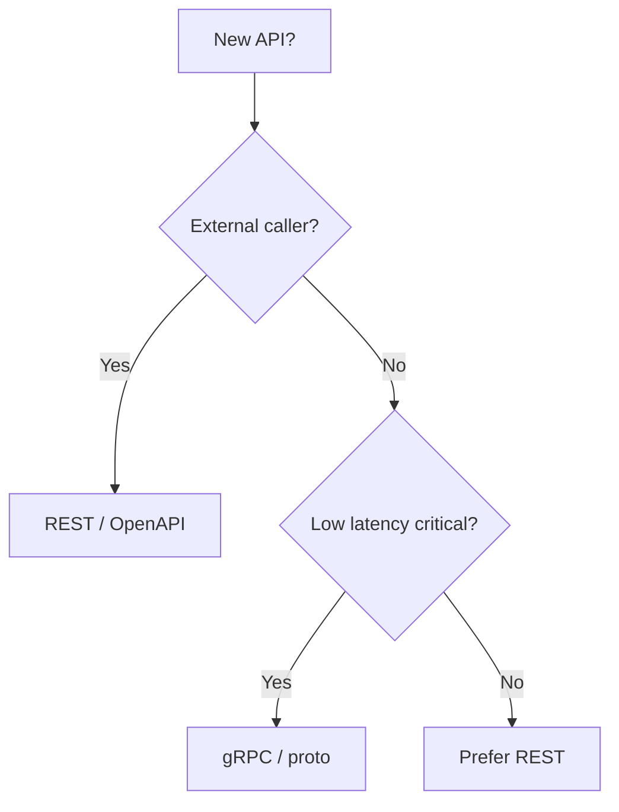
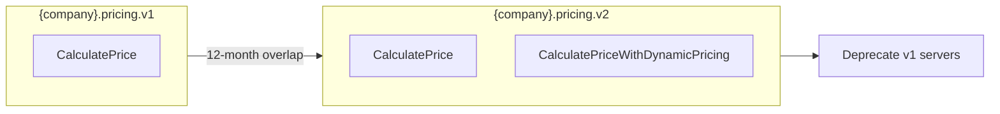
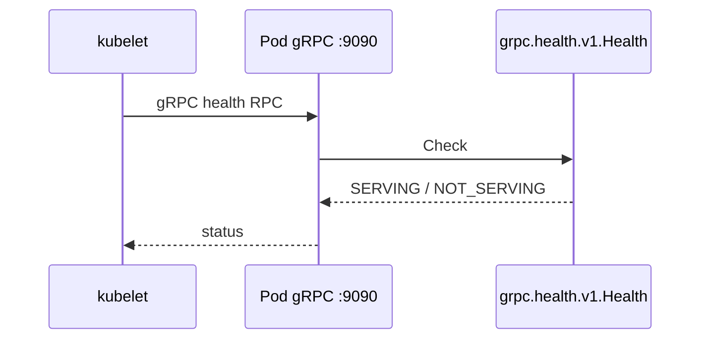
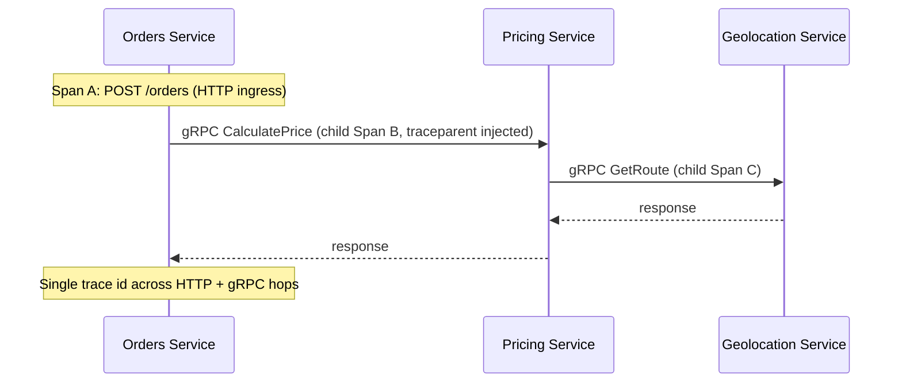

# 🔗 gRPC Standards

  

---

## 🧭 1. When to Use gRPC

> **Principle:** `.proto` contracts and wire behavior are **language-neutral**. Generated stubs differ by runtime, but package layout, versioning, deadlines, and security rules apply to every stack. Java, Spring Boot, and Gradle examples in this document are **reference implementation (Java / Spring Boot)** unless noted otherwise.

The platform uses **gRPC** for high-performance, typed, internal communication between platform services. **REST** remains the default for anything that crosses the public boundary or serves mobile and web clients through a BFF.

**Typical gRPC use cases:**

- **Fulfillment → Geolocation** - low-latency route and ETA lookups during provider assignment
- **Orders → Pricing** - synchronous price calculation and re-rating during active orders
- **Orders → Payments** - authorized, mesh-protected initiation of payment operations
- Any **internal** path where **sub-100 ms p99** and **strong contracts** (protobuf) matter more than human-readable JSON

**REST remains mandatory for:**

- **External and public APIs** (`api.{company}.com`, partner webhooks, public documentation)
- **BFF → client** - mobile and web clients never call gRPC directly; they use REST or real-time channels as defined in platform standards. **GraphQL is not approved for new services** unless granted via RFC; see [API Standards](./02-api-standards.md) (GraphQL Policy).

### 1.1 gRPC vs REST - scenario comparison

| Scenario | Prefer gRPC | Prefer REST |
|----------|-------------|-------------|
| Mobile app → backend | | Yes - BFF + REST |
| Partner HTTP integration | | Yes - versioned REST + OpenAPI |
| Service A → Service B (same cluster, mesh) | Yes - when latency or type safety matters | Yes - for simple CRUD with existing REST stacks |
| Streaming location / high QPS internal fan-out | Yes - HTTP/2, multiplexing | Rarely |
| Debugging with `curl` in production | | Yes - or use grpcurl for gRPC |
| Browser direct call | | Yes - gRPC-Web only via gateway if ever needed |

### 1.2 Decision flow

Use this flowchart for new interfaces. When in doubt, default to **REST** for anything user- or partner-facing; escalate to **gRPC** only with Platform Engineering review for latency and coupling trade-offs.



---

## 📜 2. Proto File Conventions

The **{company}/api-protos** monorepo is the DEFAULT and ONLY source of truth for all proto definitions. Per-service `proto/` directories are NOT permitted. All services consume generated code from the published `api-protos` artifact (see Section 14 - Proto Management). The package layout conventions below apply to files within the monorepo.

### 2.1 Package naming

Protobuf `package` identifiers use dot-separated segments:

```
{company}.{domain}.{service}.{version}
```

Examples:

| Service | Protobuf package | Java option (`java_package`, reference) |
|---------|------------------|----------------------------------------|
| Pricing | `{company}.pricing.v1` | `com.{company}.pricing.v1` |
| Orders | `{company}.orders.v1` | `com.{company}.orders.v1` |
| Fulfillment | `{company}.fulfillment.v1` | `com.{company}.fulfillment.v1` |

Use **`java_package`** and **`java_multiple_files`** on `.proto` for JVM services (or **`go_package`**, **C# namespaces**, **Python `package` layout**, etc.) so generated code namespaces stay consistent and do not flatten into a single giant module.

> **Other frameworks:** Go uses `grpc-go` and `protoc-gen-go-grpc`; Node.js uses `@grpc/grpc-js` and `grpc-tools`; .NET uses `Grpc.Net.Client` / server packages; Python uses `grpcio` and `grpcio-tools`. All must consume the same published protos from `{company}/api-protos`.

### 2.2 File naming

- One primary service definition per file: **`{service}.proto`**
- Examples: `pricing_service.proto`, `orders_service.proto`, `fulfillment_service.proto`
- Shared messages used across services belong in **`{domain}_common.proto`** or **`{domain}/types.proto`** under `proto/{company}/...` with packages matching the domain, not copy-pasted across files.

### 2.3 Message and field naming

| Element | Convention | Example |
|---------|------------|---------|
| Messages | `PascalCase` | `CalculatePriceRequest` |
| Fields | `snake_case` | `order_id`, `estimated_distance_meters` |
| Enums | `PascalCase` type, `UPPER_SNAKE` values | `OrderStatus`, `ORDER_STATUS_ACTIVE` |
| Services | `PascalCase` | `PricingService` |

### 2.4 Field numbers

- **Never reuse** field numbers after a field is removed.
- Use **`reserved`** for removed numbers and names so compilers and reviewers catch mistakes:

```protobuf
message PriceQuote {
  reserved 4, 5;
  reserved "legacy_promo_code", "deprecated_tax_breakdown";
  string currency_code = 1;
  // ...
}
```

- Add new fields only with **new numbers**; follow compatibility rules in Section 3.

### 2.5 Style summary

- **One service per file** (the primary gRPC service for that contract file).
- **RPC names are verbs** in `PascalCase`, describing behavior: `CalculatePrice`, `FindProvider`, `GetOrder`, `ListActiveOrders`.
- Prefer **unary** RPCs unless streaming is required (e.g. long-lived subscriptions); document streaming RPCs in the service README.

---

## 📏 3. Versioning Strategy

Versioning is **package-level**: `v1`, `v2`, … appear as the last segment of the protobuf package (e.g. `{company}.pricing.v2`).

### 3.1 Backward compatibility

Treat `.proto` evolution like **Avro schema evolution** (see platform data standards):

- **Safe:** add optional fields with new numbers; add new RPCs to the same service only if clients ignore unknown methods or you control all callers.
- **Safe:** mark fields deprecated in comments and stop sending them before removal; **reserve** numbers after removal.
- **Breaking:** changing field types, reusing numbers, renaming RPCs without a new package, or changing semantics of an existing RPC without a version bump.

### 3.2 Major versions

A **major version** is a **new package** (new `vN` folder and package name). Deploy servers that implement **both** packages only during migration windows; clients migrate explicitly to `v2`.

### 3.3 Support window

- **Previous major proto package versions remain supported for 12 months** after the successor is declared GA in the service changelog.
- After 12 months, callers must be on the new package; servers may drop the old `Service` implementation with Platform Engineering approval and a published deprecation notice.



---

## 🧰 4. Code Generation

Generated source **must not** be committed to Git. CI or local builds generate into a tool-specific output directory (reference: **`build/generated/source/proto`** for Gradle).

### 4.1 Gradle (`build.gradle.kts`) - full example

**Reference implementation (Java / Spring Boot):** apply the official Protobuf plugin and gRPC; align versions via BOM or explicit versions managed by Platform Engineering.

> **Substitution point:** Use Buf, Bazel, Maven protobuf plugin, or language-native codegen - same rule: generated output is build-artifact only, not committed.

```kotlin
import com.google.protobuf.gradle.*

plugins {
    java
    id("org.springframework.boot") version "3.2.0"
    id("io.spring.dependency-management") version "1.1.4"
    id("com.google.protobuf") version "0.9.4"
}

java {
    toolchain {
        languageVersion.set(JavaLanguageVersion.of(21))
    }
}

val grpcVersion = "1.60.1"
val protobufVersion = "3.25.1"
val apiProtosVersion = "1.0.0"

dependencies {
    protobuf("com.{company}:api-protos-java:$apiProtosVersion")
    implementation("com.{company}:api-protos-java:$apiProtosVersion")
    implementation("io.grpc:grpc-protobuf:$grpcVersion")
    implementation("io.grpc:grpc-stub:$grpcVersion")
    implementation("javax.annotation:javax.annotation-api:1.3.2")
    implementation("net.devh:grpc-spring-boot-starter:3.0.0.RELEASE")
}

protobuf {
    protoc {
        artifact = "com.google.protobuf:protoc:$protobufVersion"
    }
    plugins {
        id("grpc") {
            artifact = "io.grpc:protoc-gen-grpc-java:$grpcVersion"
        }
    }
    generateProtoTasks {
        all().forEach { task ->
            task.plugins {
                id("grpc")
            }
        }
    }
    generatedFilesBaseDir.set("$projectDir/build/generated/source/proto")
}

sourceSets {
    main {
        java {
            srcDir("build/generated/source/proto/main/java")
            srcDir("build/generated/source/proto/main/grpc")
        }
    }
}

tasks.named<JavaCompile>("compileJava") {
    dependsOn("generateProto")
}

// .gitignore must include: build/
```

**Rules:**

- Proto definitions live exclusively in the **{company}/api-protos** monorepo - per-service `proto/` directories are not permitted. Pull packaged `.proto` files into Gradle via the **`protobuf`** configuration on **`com.{company}:api-protos-java`** (same coordinates as Section 14.3), not `srcDir("proto")`.
- Output under **`build/generated/source/proto`** only.
- Add **`build/`** to `.gitignore`; never commit `**/generated/**` gRPC/Java outputs.

---

## ☕ 5. Spring Boot Integration

**Reference implementation (Java / Spring Boot):** use **`net.devh:grpc-spring-boot-starter`** for servers and clients unless Platform Engineering approves an alternative.

> **Other frameworks:** Register gRPC servers with **grpc-go** `grpc.NewServer`, **Node.js** `@grpc/grpc-js` `Server`, **.NET** minimal hosting + `MapGrpcService`, **Python** `grpc.aio` or synchronous `grpc.server` - with the same ports, health checks, and interceptors conceptually mapped to Section 5.3 and Section 11.

### 5.1 Server configuration

```yaml
# application.yml - Pricing service
grpc:
  server:
    port: 9090
    enable-reflection: false   # true only in non-prod if needed
```

Enable the server with `@GrpcService` on your implementation class.

### 5.2 Client configuration

```yaml
grpc:
  client:
    pricing:
      address: static://pricing.platform.svc.cluster.local:9090
      negotiationType: plaintext   # TLS terminated by Istio; app uses plaintext on loopback/sidecar
```

Use `@GrpcClient("pricing")` to inject a stub.

### 5.3 Interceptors

Register global interceptors as Spring beans implementing `ServerInterceptor` / `ClientInterceptor` (e.g. tracing, auth metadata, deadline defaults). Order matters: tracing outermost, auth next, business last.

---

### 5.4 Worked example: Pricing gRPC server + Orders gRPC client

**Reference implementation (Java / Spring Boot)** for server and blocking client stubs.

#### Proto excerpt (`{company}/api-protos` - `pricing/v1/pricing_service.proto`)

```protobuf
syntax = "proto3";

package {company}.pricing.v1;

option java_multiple_files = true;
option java_package = "com.{company}.pricing.v1";
option java_outer_classname = "PricingServiceProto";

service PricingService {
  rpc CalculatePrice(CalculatePriceRequest) returns (CalculatePriceResponse);
}

message CalculatePriceRequest {
  string order_id = 1;
  string customer_id = 2;
  double distance_km = 3;
  int32 duration_minutes = 4;
  string region_code = 5;
}

message CalculatePriceResponse {
  string currency_code = 1;
  int64 amount_minor_units = 2;
  string quote_id = 3;
}
```

#### Server implementation (Pricing service) - reference (Java / Spring Boot)

```java
package com.{company}.pricing.adapter.grpc;

import com.{company}.pricing.v1.CalculatePriceRequest;
import com.{company}.pricing.v1.CalculatePriceResponse;
import com.{company}.pricing.v1.PricingServiceGrpc;
import io.grpc.stub.StreamObserver;
import net.devh.boot.grpc.server.service.GrpcService;

@GrpcService
public class PricingGrpcController extends PricingServiceGrpc.PricingServiceImplBase {

    private final PriceCalculationUseCase priceCalculation;

    public PricingGrpcController(PriceCalculationUseCase priceCalculation) {
        this.priceCalculation = priceCalculation;
    }

    @Override
    public void calculatePrice(
            CalculatePriceRequest request,
            StreamObserver<CalculatePriceResponse> responseObserver) {
        var result = priceCalculation.calculate(
                request.getOrderId(),
                request.getCustomerId(),
                request.getDistanceKm(),
                request.getDurationMinutes(),
                request.getRegionCode());
        var response = CalculatePriceResponse.newBuilder()
                .setCurrencyCode(result.currencyCode())
                .setAmountMinorUnits(result.amountMinorUnits())
                .setQuoteId(result.quoteId())
                .build();
        responseObserver.onNext(response);
        responseObserver.onCompleted();
    }
}
```

#### Client usage (Orders service) - reference (Java / Spring Boot)

```java
package com.{company}.orders.adapter.grpc;

import com.{company}.pricing.v1.CalculatePriceRequest;
import com.{company}.pricing.v1.PricingServiceGrpc;
import io.grpc.StatusRuntimeException;
import net.devh.boot.grpc.client.inject.GrpcClient;
import org.springframework.stereotype.Component;

import java.util.concurrent.TimeUnit;

@Component
public class PricingGrpcClient {

    private final PricingServiceGrpc.PricingServiceBlockingStub pricingStub;

    public PricingGrpcClient(
            @GrpcClient("pricing") PricingServiceGrpc.PricingServiceBlockingStub stub) {
        this.pricingStub = stub;
    }

    public PriceQuote calculatePrice(String orderId, String customerId,
            double distanceKm, int durationMinutes, String regionCode) {
        var request = CalculatePriceRequest.newBuilder()
                .setOrderId(orderId)
                .setCustomerId(customerId)
                .setDistanceKm(distanceKm)
                .setDurationMinutes(durationMinutes)
                .setRegionCode(regionCode)
                .build();
        try {
            var response = pricingStub
                    .withDeadlineAfter(2, TimeUnit.SECONDS)
                    .calculatePrice(request);
            return new PriceQuote(
                    response.getCurrencyCode(),
                    response.getAmountMinorUnits(),
                    response.getQuoteId());
        } catch (StatusRuntimeException e) {
            throw GrpcExceptionMapper.fromStatus(e);
        }
    }
}
```

The Orders service `application.yml` includes the `grpc.client.pricing` block from Section 5.2. Domain mapping from gRPC status to exceptions is standardized in Section 6.

---

## ⚠️ 6. Error Handling

Map gRPC **status codes** to **domain exceptions** at the adapter boundary (incoming: map to HTTP or internal handling; outgoing: map from domain to status). Do not leak raw status messages to external REST clients.

### 6.1 Status → domain exception (client side)

| gRPC code | Domain exception (example) | When |
|-----------|----------------------------|------|
| `NOT_FOUND` | `OrderNotFoundException` | Order, provider, or quote does not exist |
| `INVALID_ARGUMENT` | `ValidationException` | Bad input, failed protobuf validation, business rule on input |
| `FAILED_PRECONDITION` | `IllegalStateException` or domain-specific (e.g. `OrderNotCancellableException`) | State machine violation |
| `ALREADY_EXISTS` | `DuplicateResourceException` | Idempotent create conflict |
| `PERMISSION_DENIED` | `AccessDeniedException` | AuthZ failure |
| `UNAUTHENTICATED` | `AuthenticationException` | Missing or invalid credentials |
| `DEADLINE_EXCEEDED` | `TimeoutException` | Client or server deadline exceeded |
| `UNAVAILABLE` | `CircuitBreakerOpenException` or `UpstreamUnavailableException` | Overload, no healthy upstream, breaker open |
| `RESOURCE_EXHAUSTED` | `RateLimitExceededException` | Quota / rate limit |
| `INTERNAL` | `InternalServiceException` | Logged with correlation id; generic message outward |

### 6.2 Error metadata propagation

Use **`Metadata`** for stable machine-readable codes and correlation (not stack traces). **Reference implementation (Java):**

```java
import io.grpc.Metadata;
import io.grpc.Status;
import io.grpc.protobuf.ProtoUtils;
import io.grpc.stub.MetadataUtils;

Metadata trailers = new Metadata();
Metadata.Key<String> CODE_KEY =
        Metadata.Key.of("x-error-code", Metadata.ASCII_STRING_MARSHALLER);
trailers.put(CODE_KEY, "ORDERS.ORDER.NOT_FOUND");
responseObserver.onError(Status.NOT_FOUND
        .withDescription("Order not found")
        .asRuntimeException(trailers));

// Client: read from StatusRuntimeException.getTrailers()
```

Use **`x-error-code`** for registered machine-readable error codes (same dotted format as REST; see [Error Catalog](./09-error-catalog.md)). For other custom metadata keys, prefix with **`x-{company}-`** where a company-scoped name avoids collisions (e.g. `x-{company}-correlation-id`). Propagate **W3C `traceparent`** via OpenTelemetry (Section 9), not only custom headers.

---

## 🛡️ 7. Deadlines and Timeouts

**Every outbound gRPC call MUST set a deadline.** Unbounded calls are forbidden: they tie up threads, hide slow dependencies, and break SLOs.

### 7.1 Defaults

| Call type | Default deadline |
|-----------|------------------|
| Internal service-to-service | **2 seconds** |
| External gateway / edge gRPC (if any) | **5 seconds** |

Tune per-RPC in configuration for known heavy operations (with Platform Engineering approval and documented SLO impact).

### 7.2 Client-side configuration

Prefer explicit deadlines on the stub (as in Section 5.4) or a **client interceptor** that applies defaults. **Reference implementation (Java):**

```java
import io.grpc.CallOptions;
import io.grpc.Channel;
import io.grpc.ClientCall;
import io.grpc.ClientInterceptor;
import io.grpc.ForwardingClientCall.SimpleForwardingClientCall;
import io.grpc.MethodDescriptor;

import java.util.concurrent.TimeUnit;

public class DefaultDeadlineInterceptor implements ClientInterceptor {

    private final long timeoutMs;

    public DefaultDeadlineInterceptor(long timeoutMs) {
        this.timeoutMs = timeoutMs;
    }

    @Override
    public <ReqT, RespT> ClientCall<ReqT, RespT> interceptCall(
            MethodDescriptor<ReqT, RespT> method,
            CallOptions callOptions,
            Channel next) {
        if (callOptions.getDeadline() == null) {
            callOptions = callOptions.withDeadlineAfter(timeoutMs, TimeUnit.MILLISECONDS);
        }
        return new SimpleForwardingClientCall<>(next.newCall(method, callOptions)) {};
    }
}
```

Register this interceptor (or equivalent) for gRPC clients so stubs without explicit deadlines still get **2s** (internal) by default.

### 7.3 Server-side deadline propagation

When a server calls downstream gRPC services, **propagate the remaining time** from the incoming context instead of starting a fresh 2s window. **Reference implementation (Java):**

```java
import io.grpc.Context;
import io.grpc.Deadline;
import io.grpc.stub.AbstractStub;

public <S extends AbstractStub<S>> S withIncomingDeadline(S stub) {
    Deadline parent = Context.current().getDeadline();
    if (parent != null) {
        return stub.withDeadline(parent);
    }
    return stub.withDeadlineAfter(2, TimeUnit.SECONDS);
}
```

This preserves end-to-end budget: a slow caller does not silently give each hop a full 2s.

---

## 👁️ 8. Health Checking

Use the **gRPC Health Checking Protocol** (`grpc.health.v1.Health`) for Kubernetes probes when the workload speaks gRPC on the main port or a dedicated health port.

### 8.1 Readiness and liveness

- **Liveness:** process is up; minimal checks (default health service may return `SERVING` if the runtime is alive; on the JVM, that is the common default).
- **Readiness:** dependencies satisfied (e.g. DB connection pool, critical caches); return `NOT_SERVING` until ready so the Service stops sending traffic.

Enable the health service in your stack (reference: Spring Boot gRPC starter `grpc.server.health-service-enabled` or equivalent registration).

### 8.2 Kubernetes deployment example

```yaml
apiVersion: apps/v1
kind: Deployment
metadata:
  name: pricing
  labels:
    app: pricing
    platform.{company}.com/domain: pricing
spec:
  template:
    spec:
      containers:
        - name: pricing
          image: {company}/pricing-service:{version}
          ports:
            - name: grpc
              containerPort: 9090
          readinessProbe:
            grpc:
              port: 9090
              service: {company}.pricing.v1.PricingService
            initialDelaySeconds: 5
            periodSeconds: 10
          livenessProbe:
            grpc:
              port: 9090
            initialDelaySeconds: 15
            periodSeconds: 20
```

**Notes:**

- Kubernetes **1.24+** supports native **gRPC probes** (`grpc:` field). For older clusters, use **grpc_health_probe** as an exec probe or a sidecar HTTP health endpoint approved by Platform Engineering.
- Align `service` name with the **fully qualified service name** expected by your health implementation when using per-service checks.



---

## 👁️ 9. Observability

### 9.1 OpenTelemetry gRPC instrumentation

Use your language's **OpenTelemetry gRPC instrumentation** or **explicit interceptors** that create spans for each RPC (reference: **OpenTelemetry Java agent** on the JVM):

- **Server:** span name `{company}.{Service}/{Method}` (or generic `{package}.{Service}/{method}`).
- **Client:** child span under the active context; inject **W3C trace context** into outgoing metadata.

Auto-instrumentation (agent) is preferred for consistency across services; custom interceptors are allowed for extra attributes (e.g. `{company}.order_id`).

### 9.2 Metrics

Export Prometheus-compatible metrics (naming may vary by library; align with mesh metrics where duplicated):

| Metric | Type | Description |
|--------|------|-------------|
| `grpc_server_handled_total` | Counter | RPCs completed by status |
| `grpc_server_handling_seconds` | Histogram | Server-side RPC duration |
| `grpc_client_handled_total` | Counter | Outbound RPCs by status |
| `grpc_client_handling_seconds` | Histogram | Client-side RPC duration |

Dashboards must break down by **service name**, **method**, and **status code**.

### 9.3 Trace propagation across a gRPC chain



---

## 🧪 10. Testing

### 10.1 Unit tests - `InProcessChannel` (no network)

Use **in-process** transport for fast, deterministic tests of adapters and interceptors. **Reference implementation (Java):**

```java
import com.{company}.pricing.v1.PricingServiceGrpc;
import io.grpc.inprocess.InProcessChannelBuilder;
import io.grpc.inprocess.InProcessServerBuilder;
import io.grpc.testing.GrpcCleanupRule;
import org.junit.jupiter.api.AfterEach;
import org.junit.jupiter.api.BeforeEach;
import org.junit.jupiter.api.Test;
import org.junit.jupiter.api.extension.RegisterExtension;

import java.util.concurrent.TimeUnit;

import static org.assertj.core.api.Assertions.assertThat;

class PricingGrpcControllerTest {

    @RegisterExtension
    static final GrpcCleanupRule grpcCleanup = new GrpcCleanupRule();

    private PricingServiceGrpc.PricingServiceBlockingStub stub;

    @BeforeEach
    void setUp() throws Exception {
        String serverName = InProcessServerBuilder.generateName();
        grpcCleanup.register(
                InProcessServerBuilder.forName(serverName)
                        .directExecutor()
                        .addService(new PricingGrpcController(new StubPriceCalculation()))
                        .build()
                        .start());
        var channel = grpcCleanup.register(
                InProcessChannelBuilder.forName(serverName).directExecutor().build());
        stub = PricingServiceGrpc.newBlockingStub(channel);
    }

    @Test
    void calculatePrice_returnsQuote() {
        var response = stub
                .withDeadlineAfter(5, TimeUnit.SECONDS)
                .calculatePrice(
                        com.{company}.pricing.v1.CalculatePriceRequest.newBuilder()
                                .setOrderId("o1")
                                .setCustomerId("c1")
                                .setDistanceKm(5.0)
                                .setDurationMinutes(12)
                                .setRegionCode("REGION-1")
                                .build());
        assertThat(response.getQuoteId()).isNotBlank();
    }
}
```

### 10.2 Integration tests - real server on random port

Start the gRPC server on **port 0**, read the bound port, and point the client at `localhost:{port}` (reference: **Netty** server with **Spring Boot** test context on the JVM):

```java
import org.junit.jupiter.api.Test;
import org.springframework.boot.test.context.SpringBootTest;
import org.springframework.test.context.DynamicPropertyRegistry;
import org.springframework.test.context.DynamicPropertySource;
import org.springframework.boot.test.web.server.LocalServerPort;

@SpringBootTest(webEnvironment = SpringBootTest.WebEnvironment.RANDOM_PORT)
class PricingGrpcIntegrationTest {

    @DynamicPropertySource
    static void grpcPort(DynamicPropertyRegistry registry) {
        registry.add("grpc.server.port", () -> 0);
    }

    @Test
    void contextLoads() {
        // Use @GrpcClient test configuration or blocking stub to localhost:resolvedGrpcPort
    }
}
```

For plain gRPC without Spring on the JVM, use **`GrpcServerBuilder.forPort(0)`**, start, then **`server.getPort()`** for the client channel target. Other languages use the equivalent "bind ephemeral port" pattern from their gRPC server API.

### 10.3 Consumer tests - mock gRPC server

For **Orders** testing **Pricing** integration, use your stack's in-process or fake server helpers (reference: **grpc-java** `MutableHandlerRegistry`) or **WireMock gRPC** / **Testcontainers** with a minimal fake `PricingService` implementation that returns canned responses. Prefer **contract tests** generated from the same `.proto` so breaking changes fail CI before deploy.

---

## 🔒 11. Security

### 11.1 TLS and mTLS

**mTLS and TLS termination are handled by Istio** (service mesh). Application code **does not** implement TLS for gRPC in cluster: sidecars encrypt traffic between pods. Use mesh configuration for cipher suites, cert rotation, and peer identity.

### 11.2 JWT and identity propagation

The **BFF** validates JWTs for user-facing flows. For internal gRPC, forward **claims as metadata** (never raw JWT in logs):

- Example keys: `authorization` (Bearer) where mesh policy requires it, or custom **`x-{company}-subject`**, **`x-{company}-roles`** as agreed per service (documented in that service's README).
- **Server interceptors** read metadata and populate a **security context** for use cases.

### 11.3 AuthorizationPolicy

Use **Istio `AuthorizationPolicy`** for **service-to-service** access control (e.g. only `orders` ServiceAccount may call `pricing` on port 9090). Combine with **namespace isolation** and **least privilege**. Application-level authorization (e.g. "this customer may see this order") remains in the domain layer.

---

## 🛡️ 12. gRPC Load Balancing

### 12.1 Default: Istio/Envoy L7 balancing

Istio's Envoy sidecar handles **L7 load balancing** for gRPC. Because gRPC uses HTTP/2 multiplexing, all requests over a single connection go to the same pod - connection-level (L4) balancing is insufficient and will cause hot-spotting.

### 12.2 Kubernetes headless Services

Use **headless Services** (`clusterIP: None`) so Istio can discover and balance across individual pod IPs rather than the single cluster IP:

```yaml
apiVersion: v1
kind: Service
metadata:
  name: pricing
spec:
  clusterIP: None
  selector:
    app: pricing
  ports:
    - name: grpc
      port: 9090
      targetPort: 9090
```

### 12.3 Client-side balancing

Client-side load balancing (e.g., `round_robin` in gRPC channel config) is **not recommended**. Envoy handles this transparently and consistently across all services in the mesh.

### 12.4 Stale endpoint handling

Istio **outlier detection** ejects unhealthy pods from the load-balancing pool:

| Parameter | Value |
|-----------|-------|
| Consecutive 5xx errors before ejection | **5** |
| Ejection duration | **30 seconds** |
| Max ejection percentage | **50%** (prevent full fleet ejection) |

Configure via `DestinationRule`:

```yaml
apiVersion: networking.istio.io/v1
kind: DestinationRule
metadata:
  name: pricing-outlier
spec:
  host: pricing
  trafficPolicy:
    outlierDetection:
      consecutive5xxErrors: 5
      interval: 10s
      baseEjectionTime: 30s
      maxEjectionPercent: 50
```

### 12.5 Sticky sessions

Avoid sticky sessions for gRPC. If required for long-lived streaming RPCs, use Istio **consistent hashing** on a header:

```yaml
trafficPolicy:
  loadBalancer:
    consistentHash:
      httpHeaderName: x-{company}-session-id
```

Document the business justification in an ADR before enabling sticky sessions.

---

## 🧩 13. Cancellation Propagation

When a client cancels a request, the server **MUST** observe the cancellation and stop processing promptly.

### 13.1 Server-side detection

**Reference implementation (Java):** use `StreamObserver.setOnCancelHandler()` to detect client cancellation (same pattern applies to other languages via server-streaming cancellation callbacks):

```java
@Override
public void calculatePrice(
        CalculatePriceRequest request,
        StreamObserver<CalculatePriceResponse> responseObserver) {

    var context = Context.current();
    responseObserver.setOnCancelHandler(() -> {
        log.info("Client cancelled CalculatePrice after {}ms, orderId={}",
                context.getDeadline() != null
                        ? context.getDeadline().timeRemaining(TimeUnit.MILLISECONDS)
                        : "unknown",
                request.getOrderId());
    });

    if (context.isCancelled()) {
        responseObserver.onError(Status.CANCELLED
                .withDescription("Request cancelled by client")
                .asRuntimeException());
        return;
    }

    // ... proceed with calculation
}
```

### 13.2 Downstream call cancellation

If the server has made downstream gRPC calls, cancel them when the inbound call is cancelled (reference: **`Context.current().withCancellation()`** in Java):

```java
CancellableContext cancellableContext = Context.current().withCancellation();
try {
    cancellableContext.run(() -> {
        downstreamStub.someCall(request);
    });
} finally {
    cancellableContext.cancel(new CancellationException("Parent request cancelled"));
}
```

### 13.3 Side effects on cancellation

If the cancelled operation has already produced side effects (e.g., written to a database):

- **In a transaction:** roll back the transaction.
- **Already committed:** leave the data in place and let idempotency handle a re-request from the client.
- **External side effects** (e.g., payment initiated): log for reconciliation; do not silently discard.

### 13.4 Logging

Log cancellations at **INFO** level with elapsed time for observability. Include the RPC method name and any relevant business identifiers (order ID, quote ID) to aid debugging.

---

## 📏 14. Proto Management

### 14.1 Repository structure

Protos live in a shared **`{company}/api-protos`** monorepo, organized by domain:

```
api-protos/
├── orders/
│   └── v1/
│       ├── orders_service.proto
│       └── orders_types.proto
├── pricing/
│   └── v1/
│       ├── pricing_service.proto
│       └── pricing_types.proto
├── fulfillment/
│   └── v1/
│       └── fulfillment_service.proto
└── buf.yaml
```

### 14.2 CI validation

**`buf lint`** and **`buf breaking`** run on every PR to the proto repo:

| Check | Tool | Blocks PR? |
|-------|------|------------|
| Style and lint | `buf lint` | Yes |
| Backward compatibility | `buf breaking --against origin/main` | Yes |
| Compilation | `buf build` | Yes |

Breaking changes (field type changes, removed fields without `reserved`, renamed RPCs) **fail the build**.

### 14.3 Consumption

Downstream services consume generated code via a published artifact:

| Language | Artifact | Repository |
|----------|----------|------------|
| Java | `com.{company}:api-protos-java` | Maven (internal Nexus) |
| TypeScript | `@{company}/api-protos-ts` | npm (internal registry) |

CI in the `api-protos` repo publishes new artifact versions on every merge to `main`.

### 14.4 Versioning

Proto package versions follow the **`{company}.{domain}.v{N}`** convention. A new major version means a new package - `{company}.pricing.v1` and `{company}.pricing.v2` coexist as separate packages during migration (see Section 3).

### 14.5 Review process

Proto changes require approval from:

1. **The owning team** - the team responsible for the domain.
2. **At least one consumer team** - a team that depends on the proto contract.

This ensures changes are validated from both the producer and consumer perspective before merge.

---

<div align="center">

⬅️ [Back to section](./README.md) · 🏠 [Back to root](../README.md)

</div>
