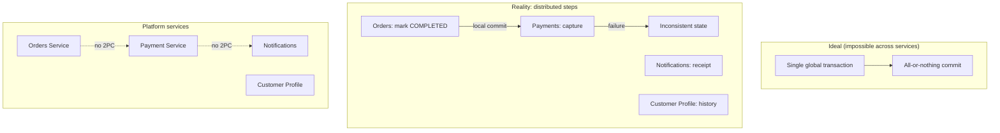
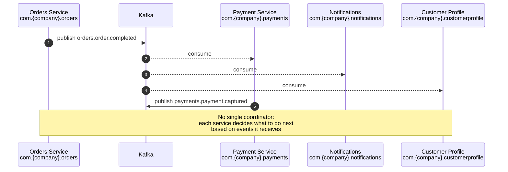
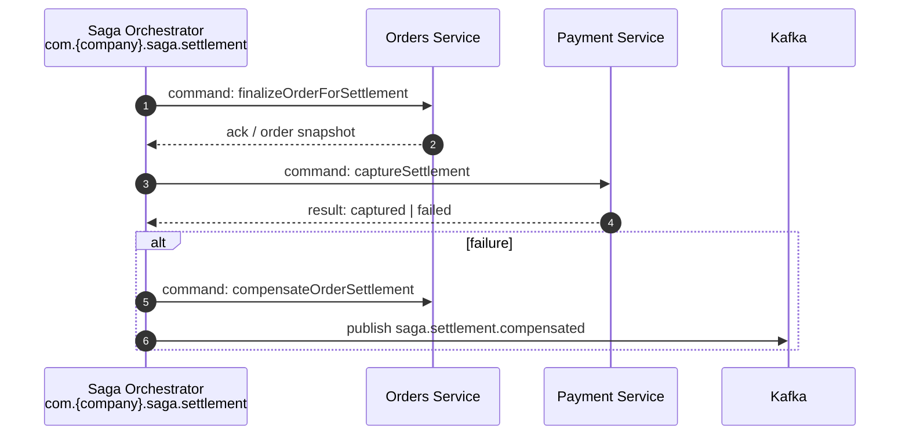
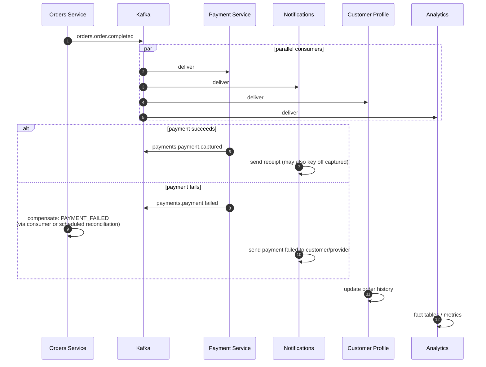
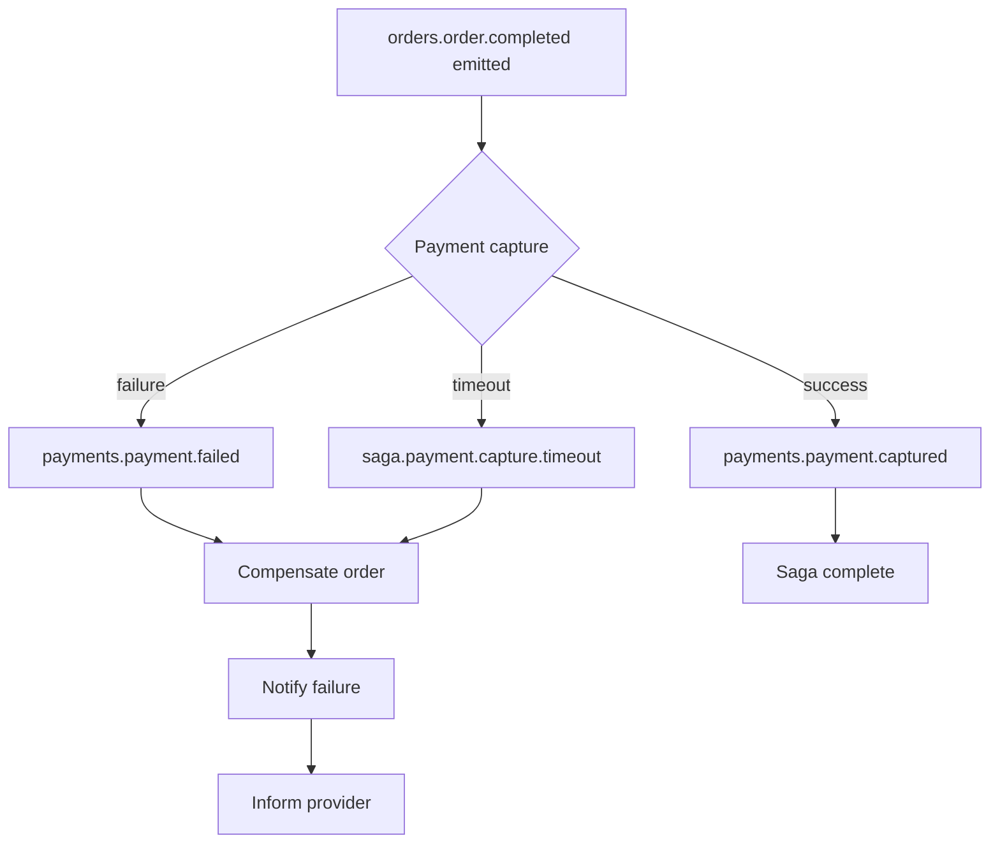
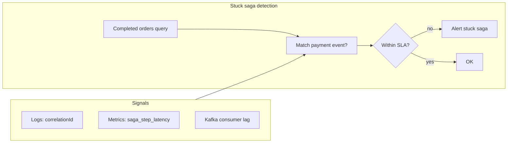

# 🔄 Saga & Distributed Transaction Patterns

  

---

## 🎯 1. The Problem

> **Principle:** Sagas, choreography vs orchestration, compensation, and idempotency are **architecture-level** concerns. They do not depend on a single language or framework. Event and package names shown as `com.{company}.*` are namespace conventions; Kafka consumer code in Java is **reference implementation (Java / Spring Boot)**.

In the platform, completing an order touches multiple services: **Orders** (`com.{company}.orders`), **Payments** (`com.{company}.payments`), **Notifications** (`com.{company}.notifications`), and **Customer Profile** (`com.{company}.customerprofile`). A naïve design might mark the order complete, then capture payment, then notify the customer - each step in its own local transaction.

If **payment capture fails after the order is already marked `COMPLETED`**, the system is inconsistent: the business says the order finished, but money was not collected. You cannot hold a single database lock across service boundaries. **Two-phase commit (2PC)** across microservices is impractical: it requires all participants to be available for the prepare phase, couples availability, and does not fit our event-driven, independently deployable services.

**Platform standard:** model multi-step business processes as **sagas** - a sequence of local transactions coordinated by **messages** (choreography or orchestration), each with a defined **compensation** path when something goes wrong.

**Visual overview:**



The diagram above contrasts a fictional atomic cross-service transaction with what actually happens: **independent commits** and the risk of partial failure. Sagas make that failure **explicit and recoverable** through compensating actions and idempotent consumers.

---

## 🧩 2. Saga Patterns

### Choreography (Preferred)

Services react to **domain events** on Kafka. There is **no central coordinator**. Each service publishes events that downstream consumers use to trigger the next local step in the business process.

| Aspect | Detail |
|--------|--------|
| **Mechanism** | Topic-based pub/sub; schemas under governed registry subjects (reference: `com.{company}.*`-style namespaces in the platform schema registry) |
| **Pros** | Loosely coupled teams and deployables; no orchestrator SPOF; aligns with domain boundaries |
| **Cons** | End-to-end progress is implicit; debugging requires correlation IDs and tracing across many consumers |

**Visual overview:**



### Orchestration

A **saga orchestrator** - either a dedicated service (e.g. `com.{company}.saga.settlement`) or a designated coordinator such as Orders for a narrow flow - **sends commands** and **waits for replies** (or correlates async responses). State machines in the orchestrator record which step is active.

| Aspect | Detail |
|--------|--------|
| **Mechanism** | Command topics and/or synchronous internal APIs with clear timeouts; orchestrator owns saga instance state |
| **Pros** | Single place to inspect progress; strict ordering is straightforward |
| **Cons** | Orchestrator is a coupling point and potential SPOF; must be scaled and resilient like any critical service |

**Visual overview:**



### Decision Guide

| Choose **choreography** when | Choose **orchestration** when |
|------------------------------|-------------------------------|
| Steps are largely **independent** and ordering between some consumers is **not** business-critical | **Strict ordering** is required across many steps |
| Few well-known reactions to a single event (notify, analytics, profile) | The saga has **more than five** distinct coordinated steps with branching |
| You want **minimal coupling** to a central coordinator | You need a **single dashboard** of saga instance state for compliance or ops |

**Policy:** **Choreography is the default** for order-adjacent flows (completion, cancellation side effects). **Orchestration is mandated only** for the **payment settlement saga** (multi-party splits, retries, regulatory holds) where explicit state and ordering outweigh coupling cost.

---

## 🧩 3. Worked Example: Order Completion Saga (Choreography)

End-to-end walkthrough for the happy path and payment failure. All events carry a **`correlationId`** (typically `orderId`) for tracing.

1. **Orders Service** (`com.{company}.orders`) marks the order `COMPLETED`, persists, and publishes **`orders.order.completed`** (Avro: `com.{company}.orders.events.OrderCompleted`).
2. **Payment Service** consumes, runs **idempotent** capture, then publishes **`payments.payment.captured`** or **`payments.payment.failed`**.
3. **Notifications Service** consumes order completion (and optionally payment outcome), sends the customer receipt or failure notice.
4. **Customer Profile Service** consumes **`orders.order.completed`**, appends to order history.
5. **Analytics pipeline** consumes the same event (and payment events) for reporting and data warehouse loads.

**Visual overview:**



---

## 🧩 4. Compensation Patterns

When a saga step **fails**, earlier **forward** effects must be **compensated** (semantic undo - not always a literal delete). Compensation is also triggered on **timeouts** (see §7).

| Step (forward) | Compensation action | Owner |
|----------------|---------------------|--------|
| Order marked `COMPLETED` | Transition order to **`PAYMENT_FAILED`** (or `COMPLETED_PENDING_PAYMENT` per product rules); block provider payout until resolved | `com.{company}.orders` |
| Payment authorized / hold placed | **Void** or **release** authorization per PSP rules | `com.{company}.payments` |
| Receipt notification sent | Send **corrective** notification ("payment issue - we're retrying" / final failure copy) | `com.{company}.notifications` |
| Customer profile history updated | **Append** a compensating record or mark entry as `VOIDED` (never silent delete of audit trail) | `com.{company}.customerprofile` |
| Analytics / DWH fact written | Emit **correcting** event or late-arriving negative adjustment | Data platform |

**Example (payment capture fails):** Orders updates status so ops and apps show truth; Notifications sends **"payment failed"** to the customer; provider surfaces are informed per policy (in-app + push) so the **payment issue** is visible without implying an unpaid completed order for payout.

**Visual overview:**



---

## 🛡️ 5. Idempotency Requirements

**Every saga participant MUST be idempotent.** Kafka provides **at-least-once** delivery; the same event can be processed twice after a crash between business logic and offset commit.

**Mandatory pattern:** use the **`processed_events` table** (or equivalent) as documented in [Kafka Patterns - Idempotent consumers](../06-developer-guides/04-kafka-patterns.md): dedupe by **`(event_id, topic)`** in the **same database transaction** as the business side effect, then acknowledge the message.

**Code example - idempotent payment capture** (`com.{company}.payments`) - **reference implementation (Java / Spring Boot):**

> **Substitution point:** Implement the same transactional dedupe (`processed_events` + business side effect + ack) with your stack's consumer SDK and unit-of-work primitives.

```java
@Component
public class OrderCompletedPaymentConsumer {

    private final PaymentCaptureService paymentCaptureService;
    private final ProcessedEventRepository processedEventRepository;
    private final PaymentEventPublisher paymentEventPublisher;

    @KafkaListener(topics = "orders.order.completed", groupId = "${spring.application.name}.order-completed.consumer")
    @Transactional
    public void onOrderCompleted(
            @Payload OrderCompletedAvro event,
            Acknowledgment acknowledgment) {

        String eventId = event.getOrderId() + "-" + event.getCompletedAt();
        String topic = "orders.order.completed";

        if (processedEventRepository.existsByEventIdAndTopic(eventId, topic)) {
            acknowledgment.acknowledge();
            return;
        }

        try {
            paymentCaptureService.captureForOrder(
                    OrderId.of(event.getOrderId()),
                    Money.of(event.getPriceAmount(), event.getCurrency()));
            processedEventRepository.save(new ProcessedEvent(eventId, topic));
            paymentEventPublisher.publishCaptured(event.getOrderId(), event.getCorrelationId());
        } catch (PaymentCaptureException ex) {
            processedEventRepository.save(new ProcessedEvent(eventId, topic));
            paymentEventPublisher.publishFailed(event.getOrderId(), ex.getReason(), event.getCorrelationId());
        }

        acknowledgment.acknowledge();
    }
}
```

> **Note:** Choose `eventId` from a stable unique field from the envelope (prefer **`eventId`** from the CloudEvents or platform envelope when present). The example composes `orderId` + `completedAt` only when the schema guarantees uniqueness.

---

## 👁️ 6. Saga State Tracking

Observability for sagas is **not** optional.

- **Structured logs:** Every handler logs saga-relevant events with **`correlationId`**, **`orderId`**, **`sagaType`** (e.g. `ORDER_COMPLETION`), and **step name**.
- **Grafana / Loki:** Query for sagas that **started** (e.g. `orders.order.completed` processed) but **never** reached a terminal payment event within SLA window.
- **Dead saga detection:** Alert if an order remains **`COMPLETED`** without a matching **`payments.payment.captured`** or **`payments.payment.failed`** within **5 minutes** (tune per region/PSP).

**Visual overview:**



---

## 🛡️ 7. Timeout Handling

| Step | Timeout (default) | On timeout |
|------|-------------------|------------|
| Payment capture | **5 minutes** | Publish **`saga.payment.capture.timeout`** (or internal compensating command); **trigger compensation** in Orders / Notifications per §4 |
| Notification dispatch | **30 seconds** | Retry with backoff; after max retries, route to DLQ (§8); do **not** block payment completion |

**Scheduler:** a **workflow or job runner** (e.g. Quartz, Spring `@Scheduled`, Temporal, or cloud schedulers) **scans for timed-out saga legs every 1 minute** and emits timeout/compensation events. Orchestrated settlement sagas store **deadline** per step in orchestrator state.

---

## ⚠️ 8. Dead Letter Handling

- Failed saga-related consumers after **3 retries** (with exponential backoff) **must** produce to a **dedicated DLQ topic** (e.g. `orders.order.completed.dlq`, `payments.saga.dlq`) with **original payload + error metadata**.
- **Monitoring:** Page if **any** saga DLQ has **depth > 0** for **more than 5 minutes**.
- **Manual replay:** After root cause is fixed, **replay from DLQ** using a controlled tool that respects **idempotency** (`processed_events`). Document the replay in the incident ticket; never delete DLQ messages until replay is verified.

---

## ❌ 9. Anti-Patterns

| Anti-pattern | Why it hurts |
|--------------|--------------|
| **Synchronous saga** (HTTP/gRPC chain, each caller waits for the next) | Defeats decoupling, amplifies failures, hides retries; **forbidden** for multi-domain order completion |
| **Nested sagas** (saga spawning another saga without clear boundaries) | Impossible to reason about compensation order and SLAs |
| **Missing compensation** | Every forward step **MUST** have a documented compensating action or terminal business state |
| **Ignoring idempotency** | **Double capture**, double notifications, corrupted profile history |
| **No timeout** | Sagas **hang forever**; customers and providers see wrong state; payouts stall |

---

## 👁️ 10. Monitoring and Alerting

**Grafana dashboard panels (minimum):**

| Panel | Description |
|-------|-------------|
| Saga completion rate | Ratio of terminal success events to started sagas (e.g. per `sagaType`) |
| Saga duration | **P50 / P99** time from `orders.order.completed` to `payments.payment.captured` |
| Failed sagas | Count per hour: `payments.payment.failed` + compensation outcomes |
| Stuck sagas | Count of orders matching §6 detection query |

**Alert rules (initial thresholds):**

| Condition | Severity |
|-----------|----------|
| Stuck saga count **> 0** for **10 minutes** | **P2** |
| Payment saga failure rate **> 1%** over rolling window | **P1** |

Tune thresholds per market and PSP; document overrides in the observability runbook.

---

<div align="center">

⬅️ [Back to section](./README.md) · 🏠 [Back to root](../README.md)

</div>
