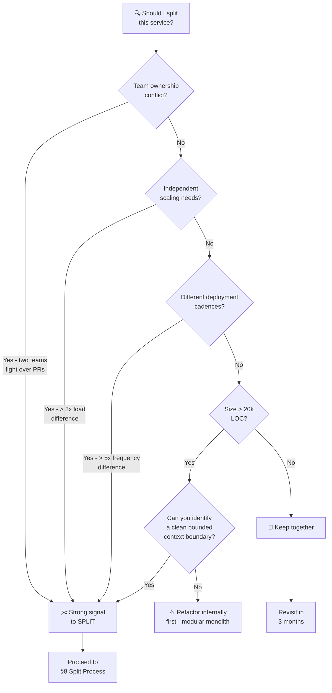
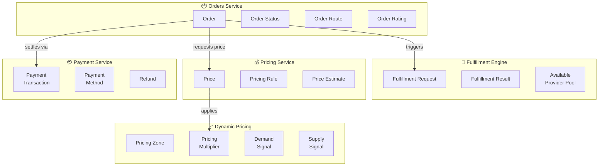
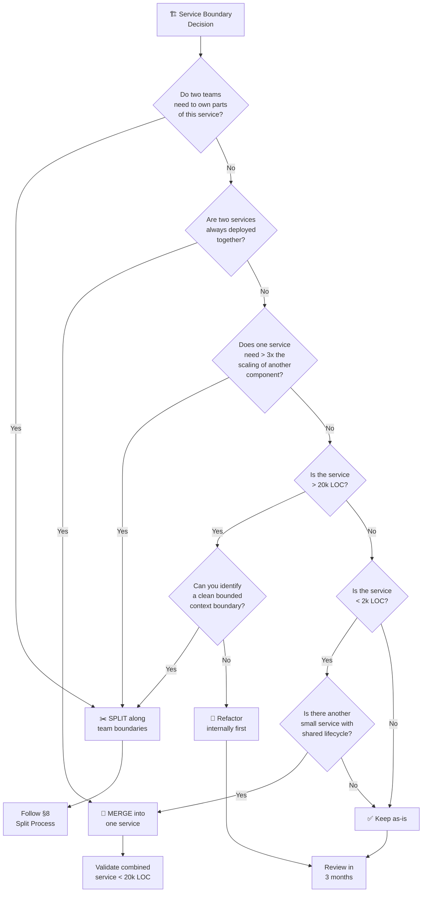

# ✂️ Service Decomposition Criteria

  

---

## 🧭 1. When to Split a Service

Splitting a service is expensive - it introduces network boundaries, distributed transactions, and operational overhead. Only split when the **cost of keeping things together** exceeds the cost of separation.

### 1.1 Split Signals

| Signal | Description | Threshold |
|--------|-------------|-----------|
| **Team ownership conflict** | Two teams need to modify the same service frequently, causing merge conflicts and coordination overhead | > 3 cross-team PRs per sprint |
| **Independent scaling needs** | One part of the service needs to scale horizontally while another does not | > 3x difference in peak load between components |
| **Different deployment cadences** | One part changes daily, another changes monthly - coupled deployments slow the fast part down | > 5x difference in deployment frequency |
| **Size** | The service has grown beyond what a single team can reason about | > 20k LOC (excluding tests and generated code) |
| **Bounded context sprawl** | The service owns entities that belong to different business domains | Service manages both `Order` and `Payment` entities |
| **Different reliability requirements** | One component is latency-critical (P99 < 50ms) while another is batch-tolerant | Significantly different SLO requirements |
| **Technology mismatch** | One component would benefit from a different runtime (e.g., ML model serving) | Clear technical justification |

### 1.2 Split Decision Matrix



---

## 🧭 2. When to Merge Services

Merging is the reverse - and equally valid. Two services that should be one create unnecessary operational overhead, network calls, and deployment complexity.

### 2.1 Merge Signals

| Signal | Description |
|--------|-------------|
| **Shared lifecycle** | Both services are always updated together - a change in one requires a change in the other |
| **Always deployed together** | You cannot deploy A without deploying B (and vice versa) |
| **Single team owns both** | One team owns both services and context-switches between them |
| **Tiny services** | Either service is < 2k LOC - the operational overhead exceeds the code complexity |
| **Synchronous call chain** | A calls B synchronously for every request - they are functionally one service split by a network boundary |
| **Shared database** | Both services read/write the same tables - the DB is the real boundary, not the service |

### 2.2 Merge Validation

Before merging, confirm:
- The combined service will not exceed 20k LOC
- The combined service has a clear single owner
- The merged service does not introduce conflicting scaling requirements
- The merged service fits within one bounded context

---

## 🧩 3. Conway's Law Alignment

> *"Organizations which design systems are constrained to produce designs which are copies of the communication structures of these organizations."* - Melvin Conway

We **embrace Conway's Law intentionally** - service boundaries should mirror team boundaries. When they don't, friction emerges: coordination overhead, unclear ownership, and slow decision-making.

### 3.1 Team → Service Mapping

```mermaid
graph TB
    subgraph Teams["👥 Engineering Teams"]
        Orders["Orders Team"]
        Providers["Providers Team"]
        Customers["Customers Team"]
        Payments["Payments Team"]
        Commercial["Commercial Team"]
        TrustSafety["Trust & Safety Team"]
        Platform["Platform Team"]
    end

    subgraph Services["🔧 Service Ownership"]
        TS["Orders Service"]
        ME["Fulfillment Engine"]
        DP["Provider Profile"]
        DA["Provider App BFF"]
        RP["Customer Profile"]
        RA["Customer App BFF"]
        PS["Payment Service"]
        PO["Payout Service"]
        PR["Pricing Service"]
        SP["Dynamic Pricing"]
        Promo["Promotions"]
        FE["Fraud Engine"]
        SS["Trust & Safety Service"]
        Infra["EKS / ArgoCD /<br/>Observability Stack"]
    end

    Orders --> TS
    Orders --> ME
    Providers --> DP
    Providers --> DA
    Customers --> RP
    Customers --> RA
    Payments --> PS
    Payments --> PO
    Commercial --> PR
    Commercial --> SP
    Commercial --> Promo
    TrustSafety --> FE
    TrustSafety --> SS
    Platform --> Infra

```



### 3.2 Anti-Pattern: Cross-Team Service Ownership

If a service is co-owned by two teams, one of these is true:
1. The service should be split along team boundaries
2. One team should fully own it and the other team should consume it via API
3. The team structure is wrong and should be reorganized

**Never accept shared ownership as a permanent state.** Shared ownership = no ownership.

---

## 🧩 4. Bounded Context Validation

Each service should own a **cohesive set of entities** that belong to the same business domain. If a service manages entities from different domains, the boundary is wrong.

### 4.1 Entity Ownership Map



### 4.2 Validation Questions

For each service, ask:

| Question | Healthy Answer | Unhealthy Answer |
|----------|---------------|-----------------|
| Can you name the bounded context? | "This is the Order lifecycle context" | "It does orders and payments" |
| Does every entity belong to this context? | Yes - all entities relate to the same domain | No - `Payment` has nothing to do with `Order` lifecycle |
| Could another team understand this service's domain in one sentence? | Yes | It takes a 30-minute explanation |
| Does the service's API name match its domain? | `orders-service` manages orders | `core-service` manages everything |

---

## 🧩 5. Coupling Analysis

Wrong service boundaries reveal themselves through coupling. If two services are tightly coupled, they are either one service pretending to be two, or the boundary is in the wrong place.

### 5.1 Coupling Indicators

| Indicator | What It Means | Action |
|-----------|--------------|--------|
| **Shared database tables** | Services are coupled at the data layer - one service's schema change can break the other | Split the table or merge the services |
| **Synchronous call chains** | Service A cannot respond without calling B, which cannot respond without calling C | Consider merging A+B or making the call async |
| **Coordinated deployments** | "We need to deploy A before B" = temporal coupling | Either merge or introduce a versioned API contract |
| **Shared libraries with business logic** | Business logic in a shared lib means the boundary is in the lib, not the services | Move the logic into one service |
| **Distributed transactions** | Two services must succeed or fail together | They probably belong together |

### 5.2 Independence Test

A properly decomposed service can:
- ✅ Be deployed independently without coordinating with other teams
- ✅ Be scaled independently based on its own load characteristics
- ✅ Be understood by its owning team without deep knowledge of other services
- ✅ Fail independently without cascading to unrelated services
- ✅ Have its database schema changed without affecting other services

---

## 🧭 6. Decomposition Decision Flowchart

Use this flowchart when debating whether to split, merge, or leave a service boundary as-is.



---

## 🧩 7. Worked Example: Should Dynamic Pricing Be Separate?

**Question:** Should Dynamic Pricing be part of Pricing Service, or its own service?

### 7.1 Analysis

| Factor | Pricing Service | Dynamic Pricing | Verdict |
|--------|----------------|-----------------|---------|
| **Team** | Commercial team (pricing rules squad) | Commercial team (demand squad) | Different sub-teams → **Split** |
| **Data** | Pricing rules, base rates, distance/time matrices | Real-time demand/supply signals, zone polygons, pricing multipliers | Different data domains → **Split** |
| **Scaling** | Moderate - price calculation per order request | High - processes location events from every active provider every 5 seconds | Very different scaling → **Split** |
| **Deployment cadence** | Monthly - pricing rules change infrequently | Weekly - algorithm tuning is continuous | Different cadences → **Split** |
| **Failure impact** | Order cannot be priced → critical | Dynamic pricing defaults to 1.0x → degraded but functional | Different failure modes → **Split** |
| **Bounded context** | "How much does this order cost?" | "What is the demand multiplier in this zone right now?" | Different questions → **Split** |

### 7.2 Decision

**Dynamic Pricing is a separate service.** The evidence is overwhelming across every decomposition criterion:

- Different sub-teams with different expertise
- Different data models and data sources
- 10x+ scaling difference (Dynamic Pricing processes continuous streams; Pricing handles request/response)
- Different deployment frequencies
- Clean API boundary: Pricing calls Dynamic Pricing to get the current multiplier

### 7.3 The Interface

```
Pricing Service → GET /api/v1/dynamic-pricing/zones/{zoneId}/multiplier → Dynamic Pricing Service
```

Pricing Service caches the multiplier for 30 seconds to tolerate Dynamic Pricing downtime. If Dynamic Pricing is unavailable, the multiplier defaults to `1.0x` (no dynamic adjustment).

---

## 📏 8. The Split Process

When the decision is made to split, follow this process to minimize disruption.

### 8.1 Steps

| Phase | Step | Detail |
|-------|------|--------|
| **1. Extract Interface** | Define the API | Design the contract between the existing service and the new service before writing any code |
| | Consumer-driven contract | Write Pact contract tests from the consumer's perspective |
| | ADR | Record the decision in an Architecture Decision Record |
| **2. Create New Service** | Scaffold | Use the service template in Backstage |
| | Implement | Build the new service behind the defined interface |
| | Test | Integration tests + contract tests must pass |
| **3. Migrate Traffic** | Strangler pattern | Route traffic to the new service gradually (5% → 25% → 50% → 100%) |
| | Dual-write (if stateful) | Write to both old and new data stores during migration |
| | Monitor | Watch error rates, latency, and correctness during migration |
| **4. Decommission** | Remove old code | Delete the extracted code from the original service |
| | Remove routing | Remove the strangler routing rules |
| | Clean up data | Migrate remaining data, drop old tables |
| | Update Backstage | Register new service, update ownership |

### 8.2 Timeline

| Service Size | Expected Duration |
|-------------|-------------------|
| Small (< 5k LOC extracted) | 2–4 weeks |
| Medium (5k–15k LOC) | 4–8 weeks |
| Large (> 15k LOC) | 8–12 weeks (consider phased extraction) |

### 8.3 Rollback Plan

Every split must have a rollback plan. If the new service is not stable within 2 weeks of full traffic migration:
1. Route traffic back to the original service
2. Conduct a retrospective
3. Fix issues and retry - or decide the split was premature

---

---
<div align="center">

⬅️ [Back to section](./README.md) · 🏠 [Back to root](../README.md)

</div>
