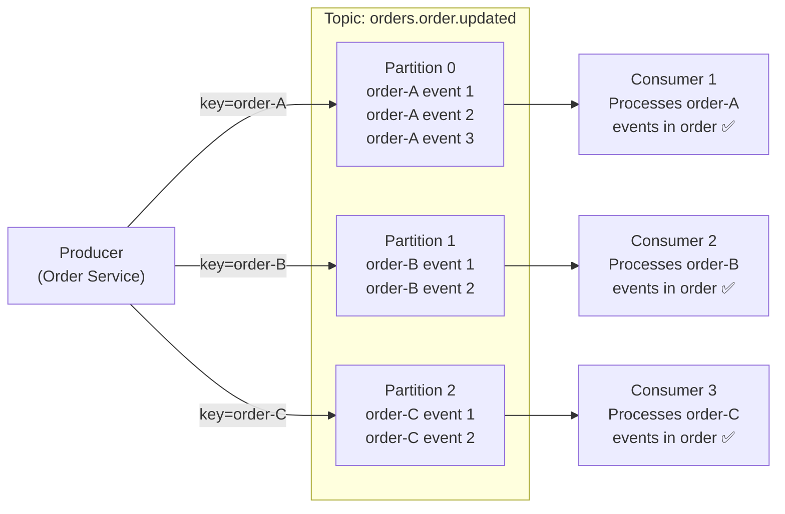
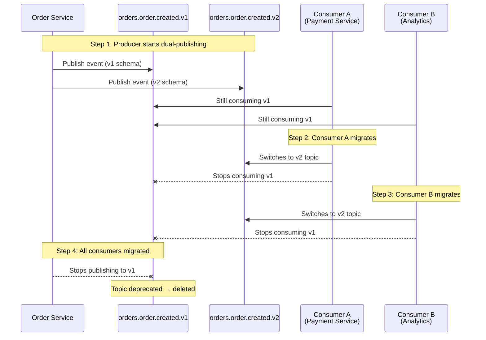

# Event Schema Evolution & Kafka Patterns

> **Status:** Mandated  
> **Owner:** Platform Engineering  
> **Last Updated:** 2026

---

## Table of Contents

1. [Avro Compatibility Modes](#1-avro-compatibility-modes)
2. [Allowed Schema Changes](#2-allowed-schema-changes)
3. [Forbidden Schema Changes](#3-forbidden-schema-changes)
4. [Glue Schema Registry Configuration](#4-glue-schema-registry-configuration)
5. [Partition Key Strategy](#5-partition-key-strategy)
6. [Ordering Guarantees](#6-ordering-guarantees)
7. [Breaking Change Playbook](#7-breaking-change-playbook)
8. [Consumer Tolerance](#8-consumer-tolerance)

---

## 1. Avro Compatibility Modes

All Kafka topics on the {Company} platform use **Avro** for message serialization with schemas registered in **AWS Glue Schema Registry**. The compatibility mode determines which schema changes are permitted without breaking existing consumers or producers.

### 1.1 Compatibility Mode Reference

| Mode | Default? | When to Use | Approval Required |
|------|----------|-------------|-------------------|
| **BACKWARD** | Yes — all topics | New schema can read data written by the old schema. Consumers can be upgraded before producers. | None — this is the default |
| **FORWARD** | No | Old schema can read data written by the new schema. Producers can be upgraded before consumers. | RFC approval required |
| **FULL** | No (recommended for high-traffic) | Both BACKWARD and FORWARD compatible. Either side can be upgraded first. | Recommended for topics with > 10 consumer groups |
| **NONE** | Forbidden | No compatibility enforcement. | Never permitted in production |

### 1.2 Allowed and Forbidden Operations by Mode

| Operation | BACKWARD | FORWARD | FULL |
|-----------|----------|---------|------|
| Add optional field with default | ✅ Allowed | ✅ Allowed | ✅ Allowed |
| Remove optional field | ✅ Allowed | ❌ Forbidden | ❌ Forbidden |
| Add required field (no default) | ❌ Forbidden | ✅ Allowed | ❌ Forbidden |
| Remove required field | ✅ Allowed | ❌ Forbidden | ❌ Forbidden |
| Add enum value at end | ✅ Allowed (with consumer tolerance) | ✅ Allowed | ✅ Allowed |
| Widen union type | ✅ Allowed | ❌ Forbidden | ❌ Forbidden |
| Narrow union type | ❌ Forbidden | ✅ Allowed | ❌ Forbidden |

---

## 2. Allowed Schema Changes

The following changes are safe under the default BACKWARD compatibility mode and do not require an RFC or migration.

### 2.1 Add an Optional Field with a Default Value

```avro
{
  "name": "deliveryInstructions",
  "type": ["null", "string"],
  "default": null,
  "doc": "Free-text delivery instructions provided by the customer"
}
```

Existing consumers that do not know about the new field will ignore it. New consumers can read it. The default value ensures that old messages (which lack the field) are still readable.

### 2.2 Add a New Enum Value at the End

```avro
{
  "name": "OrderStatus",
  "type": "enum",
  "symbols": ["CREATED", "ASSIGNED", "IN_PROGRESS", "COMPLETED", "CANCELLED", "RETURNED"]
}
```

Adding `RETURNED` at the end is safe, provided consumers implement **unknown enum tolerance** (see §8). Consumers that encounter an unknown enum value must log a warning and treat it as an unrecognized status rather than failing.

### 2.3 Widen a Union Type

Adding a new type to a union is permitted under BACKWARD compatibility:

```avro
// Before
"type": ["null", "string"]

// After — added int to the union
"type": ["null", "string", "int"]
```

---

## 3. Forbidden Schema Changes

The following changes are **never permitted** without following the breaking change playbook (§7). They will be rejected by the Glue Schema Registry compatibility check.

| Change | Why It Breaks |
|--------|--------------|
| **Remove a field** | Consumers reading old messages expect the field to exist |
| **Rename a field** | Avro uses field names for resolution — a rename is effectively a remove + add |
| **Change a field's type** | A consumer expecting `string` will fail if it receives `int` |
| **Reorder enum values** | Avro enums are encoded by ordinal position; reordering changes the meaning of existing data |
| **Change topic partition count** | Rebalances all consumer groups; messages with the same key may land on a different partition, breaking ordering guarantees. Requires RFC. |
| **Change the partition key field** | Existing consumers rely on per-key ordering; changing the key field breaks ordering semantics |

### 3.1 Schema Validation in CI

Every service that publishes Kafka events includes a **schema compatibility check** in its CI pipeline:

```bash
aws glue check-schema-version-validity \
  --data-format AVRO \
  --schema-definition file://src/main/avro/OrderEvent.avsc \
  --schema-id SchemaName="orders.order.v1",RegistryName="{company}-production"
```

If the new schema is incompatible with the registered schema, the CI build fails. Developers must either adjust the schema to be compatible or follow the breaking change playbook.

---

## 4. Glue Schema Registry Configuration

### 4.1 Registry Structure

| Registry | Purpose | Environment |
|----------|---------|-------------|
| `{company}-production` | All production topic schemas | `prod` |
| `{company}-staging` | Staging schemas (may have NONE compatibility for testing) | `staging` |
| `{company}-development` | Development schemas (NONE compatibility permitted) | `dev` |

### 4.2 Subject Naming Convention

```
<domain>.<entity>.<event-type>.v<major-version>

Examples:
  orders.order.created.v1
  payments.payment.captured.v1
  fulfillment.assignment.completed.v1
  pricing.rule.updated.v1
```

### 4.3 Version Lifecycle

| Phase | State | Behavior |
|-------|-------|----------|
| **Latest** | Active | Current version used by producers |
| **Available** | Active | Previous compatible versions; consumers may still use them |
| **Deprecated** | Deprecated | Marked for removal; consumers must migrate within the deprecation window |
| **Deleted** | Removed | Schema version purged after all consumers have migrated |

### 4.4 Compatibility Mode per Subject

Compatibility mode is set at the subject level, not the registry level. This allows high-traffic topics to use FULL compatibility while lower-traffic topics use the default BACKWARD.

```bash
aws glue update-schema \
  --schema-id SchemaName="orders.order.created.v1",RegistryName="{company}-production" \
  --compatibility FULL
```

---

## 5. Partition Key Strategy

### 5.1 Mandatory Partition Keys

Every domain event topic **must** have a defined partition key. Publishing without a key (null key) results in round-robin distribution, which destroys ordering guarantees and is **forbidden** for domain events.

### 5.2 Partition Key Mapping

| Domain | Topic Pattern | Partition Key | Rationale |
|--------|--------------|---------------|-----------|
| **Orders** | `orders.order.*` | `orderId` | All events for an order are processed in order |
| **Payments** | `payments.payment.*` | `orderId` | Payment events correlated with order lifecycle |
| **Fulfillment** | `fulfillment.assignment.*` | `orderId` | Assignment events tied to a specific order |
| **Providers** | `providers.provider.*` | `providerId` | Provider state changes are per-provider |
| **Customers** | `customers.customer.*` | `customerId` | Customer events are per-customer |
| **Pricing** | `pricing.rule.*` | `regionId` | Pricing rules scoped to regions |
| **Dynamic Pricing** | `pricing.dynamic.*` | `zoneId` | Multiplier updates scoped to pricing zones |
| **Notifications** | `notifications.notification.*` | `recipientId` | Delivery ordering per recipient |

### 5.3 High-Cardinality Warning

Partition keys with very high cardinality (e.g., `orderId` in a system processing millions of orders daily) distribute well across partitions. However, partition keys with **low cardinality** (e.g., `country` with 5 values) cause hot partitions.

| Cardinality | Risk | Mitigation |
|-------------|------|------------|
| Very high (> 1M distinct keys/day) | None — good distribution | Default behavior |
| Moderate (1K–1M) | Acceptable | Monitor partition lag skew |
| Low (< 1K) | Hot partitions, consumer lag skew | Add a sub-key (e.g., `country:shard-N`) or use a different key |

---

## 6. Ordering Guarantees

### 6.1 What Kafka Guarantees

Kafka provides **per-partition ordering only**. Messages with the same key go to the same partition and are consumed in the order they were produced. There is **no cross-partition ordering guarantee**.



### 6.2 Head-of-Line Blocking

If a consumer fails to process a message and retries in-place, all subsequent messages **on that partition** are blocked. This is head-of-line blocking.

| Mitigation | How It Works |
|------------|--------------|
| **Dead-letter topic** | After N retries (default: 3), move the failed message to a DLT and continue processing. Operators investigate DLT messages separately. |
| **Retry topic with delay** | Move the failed message to a retry topic with increasing backoff delays (1s, 10s, 60s). The consumer continues processing the main partition. |
| **Idempotent processing** | Design consumers to safely reprocess messages. On retry, the same message produces the same outcome. |

### 6.3 Cross-Service Event Ordering

If service A must process event X before service B processes event Y, and X and Y are on different topics, **Kafka does not guarantee this ordering**. Solutions:

| Approach | When to Use |
|----------|-------------|
| **Causal ordering via event metadata** | Include a `causationId` and `correlationId` in every event. Service B checks that the causation event has been processed before acting. |
| **Orchestration** | Use a saga orchestrator that explicitly sequences steps (see saga-patterns.md) |
| **Wait-and-retry** | Service B receives event Y but the prerequisite state is not yet present. It retries after a delay. Simple but adds latency. |

---

## 7. Breaking Change Playbook

When a schema change is fundamentally incompatible — a field type change, a field removal, or a semantic change that alters the meaning of existing fields — follow this playbook. There are no shortcuts.

### 7.1 Steps

| Step | Action | Detail |
|------|--------|--------|
| 1 | **Create new topic** | Name the new topic with a `v2` suffix (e.g., `orders.order.created.v2`). Register the new schema. |
| 2 | **Dual-publish** | The producer publishes to **both** the old topic (v1) and the new topic (v2) simultaneously. Minimum dual-publish window: **30 days**. |
| 3 | **Consumer migration** | Notify all consumer teams. Consumers migrate to the new topic at their own pace within the migration window. |
| 4 | **Monitor migration** | Track consumer group lag on the old topic. Migration is complete when all consumer groups on v1 have zero lag and have been decommissioned. |
| 5 | **Deprecate old topic** | Mark the v1 topic as deprecated. Follow the deprecation lifecycle (see `03-engineering-practices/08-deprecation-lifecycle.md`). |
| 6 | **Remove old topic** | After the deprecation window, delete the v1 topic and its schema versions. |

### 7.2 Migration Flow



### 7.3 Dual-Publish Implementation

```java
@Service
@RequiredArgsConstructor
public class OrderEventPublisher {

    private final KafkaTemplate<String, OrderCreatedV1> kafkaV1;
    private final KafkaTemplate<String, OrderCreatedV2> kafkaV2;
    private final FeatureFlagClient featureFlags;

    public void publishOrderCreated(Order order) {
        OrderCreatedV2 eventV2 = OrderCreatedV2.fromDomain(order);
        kafkaV2.send("orders.order.created.v2", order.getId(), eventV2);

        if (featureFlags.isEnabled("dual-publish-order-created-v1")) {
            OrderCreatedV1 eventV1 = OrderCreatedV1.fromDomain(order);
            kafkaV1.send("orders.order.created.v1", order.getId(), eventV1);
        }
    }
}
```

The dual-publish is gated by a feature flag so it can be disabled once all consumers have migrated.

---

## 8. Consumer Tolerance

All Kafka consumers on the {Company} platform must be **tolerant** of schema evolution. A consumer that crashes on an unknown field or a missing optional field is a bug.

### 8.1 Rules

| Rule | Implementation |
|------|---------------|
| **Ignore unknown fields** | Avro readers configured with `GenericDatumReader` or generated specific readers with `setNewFieldsPolicy(IGNORE)`. Unknown fields are silently skipped. |
| **Handle missing optional fields** | Consumers check for null/default values on all optional fields. Business logic has explicit handling for "field not present." |
| **Tolerate unknown enum values** | Consumers that encounter an unrecognized enum value log a warning and fall through to a default handler. They do not throw an exception. |
| **Version header check** | Every event includes a `schemaVersion` header. Consumers log the version for debugging but do not reject messages based on version alone. |

### 8.2 Consumer Tolerance Test

Every consumer service includes an integration test that validates tolerance:

```java
@Test
void shouldHandleUnknownFieldsGracefully() {
    GenericRecord record = new GenericData.Record(SCHEMA_V1);
    record.put("orderId", "order-123");
    record.put("status", "CREATED");

    GenericRecord evolved = addUnknownField(record, "newField", "unexpected-value");

    OrderEvent parsed = consumer.deserialize(evolved);

    assertThat(parsed.getOrderId()).isEqualTo("order-123");
    assertThat(parsed.getStatus()).isEqualTo("CREATED");
}

@Test
void shouldHandleMissingOptionalFieldsGracefully() {
    GenericRecord record = new GenericData.Record(SCHEMA_V2);
    record.put("orderId", "order-456");
    record.put("status", "COMPLETED");
    // deliveryInstructions intentionally not set — should default to null

    OrderEvent parsed = consumer.deserialize(record);

    assertThat(parsed.getOrderId()).isEqualTo("order-456");
    assertThat(parsed.getDeliveryInstructions()).isNull();
}
```

---

← [Back to section](./README.md) · [Back to root](../README.md)
