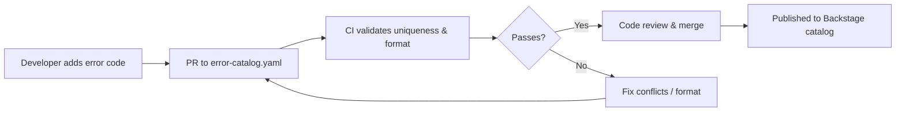
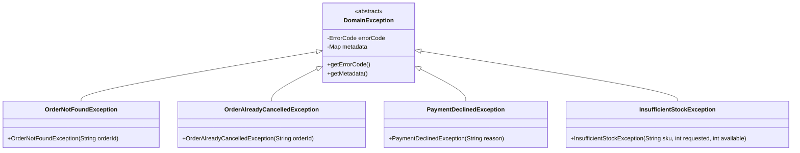
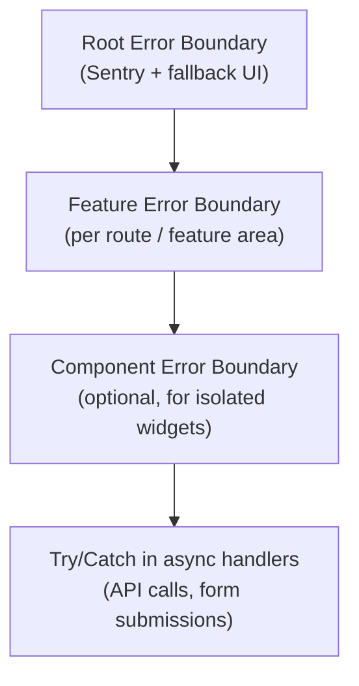

# 🚨 Error Catalog & Exception Handling

  

---

## 📋 Table of Contents

1. [Central Error Code Registry](#1-central-error-code-registry)
2. [Registration Process](#2-registration-process)
3. [Error Code to Status Mapping](#3-error-code-to-status-mapping)
4. [Global Exception Handler Standard](#4-global-exception-handler-standard)
5. [Domain Exception Hierarchy](#5-domain-exception-hierarchy)
6. [Standard Error Response Body](#6-standard-error-response-body)
7. [Frontend Error Handling](#7-frontend-error-handling)
8. [Cross-Reference: API Standards Error Shape](#8-cross-reference-api-standards-error-shape)

---

## ⚠️ 1. Central Error Code Registry

Every error surfaced by a {Company} service must have a registered error code in the central catalog. Error codes are globally unique, human-readable, and stable across releases.

### 1.1 Error Code Format

```
{DOMAIN}.{ENTITY}.{ERROR}
```

| Segment | Description | Convention |
|---------|-------------|------------|
| `DOMAIN` | Business domain (maps to a bounded context) | UPPER_SNAKE_CASE, singular |
| `ENTITY` | The entity or aggregate root involved | UPPER_SNAKE_CASE, singular |
| `ERROR` | The specific error condition | UPPER_SNAKE_CASE, past tense or adjective |

### 1.2 Examples

| Error Code | Meaning |
|------------|---------|
| `ORDERS.ORDER.NOT_FOUND` | The requested order does not exist |
| `ORDERS.ORDER.ALREADY_CANCELLED` | Attempted to cancel an already-cancelled order |
| `PAYMENTS.PAYMENT.DECLINED` | Payment processor declined the transaction |
| `PAYMENTS.REFUND.LIMIT_EXCEEDED` | Refund amount exceeds the original payment |
| `USERS.ACCOUNT.LOCKED` | Account locked after too many failed login attempts |
| `USERS.SESSION.EXPIRED` | The user's session has timed out |
| `INVENTORY.STOCK.INSUFFICIENT` | Not enough stock to fulfill the order |
| `NOTIFICATIONS.TEMPLATE.NOT_FOUND` | The requested notification template does not exist |

### 1.3 Reserved Domains

| Domain | Owner Team |
|--------|-----------|
| `PLATFORM` | Platform Engineering — for infrastructure-level errors |
| `AUTH` | Identity & Access team |
| `GATEWAY` | API Gateway / BFF team |

Platform-level error codes:

| Error Code | Meaning |
|------------|---------|
| `PLATFORM.SERVICE.UNAVAILABLE` | Downstream service is unreachable |
| `PLATFORM.REQUEST.RATE_LIMITED` | Request throttled by rate limiter |
| `PLATFORM.REQUEST.INVALID` | Malformed request body |
| `PLATFORM.AUTH.UNAUTHORIZED` | Missing or invalid authentication |
| `PLATFORM.AUTH.FORBIDDEN` | Authenticated but insufficient permissions |

---

## 📏 2. Registration Process

### 2.1 Workflow



### 2.2 error-catalog.yaml

Error codes are registered in a single YAML file in the `platform-error-catalog` repository:

```yaml
# error-catalog.yaml
domains:
  ORDERS:
    owner: order-team
    errors:
      - code: ORDERS.ORDER.NOT_FOUND
        http_status: 404
        grpc_status: NOT_FOUND
        user_message: "We couldn't find that order. Please check the order ID and try again."
        runbook: "https://backstage.{company}.dev/docs/runbooks/order-not-found"

      - code: ORDERS.ORDER.ALREADY_CANCELLED
        http_status: 409
        grpc_status: FAILED_PRECONDITION
        user_message: "This order has already been cancelled."
        runbook: "https://backstage.{company}.dev/docs/runbooks/order-already-cancelled"

  PAYMENTS:
    owner: payments-team
    errors:
      - code: PAYMENTS.PAYMENT.DECLINED
        http_status: 422
        grpc_status: ABORTED
        user_message: "Your payment was declined. Please try a different payment method."
        runbook: "https://backstage.{company}.dev/docs/runbooks/payment-declined"
```

### 2.3 CI Validation Rules

The CI pipeline validates every PR to `error-catalog.yaml`:

| Rule | Check |
|------|-------|
| **Uniqueness** | No duplicate `code` values across all domains |
| **Format** | Code matches regex `^[A-Z_]+\.[A-Z_]+\.[A-Z_]+$` |
| **Required fields** | `code`, `http_status`, `grpc_status`, `user_message` present |
| **Valid HTTP status** | `http_status` is a valid HTTP status code (400–599) |
| **Valid gRPC status** | `grpc_status` is a recognized gRPC status name |
| **Owner exists** | `owner` maps to a team in the Backstage catalog |

---

## ⚠️ 3. Error Code to Status Mapping

### 3.1 Mapping Table

| Error Code | HTTP Status | gRPC Status | User-Facing Message | Runbook |
|------------|-------------|-------------|---------------------|---------|
| `ORDERS.ORDER.NOT_FOUND` | 404 | `NOT_FOUND` | "We couldn't find that order." | [Link](https://backstage.{company}.dev/docs/runbooks/order-not-found) |
| `ORDERS.ORDER.ALREADY_CANCELLED` | 409 | `FAILED_PRECONDITION` | "This order has already been cancelled." | [Link](https://backstage.{company}.dev/docs/runbooks/order-already-cancelled) |
| `PAYMENTS.PAYMENT.DECLINED` | 422 | `ABORTED` | "Your payment was declined." | [Link](https://backstage.{company}.dev/docs/runbooks/payment-declined) |
| `PAYMENTS.REFUND.LIMIT_EXCEEDED` | 422 | `OUT_OF_RANGE` | "Refund exceeds the original amount." | [Link](https://backstage.{company}.dev/docs/runbooks/refund-limit-exceeded) |
| `USERS.ACCOUNT.LOCKED` | 423 | `FAILED_PRECONDITION` | "Your account is locked. Contact support." | [Link](https://backstage.{company}.dev/docs/runbooks/account-locked) |
| `USERS.SESSION.EXPIRED` | 401 | `UNAUTHENTICATED` | "Your session has expired. Please sign in again." | [Link](https://backstage.{company}.dev/docs/runbooks/session-expired) |
| `INVENTORY.STOCK.INSUFFICIENT` | 409 | `FAILED_PRECONDITION` | "This item is out of stock." | [Link](https://backstage.{company}.dev/docs/runbooks/insufficient-stock) |
| `PLATFORM.REQUEST.RATE_LIMITED` | 429 | `RESOURCE_EXHAUSTED` | "Too many requests. Please try again shortly." | [Link](https://backstage.{company}.dev/docs/runbooks/rate-limited) |
| `PLATFORM.SERVICE.UNAVAILABLE` | 503 | `UNAVAILABLE` | "Service temporarily unavailable." | [Link](https://backstage.{company}.dev/docs/runbooks/service-unavailable) |
| `PLATFORM.AUTH.UNAUTHORIZED` | 401 | `UNAUTHENTICATED` | "Please sign in to continue." | [Link](https://backstage.{company}.dev/docs/runbooks/unauthorized) |
| `PLATFORM.AUTH.FORBIDDEN` | 403 | `PERMISSION_DENIED` | "You don't have permission for this action." | [Link](https://backstage.{company}.dev/docs/runbooks/forbidden) |

### 3.2 HTTP ↔ gRPC Status Mapping Defaults

When a domain team registers a new error and is unsure which gRPC status to use, follow this default mapping:

| HTTP Status | Default gRPC Status |
|-------------|-------------------|
| 400 | `INVALID_ARGUMENT` |
| 401 | `UNAUTHENTICATED` |
| 403 | `PERMISSION_DENIED` |
| 404 | `NOT_FOUND` |
| 409 | `FAILED_PRECONDITION` or `ALREADY_EXISTS` |
| 422 | `INVALID_ARGUMENT` or `ABORTED` |
| 429 | `RESOURCE_EXHAUSTED` |
| 500 | `INTERNAL` |
| 503 | `UNAVAILABLE` |
| 504 | `DEADLINE_EXCEEDED` |

---

## ⚠️ 4. Global Exception Handler Standard

Every {Company} Spring Boot service must register a `@RestControllerAdvice` that catches `DomainException` subclasses and maps them to the standard error response body.

### 4.1 DomainException Base Class

```java
public abstract class DomainException extends RuntimeException {

    private final ErrorCode errorCode;
    private final Map<String, Object> metadata;

    protected DomainException(ErrorCode errorCode, String message) {
        this(errorCode, message, Map.of());
    }

    protected DomainException(ErrorCode errorCode, String message, Map<String, Object> metadata) {
        super(message);
        this.errorCode = errorCode;
        this.metadata = metadata;
    }

    public ErrorCode getErrorCode() { return errorCode; }
    public Map<String, Object> getMetadata() { return metadata; }
}
```

### 4.2 ErrorCode Enum

```java
public enum ErrorCode {
    ORDER_NOT_FOUND("ORDERS.ORDER.NOT_FOUND", 404),
    ORDER_ALREADY_CANCELLED("ORDERS.ORDER.ALREADY_CANCELLED", 409),
    PAYMENT_DECLINED("PAYMENTS.PAYMENT.DECLINED", 422),
    STOCK_INSUFFICIENT("INVENTORY.STOCK.INSUFFICIENT", 409);

    private final String code;
    private final int httpStatus;

    ErrorCode(String code, int httpStatus) {
        this.code = code;
        this.httpStatus = httpStatus;
    }

    public String getCode() { return code; }
    public int getHttpStatus() { return httpStatus; }
}
```

### 4.3 GlobalExceptionHandler

```java
@RestControllerAdvice
@Slf4j
public class GlobalExceptionHandler {

    @ExceptionHandler(DomainException.class)
    public ResponseEntity<ErrorResponse> handleDomainException(
            DomainException ex, HttpServletRequest request) {

        ErrorCode code = ex.getErrorCode();

        log.warn("Domain exception: code={}, message={}, path={}",
                code.getCode(), ex.getMessage(), request.getRequestURI());

        ErrorResponse body = new ErrorResponse(
                code.getCode(),
                ex.getMessage(),
                request.getRequestURI(),
                MDC.get("requestId"),
                MDC.get("traceId"),
                ex.getMetadata()
        );

        return ResponseEntity.status(code.getHttpStatus()).body(body);
    }

    @ExceptionHandler(ConstraintViolationException.class)
    public ResponseEntity<ErrorResponse> handleValidation(
            ConstraintViolationException ex, HttpServletRequest request) {

        Map<String, Object> violations = ex.getConstraintViolations().stream()
                .collect(Collectors.toMap(
                        v -> v.getPropertyPath().toString(),
                        v -> (Object) v.getMessage(),
                        (a, b) -> a
                ));

        ErrorResponse body = new ErrorResponse(
                "PLATFORM.REQUEST.INVALID",
                "Validation failed",
                request.getRequestURI(),
                MDC.get("requestId"),
                MDC.get("traceId"),
                violations
        );

        return ResponseEntity.badRequest().body(body);
    }

    @ExceptionHandler(Exception.class)
    public ResponseEntity<ErrorResponse> handleUnexpected(
            Exception ex, HttpServletRequest request) {

        log.error("Unhandled exception: path={}", request.getRequestURI(), ex);

        ErrorResponse body = new ErrorResponse(
                "PLATFORM.SERVICE.INTERNAL_ERROR",
                "An unexpected error occurred",
                request.getRequestURI(),
                MDC.get("requestId"),
                MDC.get("traceId"),
                Map.of()
        );

        return ResponseEntity.status(500).body(body);
    }
}
```

---

## 🧩 5. Domain Exception Hierarchy

Each domain defines concrete exception classes that extend `DomainException`:



### 5.1 Example: OrderNotFoundException

```java
public class OrderNotFoundException extends DomainException {

    public OrderNotFoundException(String orderId) {
        super(
            ErrorCode.ORDER_NOT_FOUND,
            "Order not found: " + orderId,
            Map.of("orderId", orderId)
        );
    }
}
```

### 5.2 Usage in Service Layer

```java
@Service
public class OrderService {

    private final OrderRepository orderRepository;

    public Order getOrder(String orderId) {
        return orderRepository.findById(orderId)
                .orElseThrow(() -> new OrderNotFoundException(orderId));
    }
}
```

---

## 📡 6. Standard Error Response Body

All {Company} APIs return errors in a consistent JSON structure defined in the [API Standards](./02-api-standards.md).

### 6.1 Error Response Schema

```json
{
  "error": {
    "code": "ORDERS.ORDER.NOT_FOUND",
    "message": "Order not found: ord-12345",
    "path": "/api/v1/orders/ord-12345",
    "requestId": "req-abc-123",
    "traceId": "1-abc123-def456",
    "metadata": {
      "orderId": "ord-12345"
    },
    "timestamp": "2026-03-15T10:30:00Z"
  }
}
```

### 6.2 ErrorResponse Record

```java
public record ErrorResponse(
        String code,
        String message,
        String path,
        String requestId,
        String traceId,
        Map<String, Object> metadata
) {
    @JsonProperty("timestamp")
    public Instant timestamp() {
        return Instant.now();
    }
}
```

### 6.3 Error Response Field Reference

| Field | Type | Required | Description |
|-------|------|----------|-------------|
| `code` | string | Yes | Registered error code from the catalog |
| `message` | string | Yes | Developer-facing message (may contain IDs, never PII) |
| `path` | string | Yes | The request path that produced the error |
| `requestId` | string | Yes | Correlation ID from the `X-Request-Id` header |
| `traceId` | string | Yes | Distributed tracing ID |
| `metadata` | object | No | Additional context (entity IDs, counts, limits) |
| `timestamp` | string (ISO-8601) | Yes | Server timestamp of the error |

---

## 🌐 7. Frontend Error Handling

### 7.1 Error Boundary Strategy

{Company} frontend applications use a layered error boundary architecture:



| Boundary Layer | Catches | User Experience | Reports To |
|----------------|---------|-----------------|------------|
| **Root** | Unhandled exceptions, render crashes | Full-page fallback: "Something went wrong. [Refresh] [Report]" with `requestId` | Sentry (automatic) |
| **Feature** | Errors within a feature area (e.g., order details page) | Feature-area fallback: "Could not load orders. [Retry]" | Sentry (automatic) |
| **Component** | Errors in isolated widgets (e.g., recommendation carousel) | Component placeholder: "Could not load recommendations" | Sentry (automatic) |
| **Async handler** | API errors, form validation failures | Inline error messages, toast notifications | Sentry (manual for 5xx) |

### 7.2 Root Error Boundary Implementation

```tsx
import * as Sentry from "@sentry/react";

export const RootErrorBoundary = Sentry.withErrorBoundary(
  ({ children }: { children: React.ReactNode }) => <>{children}</>,
  {
    fallback: ({ error, resetError }) => (
      <ErrorFallbackPage
        title="Something went wrong"
        message="An unexpected error occurred. Our team has been notified."
        requestId={getLastRequestId()}
        onRetry={resetError}
      />
    ),
    showDialog: false,
  }
);
```

### 7.3 Feature Error Boundary with Retry

```tsx
import { ErrorBoundary } from "react-error-boundary";

function FeatureErrorFallback({ error, resetErrorBoundary }: FallbackProps) {
  const apiError = parseApiError(error);

  return (
    <Alert severity="error">
      <AlertTitle>{apiError?.message ?? "Something went wrong"}</AlertTitle>
      {apiError?.requestId && (
        <Typography variant="caption">
          Reference: {apiError.requestId}
        </Typography>
      )}
      <Button onClick={resetErrorBoundary}>Try Again</Button>
    </Alert>
  );
}

export function OrderFeatureBoundary({ children }: Props) {
  return (
    <ErrorBoundary FallbackComponent={FeatureErrorFallback}>
      {children}
    </ErrorBoundary>
  );
}
```

### 7.4 Showing requestId to Users

When an API call fails with a 5xx error, the frontend displays the `requestId` so the user can provide it to support:

```tsx
function ApiErrorToast({ error }: { error: ApiError }) {
  return (
    <Toast variant="error">
      <p>{error.userMessage}</p>
      {error.requestId && (
        <small>
          If this persists, contact support with reference: <code>{error.requestId}</code>
        </small>
      )}
    </Toast>
  );
}
```

### 7.5 API Error Parsing Utility

```tsx
interface ApiError {
  code: string;
  message: string;
  requestId: string;
  userMessage: string;
}

function parseApiError(error: unknown): ApiError | null {
  if (error instanceof Response) {
    const body = error.json();
    return {
      code: body.error?.code ?? "UNKNOWN",
      message: body.error?.message ?? "Unknown error",
      requestId: body.error?.requestId ?? "N/A",
      userMessage: getUserMessage(body.error?.code),
    };
  }
  return null;
}
```

---

## 📋 8. Cross-Reference: API Standards Error Shape

The error response structure defined here aligns with the [API Standards](./02-api-standards.md) `error` envelope. Key alignment points:

| Aspect | API Standards | Error Catalog |
|--------|--------------|---------------|
| **Envelope** | All errors wrapped in `{ "error": { ... } }` | Same |
| **Code field** | Required, string | Drawn from `error-catalog.yaml` |
| **HTTP status** | Follows REST conventions | Mapped per error code |
| **Correlation** | `X-Request-Id` header echoed in response | `requestId` field in error body |
| **Tracing** | `X-Amzn-Trace-Id` header | `traceId` field in error body |
| **Localization** | `Accept-Language` header determines `message` language | `user_message` in catalog is the default (English); localized messages via i18n service |

### 8.1 gRPC Error Mapping

For gRPC services, the error code is carried in the `Status` metadata:

```java
Status status = Status.NOT_FOUND
        .withDescription("Order not found: " + orderId);

Metadata metadata = new Metadata();
metadata.put(
    Metadata.Key.of("x-error-code", Metadata.ASCII_STRING_MARSHALLER),
    "ORDERS.ORDER.NOT_FOUND"
);
metadata.put(
    Metadata.Key.of("x-request-id", Metadata.ASCII_STRING_MARSHALLER),
    requestId
);

throw status.asRuntimeException(metadata);
```

---

---
<div align="center">

⬅️ [Back to section](./README.md) · 🏠 [Back to root](../README.md)

</div>
