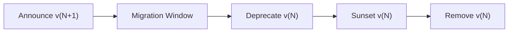

# 🔢 API Versioning Strategy

  

---

## 🎯 1. Overview

API versioning protects consumers from breaking changes while allowing producers to evolve. A consistent versioning strategy across {Company} prevents fragmentation, reduces integration friction, and gives consumers clear migration paths when changes land.

> **Rule:** Every public and internal API must be versioned. Unversioned APIs must not reach production.

---

## 📐 2. Versioning Approach

{Company} uses **URL path versioning** as the primary strategy for REST APIs. It is explicit, visible in logs and dashboards, and requires no special client configuration.

| Approach | Format | When to use |
|----------|--------|-------------|
| **URL path** (default) | `/api/v1/orders` | All REST APIs - public and internal |
| **Header** | `Accept-Version: v2` | SDK-mediated APIs where URL changes are costly |
| **Content-type** | `Accept: application/vnd.{company}.v2+json` | Hypermedia APIs with strict content negotiation |

> **Rule:** URL path versioning is the default. Header or content-type versioning requires Architecture Review Board approval.

### 2.1 Version Format

- Major version only in the URL: `v1`, `v2`, `v3`
- Minor and patch changes are delivered within the same major version without a URL change
- gRPC APIs version via package namespace: `{company}.orders.v1`

---

## 🚫 3. Breaking Change Policy

A breaking change is any change that can cause an existing, correctly-written consumer to fail. The following are breaking changes:

| Change type | Example |
|-------------|---------|
| Removing a field | Dropping `currency` from the response |
| Renaming a field | `order_total` becomes `total_amount` |
| Changing a field type | `id` from integer to string |
| Removing an endpoint | Deleting `DELETE /api/v1/orders/{id}` |
| Changing error codes | `404` becomes `410` for the same scenario |
| Adding a required request field | New mandatory `region` parameter |

### 3.1 Non-Breaking Changes (Safe)

These changes are safe to ship within an existing version:

- Adding a new optional request field
- Adding a new response field
- Adding a new endpoint
- Adding a new enum value (if consumers handle unknown values)
- Relaxing a validation constraint

---

## ⏳ 4. Deprecation Timeline

Every version follows a predictable deprecation lifecycle. Consumers must never be surprised by a sunset.

**Visual overview:**

| Phase | Duration | Requirements |
|-------|----------|-------------|
| **Announce** | Day 0 | Changelog entry, consumer notification, migration guide published |
| **Migration window** | 90 days (public) / 30 days (internal) | Both versions serve traffic side-by-side |
| **Deprecation** | After migration window | `Deprecation: true` and `Sunset: <date>` headers on every v(N) response |
| **Sunset** | End of window | v(N) returns `410 Gone` with a body pointing to v(N+1) |

> **Rule:** Public APIs must maintain at least two concurrent versions during migration. Internal APIs must maintain at least 30 days of overlap.

---

## 🛡️ 5. Implementation Standards

### 5.1 Response Headers

Every versioned response must include `X-API-Version: v1`. Deprecated versions must add `Deprecation: true`, `Sunset: <date>`, and a `Link` header pointing to the successor version.

### 5.2 Routing

API Gateway routes requests by version prefix. Backend services handle only one major version per deployment. Version translation layers are prohibited - they hide complexity and drift over time.

### 5.3 Documentation

Every version must have its own OpenAPI specification. Deprecated fields are marked with `deprecated: true` in the schema.

---

## ⚠️ 6. Anti-Patterns

| Anti-pattern | Problem | Fix |
|-------------|---------|-----|
| **Query parameter versioning** (`?v=2`) | Easy to forget, invisible in routing | Use URL path versioning |
| **Versioning every minor change** | Version explosion, consumer fatigue | Only bump major version for breaking changes |
| **Eternal beta** | `v0` that never graduates | Set a graduation date at launch |
| **Silent breaking changes** | Changing behavior without a version bump | Enforce contract tests in CI |
| **Translation layers** | Proxies that convert v1 to v2 internally | Each version is a first-class deployment |

---

## 🔗 7. Cross-References

- [API Standards](./02-api-standards.md) - REST conventions, naming, pagination
- [gRPC Standards](./05-grpc-standards.md) - gRPC-specific versioning via package namespace
- [Error Catalog](./09-error-catalog.md) - Standard error codes across versions

---

⬅️ [Back to section](./README.md) · 🏠 [Back to root](../README.md)

