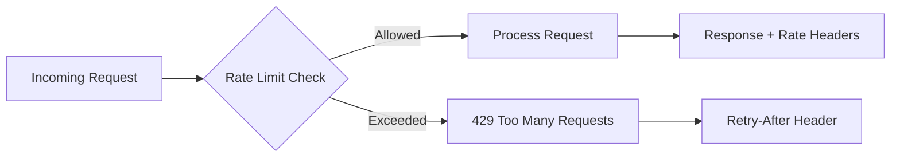

# 🚦 Rate Limiting and Throttling

  

---

## 🎯 1. Overview

Rate limiting protects services from traffic spikes, abusive clients, and cascading failures. Without it, a single misbehaving consumer can exhaust resources for everyone. Every API - public and internal - must enforce rate limits proportional to its capacity and the caller's entitlement.

> **Rule:** All APIs must enforce rate limits. Services that accept unbounded traffic must not pass production readiness review.

---

## 📐 2. Algorithms

{Company} supports two rate-limiting algorithms. Choose based on your traffic profile.

| Algorithm | How it works | Best for |
|-----------|-------------|----------|
| **Token bucket** | Tokens refill at a fixed rate; each request consumes one token. Allows short bursts up to bucket capacity. | APIs with bursty traffic patterns |
| **Sliding window** | Counts requests in a rolling time window. Smooth enforcement with no burst allowance. | APIs requiring strict, predictable throughput |

**Visual overview:**



> **Rule:** Token bucket is the default for public APIs. Sliding window is the default for internal service-to-service calls.

---

## 🏷️ 3. Per-Tenant Limits

Rate limits are applied per tenant (API key, OAuth client, or authenticated user), not globally. Global limits exist only as a safety net.

| Tier | Requests per minute | Burst allowance | Use case |
|------|-------------------|-----------------|----------|
| **Free** | 60 | 10 | Trial and sandbox consumers |
| **Standard** | 600 | 100 | Production integrations |
| **Premium** | 6,000 | 1,000 | High-volume partners |
| **Internal** | 12,000 | 2,000 | Service-to-service calls |
| **Global cap** | 60,000 | 5,000 | Per-endpoint safety net |

Tenant tier is resolved from the API key or OAuth token at the gateway layer. Services behind the gateway inherit the resolved tier.

---

## 📨 4. Response Headers

Every response must include rate limit metadata so clients can self-regulate.

```
X-RateLimit-Limit: 600
X-RateLimit-Remaining: 542
X-RateLimit-Reset: 1714003200
```

When a request is throttled, return `429 Too Many Requests` with:

```json
{
  "error": "rate_limit_exceeded",
  "message": "Rate limit exceeded. Retry after 12 seconds.",
  "retry_after_seconds": 12
}
```

The `Retry-After` HTTP header must also be set with the same value.

---

## 🔄 5. Circuit Breaker Integration

Rate limiting and circuit breakers work together. When a downstream dependency trips its circuit breaker, the calling service must shed load rather than queue requests.

| Scenario | Rate limiter behavior |
|----------|----------------------|
| Downstream healthy | Normal limits apply |
| Downstream degraded (circuit half-open) | Reduce limit to 25% of normal |
| Downstream down (circuit open) | Return `503 Service Unavailable` immediately |

> **Rule:** Services must not retry against a rate-limited endpoint without respecting the `Retry-After` header. Clients that ignore `Retry-After` are blocked at the gateway.

---

## 🏗️ 6. Implementation

### 6.1 Enforcement Points

| Layer | Technology | Scope |
|-------|-----------|-------|
| **API Gateway** | Kong / Envoy rate-limit plugin | Public APIs, per-tenant |
| **Service mesh** | Envoy local rate limit | Service-to-service |
| **Application** | Resilience4j / Bucket4j (Java ref) | Fine-grained per-endpoint |

Distributed counters are stored in Redis (cluster mode required) with keys formatted as `ratelimit:{tenant_id}:{endpoint}:{window_start}`, expiring automatically at window boundary.

---

## ⚠️ 7. Anti-Patterns

| Anti-pattern | Problem | Fix |
|-------------|---------|-----|
| **No rate limit** | One client can starve all others | Add per-tenant limits at gateway |
| **Global-only limits** | Good tenants are penalized by bad ones | Apply per-tenant limits first |
| **Ignoring Retry-After** | Retry storms amplify the overload | Enforce backoff; block repeat offenders |
| **In-memory counters only** | Limits reset on pod restart; inconsistent across replicas | Use Redis for distributed counters |

---

## 🔗 8. Cross-References

- [API Standards](./02-api-standards.md) - HTTP status codes and error response format
- [Error Catalog](./09-error-catalog.md) - Standard error codes for rate-limit responses

---
<div align="center">

⬅️ [Back to section](./README.md) · 🏠 [Back to root](../README.md)

</div>
