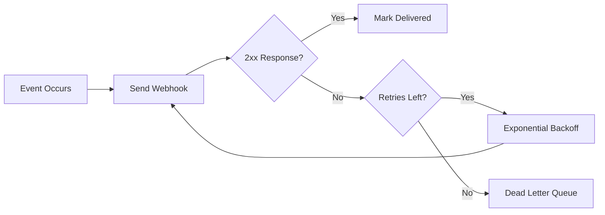

# 🪝 Webhook Design and Delivery

  

---

## 🎯 1. Overview

Webhooks push event notifications to consumer-registered HTTP endpoints. They are the primary mechanism for notifying external integrations about state changes without requiring polling. Poorly designed webhooks cause data loss, security holes, and debugging nightmares.

> **Rule:** All webhook producers must implement payload signing, idempotent delivery, and exponential backoff retry. Unsigned webhooks must not be deployed.

---

## 📐 2. Payload Design

Every webhook payload follows a standard envelope format:

```json
{
  "id": "evt_a1b2c3d4e5f6",
  "type": "order.completed",
  "version": "1.0",
  "timestamp": "2026-04-11T10:30:00Z",
  "data": {
    "order_id": "ord_789xyz",
    "status": "completed",
    "total_cents": 4500,
    "currency": "USD"
  }
}
```

| Field | Type | Required | Purpose |
|-------|------|----------|---------|
| `id` | string | Yes | Globally unique event identifier for idempotency |
| `type` | string | Yes | Dot-notation event type |
| `version` | string | Yes | Payload schema version |
| `timestamp` | ISO 8601 | Yes | When the event occurred |
| `data` | object | Yes | Event-specific payload |

> **Rule:** Payloads must be self-contained. Consumers must not need to call back to the producer to understand the event. Include all relevant data in the `data` field.

---

## 🔐 3. Payload Signing

Every webhook request is signed using HMAC-SHA256. Consumers must verify the signature before processing.

**Signing process:**

1. Producer computes `HMAC-SHA256(webhook_secret, raw_request_body)`
2. Signature is sent in the `X-Webhook-Signature-256` header
3. A timestamp is sent in `X-Webhook-Timestamp` to prevent replay attacks
4. Consumer recomputes the HMAC and compares in constant time

```
X-Webhook-Signature-256: sha256=5d7e8f...
X-Webhook-Timestamp: 1714003200
```

> **Rule:** Consumers must reject requests where the timestamp is more than 5 minutes old to prevent replay attacks.

---

## 🔄 4. Retry and Backoff

Failed deliveries are retried with exponential backoff. A delivery is considered failed if the consumer returns a non-2xx status code or the connection times out.

Retry intervals: immediate, 30s, 2min, 15min, 1h, 4h, 12h (7 attempts total, spanning approximately 17 hours).

**Visual overview:**



> **Rule:** After 7 failed attempts, the event is moved to a dead-letter queue. The endpoint is marked as unhealthy after 3 consecutive failures, and the consumer is notified.

---

## 🛡️ 5. Idempotency

Consumers must handle duplicate deliveries gracefully. The `id` field in the payload is the idempotency key.

**Consumer implementation requirements:**

1. Store processed event IDs in a deduplication table with a TTL of at least 7 days
2. Return `200 OK` for already-processed events without re-executing side effects
3. Use the event `id` - not the business entity ID - as the deduplication key

---

## 📋 6. Registration and Management

Webhook subscriptions are managed through a self-service API supporting registration (`POST`), listing (`GET`), update (`PATCH`), deletion (`DELETE`), test delivery, and delivery log inspection. All endpoints live under `/api/v1/webhooks`.

---

## ⚠️ 7. Anti-Patterns

| Anti-pattern | Problem | Fix |
|-------------|---------|-----|
| **Unsigned payloads** | Consumers cannot verify authenticity | Always sign with HMAC-SHA256 |
| **No retry** | Events are silently lost on failure | Implement exponential backoff |
| **Callback-required payloads** | Consumer must call API to get event data | Include all data in the payload |
| **Synchronous processing** | Slow consumers block the delivery queue | Consumers should enqueue and process async |
| **No delivery log** | Impossible to debug missed events | Record every delivery attempt with status |

---

## 🔗 8. Cross-References

- [API Standards](./02-api-standards.md) - HTTP conventions for webhook endpoints
- [Event Schema Evolution](./08-event-schema-evolution.md) - Schema versioning for webhook payloads

---
<div align="center">

⬅️ [Back to section](./README.md) · 🏠 [Back to root](../README.md)

</div>
