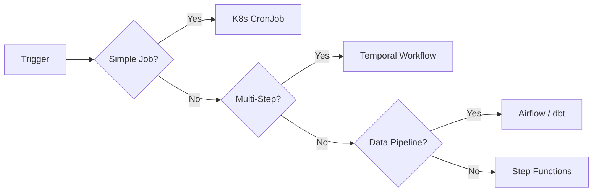

# ⚙️ Batch Processing and Workflow Orchestration

  

---

## 🎯 1. Overview

Not everything is a real-time API call. Batch jobs, scheduled tasks, and multi-step workflows are essential for data pipelines, reconciliation, reporting, and background processing. Without standards, teams build fragile cron jobs that fail silently and are impossible to debug.

> **Rule:** All batch and scheduled workloads must be idempotent, observable, and recoverable. Fire-and-forget cron scripts are not acceptable in production.

---

## 📐 2. Job Categories

| Category | Trigger | Duration | Example |
|----------|---------|----------|---------|
| **Scheduled batch** | Cron schedule | Minutes to hours | Nightly reconciliation, report generation |
| **Event-driven batch** | Threshold or event | Seconds to minutes | Process when queue reaches 1,000 items |
| **Long-running workflow** | API call or event | Hours to days | Order fulfillment, user onboarding |
| **Data pipeline** | Schedule or trigger | Minutes to hours | ETL, data warehouse load |

---

## 🏗️ 3. Technology Selection

| Workload type | Recommended tool | When to use |
|---------------|-----------------|-------------|
| **Simple scheduled jobs** | Kubernetes CronJob | Single-step, stateless, < 15 minutes |
| **Multi-step workflows** | Temporal | Long-running, requires retry/compensation, human-in-the-loop |
| **Cloud-native orchestration** | AWS Step Functions | AWS-heavy workloads, state machine patterns |
| **Data pipelines** | Apache Airflow / dbt | DAG-based data transformations, analytics pipelines |

**Visual overview:**

---

## 🔁 4. Idempotency Requirements

Every batch job must produce the same result whether it runs once or multiple times for the same input window.

| Technique | How it works |
|-----------|-------------|
| **Idempotency key** | Each job run is tagged with a unique key (e.g., `reconcile-2026-04-11`). Re-runs with the same key skip already-processed records. |
| **Upsert over insert** | Use `INSERT ... ON CONFLICT UPDATE` instead of blind inserts |
| **Checkpoint tracking** | Record the last processed offset, timestamp, or ID. Resume from checkpoint on restart. |
| **Output deduplication** | Write results to a staging table, then merge into the target table in a single transaction |

> **Rule:** Jobs that write to external systems (email, SMS, payment) must gate on a deduplication check. Sending a customer the same invoice twice is a production incident.

---

## 🛡️ 5. Failure Recovery

### 5.1 Retry Strategy

| Failure type | Retry behavior |
|-------------|----------------|
| **Transient** (network timeout, throttle) | Exponential backoff, max 5 retries |
| **Poison record** (bad data) | Skip and route to dead-letter queue |
| **Infrastructure** (OOM, node failure) | Kubernetes restarts the pod; resume from checkpoint |
| **Upstream dependency down** | Circuit breaker; pause job and alert |

### 5.2 Compensation

For multi-step workflows, every forward action must have a compensation action. If step 3 of 5 fails, steps 1 and 2 are compensated (reversed) automatically.

---

## 📊 6. Observability

Every batch job must emit:

| Signal | Requirement |
|--------|-------------|
| **Start/end events** | Structured log with job name, run ID, start time, end time |
| **Records processed** | Counter metric: total, succeeded, failed, skipped |
| **Duration** | Histogram metric for SLO tracking |
| **Alerts** | Fire if job does not complete within 2x expected duration |
| **Dead-letter count** | Alert if dead-letter queue depth exceeds threshold |

---

## ⚠️ 7. Anti-Patterns

| Anti-pattern | Problem | Fix |
|-------------|---------|-----|
| **Bare cron + script** | No retry, no observability, no recovery | Use K8s CronJob or Temporal |
| **Unbounded batch size** | OOM on large datasets | Process in fixed-size pages with checkpointing |
| **No idempotency** | Duplicate processing on retry | Tag each run and deduplicate |
| **Synchronous fan-out** | One slow step blocks everything | Use async steps with a workflow engine |
| **Silent failure** | Job fails, nobody notices until customer reports | Emit metrics and alert on missing completions |

---

## 🔗 8. Cross-References

- [Saga Patterns](./06-saga-patterns.md) - Compensation strategies for distributed workflows
- [Event Schema Evolution](./08-event-schema-evolution.md) - Schema standards for events that trigger batch jobs

---

⬅️ [Back to section](./README.md) · 🏠 [Back to root](../README.md)

