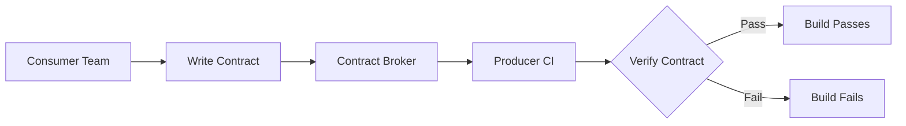

# 🤝 Contract Testing

  

---

## 🎯 1. Overview

Integration tests that spin up real services are slow, flaky, and expensive. Contract tests verify that a producer's API matches what its consumers expect - without deploying either service. They catch breaking changes at build time, not in staging.

> **Rule:** Every service that exposes an API consumed by another team must have consumer-driven contract tests running in CI. Contracts are mandatory for cross-team boundaries.

---

## 📐 2. Consumer-Driven Contracts

In consumer-driven contract testing, the consumer defines the contract - the minimal set of fields and behaviors it depends on. The producer verifies it can satisfy all consumer contracts.

**Visual overview:**



| Role | Responsibility |
|------|---------------|
| **Consumer** | Writes contract tests that describe the requests it sends and the responses it expects |
| **Producer** | Runs consumer contracts against its real implementation in CI |
| **Broker** | Central registry (Pactflow or Pact Broker) that stores and versions contracts |

---

## 🏗️ 3. Technology Standards

| Stack | Contract tool | Integration |
|-------|--------------|-------------|
| **Java (Spring)** | Spring Cloud Contract | Gradle plugin, auto-generated stubs |
| **Java / polyglot** | Pact JVM | Language-agnostic via Pact Broker |
| **Node.js** | Pact JS | npm package, Pact Broker |
| **gRPC** | Protobuf compatibility checks | `buf breaking` in CI |
| **Event-driven** | Pact message contracts | Async message verification |

> **Rule:** Use Pact for cross-language boundaries. Spring Cloud Contract is permitted for Java-to-Java contracts within the same organization.

---

## 🔄 4. Contract Lifecycle

### 4.1 Consumer Contract Principles

- Declare the **minimum** you need - not the full API surface
- Use type-based matching (`stringType`, `numberType`) over exact values
- Include only the fields the consumer reads; ignore the rest
- Each interaction needs a provider state (`given`) for deterministic verification

### 4.2 Producer Verification

The producer's CI pipeline pulls all consumer contracts from the broker and verifies them:

```bash
./gradlew pactVerify \
  --provider.name=order-service \
  --pact.broker.url=https://pact.internal.{company}.com
```

---

## 🚀 5. CI Integration

### 5.1 Pipeline Flow

| Stage | What happens |
|-------|-------------|
| **Consumer build** | Consumer contract tests run. On success, contracts are published to the broker. |
| **Producer build** | Producer pulls latest contracts from the broker and verifies them. |
| **Can-I-Deploy** | Before deployment, `pact-broker can-i-deploy` checks compatibility across all consumers. |
| **Deploy** | Only proceeds if all contracts pass |

### 5.2 Branch Strategy

| Branch | Contract behavior |
|--------|-------------------|
| **Feature branch** | Contracts are published with branch tag; producer verification is optional |
| **Main** | Contracts are published as latest; producer verification is mandatory |
| **Release** | `can-i-deploy` gate blocks release if any contract fails |

---

## 📋 6. Contract Versioning

Contracts are versioned automatically by the broker using the consumer's Git SHA. When a consumer updates its contract, the producer's next CI run verifies against the new version.

| Scenario | Outcome |
|----------|---------|
| Consumer adds a new field expectation | Producer must return the field or build fails |
| Consumer removes a field expectation | No producer impact (field is still returned) |
| Producer removes a field | All consumers expecting that field will fail |
| Producer adds a new optional field | No consumer impact |

---

## ⚠️ 7. Anti-Patterns

| Anti-pattern | Problem | Fix |
|-------------|---------|-----|
| **Producer-driven contracts** | Producer defines what consumers get; no consumer protection | Use consumer-driven contracts |
| **Full-payload matching** | Tests break on any additive change | Match only fields the consumer uses |
| **No broker** | Contracts live in Git repos; no central verification | Deploy Pact Broker or Pactflow |
| **Skipping can-i-deploy** | Breaking changes reach production | Add can-i-deploy as a required CI gate |
| **Stale contracts** | Consumer contracts are never updated | Automate contract generation from client code |

---

## 🔗 8. Cross-References

- [API Standards](./02-api-standards.md) - API design conventions that contracts validate
- [CI Practices](../03-engineering-practices/02-ci-practices.md) - Pipeline stages where contracts run
- [gRPC Standards](./05-grpc-standards.md) - Protobuf compatibility as a form of contract testing

---
<div align="center">

⬅️ [Back to section](./README.md) · 🏠 [Back to root](../README.md)

</div>
