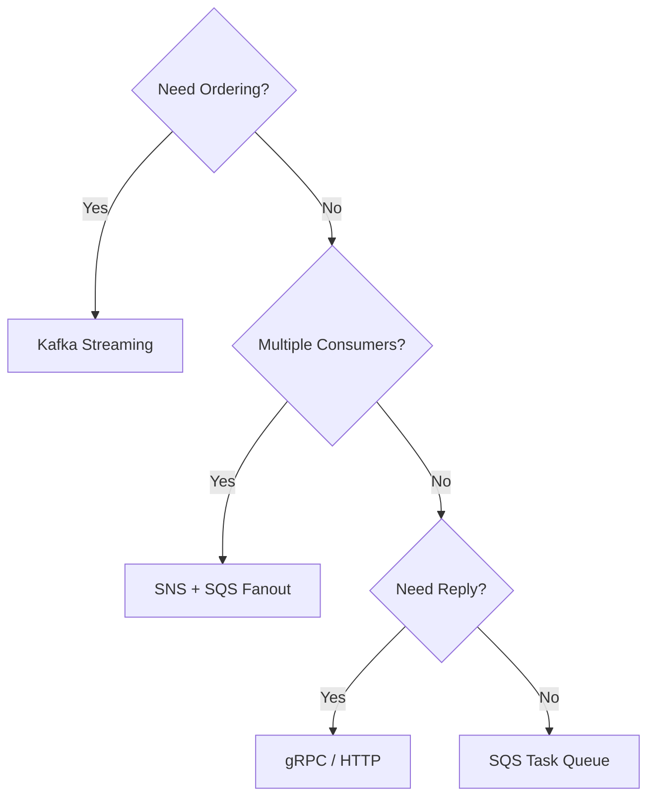

# 📬 Messaging Patterns

  

---

## 🎯 1. Overview

Not every async workload belongs on Kafka. Queues, task processors, and transactional outbox patterns each solve different problems. Choosing the wrong messaging tool creates unnecessary complexity or data loss. This guide helps teams pick the right pattern for each use case.

> **Rule:** Choose the messaging pattern based on the delivery guarantee, ordering requirement, and consumer model - not team familiarity.

---

## 📐 2. Pattern Selection

| Pattern | Tool | Delivery | Ordering | Best for |
|---------|------|----------|----------|----------|
| **Event streaming** | Kafka | At-least-once | Per-partition | Event sourcing, audit logs, cross-domain events |
| **Task queue** | SQS / RabbitMQ | At-least-once | Best-effort (FIFO available) | Background jobs, async processing |
| **Pub/sub fanout** | SNS + SQS | At-least-once | No guarantee | Notifications to multiple consumers |
| **Transactional outbox** | DB + CDC | Exactly-once (effective) | Per-entity | Reliable event publishing with DB consistency |
| **Request-reply** | gRPC / HTTP | Synchronous | N/A | When the caller needs an immediate response |

**Visual overview:**



---

## 🔄 3. Transactional Outbox Pattern

The outbox pattern solves the dual-write problem: how to update a database and publish an event atomically without distributed transactions.

### 3.1 How It Works

1. Service writes the business entity and an outbox record in the same database transaction
2. A CDC connector (Debezium) or a poller reads the outbox table and publishes events to Kafka
3. The outbox record is marked as published (or deleted) after successful delivery

### 3.2 Outbox Table Schema

```sql
CREATE TABLE outbox (
    id            UUID PRIMARY KEY,
    aggregate_type VARCHAR(255) NOT NULL,
    aggregate_id   VARCHAR(255) NOT NULL,
    event_type    VARCHAR(255) NOT NULL,
    payload       JSONB NOT NULL,
    created_at    TIMESTAMP NOT NULL DEFAULT NOW(),
    published_at  TIMESTAMP
);
```

> **Rule:** Any service that writes to a database and publishes events must use the outbox pattern or accept the risk of data inconsistency. Direct Kafka writes from application code after a DB commit are prohibited for critical events.

---

## 📨 4. Queue-Based Task Processing

For fire-and-forget background tasks where ordering does not matter, SQS provides simpler operational overhead than Kafka.

| Configuration | Value |
|--------------|-------|
| **Visibility timeout** | 6x the expected processing time |
| **Max receive count** | 5 (then route to DLQ) |
| **Dead-letter queue** | Required for every queue |
| **Long polling** | Enabled (20 seconds) |
| **Message retention** | 7 days |

### 4.1 SQS vs Kafka Decision

| Factor | Choose SQS | Choose Kafka |
|--------|-----------|-------------|
| Ordering | Not required or FIFO is sufficient | Strict per-partition ordering needed |
| Consumer count | 1 consumer group | Multiple independent consumer groups |
| Retention | Consume and delete | Replay from any offset |
| Throughput | < 10,000 msgs/sec | > 10,000 msgs/sec or unbounded |
| Operational overhead | Fully managed, zero ops | Requires cluster management |

---

## 🛡️ 5. Delivery Guarantees

| Guarantee | Implementation | Trade-off |
|-----------|---------------|-----------|
| **At-most-once** | Fire and forget, no ack | Messages can be lost |
| **At-least-once** | Ack after processing; consumer is idempotent | Duplicates are possible |
| **Effectively-once** | Outbox + idempotent consumer + dedup store | Highest reliability, most complexity |

> **Rule:** At-least-once with idempotent consumers is the minimum for all production workloads. At-most-once is only acceptable for non-critical metrics and telemetry.

---

## ⚠️ 6. Anti-Patterns

| Anti-pattern | Problem | Fix |
|-------------|---------|-----|
| **Kafka for everything** | Operational overhead for simple tasks | Use SQS for one-off background jobs |
| **No dead-letter queue** | Failed messages vanish | Attach a DLQ to every queue and topic |
| **Dual write** | DB commit and Kafka publish are not atomic | Use the transactional outbox pattern |
| **Large payloads in messages** | Broker performance degrades | Send a reference (S3 URL) for payloads > 256 KB |
| **Shared topics** | Unrelated events on one topic couple services | One topic per event type or aggregate |

---

## 🔗 7. Cross-References

- [System Architecture Blueprint](./01-system-architecture.md) - Where messaging fits in the overall architecture
- [Event Schema Evolution](./08-event-schema-evolution.md) - Schema standards for all message payloads
- [Saga Patterns](./06-saga-patterns.md) - Orchestration and choreography over messaging

---
<div align="center">

⬅️ [Back to section](./README.md) · 🏠 [Back to root](../README.md)

</div>
