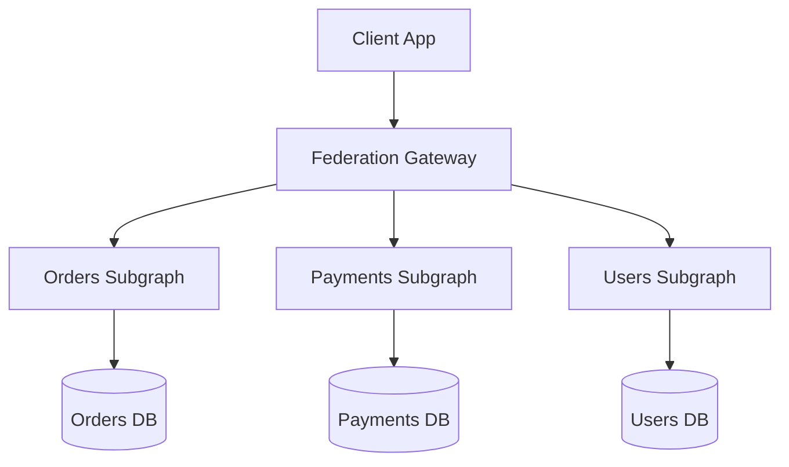

# 🔮 GraphQL Standards and Federation

  

---

## 🎯 1. Overview

GraphQL provides a flexible query language for clients that need to aggregate data from multiple services in a single request. It is not a replacement for REST or gRPC - it complements them as a BFF (Backend for Frontend) layer. Uncontrolled GraphQL usage leads to performance disasters, N+1 queries, and unmanageable schemas.

> **Rule:** GraphQL is permitted as a BFF aggregation layer. Direct service-to-service communication must use REST or gRPC, not GraphQL.

---

## 📐 2. When to Use GraphQL

| Use case | GraphQL | REST / gRPC |
|----------|---------|-------------|
| Mobile/web BFF needing flexible queries | Yes | No |
| Service-to-service communication | No | Yes |
| Public API for third-party developers | Evaluate carefully | Preferred |
| Simple CRUD with fixed responses | No | Yes |
| Real-time subscriptions (notifications) | Yes (subscriptions) | WebSockets |
| File upload/download | No | Yes |

---

## 🏗️ 3. Schema Design

### 3.1 Naming Conventions

| Element | Convention | Example |
|---------|-----------|---------|
| Types | PascalCase | `Order`, `PaymentMethod` |
| Fields | camelCase | `orderStatus`, `createdAt` |
| Enums | SCREAMING_SNAKE | `ORDER_CONFIRMED`, `PAYMENT_FAILED` |
| Mutations | verb + noun | `createOrder`, `cancelPayment` |
| Queries | noun or get + noun | `order`, `orders`, `getOrderById` |

### 3.2 Schema Principles

1. **Expose domain concepts, not database tables.** Schema types represent business entities, not ORM models.
2. **Nullable by default.** Only mark fields as non-null (`!`) when the field is guaranteed to always have a value.
3. **Connections for lists.** Use the Relay connection pattern (`edges`, `node`, `pageInfo`) for all paginated lists.
4. **Input types for mutations.** Every mutation accepts a single `input` argument typed as an input object.
5. **Union types for errors.** Return a union of the success type and error types instead of throwing exceptions.

---

## ⚡ 4. Query Complexity and Protection

Uncontrolled queries can fetch entire object graphs, crashing backend services. Every GraphQL gateway must enforce:

| Protection | Limit |
|-----------|-------|
| **Max query depth** | 10 levels |
| **Max query complexity** | 1,000 points (each field = 1, connections = 10) |
| **Max aliases** | 5 per query |
| **Query timeout** | 10 seconds |
| **Persisted queries only** (production) | Clients register queries at build time; ad-hoc queries are rejected |

> **Rule:** Production GraphQL endpoints must use persisted (allowlisted) queries. Ad-hoc queries are permitted only in development and staging environments.

---

## 🔄 5. DataLoader Pattern

N+1 queries are the most common GraphQL performance problem. Every resolver that fetches related data must use the DataLoader pattern for batching and caching.

| Without DataLoader | With DataLoader |
|-------------------|----------------|
| 1 query for orders + N queries for customers | 1 query for orders + 1 batched query for customers |
| O(N) database calls | O(1) database calls |
| Latency grows linearly with result size | Latency stays constant |

> **Rule:** All resolvers that access a data source must use DataLoader. Resolvers that issue individual queries per item must not pass code review.

---

## 🌐 6. Federation

For organizations with multiple teams owning different domains, Apollo Federation (or compatible alternatives) allows each team to own a subgraph that contributes to a unified supergraph.

**Visual overview:**

### 6.1 Federation Rules

| Rule | Rationale |
|------|-----------|
| Each subgraph is owned by one team | Clear ownership prevents schema conflicts |
| Entity keys are globally unique | `@key` directives define how entities are resolved across subgraphs |
| Schema changes go through composition CI | A broken subgraph must not bring down the supergraph |
| Shared types use `@shareable` | Explicitly mark types that multiple subgraphs contribute to |

---

## ⚠️ 7. Anti-Patterns

| Anti-pattern | Problem | Fix |
|-------------|---------|-----|
| **GraphQL for service-to-service** | Adds unnecessary query parsing overhead | Use gRPC or REST between services |
| **No query complexity limits** | Malicious or naive queries crash the gateway | Enforce depth, complexity, and alias limits |
| **Resolvers with direct DB queries** | N+1 performance disaster | Use DataLoader for all data access |
| **Ad-hoc queries in production** | Unpredictable load, security risk | Require persisted queries |
| **Monolithic schema** | One team owns everything, bottleneck | Use federation with team-owned subgraphs |

---

## 🔗 8. Cross-References

- [API Standards](./02-api-standards.md) - REST conventions that GraphQL BFFs call downstream
- [gRPC Standards](./05-grpc-standards.md) - Preferred protocol for service-to-service behind GraphQL
- [System Architecture Blueprint](./01-system-architecture.md) - Where the BFF layer sits in the architecture

---

⬅️ [Back to section](./README.md) · 🏠 [Back to root](../README.md)

