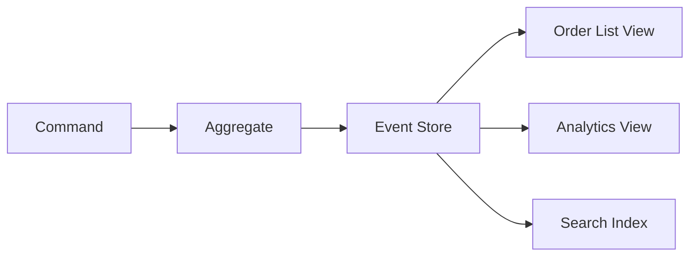

# 📖 Event Sourcing and CQRS

  

---

## 🎯 1. Overview

Event sourcing stores state as a sequence of immutable events rather than as a mutable row in a database. CQRS (Command Query Responsibility Segregation) separates the write model from the read model, allowing each to be optimized independently. Together, they provide a complete audit trail and flexible read projections - but they add significant complexity.

> **Rule:** Event sourcing and CQRS are opt-in patterns. Teams must justify their use with a concrete requirement (audit trail, temporal queries, or divergent read/write scaling). Default to standard CRUD unless these requirements exist.

---

## 📐 2. When to Use (and When Not To)

### 2.1 Good Fit

| Requirement | Why event sourcing helps |
|-------------|------------------------|
| **Complete audit trail** | Every state change is an immutable event - no data is lost |
| **Temporal queries** | "What was the order state at 3:00 PM?" is trivial to answer |
| **Multiple read models** | Projections can build different views from the same event stream |
| **Regulatory compliance** | Immutable event log satisfies audit requirements |
| **Complex domain logic** | Events model domain behavior more naturally than CRUD |

### 2.2 Bad Fit

| Scenario | Why event sourcing hurts |
|----------|------------------------|
| Simple CRUD applications | Massive over-engineering for basic read/write |
| Low-value audit requirements | Database triggers or CDC are simpler alternatives |
| Teams new to DDD | Event sourcing requires deep domain modeling skills |
| High-frequency updates to the same entity | Event stream grows fast; snapshots add complexity |
| Simple reporting needs | A read replica or materialized view is sufficient |

---

## 🏗️ 3. Event Store Design

The event store is an append-only log of domain events. Each event belongs to an aggregate (entity) and is ordered by sequence number.

### 3.1 Event Store Rules

| Rule | Rationale |
|------|-----------|
| Events are append-only | Never update or delete events; immutability is the core guarantee |
| Events are ordered per aggregate | Sequence number ensures deterministic replay |
| Events carry business meaning | `OrderConfirmed`, not `OrderUpdated` with a status field |
| Metadata is separate from payload | Correlation IDs, user ID, and causation ID go in metadata |

---

## 🔄 4. Projections

Projections consume events and build read-optimized views. Each projection is independently rebuildable from the event stream.

**Visual overview:**

| Projection type | Storage | Rebuild strategy |
|----------------|---------|-----------------|
| **Relational view** | PostgreSQL | Replay all events, apply to tables |
| **Search index** | Elasticsearch | Replay all events, re-index |
| **Cache** | Redis | Replay recent events, warm cache |
| **Notification** | SQS / email | Do not replay - notifications are one-time |

> **Rule:** Every projection must be rebuildable from scratch by replaying the event stream. Projections that cannot be rebuilt are not projections - they are side effects.

---

## 📸 5. Snapshots

As event streams grow, replaying all events to rebuild an aggregate becomes slow. Snapshots capture the aggregate state at a point in time.

| Snapshot strategy | Trigger |
|------------------|---------|
| **Every N events** | Snapshot after every 100 events per aggregate |
| **Time-based** | Snapshot daily for aggregates with high event volume |
| **On read** | Snapshot on first read if no recent snapshot exists |

Rebuild logic: load the latest snapshot, then replay only events after the snapshot's sequence number.

---

## 🧱 6. CQRS Separation

CQRS splits the application into a write side (commands) and a read side (queries). They can use different data stores, different schemas, and scale independently.

| Concern | Write side | Read side |
|---------|-----------|-----------|
| **Data store** | Event store (append-only) | Projections (relational, search, cache) |
| **Optimization** | Consistency, validation | Query performance, denormalization |
| **Scaling** | Scale for write throughput | Scale for read throughput |
| **Staleness** | Always current | Eventually consistent (seconds) |

> **Rule:** CQRS read models are eventually consistent. If a use case requires immediate read-after-write consistency, query the write model directly for that specific case.

---

## ⚠️ 7. Anti-Patterns

| Anti-pattern | Problem | Fix |
|-------------|---------|-----|
| **Event sourcing everything** | Unnecessary complexity for simple domains | Use CRUD for simple services |
| **Mutable events** | Destroys the audit trail and replay guarantee | Events are immutable; publish corrective events instead |
| **God aggregate** | One aggregate with thousands of events | Split into smaller, focused aggregates |
| **Tight projection coupling** | Projection failure blocks writes | Projections run asynchronously and independently |
| **No snapshots** | Aggregate rebuild takes minutes | Snapshot every 100 events |

---

## 🔗 8. Cross-References

- [Saga Patterns](./06-saga-patterns.md) - Process managers that coordinate across event-sourced aggregates
- [Event Schema Evolution](./08-event-schema-evolution.md) - How to evolve event schemas without breaking projections

---

⬅️ [Back to section](./README.md) · 🏠 [Back to root](../README.md)

