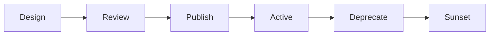

# 🔄 API Lifecycle Management

  

---

## 🎯 1. Overview

An API is a product with a lifecycle - from initial design through active use to eventual sunset. Managing this lifecycle deliberately prevents orphaned APIs, surprise deprecations, and consumer frustration. Every API at {Company} follows a defined path from proposal to retirement.

> **Rule:** No API reaches production without completing the Design and Review phases. No API is removed without completing the Deprecation and Sunset phases.

---

## 📐 2. Lifecycle Phases

Every API moves through six phases. Skipping phases is not permitted.

**Visual overview:**

| Phase | Owner | Duration | Gate |
|-------|-------|----------|------|
| **Design** | API producer team | 1 - 2 weeks | OpenAPI spec reviewed by Architecture |
| **Review** | Architecture Review Board | 1 week | Naming, versioning, error standards pass |
| **Publish** | Producer team | 1 sprint | API deployed, documented, registered in catalog |
| **Active** | Producer team | Ongoing | SLOs met, contract tests green |
| **Deprecate** | Producer team | 90 days (public) / 30 days (internal) | All consumers notified, migration guide published |
| **Sunset** | Producer team | 1 sprint | Traffic at zero, endpoints return 410 |

---

## 📝 3. Design Phase

Before writing any code, the API producer must deliver an OpenAPI 3.1 specification, a consumer analysis document, new error catalog entries, and a breaking change assessment for new versions.

### 3.1 Design Review Checklist

- [ ] Endpoints follow {Company} naming conventions
- [ ] Request/response models use standard types (ISO 8601 dates, UUID identifiers)
- [ ] Pagination uses cursor-based pagination for lists
- [ ] Error responses follow the standard error envelope
- [ ] Rate limit tiers are defined
- [ ] Versioning strategy is declared

---

## 🚀 4. Publish Phase

Publishing an API means it is discoverable, documented, and monitored.

| Requirement | Detail |
|-------------|--------|
| **API catalog entry** | Registered in Backstage with owner, description, and links |
| **Documentation** | OpenAPI spec published to the developer portal |
| **Contract tests** | Consumer-driven contracts registered in the broker |
| **Monitoring** | Dashboards for latency, error rate, and traffic volume |
| **SLOs** | Availability and latency targets published |

> **Rule:** An API that is not in the catalog does not exist. Shadow APIs are a security and operational risk.

---

## ⏳ 5. Deprecation Phase

Deprecation is a communication process, not a code change. The goal is to give consumers time and tooling to migrate.

### 5.1 Deprecation Requirements

| Step | Timeline | Action |
|------|----------|--------|
| **Announce** | Day 0 | Email consumers, post in #api-changes Slack channel, update catalog status |
| **Migration guide** | Day 0 | Publish a step-by-step guide showing how to move to the replacement API |
| **Response headers** | Day 0 | Add `Deprecation: true` and `Sunset: <date>` headers to all responses |
| **Usage monitoring** | Ongoing | Track consumer migration progress weekly |
| **Final notice** | 14 days before sunset | Direct outreach to remaining consumers |

> **Rule:** An API must not be sunset while any consumer is still sending traffic. Track consumer count weekly; if consumers remain at the deadline, escalate to their engineering leads.

---

## 🗑️ 6. Sunset Phase

Sunset is the final removal of the API from production.

| Step | Action |
|------|--------|
| **1. Return 410** | Replace the implementation with a handler that returns `410 Gone` with a body pointing to the successor |
| **2. Hold for 30 days** | Keep the 410 handler live so late consumers get a clear error |
| **3. Remove code** | Delete the endpoint code, tests, and OpenAPI spec for the sunset version |
| **4. Update catalog** | Mark the API as retired in Backstage |
| **5. Archive docs** | Move documentation to an archive section, do not delete it |

---

## 📊 7. API Health Metrics

Track these across all active APIs to detect lifecycle issues early:

| Metric | Healthy | Investigate |
|--------|---------|-------------|
| **Error rate** | < 1% | > 1% sustained |
| **p99 latency** | Within SLO | > 2x SLO target |
| **Consumer count** | Stable or growing | Dropping without deprecation |
| **Traffic volume** | Predictable | Unexpected spikes or drops |
| **Contract test pass rate** | 100% | Any failure |

---

## 🔗 8. Cross-References

- [API Standards](./02-api-standards.md) - Naming conventions and error formats referenced during design review
- [Error Catalog](./09-error-catalog.md) - Standard error codes for 410 Gone and deprecation responses

---

⬅️ [Back to section](./README.md) · 🏠 [Back to root](../README.md)

