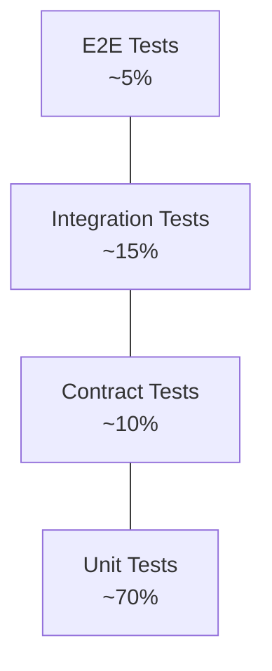

# 🧪 Testing Pyramid

  

---

## 🎯 1. Philosophy

Testing is not a phase that follows development — it is a design activity that happens concurrently with development. Tests are the first consumers of your code. If a unit is hard to test, the design is wrong.

**Our target:** Tests that are fast, deterministic, and tell you exactly what broke. A flaky test is worse than no test — it erodes trust in the entire suite.

### 1.1 The Pyramid

```
                    ┌─────────────┐
                    │     E2E     │  ~5%
                    │  (few, slow)│
                   /└─────────────┘\
                  /  ┌───────────┐  \
                 /   │  Contract │   \  ~10%
                /    │   (Pact)  │    \
               / ────└───────────┘──── \
              /   ┌─────────────────┐   \
             /    │   Integration   │    \  ~25%
            /     │  (Testcontain.) │     \
           /──────└─────────────────┘──────\
          /       ┌─────────────────────┐   \
         /        │        Unit         │    \  ~60%
        /         │   (fast, isolated)  │     \
       └──────────└─────────────────────┘──────┘
```

**Visual overview:**



| Layer | Volume | Speed | Scope | Runs In |
|-------|--------|-------|-------|---------|
| Unit | ~60% | < 1ms/test | Single class or function | Local + CI every PR |
| Integration | ~25% | < 1s/test | Service boundary + real infra | CI every PR |
| Contract | ~10% | < 500ms/test | API contract between two services | CI every PR |
| E2E | ~5% | Seconds/minutes | Full user journey | CI nightly + pre-release |

---

## 🧪 2. Unit Tests

### 2.1 Definition

A unit test exercises a **single class or function in complete isolation**. All dependencies are mocked or stubbed.

### 2.2 Framework & Libraries

| Library | Purpose |
|---------|---------|
| **JUnit 5** | Test runner, lifecycle management |
| **Mockito** | Mocking dependencies |
| **AssertJ** | Fluent, readable assertions |
| **ArchUnit** | Architecture rule enforcement (see section 6) |

### 2.3 Rules

- Tests must be **independent** — no shared mutable state between tests
- Test names follow: `methodName_givenCondition_expectedBehaviour`
  ```java
  @Test
  void calculatePrice_givenDynamicPricingActive_returnsMultipliedPrice() { ... }
  ```
- Prefer **one assertion concept per test** — multiple `assertThat` calls are fine if they assert the same concept
- No `Thread.sleep()` — use `CompletableFuture` / `Awaitility` if timing matters
- No file system or network access in unit tests

### 2.4 Coverage Policy

- **Minimum coverage gate:** 80% line coverage, enforced in CI (SonarCloud)
- Coverage is a floor, not a target — 80% with meaningful tests is better than 95% with trivial ones
- Coverage thresholds are configured per module in `build.gradle`:
  ```kotlin
  jacocoTestCoverageVerification {
      violationRules {
          rule { limit { minimum = "0.80".toBigDecimal() } }
      }
  }
  ```
- Domain logic (services, domain objects) should be closer to **95%**
- Controller / adapter layers do not need >80% — they are covered by integration tests

### 2.5 What Not to Unit Test

- Framework wiring (Spring config, bean definitions)
- Data Transfer Objects (DTOs) with no logic
- Simple getters/setters

---

## 🔗 3. Integration Tests

### 3.1 Definition

An integration test exercises **a service's interaction with its real dependencies** — database, Kafka, external HTTP calls (stubbed via WireMock). The application starts (or a slice of it) and exercises real I/O.

### 3.2 Framework & Libraries

| Library | Purpose |
|---------|---------|
| **Testcontainers** | Spins up real PostgreSQL, Redis, Kafka in Docker per test run |
| **WireMock** | Stubs external HTTP dependencies |
| **Spring Boot Test** (`@SpringBootTest`) | Full application context for integration tests |
| **Spring `@DataJpaTest`** | Slice test for repository layer only |
| **Spring `@WebMvcTest`** | Slice test for controller layer only |

### 3.3 Testcontainers Setup

All services use a shared base test class that starts containers once per test suite:

```java
@Testcontainers
public abstract class BaseIntegrationTest {

    @Container
    static PostgreSQLContainer<?> postgres =
        new PostgreSQLContainer<>("postgres:15-alpine");

    @Container
    static KafkaContainer kafka =
        new KafkaContainer(DockerImageName.parse("confluentinc/cp-kafka:7.5.0"));

    @DynamicPropertySource
    static void configureProperties(DynamicPropertyRegistry registry) {
        registry.add("spring.datasource.url", postgres::getJdbcUrl);
        registry.add("spring.datasource.username", postgres::getUsername);
        registry.add("spring.datasource.password", postgres::getPassword);
        registry.add("spring.kafka.bootstrap-servers", kafka::getBootstrapServers);
    }
}
```

### 3.4 Test Data Strategy

- **No shared test data across tests** — each test seeds its own data and cleans up
- Use `@Transactional` on tests that write to the DB to auto-rollback after each test
- For Kafka tests, use unique topic names per test or partition by test run ID
- Test data builders (Builder pattern) must exist for every domain entity:
  ```java
  Order order = OrderTestBuilder.anOrder()
      .withStatus(OrderStatus.IN_PROGRESS)
      .withCustomer(CustomerTestBuilder.aCustomer().build())
      .build();
  ```

### 3.5 Rules

- Integration tests live in `src/test/java` in a package ending in `integration`
- They must be tagged with `@Tag("integration")` so they can be run separately
- Integration test suite must complete in **< 5 minutes** — if it doesn't, split the service
- No `Thread.sleep()` — use `Awaitility` for async assertions:
  ```java
  Awaitility.await()
      .atMost(10, SECONDS)
      .until(() -> orderRepository.findById(orderId).isPresent());
  ```

---

## 🔗 4. Contract Tests (Consumer-Driven)

### 4.1 Why Contract Tests

Contract tests fill the gap between unit tests (no real dependencies) and E2E tests (too slow, too brittle). They verify that a **producer's API matches what its consumers expect**, without running both services simultaneously.

### 4.2 Framework

**Pact** — Consumer-Driven Contract Testing.

- Consumers define pacts (contracts) in their own test suite
- Pacts are published to **Pact Broker** (self-hosted or PactFlow)
- Providers run verification tests against published pacts in CI
- Provider deployments are **blocked** if a published pact fails verification

### 4.3 Consumer Side (Defining a Pact)

```java
@ExtendWith(PactConsumerTestExt.class)
@PactTestFor(providerName = "orders-service")
class OrderServicePactConsumerTest {

    @Pact(consumer = "notifications-service")
    public RequestResponsePact orderCompletedPact(PactDslWithProvider builder) {
        return builder
            .given("order abc-123 exists and is completed")
            .uponReceiving("a request for order abc-123")
                .path("/v1/orders/abc-123")
                .method("GET")
            .willRespondWith()
                .status(200)
                .body(new PactDslJsonBody()
                    .stringType("orderId", "abc-123")
                    .stringMatcher("status", "COMPLETED|CANCELLED", "COMPLETED"))
            .toPact();
    }
}
```

### 4.4 Provider Side (Verifying a Pact)

```java
@Provider("orders-service")
@PactBroker
@SpringBootTest(webEnvironment = SpringBootTest.WebEnvironment.RANDOM_PORT)
class OrderServicePactProviderTest {

    @TestTarget
    public Target target = new SpringBootHttpTarget();

    @State("order abc-123 exists and is completed")
    void orderExists() {
        // seed state into DB
    }
}
```

### 4.5 Rules

- Every new inter-service dependency requires a Pact consumer test before the integration is built
- Pact verification runs in the provider's CI pipeline on every PR
- A provider cannot be deployed if it breaks a consumer pact — this is enforced via can-i-deploy in the CD pipeline

---

## 🔗 4.6 Kafka Event Contract Tests

HTTP APIs are covered by Pact (see above). Kafka event schemas need equivalent protection — if the Orders Service changes the shape of `orders.order.completed`, the Payments consumer must not break silently.

### Framework

**Pact v4 Message Contracts** — extends Pact to asynchronous message-based interactions.

### Consumer Side (Defining Expected Message Shape)

```java
@ExtendWith(PactConsumerTestExt.class)
@PactTestFor(providerName = "orders-service", providerType = ProviderType.ASYNCH)
class OrderCompletedMessagePactTest {

    @Pact(consumer = "payments-service")
    public MessagePact orderCompletedPact(MessagePactBuilder builder) {
        return builder
            .expectsToReceive("an orders.order.completed event")
            .withContent(new PactDslJsonBody()
                .stringType("orderId", "order-abc123")
                .stringType("customerId", "customer-xyz")
                .stringType("providerId", "provider-456")
                .integerType("priceAmountCents", 1250)
                .stringType("currency", "USD")
                .stringMatcher("status", "COMPLETED", "COMPLETED")
                .datetime("completedAt", "yyyy-MM-dd'T'HH:mm:ss'Z'"))
            .toPact();
    }

    @Test
    @PactTestFor(pactMethod = "orderCompletedPact")
    void shouldProcessOrderCompletedEvent(List<Message> messages) {
        var event = objectMapper.readValue(
            messages.get(0).contentsAsBytes(), OrderCompletedAvro.class);
        assertThat(event.getOrderId()).isEqualTo("order-abc123");
        assertThat(event.getPriceAmountCents()).isEqualTo(1250);
    }
}
```

### Provider Side (Verifying Published Messages Match)

```java
@Provider("orders-service")
@PactBroker
class OrderCompletedMessageProviderTest {

    @TestTemplate
    @ExtendWith(PactVerificationInvocationContextProvider.class)
    void verifyPact(PactVerificationContext context) {
        context.verifyInteraction();
    }

    @PactVerifyProvider("an orders.order.completed event")
    MessageAndMetadata orderCompletedEvent() {
        // Build the actual event the service would produce
        var event = OrderCompletedAvro.newBuilder()
            .setOrderId("order-abc123")
            .setCustomerId("customer-xyz")
            .setProviderId("provider-456")
            .setPriceAmountCents(1250)
            .setCurrency("USD")
            .setStatus("COMPLETED")
            .setCompletedAt(Instant.now().toString())
            .build();

        return new MessageAndMetadata(
            objectMapper.writeValueAsBytes(event),
            Map.of("contentType", "application/json")
        );
    }
}
```

### Integration with Schema Registry

Pact message contracts complement Glue Schema Registry backward compatibility checks:
- **Schema Registry** prevents structural breaks (field type changes, removed required fields)
- **Pact message contracts** verify semantic expectations (consumers get the fields they need, with values they can process)

Both must pass in CI. A provider deployment is blocked if either a schema compatibility check or a Pact verification fails.

---

## 🧪 5. End-to-End Tests

### 5.1 Scope

E2E tests exercise **complete user journeys** from the API layer through to real downstream systems in a dedicated test environment.

### 5.2 Framework & Libraries

| Library | Purpose |
|---------|---------|
| **REST Assured** | HTTP client for API E2E testing |
| **Karate DSL** | BDD-style API test scenarios (optional, for non-dev QA) |

### 5.3 What to E2E Test (and What Not To)

**Do E2E test:**
- Critical happy paths: `Create order → Assign provider → Start order → Complete order → Payment captured`
- Critical failure paths: `Payment fails → Order cancelled → Provider released`
- Cross-service state consistency checks

**Do not E2E test:**
- Every validation rule (unit tests cover this)
- Every error code (integration tests cover this)
- Performance (separate load tests)

### 5.4 Rules

- E2E tests run nightly against `staging` environment, not on every PR
- E2E tests run on the pre-production environment before every production release
- E2E test failures **block** production releases
- E2E tests must clean up after themselves — they cannot leave state in the environment
- E2E test suite must complete in **< 30 minutes** — parallelize if needed

---

## 📏 6. Architecture Tests (ArchUnit)

ArchUnit tests enforce architectural rules at build time. Every service must include a standard set of architecture tests:

```java
@AnalyzeClasses(packages = "com.{company}.orders")
class ArchitectureTest {

    @ArchTest
    static final ArchRule domainMustNotDependOnInfra =
        noClasses().that().resideInAPackage("..domain..")
            .should().dependOnClassesThat()
            .resideInAPackage("..infrastructure..");

    @ArchTest
    static final ArchRule controllersMustNotCallRepositories =
        noClasses().that().haveNameMatching(".*Controller")
            .should().dependOnClassesThat()
            .haveNameMatching(".*Repository");

    @ArchTest
    static final ArchRule domainMustNotImportSpring =
        noClasses().that().resideInAPackage("..domain..")
            .should().dependOnClassesThat()
            .resideInAnyPackage("org.springframework..");
}
```

The platform template ships with a standard set of ArchUnit rules. Teams may add rules but may not remove the platform defaults.

---

## ⚡ 7. Performance & Load Tests

### 7.1 Tools

| Tool | Use Case |
|------|---------|
| **Gatling** | Load testing — scripted in Scala/Java |
| **k6** | Ad-hoc performance tests, CI-friendly |

### 7.2 Performance Baselines

Every service must define and document its performance baseline in `docs/performance.md`:

| Metric | Target |
|--------|--------|
| P50 latency | < 50ms (internal), < 200ms (external) |
| P99 latency | < 200ms (internal), < 1000ms (external) |
| Error rate at peak | < 0.1% |
| Throughput | Defined per service |

### 7.3 Load Test Cadence

- Load tests run **weekly** in the staging environment via scheduled CI
- Load test results are published to the team dashboard
- A regression of >20% in P99 latency triggers a team alert

---

## ❌ 8. Flaky Test Policy

A flaky test is a test that passes and fails without code changes. Flaky tests are **treated as bugs**.

1. A flaky test must be **quarantined** (tagged `@Disabled` with a tracking issue) within 24 hours of being identified
2. The tracking issue must be fixed within **2 weeks**; if not fixed within **4 weeks**, the test must be **deleted or rewritten from scratch**
3. Flaky test counts are tracked on the team engineering health dashboard

---

## 🔄 9. Accessibility Testing in CI

Accessibility is not an afterthought — it is tested in CI alongside functional tests.

### 9.1 Web Frontends

- **axe-core** is integrated into all Playwright E2E tests via `@axe-core/playwright`
- Every E2E test page navigation includes an accessibility scan
- **WCAG 2.1 AA** violations **fail the build** — no exceptions
- Known false positives are suppressed with documented justification in the axe configuration file, reviewed quarterly

### 9.2 Mobile

- Accessibility audit runs via **Detox** (React Native) or **Appium** with accessibility assertions
- Violations are logged as **warnings** by default
- At **L3+ maturity** (per the team maturity model), accessibility violations become **blocking**
- Minimum checks: content descriptions on interactive elements, minimum touch target sizes, contrast ratios

### 9.3 Cross-Reference

See [09-mobile-and-frontend/02-web-frontend-standards.md](../09-mobile-and-frontend/02-web-frontend-standards.md) for the full web accessibility standards, including ARIA patterns, keyboard navigation requirements, and screen reader testing.

---

## 💡 10. Shared Test Fixtures

### 10.1 Fixture Library

Shared test data builders live in the **{company}-test-fixtures** library, organized by domain module:

| Module | Artifact | Scope |
|--------|----------|-------|
| `test-fixtures-orders` | `com.{company}:test-fixtures-orders` | Order, OrderLine, OrderEvent builders |
| `test-fixtures-payments` | `com.{company}:test-fixtures-payments` | Payment, Refund builders |
| `test-fixtures-customers` | `com.{company}:test-fixtures-customers` | Customer, Address builders |
| `test-fixtures-providers` | `com.{company}:test-fixtures-providers` | Provider, Vehicle, Document builders |

The library is published to the internal Maven repository and versioned independently from service releases.

### 10.2 Naming Convention

All fixture builders follow the pattern `{Entity}Fixture.a{Entity}()`:

```java
Order order = OrderFixture.anOrder()
    .withStatus(COMPLETED)
    .withCustomer(CustomerFixture.aCustomer().build())
    .withPrice(1250, "USD")
    .build();

Payment payment = PaymentFixture.aPayment()
    .forOrder(order)
    .withStatus(CAPTURED)
    .build();
```

### 10.3 Rules

- Fixtures produce **valid domain objects** by default — callers override only the fields relevant to their test
- Fixtures must not depend on Spring context or database — they are plain Java builders
- Each domain team owns and maintains their fixture module

---

## 🔗 11. Mocking Infrastructure

### 11.1 Infrastructure Mocking by Technology

| Technology | Unit Tests | Integration Tests |
|------------|-----------|-------------------|
| **gRPC** | `grpc-testing` InProcessServer with canned responses | Testcontainers with real gRPC server |
| **Kafka** | EmbeddedKafka (`spring-kafka-test`) | Testcontainers Confluent image (`confluentinc/cp-kafka`) |
| **External HTTP** | WireMock (stubbed responses) | WireMock (stubbed responses) |
| **PostgreSQL** | — (unit tests do not touch DB) | Testcontainers (`postgres:15-alpine`) |
| **Redis** | — (unit tests do not touch Redis) | Testcontainers (`redis:7-alpine`) |

### 11.2 Performance Testing in Staging

Staging performance tests run during **off-peak hours** (weekdays 02:00–06:00 UTC) to avoid interfering with QA and integration testing.

Each service must document its **test data shape** in `docs/performance.md`:

| Field | Description |
|-------|-------------|
| **Dataset size** | Number of records seeded before the test (e.g., 100K orders, 10K providers) |
| **Traffic pattern** | Steady-state vs. spike; read/write ratio |
| **External dependencies** | Stubbed or real; if stubbed, latency profile used |
| **Baseline metrics** | Expected p50, p95, p99 latency and throughput |

---

## 🧬 12. Mutation Testing

### 12.1 Purpose

Code coverage tells you which lines were executed by tests — it does not tell you whether the tests actually **verified correct behavior**. Mutation testing fills this gap by introducing small code changes (mutations) into the production code and checking whether the test suite detects them. If a mutation survives (tests still pass), the tests are not asserting strongly enough.

### 12.2 Tool

**PIT (Pitest)** for Java — integrated as a Gradle plugin in the platform BOM.

```kotlin
// build.gradle.kts
plugins {
    id("info.solidsoft.pitest") version "1.15.0"
}

pitest {
    targetClasses.set(setOf("com.{company}.orders.domain.*"))
    targetTests.set(setOf("com.{company}.orders.domain.*"))
    mutators.set(setOf("DEFAULTS"))
    outputFormats.set(setOf("HTML", "XML"))
    timestampedReports.set(false)
}
```

### 12.3 When to Use

| Scope | Mutation Testing Required? |
|-------|---------------------------|
| **Tier 1 services** (payments, orders, fulfillment) | Yes — critical business logic must be mutation-tested |
| **Critical business logic** (pricing calculations, order state machines, payment processing) | Yes — these are the highest-risk code paths |
| **Tier 2/3 services** | Recommended but not required |
| **All services universally** | No — mutation testing is slow and computationally expensive; apply it where the risk justifies the cost |

### 12.4 Mutation Score Target

- **>70% mutation score** for critical domains (pricing, payments, order lifecycle)
- This is **not a hard gate in CI** — it is tracked and reviewed during code reviews and quarterly quality assessments
- A low mutation score in critical code paths should trigger a conversation about test quality, not a blind push for higher numbers

### 12.5 How to Run

| Context | Command | Frequency |
|---------|---------|-----------|
| **Local development** | `./gradlew pitest` | On demand, before raising a PR that touches critical logic |
| **CI (Tier 1 services)** | Scheduled CI job | Weekly (not on every PR — too slow) |
| **Results dashboard** | Pitest HTML report published to build artifacts | Reviewed in sprint retrospectives |

### 12.6 Interpreting Results

| Result | Meaning | Action |
|--------|---------|--------|
| **Killed mutant** | A test detected the mutation and failed — the test is effective | No action needed |
| **Survived mutant** | Tests still passed despite the mutation — assertions are too weak | Strengthen test assertions; the test may be exercising the code but not verifying the output |
| **No coverage mutant** | No test covers this line at all | Add test coverage for the uncovered code |
| **Timed out mutant** | The mutation caused an infinite loop detected by Pitest's timeout | Generally treated as "killed" — the mutation was detected |

Survived mutants indicate **weak test assertions**, not necessarily missing tests. A test that calls the method but only asserts `assertNotNull(result)` will show high code coverage but low mutation score.

---
<div align="center">

⬅️ [Back to section](./README.md) · 🏠 [Back to root](../README.md)

</div>
