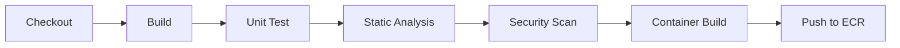

# 🔄 CI Practices

  

---

## 🎯 1. Philosophy

Continuous Integration means **integrating into the main branch continuously** - not once a sprint, not once a week, but multiple times a day. The CI pipeline is the guardian of main: nothing that breaks the build, fails tests, or violates quality gates gets in.

**The two laws of CI:**
1. The main branch is always in a releasable state
2. If the build is broken, fixing it is the team's top priority - everything else stops

---

## 📏 2. Source Control Strategy

### 2.1 Trunk-Based Development

We practice **trunk-based development** (TBD). All engineers commit to `main` either directly (for very small changes) or via **short-lived feature branches** (lifespan < 2 days).

**Why TBD and not GitFlow / long-lived branches:**
- Long-lived branches create merge debt - the longer a branch lives, the harder it merges
- GitFlow encourages batching changes, which conflicts with CI/CD principles
- TBD forces small, incremental, always-integrating changes - which surfaces problems early

### 2.2 Branch Naming

```
{type}/{jira-ticket}-{short-description}

Types: feat, fix, refactor, chore, docs, test

Examples:
  feat/RIDE-1234-add-dynamic-pricing-endpoint
  fix/RIDE-5678-correct-price-calculation
  chore/RIDE-9012-upgrade-spring-boot-3.2
```

### 2.3 Branch Protection Rules (GitHub)

All repositories must enforce:
- ✅ Require PR before merging to `main`
- ✅ Require at least **1 approval** (2 for core platform services)
- ✅ Require all status checks to pass before merging
- ✅ Require branches to be up to date before merging
- ✅ Dismiss stale reviews when new commits are pushed
- ✅ Require linear history (rebase, not merge commits)
- ❌ No force pushes to `main`
- ❌ No deletion of `main`

### 2.4 Commit Messages

We use **Conventional Commits**:

```
{type}({scope}): {short description}

{optional longer body}

{optional footer: BREAKING CHANGE, Refs, Closes}

Examples:
  feat(pricing): add dynamic multiplier to price calculation
  fix(fulfillment): prevent double-assignment of provider to order
  chore(deps): upgrade spring-boot to 3.2.1
  docs(api): update OpenAPI spec for v2 orders endpoint

  BREAKING CHANGE: removed deprecated priceEstimate field from response
```

Types: `feat`, `fix`, `refactor`, `test`, `docs`, `chore`, `perf`, `ci`, `build`

Commit messages are **linted in CI** - a PR with non-conforming commit messages fails.

---

## 📏 3. Pull Request Standards

### 3.1 PR Size

- **Target: < 400 lines changed per PR**
- PRs > 800 lines require explicit justification in the PR description
- Large PRs are a signal that the change should be broken down, not a sign of productivity

### 3.2 PR Description Template

Every repository ships with a PR template at `.github/pull_request_template.md`:

```markdown
## What does this PR do?

<!-- One paragraph summary -->

## Why?

<!-- Business or technical motivation -->

## How was it tested?

<!-- Unit tests / integration tests / manual testing steps -->

## Checklist

- [ ] Tests added/updated
- [ ] OpenAPI spec updated (if API changes)
- [ ] ADR raised (if architectural decision made)
- [ ] Feature flag added (if deploying behind a flag)
- [ ] Runbook updated (if operational behaviour changed)
- [ ] No secrets or credentials committed
```

### 3.3 Code Review Standards

Reviewers are expected to check for:
- Correctness (does it do what it says?)
- Test coverage (is the behaviour tested?)
- Security (no credentials, no injection risks, no overly permissive access)
- API contract adherence (does it follow API standards?)
- Observability (does it log and emit metrics appropriately?)

Reviewers are **not** expected to enforce formatting - that is the linter's job.

**Review SLA:** PRs must receive a first review within **1 business day**. Stale PRs (no activity for 3 days) are auto-flagged on the team Slack channel.

---

## 🔄 4. CI Pipeline

### 4.1 Platform

**GitHub Actions** - all pipelines are defined in `.github/workflows/` in the service repository.

The platform team provides **reusable workflow templates** in the central `platform-workflows` repository. Services reference these rather than copy-pasting pipeline YAML.

### 4.2 PR Pipeline

Triggered on: **every push to a feature branch / every PR update**

**Time budget: < 10 minutes total. If it's slower, optimise it.**

**Principle (tool-agnostic):** Every PR pipeline must **check out** the change, **restore build caches**, **compile** (fail fast on syntax and types), **lint and format-check**, **run fast tests** with a **coverage gate**, **run slower integration or contract checks** as budget allows, **scan dependencies and secrets**, **analyse static quality**, and **build a container image** without publishing it. Stages map to your toolchain (Maven, npm, Poetry, Go modules, .NET SDK, etc.).

**Reference implementation (Java / Gradle / GitHub Actions):**

```yaml
# .github/workflows/pr.yml
name: PR Pipeline

on:
  pull_request:
    branches: [main]

jobs:
  build-and-test:
    uses: {company}/platform-workflows/.github/workflows/java-pr.yml@main
    with:
      java-version: '21'
    secrets: inherit
```

The shared `java-pr.yml` workflow runs these stages in order (same **intent** as above, JVM-specific commands):

```
┌─────────────────────────────────────────────────────────┐
│  Stage 1: Setup (30s)                                   │
│  Principle: reproducible toolchain + cached deps        │
│  - Checkout                                             │
│  - Setup JDK 21 (Amazon Corretto)                       │
│  - Restore Gradle cache                                 │
└──────────────────────┬──────────────────────────────────┘
                       │
┌──────────────────────▼──────────────────────────────────┐
│  Stage 2: Build & Lint (2 min)                          │
│  Principle: compile + style + commit + secret hygiene   │
│  - gradle build -x test                                 │
│  - Checkstyle (Google Java Style)                       │
│  - Conventional commit lint                             │
│  - Detect secrets scan (git-secrets / gitleaks)         │
└──────────────────────┬──────────────────────────────────┘
                       │
┌──────────────────────▼──────────────────────────────────┐
│  Stage 3: Unit Tests (3 min)                            │
│  Principle: fast feedback + coverage floor              │
│  - gradle test (unit tests only)                        │
│  - JaCoCo coverage report                               │
│  - Coverage gate: ≥ 80% or fail                         │
└──────────────────────┬──────────────────────────────────┘
                       │
┌──────────────────────▼──────────────────────────────────┐
│  Stage 4: Integration Tests (4 min)                     │
│  Principle: real I/O boundaries + consumer contracts      │
│  - gradle integrationTest (Testcontainers)              │
│  - Contract test verification (Pact)                    │
└──────────────────────┬──────────────────────────────────┘
                       │
┌──────────────────────▼──────────────────────────────────┐
│  Stage 5: Security & Quality (2 min, parallel)          │
│  Principle: deps, static analysis, API drift, image lint│
│  - Snyk dependency scan                                 │
│  - SonarCloud analysis                                  │
│  - OpenAPI diff (no breaking changes vs main)           │
│  - Dockerfile lint (Hadolint)                           │
└──────────────────────┬──────────────────────────────────┘
                       │
┌──────────────────────▼──────────────────────────────────┐
│  Stage 6: Container Build (1 min)                       │
│  Principle: image builds and scans before merge         │
│  - Docker build (does not push)                         │
│  - Snyk container scan                                  │
└─────────────────────────────────────────────────────────┘
```

> **Substitution point:** Replace JDK/Gradle/JaCoCo with your SDK and build tool; keep the same gates (build, lint, unit coverage, integration/contract, security, container).

**Visual overview:**



### 4.3 Main Branch Pipeline

Triggered on: **every merge to `main`**

This is the pipeline that builds and publishes the artifact for deployment.

```
Stage 1: Full build + all tests (same as PR pipeline)
Stage 2: Container build & push to ECR
  - Tag: {git-sha}, {version}
Stage 3: Pact can-i-deploy check
Stage 4: Trigger CD pipeline (dev environment)
Stage 5: Publish Pact to broker
Stage 6: Release notes generation (conventional-changelog)
```

### 4.4 Scheduled Pipelines

| Pipeline | Schedule | Purpose |
|----------|----------|---------|
| Dependency update scan | Daily 06:00 UTC | Snyk, Dependabot |
| Load test | Weekly Mon 02:00 UTC | Gatling against staging |
| E2E test suite | Nightly 01:00 UTC | Full journey tests |
| Security audit | Weekly | OWASP dependency check |

---

## 📏 5. Quality Gates

These gates are **non-negotiable**. A PR cannot be merged if any of these fail:

> **Substitution point:** "JUnit" and "JaCoCo" name the Java reference stack. Your gate is **100% pass** on the project's unit and integration suites and **≥ 80% line coverage** (or stricter where agreed), reported by your language's runner and coverage tool.

| Gate | Tool | Threshold |
|------|------|-----------|
| Unit test pass rate | JUnit 5 | 100% |
| Integration test pass rate | JUnit 5 | 100% |
| Line coverage | JaCoCo + SonarCloud | ≥ 80% |
| Code smells | SonarCloud | 0 blockers, 0 critical |
| Dependency vulnerabilities | Snyk | 0 critical, 0 high |
| Container vulnerabilities | Snyk | 0 critical |
| Secret detection | Gitleaks | 0 detected |
| Breaking API change | openapi-diff | 0 breaking changes (or ADR required) |
| Commit message format | commitlint | Conventional Commits compliant |
| Checkstyle | Checkstyle (Google style) | 0 violations |

**Reference implementation (Java):** The tools in the "Tool" column reflect the default JVM pipeline; thresholds apply to all services regardless of language.

---

## ⚡ 6. Build Performance

### 6.1 Gradle Caching

**Principle:** Use **remote or CI-local build caches** keyed on lockfiles and inputs so repeated builds reuse compiled artifacts and dependencies.

**Reference implementation (Java):** All pipelines use Gradle remote build cache:
- Cache hosted on **Gradle Enterprise** (or GitHub Actions cache)
- Cache key based on: task inputs + dependency hash
- Expected cache hit rate: > 70% on warm runs

### 6.2 Test Parallelism

**Principle:** Run **unit tests in parallel** where safe; cap **integration tests** when shared resources (containers, ports) require it; use **matrix or fan-out** across services.

**Reference implementation (Java / Gradle):**

- Unit tests run in parallel: `maxParallelForks = Runtime.getRuntime().availableProcessors()`
- Integration tests run sequentially per service (Testcontainers constraint)
- Multiple services' pipelines run in parallel (GitHub Actions matrix)

### 6.3 Pipeline Time SLA

| Pipeline | Target | Alert Threshold |
|----------|--------|----------------|
| PR pipeline | < 10 min | > 15 min triggers review |
| Main pipeline | < 15 min | > 20 min triggers review |

If a pipeline consistently exceeds its SLA, the team is expected to optimise it - slow feedback loops kill CI culture.

---

## 📋 7. Notifications & Visibility

- **Slack:** CI failures on `main` post to `#ci-failures-{team}` channel immediately
- **GitHub:** All checks visible on PR - no merge until green
- **Dashboard:** Platform CI health dashboard in Grafana - tracks build times, failure rates, flakiness per service

---

## 🔒 8. DAST in CI

### 8.1 OWASP ZAP Scans

Dynamic Application Security Testing is performed quarterly against the staging environment:

| Parameter | Value |
|-----------|-------|
| **Tool** | OWASP ZAP (containerized, latest stable) |
| **Target** | Staging environment - all public-facing API endpoints |
| **Frequency** | Quarterly (scheduled CI pipeline) |
| **Scan type** | Full active scan + API scan (OpenAPI-driven) |

### 8.2 Results Handling

| Action | Detail |
|--------|--------|
| **Filing** | All findings are filed as Jira tickets with the `security` label |
| **Triage** | Security team triages findings within 5 business days |
| **Assignment** | Findings are assigned to the owning service team |
| **SLA** | Critical: 7 days; High: 14 days; Medium: 30 days; Low: next sprint |

---

## 🔄 9. Terraform Drift Detection

### 9.1 Scheduled Drift Check

A weekly `terraform plan` runs in CI for the `platform-config` repository to detect configuration drift between the Terraform state and actual AWS resources:

| Parameter | Value |
|-----------|-------|
| **Frequency** | Weekly (Monday 04:00 UTC) |
| **Repository** | `platform-config` |
| **Action on drift** | Alert to `#platform-alerts` Slack channel |
| **Auto-remediate** | No - drift is investigated manually before applying |

### 9.2 Drift Alert Format

Alerts include: environment, resource type, resource name, and a summary of the detected drift. The on-call platform engineer investigates whether the drift was caused by manual changes (ClickOps - a compliance violation) or by an external process.

---

## 🧪 10. Terraform Module Testing

### 10.1 Terratest for Shared Modules

All shared Terraform modules in the `platform-modules` repository are tested with **Terratest**:

| Parameter | Value |
|-----------|-------|
| **Framework** | Terratest (Go) |
| **Trigger** | Every PR to `platform-modules` |
| **Test cycle** | Provision → validate → destroy |
| **Environment** | Dedicated `terraform-test` AWS account |

### 10.2 Test Requirements

Each module must include tests that:

- Provision the module with default and override variables
- Validate the created resources (e.g., RDS instance is Multi-AZ, S3 bucket has versioning enabled)
- Destroy all resources cleanly (no orphaned resources)
- Complete within **15 minutes** per module

### 10.3 Module Release Process

| Step | Action |
|------|--------|
| 1 | PR with module changes + Terratest |
| 2 | Terratest passes (provision → validate → destroy) |
| 3 | Platform team review and approval |
| 4 | Merge to `main` → new module version tagged |

---
<div align="center">

⬅️ [Back to section](./README.md) · 🏠 [Back to root](../README.md)

</div>
