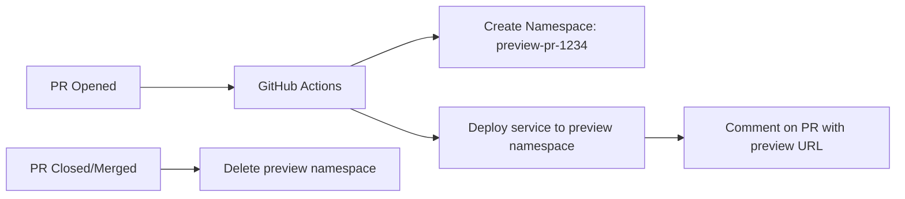
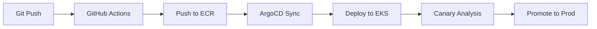
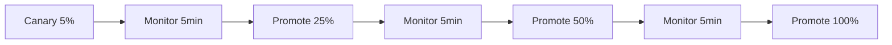
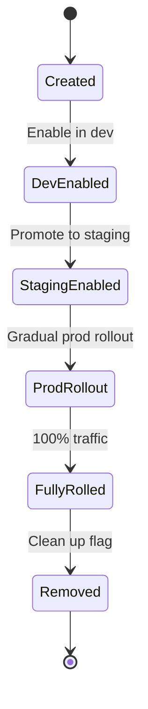
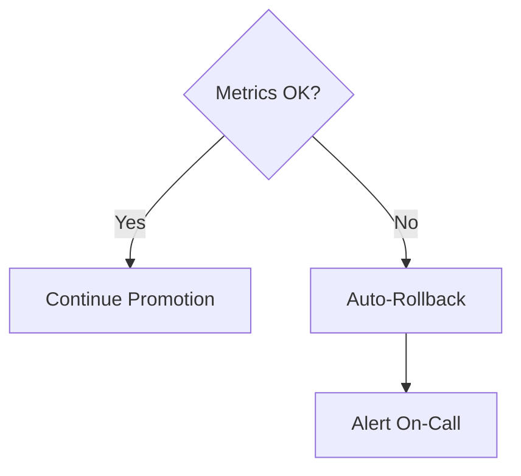

# 🚀 CD Practices

  

---

## 🎯 1. Philosophy

**Continuous Delivery** means every commit to `main` that passes CI is *capable* of being deployed to production. **Continuous Deployment** means it *is* deployed to production, automatically.

Our target state is **continuous deployment** to production for all services, with production releases gated only by automated tests - not manual approvals. We get there incrementally, using feature flags and progressive delivery to decouple deployment from release.

**Core principle:** Promote **artifacts**, not code. The same container image that was built and tested in CI is the image that runs in production. We never rebuild between environments.

---

## 🚀 2. Environments

| Environment | Purpose | Deployment Trigger | Access |
|-------------|---------|-------------------|--------|
| `dev` | Post-merge integration testing | Automatic on merge to `main` | Engineers |
| `staging` | Pre-production validation, E2E tests, load tests | Automatic after `dev` passes | Engineers + QA |
| `production` | Live traffic | Automatic after `staging` passes | Controlled via feature flags |

### 2.1 Ephemeral Preview Environments

For complex changes that benefit from a live preview before merging to main, engineers can spin up a per-PR preview environment on the dev EKS cluster.

**How it works:**



**Implementation:**
- Each preview gets its own Kubernetes namespace: `preview-pr-{number}`
- The service is deployed using the same Helm chart with preview-specific values
- Shared dependencies (PostgreSQL, Kafka, Redis) are accessed from the dev cluster with isolated schemas/topics: `preview_{pr_number}_orders`
- GitHub Actions comments the preview URL on the PR automatically
- Namespace is automatically deleted when the PR is closed or merged (via GitHub webhook)

**When to use preview environments:**
- Multi-service changes that need integration validation before merge
- UI/API changes that product or design needs to review
- Database migration testing with realistic data shapes

**When NOT to use them:**
- Simple code changes covered by unit/integration tests
- Changes that don't affect the running service (docs, tests, config)

**Cost control:** Preview environments auto-terminate after 24 hours of PR inactivity. Maximum 10 concurrent previews per team.

### 2.2 Environment Parity

All environments are **structurally identical** - same Kubernetes manifests, same Helm values shape, different configuration values. If it behaves differently in staging than in production, that is a parity bug.

- Same container image promoted through all environments
- Same infrastructure topology (smaller in dev/staging, not different)
- No environment-specific code paths in application code

---

## 🚀 3. Deployment Tooling

| Tool | Role |
|------|------|
| **GitHub Actions** | CI pipeline, artifact build, triggers CD |
| **ArgoCD** | GitOps controller - reconciles desired state from Git to EKS |
| **Helm** | Kubernetes manifest templating |
| **Amazon ECR** | Container registry |
| **LaunchDarkly** | Feature flags - decouples deploy from release |

### 3.1 GitOps Model

We follow a strict **GitOps** model:

- Application config (Kubernetes manifests, Helm values) lives in a dedicated `platform-config` Git repository, separate from application code
- ArgoCD watches this repository and reconciles the cluster state to match it
- **No direct `kubectl apply` in production** - all changes via Git PR to `platform-config`
- Drift detection: ArgoCD alerts on any difference between Git state and cluster state

```
┌──────────────┐    merge to main    ┌──────────────────┐
│  App Repo    │ ──────────────────► │  CI Pipeline     │
│  (GitHub)    │                     │  builds image    │
└──────────────┘                     │  pushes to ECR   │
                                     └────────┬─────────┘
                                              │ updates image tag
                                              ▼
                                     ┌──────────────────┐
                                     │  platform-config │
                                     │  repo (GitHub)   │
                                     └────────┬─────────┘
                                              │ ArgoCD watches
                                              ▼
                                     ┌──────────────────┐
                                     │    ArgoCD        │
                                     │  reconciles to   │
                                     │  EKS cluster     │
                                     └──────────────────┘
```

**Visual overview:**



---

## 🔄 4. Deployment Pipeline Stages

### 4.1 Full Pipeline Flow

```
[main merge]
     │
     ▼
[CI Pipeline] ──── fails ──► blocked; notify team
     │ passes
     ▼
[Build & Push Image]
  - docker build
  - push to ECR: {git-sha}, {version}
  - Snyk container scan (blocks on critical)
     │
     ▼
[Deploy to DEV]
  - ArgoCD sync: dev namespace
  - Smoke tests (health check endpoints)
  - Pact can-i-deploy check
     │ fails ──► rollback dev; notify team
     │ passes
     ▼
[Deploy to STAGING]
  - ArgoCD sync: staging namespace
  - Integration smoke tests
  - Full E2E test suite (async, ~20 min)
  - Performance regression check
     │ fails ──► rollback staging; notify team
     │ passes
     ▼
[Deploy to PRODUCTION]
  - Canary: 5% traffic for 10 minutes
  - Automated canary analysis (error rate, latency)
     │ fails ──► automatic rollback; PagerDuty alert
     │ passes
  - Progressive rollout: 25% → 50% → 100%
  - Monitor for 30 minutes post-full-rollout
     │ anomaly detected ──► automatic rollback
     │ stable
     ▼
[Release Complete]
  - Tag Git commit with version
  - Post to #deployments Slack channel
  - Update service catalog
```

---

## 🚀 5. Progressive Delivery

For a platform with real-time, safety-critical operations, progressive delivery is **non-negotiable**. We never go from 0% to 100% in one step in production.

### 5.1 Canary Deployments

All production deployments use canary releases managed by **ArgoCD Rollouts** + **Argo Rollouts with Istio**.

Default canary progression:

```yaml
# Example Argo Rollout strategy
strategy:
  canary:
    steps:
    - setWeight: 5
    - pause: {duration: 10m}
    - analysis:
        templates:
        - templateName: error-rate-analysis
    - setWeight: 25
    - pause: {duration: 5m}
    - setWeight: 50
    - pause: {duration: 5m}
    - setWeight: 100
```

**Visual overview:**



### 5.2 Automated Canary Analysis

Argo Rollouts queries Prometheus during the canary pause to automatically abort if:

| Metric | Abort Threshold |
|--------|----------------|
| HTTP 5xx error rate | > 1% (vs baseline) |
| P99 latency | > 20% regression |
| Kafka consumer lag | > 5x baseline |

If any metric breaches its threshold, the rollout is **automatically aborted and rolled back**. No human intervention needed.

### 5.3 Manual Promotion Gate (Optional)

For high-risk changes (schema migrations, major features), a manual approval gate can be inserted before 100%:

```yaml
- setWeight: 50
- pause: {}   # Waits for manual approval in ArgoCD UI or CLI
- setWeight: 100
```

---

## 📏 6. Feature Flags

Feature flags are how we **decouple deployment from release**. Code ships to production disabled; features are enabled via flags without a deployment.

### 6.1 Platform

**LaunchDarkly** - the only approved feature flag platform. No custom flag systems.

### 6.2 Flag Types

| Type | Use Case | Example |
|------|---------|---------|
| **Release flag** | Hide unreleased code | New fulfillment algorithm |
| **Ops flag** | Kill switch for features in emergencies | Disable dynamic pricing during outage |
| **Experiment flag** | A/B test variants | New price display format |
| **Permission flag** | Gradual rollout by user segment | Enable feature for beta providers first |

### 6.3 Flag Lifecycle Rules

- Every flag has an **owner** and a **review date** set at creation
- Release flags must be **removed within 30 days** of being fully rolled out per the deprecation lifecycle (see [`08-deprecation-lifecycle.md`](./08-deprecation-lifecycle.md))
- Permanent ops flags (kill switches) are exempt from removal but must be reviewed quarterly
- Flag keys follow the naming convention `{type}.{team}.{feature}.{yyyy-mm}` (see [`01-platform-standards/02-naming-conventions.md`](../01-platform-standards/02-naming-conventions.md) section 8) e.g. `release.orders.new-checkout.2026-04`
- No business logic should permanently depend on a flag - flags are temporary

**Visual overview:**



### 6.4 Flag Usage in Code

```java
// Good: flag wraps the new code path
if (flagClient.boolVariation("release.fulfillment.ml-model.2026-04", context, false)) {
    return mlFulfillmentService.findBestProvider(request);
} else {
    return legacyFulfillmentService.findBestProvider(request);
}

// Bad: flag wraps a massive block - refactor first, then flag
```

---

## 🔄 7. Rollback Strategy

### 7.1 Automated Rollback

The **first line of defence** is automated rollback via Argo Rollouts canary analysis (see section 5.2). This handles the majority of bad deploys before they affect significant traffic.

### 7.2 Manual Rollback

If a problem is detected post-full-rollout:

**Option A - Feature flag (preferred, < 1 minute):**
```
Turn off the LaunchDarkly flag for the affected feature
```

**Option B - ArgoCD rollback (< 2 minutes):**
```bash
argocd app rollback {service-name} --revision {previous-revision}
```

**Option C - Git revert + redeploy (5-10 minutes):**
```bash
git revert {bad-commit-sha}
git push origin main
# CI/CD pipeline runs and deploys the revert
```

### 7.3 Rollback Decision Tree

```
Is the issue caught during canary?
  └─ YES → Argo Rollouts auto-aborts and rolls back. Done.

Is there a feature flag for the affected feature?
  └─ YES → Turn off the flag. Monitor. Done.

Is the issue in application behaviour (not infra)?
  └─ YES → ArgoCD rollback to previous revision. Monitor.

Is the issue in database schema?
  └─ YES → This is the hard case. Flyway forward-only migration.
           Requires a new migration to undo. Never run rollback scripts.
           Escalate to Tech Lead.
```

**Visual overview:**



### 7.4 Schema Migration & Rollback

We follow **expand-contract** pattern for database schema changes:

1. **Expand:** Add new column (nullable, backward compatible) - deploy
2. **Migrate:** Backfill data - deploy
3. **Contract:** Remove old column - deploy (after all consumers are updated)

**Never** make a breaking schema change in a single deployment.

---

## 📏 8. Deployment Freeze & Governance

### 8.1 Change Freeze

Deployments to production are frozen during:
- Peak demand windows (e.g. seasonal peaks, public holidays, promotional events)
- The 2 hours before and after any major operational event
- P1 incident resolution (until incident is closed)

Freeze windows are managed in the deployment calendar (linked in the team wiki).

### 8.2 Deployment Notifications

All production deployments post automatically to `#deployments` Slack channel:

```
🚀 [orders-service] v2.14.3 deployed to PRODUCTION
   Commit: feat(orders): add multi-stop order support (#1234)
   Author: @john.doe
   Duration: 12m 34s
   Canary: ✅ passed (error rate: 0.02%, p99: 145ms)
```

---

## 📋 9. Service Readiness Checklist

Before a service is eligible for automated production deployment, it must have:

- [ ] Health check endpoint (`/actuator/health`) returning Kubernetes-compatible response
- [ ] Readiness probe configured in Kubernetes manifests
- [ ] Liveness probe configured in Kubernetes manifests
- [ ] Graceful shutdown handling (drain in-flight requests before shutdown)
- [ ] Structured JSON logging with correlation IDs
- [ ] Prometheus metrics endpoint (`/actuator/prometheus`)
- [ ] At least one Grafana dashboard
- [ ] At least one alert rule configured
- [ ] PagerDuty routing configured
- [ ] Runbook documented and linked from service catalog
- [ ] Feature flags for all unreleased features

---

## 📏 10. Change Risk Rubric

Every production deployment carries risk. The following rubric classifies changes by risk level and defines the appropriate deployment method and approval requirements.

| Risk Level | Characteristics | Deployment Method | Approval Required |
|------------|----------------|------------------|-------------------|
| **Low** | Config changes, environment variable updates, feature flag toggles | Auto-rollback via ArgoCD | None |
| **Medium** | Single-service code changes, minor API updates, dependency bumps | Canary deployment (5% → 25% → 50% → 100%) | Tech Lead |
| **High** | Schema migrations, multi-service coordinated changes, new service deployment, breaking API changes | Manual promotion gates between stages | Tech Lead + Engineering Manager |

### How to Classify

- If the change can be reverted by toggling a flag or updating a config value → **Low**.
- If the change affects a single service's behavior and can be rolled back via ArgoCD → **Medium**.
- If the change requires coordination across services, involves a database migration, or cannot be easily rolled back → **High**.

When in doubt, classify one level higher.

---

## 🚀 11. Deploy Frequency Targets

Deployment frequency targets are aligned with the [Engineering Maturity Model](../08-program/01-maturity-model.md). Teams at higher maturity levels are expected to deploy more frequently with shorter lead times.

| Maturity Level | Deploy Frequency Target | Lead Time Target | Description |
|----------------|------------------------|------------------|-------------|
| **L2 - Managed** | Weekly | < 1 week | Team deploys reliably at least once per week; manual gates may still exist |
| **L3 - Defined** | Daily | < 1 day | Team deploys daily with automated canary; feature flags decouple deploy from release |
| **L4 - Optimized** | On-demand, multiple per day | < 1 hour | Fully automated pipeline; engineers deploy whenever code is merged; zero manual gates |

These targets are measured via ArgoCD deployment timestamps and reviewed in the monthly engineering metrics review. Teams that consistently miss their maturity-level target should investigate pipeline bottlenecks, test reliability, or approval process friction.

---
<div align="center">

⬅️ [Back to section](./README.md) · 🏠 [Back to root](../README.md)

</div>
