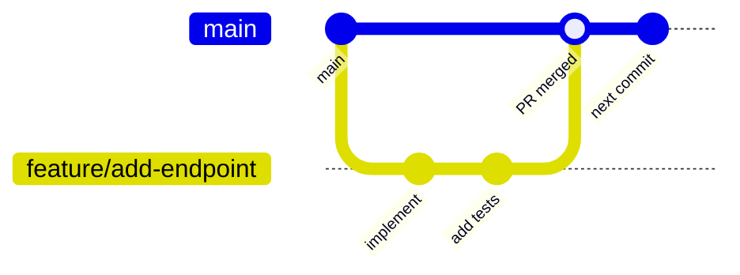

# 🌿 Git Workflow

  

---

## 🎯 1. Our Approach: Trunk-Based Development

Git workflow rules here are **language-agnostic**. Shell examples that use **Java** paths or **Spring**-style feature-flag snippets are **reference implementation** only.

We practice **trunk-based development (TBD)**. All engineers integrate their work into `main` frequently - at least once a day, ideally multiple times.

If you're coming from GitFlow or long-lived feature branches, this feels wrong at first. It isn't. Here's why TBD is better:

| GitFlow / Long Branches | Trunk-Based Development |
|------------------------|------------------------|
| Branches live for weeks | Branches live for hours or days (max 2 days) |
| Integration pain saved up until merge | Integration pain distributed - small and constant |
| "Merge hell" before release | Main is always releasable |
| Bugs found late, hard to bisect | Bugs found immediately, easy to find |
| Deploy when branch is "ready" | Deploy continuously |

---

## 📏 2. The Daily Workflow

### 2.1 Start of Day

```bash
# Always start from a fresh main
git checkout main
git pull origin main
```

### 2.2 Create a Short-Lived Branch

**Visual overview:**



```bash
# Branch from main - never from another feature branch
git checkout -b feat/PROJ-1234-add-price-calculation
```

Branch naming: `{type}/{ticket}-{short-description}`

Types: `feat`, `fix`, `refactor`, `chore`, `docs`, `test`

### 2.3 Work in Small Commits

Commit frequently - every logical unit of change. Don't save one big commit at the end.

**Reference implementation (Java / Maven layout):**

```bash
# Add the domain model
git add src/main/java/com/{company}/orders/domain/model/PriceAmount.java
git commit -m "feat(pricing): add PriceAmount value object"

# Add the service logic
git add src/main/java/com/{company}/orders/domain/service/PriceCalculationService.java
git commit -m "feat(pricing): add price calculation logic"

# Add unit tests
git add src/test/java/com/{company}/orders/domain/service/PriceCalculationServiceTest.java
git commit -m "test(pricing): add price calculation unit tests"
```

Each commit should leave the codebase in a working state.

### 2.4 Keep Your Branch in Sync With Main

If main has moved while you're working (it usually has), rebase - don't merge:

```bash
# Pull latest main and rebase your work on top of it
git fetch origin
git rebase origin/main

# If there are conflicts, resolve them file by file, then:
git add {resolved-file}
git rebase --continue
```

**Why rebase, not merge?** Because merge creates a merge commit that clutters history. Rebase keeps history linear and readable.

### 2.5 Push and Raise a PR

```bash
# Push your branch
git push origin feat/PROJ-1234-add-price-calculation

# Raise a PR using the GitHub CLI
gh pr create --title "feat(pricing): add price calculation" --fill
```

Fill in the PR template honestly. A description like "adds stuff" will fail code review.

### 2.6 After Approval - Squash and Merge

When your PR is approved:
- Use **"Squash and merge"** in GitHub - this creates one clean commit on main per PR
- The squash commit message should follow Conventional Commits format
- Delete the branch after merging

---

## 💡 3. Common Scenarios

### Scenario 1: My feature will take more than 2 days

This is the most common challenge. The solution is **feature flags** - ship the code disabled.

**Reference implementation (Java):**

```java
// Day 1 - merge the data model and DB migration (behind a flag, but flag is off)
// Day 2 - merge the service logic (flag still off)
// Day 3 - merge the API endpoint
// Day 4 - enable the flag for internal testing
// Day 5 - enable for 10% of users
```

Each day's work is a small, independent PR that merges to main. The feature only becomes visible when the flag is turned on.

```java
// Code is in production but inactive - no one sees it yet
if (flagClient.boolVariation("pricing-new-price-calculation", context, false)) {
    return newPriceCalculationService.calculate(request);
} else {
    return legacyPriceCalculationService.calculate(request);
}
```

### Scenario 2: I need to refactor something large

Break it into steps. Each step is a small, safe PR.

**Bad approach:** One massive "refactor everything" PR with 2000 line changes.

**Good approach:**
```
PR 1: Extract PriceCalculationService interface (no behaviour change)
PR 2: Move pricing logic into new service (with tests proving equivalence)
PR 3: Update callers to use new service
PR 4: Delete old code
```

Each PR is < 400 lines, reviewable, and safe to merge independently.

### Scenario 3: Two engineers need to collaborate on the same feature

Both work on `main`-branched short-lived branches. If they depend on each other's work:

```bash
# Engineer B branches from Engineer A's branch (temporarily)
git checkout feat/PROJ-1234-add-order-model    # A's branch
git checkout -b feat/PROJ-1235-add-order-service   # B's branch from A's

# When A's PR merges, B rebases onto main
git fetch origin
git rebase origin/main
```

### Scenario 4: I merged something broken to main

**Don't panic. Don't force push.**

```bash
# Option 1 (preferred): Revert the bad commit
git revert {bad-commit-sha}
git push origin main
# This creates a new commit that undoes the bad one - safe and auditable

# Option 2: Fix forward (if the fix is small and fast)
git checkout -b fix/PROJ-9999-fix-broken-price-calculation
# ... fix the bug ...
git commit -m "fix(pricing): correct null pointer in price calculation"
# ... raise PR and merge immediately
```

Never `git reset --hard` on main. Never `git push --force` on main (it's blocked by branch protection anyway).

### Scenario 5: I accidentally committed to main locally

```bash
# Move your commit to a branch instead
git branch feat/PROJ-1234-my-feature      # create branch pointing to your commit
git reset --hard origin/main               # reset main to the remote state
git checkout feat/PROJ-1234-my-feature    # switch to your branch
# Your commit is now on the feature branch, not local main
```

### Scenario 6: I need to undo my last local commit (before pushing)

```bash
# Undo last commit but keep the changes staged
git reset --soft HEAD~1

# Undo last commit and unstage the changes
git reset HEAD~1

# Undo last commit and discard the changes entirely (careful!)
git reset --hard HEAD~1
```

---

## 📏 4. Commit Messages - Conventional Commits

Every commit must follow this format:

```
{type}({scope}): {short description}

{optional body - explain WHY, not WHAT}

{optional footer: BREAKING CHANGE, Closes, Refs}
```

### Types

| Type | When to Use |
|------|------------|
| `feat` | A new feature or behaviour |
| `fix` | A bug fix |
| `refactor` | Code change that doesn't add a feature or fix a bug |
| `test` | Adding or updating tests |
| `docs` | Documentation only changes |
| `chore` | Build system, dependencies, tooling |
| `perf` | Performance improvement |
| `ci` | CI/CD pipeline changes |

### Good Examples

```bash
# Feature with scope
git commit -m "feat(orders): add multi-stop order support"

# Bug fix with ticket reference
git commit -m "fix(fulfillment): prevent double-assignment of provider to order

Closes PROJ-1892.
When two assignment requests arrived simultaneously for the same order,
both could succeed due to missing optimistic lock. Added @Version
field to Order entity to enforce optimistic locking."

# Breaking change (Java / Spring example)
git commit -m "feat(api): change price response to use cents instead of dollars

BREAKING CHANGE: price.amount is now an integer in cents (e.g. 1250)
rather than a decimal in dollars (e.g. 12.50). Consumers must update
their parsing logic. See migration guide in docs/api-migration-v2.md"

# Chore (framework-specific example)
git commit -m "chore(deps): upgrade spring-boot to 3.2.1"
```

### Bad Examples

```bash
# ❌ Too vague
git commit -m "fix stuff"
git commit -m "WIP"
git commit -m "changes"
git commit -m "Update OrderService.java"
git commit -m "PROJ-1234"   # just a ticket number - no description
```

---

## 📏 5. Code Review Etiquette

### For the PR Author

- **Keep PRs small** - < 400 lines. Large PRs get poor reviews.
- **Fill in the template** - make it easy for the reviewer to understand context
- **Review your own PR first** - read every line before requesting review; catch your own mistakes
- **Respond to all comments** - even if just "done" or "discussed offline"
- **Don't take feedback personally** - it's about the code, not about you

### For the Reviewer

See the full [Code Review Guide](./06-code-review-guide.md).

---

## 📋 6. Useful Git Commands

```bash
# See a clean log of recent commits
git log --oneline --graph --decorate -20

# See what changed in a commit
git show {commit-sha}

# Find which commit introduced a bug (binary search)
git bisect start
git bisect bad          # current state is broken
git bisect good v1.2.3  # this version was fine
# Git checks out commits for you to test; mark each good/bad until found

# Stash work in progress before switching context
git stash push -m "WIP: price calculation refactor"
git stash pop           # bring it back

# See which branches have been merged into main (safe to delete)
git branch --merged main

# Delete a local branch
git branch -d feat/PROJ-1234-add-price-calculation

# Delete the remote branch (GitHub also does this automatically on PR merge)
git push origin --delete feat/PROJ-1234-add-price-calculation
```

---

## 📋 7. Git Configuration Checklist

Every engineer should have these configured:

```bash
# Your identity (shows in commit history)
git config --global user.name "Your Name"
git config --global user.email "your.name@{company}.com"

# Rebase by default when pulling (not merge)
git config --global pull.rebase true

# Prune deleted remote branches on fetch
git config --global fetch.prune true

# Better diff output
git config --global diff.algorithm histogram

# Default branch name
git config --global init.defaultBranch main

# Install pre-commit hooks (do this in every repo)
pre-commit install --hook-type commit-msg
pre-commit install
```

---

## 📝 8. Changelog Standard

### 8.1 Requirement

Every service repository must maintain a `CHANGELOG.md` at the repository root. The changelog is a human-readable record of notable changes to the service, organized by release version.

### 8.2 Format

Follow [Keep a Changelog](https://keepachangelog.com/) with these section headings:

| Section | Content |
|---------|---------|
| **Added** | New features or capabilities |
| **Changed** | Changes to existing functionality |
| **Deprecated** | Features that will be removed in a future release |
| **Removed** | Features that have been removed |
| **Fixed** | Bug fixes |
| **Security** | Vulnerability fixes or security improvements |

### 8.3 Versioning

Entries are grouped by release version (semver) with dates:

```markdown
## [Unreleased]

### Added
- Multi-stop order support (PROJ-2345)

## [1.4.0] - 2026-03-15

### Added
- Dynamic pricing multiplier endpoint

### Fixed
- Null pointer when provider location is missing (PROJ-2301)

## [1.3.2] - 2026-03-01

### Security
- Upgrade Jackson to 2.17.1 to address CVE-2024-XXXXX
```

### 8.4 Unreleased Section

The `[Unreleased]` section at the top of the changelog captures changes that have been merged to `main` but not yet included in a tagged release. When a release is cut, the unreleased entries move under the new version heading.

### 8.5 When to Update

Every PR that changes **observable behavior** must include a `CHANGELOG.md` entry. This is enforced via the PR template checklist:

- New feature or API endpoint → `Added`
- Changed behavior, response format, or configuration → `Changed`
- Bug fix → `Fixed`
- Dependency update with security implications → `Security`

PRs that do not change observable behavior (pure refactoring, test additions, CI changes) do not require a changelog entry.

### 8.6 Auto-Generation

Tools like `conventional-changelog` can generate changelog entries from commit messages. This is **optional** - human-curated entries are preferred for clarity and readability. Auto-generated changelogs tend to include noise (every commit) rather than signal (meaningful changes).

### 8.7 Audience

| Reader | What They Need From the Changelog |
|--------|-----------------------------------|
| **Other teams consuming your API or events** | Breaking changes, new endpoints, deprecated fields |
| **On-call engineers investigating regressions** | Recent changes that might explain new errors |
| **PMs tracking what shipped** | Features and fixes included in each release |
| **Future engineers on your team** | Historical context for why the service changed |

---
<div align="center">

⬅️ [Back to section](./README.md) · 🏠 [Back to root](../README.md)

</div>
