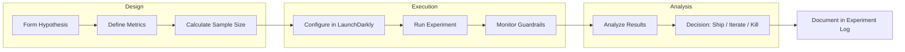
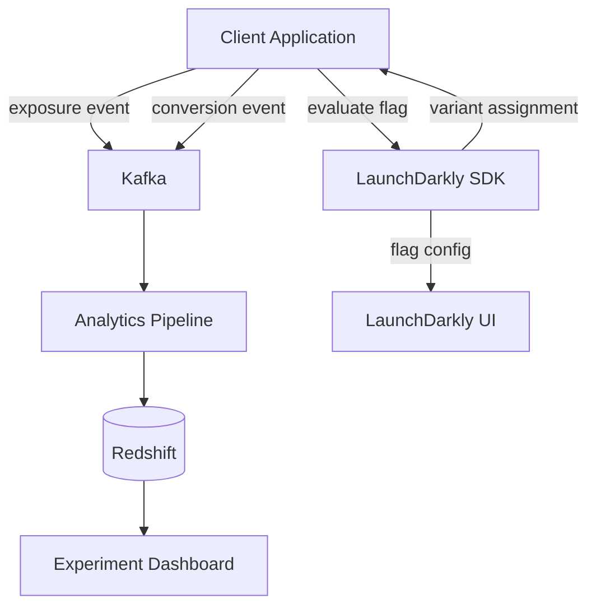

# 🔬 A/B Testing Strategy

  

---

## 🎯 1. Purpose

A/B testing is how we make product decisions with data instead of opinions. This document defines how {Company} runs feature experiments — hypothesis formation, test design, statistical rigor, and operational guardrails.

This is the **general product A/B testing standard**. For ML-specific experimentation (model champion/challenger, shadow scoring), see `10-ai-ml-platform/01-ml-platform.md`.

---

## 🧪 2. When to A/B Test

### 2.1 Good Candidates

| Scenario | Example |
|----------|---------|
| UI/UX changes | New checkout flow, redesigned search results |
| Feature rollout | New notification type, updated recommendation logic |
| Pricing/promotions | Different discount structures, pricing display formats |
| Copy changes | Different onboarding messages, CTA wording |
| Performance optimizations | Faster load time → does it change conversion? |

### 2.2 Not Everything Needs an A/B Test

| Scenario | Why Not | Alternative |
|----------|---------|-------------|
| Bug fixes | Obvious improvements don't need measurement | Just ship it |
| Regulatory requirements | No choice in the matter | Just ship it |
| Infrastructure changes | No user-facing impact to measure | Canary deployment |
| Obvious improvements | < 1% of users affected | Feature flag with monitoring |

---

## 🔄 3. Experiment Lifecycle



---

## 📏 4. Experiment Design

### 4.1 Hypothesis Template

Every experiment must have a hypothesis documented before it starts:

```
We believe that [change]
for [user segment]
will result in [measurable outcome]
because [reasoning].

We will measure: [primary metric]
Guardrail metrics: [metrics that must not degrade]
We will run for: [minimum duration]
```

### 4.2 Metrics Framework

| Metric Type | Definition | Example |
|-------------|-----------|---------|
| **Primary metric** | The one metric the experiment is designed to move | Conversion rate, order completion rate |
| **Secondary metrics** | Related metrics that provide context | Average order value, time to completion |
| **Guardrail metrics** | Metrics that must NOT degrade | Error rate, latency p99, crash rate, revenue |

### 4.3 Sample Size Calculation

Before running any experiment, calculate the required sample size:

| Parameter | Default | Notes |
|-----------|---------|-------|
| **Significance level (α)** | 0.05 (5%) | Probability of false positive |
| **Statistical power (1-β)** | 0.80 (80%) | Probability of detecting a real effect |
| **Minimum detectable effect (MDE)** | Varies by metric | Smallest change worth detecting |

Use the formula or an online calculator (e.g., Evan Miller's). Document the expected duration before starting.

**Rule of thumb:**
- Small effect sizes (1-2% relative change) → large samples, 2-4 weeks
- Medium effect sizes (5-10%) → moderate samples, 1-2 weeks
- Large effect sizes (20%+) → small samples, days

### 4.4 Traffic Allocation

| Phase | Control | Treatment | Duration |
|-------|---------|-----------|----------|
| **Burn-in** | 95% | 5% | 24 hours |
| **Ramp** | 80% | 20% | 3 days |
| **Full experiment** | 50% | 50% | Until sample size reached |

Always start with a small allocation to catch bugs and regressions before exposing half your users.

---

## 🔗 5. Technical Implementation

### 5.1 Feature Flag Integration

All A/B tests are implemented as **LaunchDarkly experiments**. The feature flag platform handles:

- **Random, sticky assignment** — users consistently see the same variant
- **Segment targeting** — run experiments on specific user cohorts
- **Mutual exclusion** — prevent users from being in conflicting experiments
- **Kill switch** — instantly disable a variant if guardrails are breached

### 5.2 Flag Naming Convention

```
experiment.{team}.{feature}.{yyyy-mm}

Examples:
  experiment.commercial.price-display-v2.2026-04
  experiment.orders.new-checkout-flow.2026-03
  experiment.customers.onboarding-redesign.2026-04
```

### 5.3 Event Instrumentation

Every experiment requires instrumentation to capture:

```json
{
  "event_type": "experiment.exposure",
  "experiment_id": "price-display-v2",
  "variant": "treatment_a",
  "user_id": "usr_abc123",
  "timestamp": "2026-04-01T12:00:00Z",
  "context": {
    "platform": "web",
    "region": "us-east-1"
  }
}
```

Emit exposure events at the point where the user **actually sees** the variant, not when the flag is evaluated. This prevents dilution from users who are assigned but never reach the experiment surface.

### 5.4 Architecture



---

## 🧪 6. Running the Experiment

### 6.1 Pre-Launch Checklist

- [ ] Hypothesis documented and reviewed by PM + Eng Lead
- [ ] Primary, secondary, and guardrail metrics defined
- [ ] Sample size calculated and expected duration documented
- [ ] Feature flag created with correct targeting rules
- [ ] Exposure and conversion events instrumented and verified in staging
- [ ] Guardrail alerts configured (latency, error rate, crash rate)
- [ ] Experiment registered in the experiment log

### 6.2 Monitoring During Experiment

| Check | Frequency | Action if breached |
|-------|-----------|-------------------|
| Error rate by variant | Continuous | Kill the experiment immediately |
| Latency p99 by variant | Continuous | Kill if > 20% regression |
| Crash rate by variant | Daily | Kill if treatment is worse |
| Sample ratio mismatch (SRM) | Daily | Investigate — assignment bug |
| Guardrail metrics | Daily | Kill if any guardrail degrades significantly |

### 6.3 Duration Rules

- **Minimum runtime:** 7 days (to capture weekly seasonality)
- **Maximum runtime:** 30 days (stale experiments waste opportunity cost)
- **Never peek and stop early** — wait for the pre-calculated sample size, or use sequential testing methods

---

## 📋 7. Analysis and Decision

### 7.1 Statistical Analysis

| Method | When to Use |
|--------|-------------|
| **Frequentist (t-test / chi-square)** | Standard experiments with pre-calculated sample size |
| **Sequential testing** | When you need to check results before the full sample is collected |
| **Bayesian** | When stakeholders want probability statements ("85% chance treatment is better") |

Default is frequentist with α = 0.05 and power = 0.80.

### 7.2 Decision Framework

| Result | Action |
|--------|--------|
| **Statistically significant, positive** | Ship the treatment to 100% |
| **Statistically significant, negative** | Kill the treatment; document learnings |
| **Not significant after full duration** | Kill; the effect is too small to matter |
| **Guardrail breached** | Kill immediately; investigate root cause |

### 7.3 Experiment Log

All experiments must be recorded in the shared experiment log:

| Field | Content |
|-------|---------|
| Experiment ID | Unique identifier |
| Hypothesis | What we believed |
| Dates | Start and end |
| Variants | Description of control and treatment(s) |
| Primary metric result | With confidence interval |
| Decision | Ship / Kill / Iterate |
| Learnings | What did we learn? |
| Owner | PM + Eng Lead |

---

## ❌ 8. Anti-Patterns

| Anti-Pattern | Why It's Harmful | What to Do Instead |
|-------------|-----------------|-------------------|
| No hypothesis | You're not learning, just shipping randomly | Write the hypothesis before the code |
| Peeking at results daily and stopping early | Inflates false positive rate | Use sequential testing or wait for full sample |
| Testing too many variants | Splits traffic too thin, extends duration | 2-3 variants max; focus on the biggest bets |
| Running experiments without guardrails | Can silently degrade user experience | Always set guardrail alerts |
| Never killing experiments | Stale flags accumulate, code becomes unreadable | 30-day max; remove the flag after decision |
| Using A/B tests for everything | Delays obvious improvements | Reserve for genuine uncertainty |

---

## 📋 9. Product Analytics (Non-Experiment)

Not all product measurement requires an A/B test. Product metrics outside of experiments are tracked via **structured events** that flow through the analytics pipeline.

### Event Naming Convention

All product analytics events follow the `{domain}.{action}.{object}` naming pattern:

| Domain | Action | Object | Full Event Name |
|--------|--------|--------|----------------|
| `checkout` | `clicked` | `place_order` | `checkout.clicked.place_order` |
| `search` | `submitted` | `query` | `search.submitted.query` |
| `onboarding` | `completed` | `step_3` | `onboarding.completed.step_3` |
| `provider` | `accepted` | `order_offer` | `provider.accepted.order_offer` |
| `settings` | `toggled` | `dark_mode` | `settings.toggled.dark_mode` |
| `order` | `viewed` | `tracking_screen` | `order.viewed.tracking_screen` |

### Pipeline

```
Client / Service → Structured Event → Kafka → Redshift → QuickSight Dashboards
```

Events are published to Kafka with a consistent schema, consumed by the analytics pipeline, loaded into Redshift, and surfaced in QuickSight dashboards.

### Product Metric Catalog

The canonical list of product events and their definitions is maintained in [06-developer-guides/09-data-governance.md](../06-developer-guides/09-data-governance.md). Teams must register new events in the catalog before instrumenting them to prevent naming collisions and ensure consistent definitions.

### Self-Serve Analytics

Product managers and analysts access analytics via **QuickSight** connected to Redshift. QuickSight provides:

- Pre-built dashboards for core product funnels (onboarding, order flow, payment)
- Ad-hoc query capability for custom analysis
- Scheduled email reports for key metrics

No direct Redshift access is granted outside the analytics team. All queries go through QuickSight or approved BI tooling.

---
<div align="center">

⬅️ [Back to section](./README.md) · 🏠 [Back to root](../README.md)

</div>
