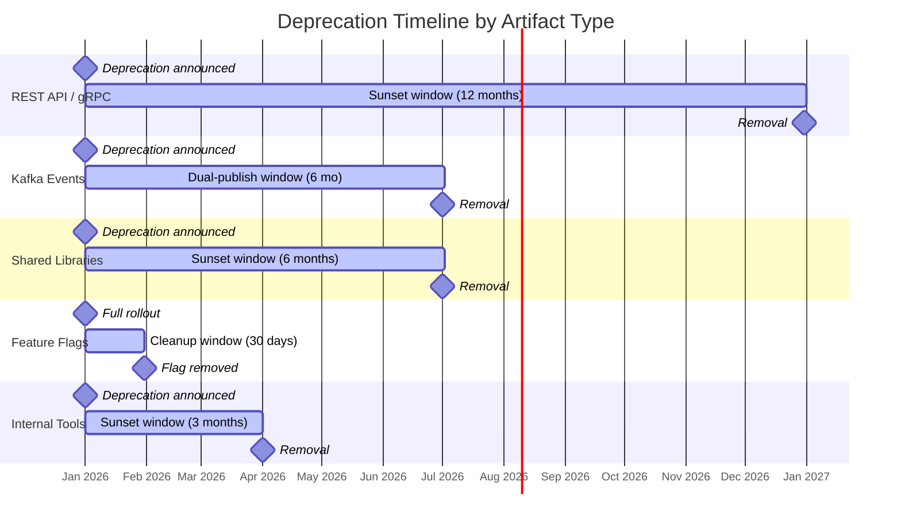
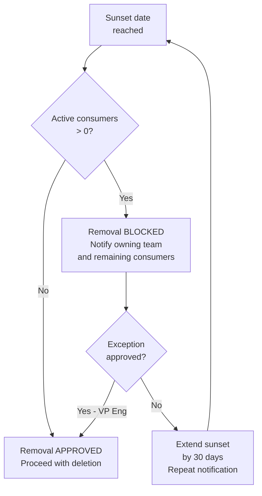

# 🗓️ Deprecation Lifecycle

  

---

## 📋 Table of Contents

1. [Scope](#1-scope)
2. [Deprecation Timelines](#2-deprecation-timelines)
3. [Communication Cadence](#3-communication-cadence)
4. [Communication Channels](#4-communication-channels)
5. [Usage Tracking & Removal Gates](#5-usage-tracking--removal-gates)
6. [Consumer Migration Checklist](#6-consumer-migration-checklist)
7. [CI Enforcement](#7-ci-enforcement)
8. [Exception Process](#8-exception-process)

---

## 🎯 1. Scope

This document governs the deprecation and sunset process for all shared platform artifacts at {Company}. Any artifact consumed by teams other than its owner must follow this lifecycle before removal.

| Artifact Type | Examples |
|---------------|----------|
| **REST APIs** | Versioned endpoints (`/api/v1/orders`), entire API versions |
| **gRPC services** | Service definitions, individual RPCs |
| **Kafka events** | Event schemas, entire topics |
| **Feature flags** | LaunchDarkly flags after full rollout |
| **Shared libraries** | `@{company}/ui`, `com.{company}.commons`, internal SDKs (major versions) |
| **Internal tools** | CLI tools, scripts, internal dashboards |
| **Domain services** | Entire microservices being replaced or consolidated |

---

## 📏 2. Deprecation Timelines

Every deprecated artifact has a defined **sunset window** - the period between the deprecation announcement and the removal date. The window length varies by artifact type to reflect the migration effort and blast radius.

| Artifact Type | Sunset Window | Rationale |
|---------------|--------------|-----------|
| **REST APIs** | 12 months | External and internal consumers; long integration cycles |
| **gRPC services** | 12 months | Service-to-service contracts; coordinated migration |
| **Kafka events** | 6 months (dual-publish window) | Producers dual-publish during the window; consumers migrate to the new topic |
| **Feature flags** | 30 days after full rollout | Flag is no longer needed once the feature is at 100% and stable |
| **Shared libraries (major versions)** | 6 months | Teams need time to upgrade and test against the new major version |
| **Internal tools** | 3 months | Lower blast radius; fewer consumers |
| **Domain services** | RFC required, custom timeline | High complexity; timeline negotiated per case |

### 2.1 Timeline Visualization



---

## 📏 3. Communication Cadence

Deprecation is not a one-time announcement. Consumers must be reminded at regular intervals to ensure no team is caught by surprise at sunset.

| Milestone | Timing | Action |
|-----------|--------|--------|
| **Deprecation announced** | Day 0 | Initial announcement with migration guide, sunset date, and replacement |
| **6-month reminder** | 6 months before sunset | Reminder with updated migration stats (how many consumers have migrated) |
| **3-month reminder** | 3 months before sunset | Escalation if > 50% of consumers have not migrated |
| **1-month warning** | 1 month before sunset | Final planning window; teams must have migration PRs in progress |
| **2-week warning** | 2 weeks before sunset | Last call; escalation to engineering managers of non-migrated teams |
| **48-hour final warning** | 48 hours before sunset | Final notification; removal proceeds unless an exception is granted |
| **Sunset executed** | Sunset date | Artifact removed or returns 410 Gone |

---

## 📏 4. Communication Channels

Deprecation notices must reach every consumer team through multiple channels. A Slack message alone is insufficient.

| Channel | Format | Audience |
|---------|--------|----------|
| **Backstage banner** | Persistent banner on the service/library catalog page | Anyone browsing the catalog |
| **Slack `#platform-announcements`** | Structured message with sunset date, migration guide link, and consumer list | All engineering |
| **Email to registered consumers** | Direct email to tech leads of consuming services (from Backstage dependency graph) | Affected teams only |
| **API response header: `Deprecation`** | `Deprecation: true` header on all responses from the deprecated API | API consumers (programmatic detection) |
| **API response header: `Sunset`** | `Sunset: Sat, 31 Dec 2026 23:59:59 GMT` header with the removal date | API consumers (programmatic detection) |
| **ADR / RFC** | Architecture Decision Record documenting the deprecation rationale and replacement | Permanent record |

### 4.1 Deprecation Header Example

```http
HTTP/1.1 200 OK
Content-Type: application/json
Deprecation: true
Sunset: Sat, 31 Dec 2026 23:59:59 GMT
Link: <https://docs.{company}.internal/migration/orders-v2>; rel="successor-version"
```

Consumers that parse these headers can automate deprecation detection and surface warnings in their own CI pipelines.

---

## 🔄 5. Usage Tracking & Removal Gates

No deprecated artifact may be removed while it still has active consumers. Usage is tracked automatically, and removal is gated on zero active consumers.

### 5.1 Tracking Methods

| Artifact Type | Tracking Method | Data Source |
|---------------|----------------|-------------|
| **REST APIs** | Request count per consumer (identified by API key or service identity header) | API Gateway access logs (Kong / AWS API Gateway) |
| **gRPC services** | Request count per caller (from mTLS client certificate identity) | Envoy access logs |
| **Kafka events** | Consumer group activity | Kafka consumer group lag monitoring (Prometheus `kafka_consumergroup_lag`) |
| **Feature flags** | Evaluation count per service | LaunchDarkly flag usage metrics |
| **Shared libraries** | Dependency declaration in `pom.xml` / `package.json` | Backstage dependency graph scan (weekly) |

### 5.2 Removal Gate



**Active consumer definition:**
- REST/gRPC: any request in the last 30 days
- Kafka: any consumer group with committed offsets in the last 30 days
- Libraries: any service with the deprecated major version in its dependency tree

---

## 📋 6. Consumer Migration Checklist

The deprecating team is responsible for providing a migration path. Dropping an artifact without a replacement is not permitted unless the capability is being intentionally retired.

| Step | Responsible | Detail |
|------|-------------|--------|
| **1. Identify consumers** | Deprecating team | Use API Gateway logs, Backstage dependency graph, or Kafka consumer groups to enumerate all consumers |
| **2. Publish migration guide** | Deprecating team | Step-by-step guide explaining how to migrate to the replacement. Published in the engineering docs and linked from the Backstage banner. |
| **3. Notify consumers** | Deprecating team | Send initial deprecation notice via all channels (§4) |
| **4. Support migration** | Deprecating team | Offer office hours, answer questions in the migration Slack channel, review migration PRs |
| **5. Track migration progress** | Deprecating team | Maintain a dashboard showing migration status per consumer |
| **6. Verify migration** | Consuming team | Consuming team confirms their service is fully migrated and no longer depends on the deprecated artifact |
| **7. Remove** | Deprecating team | Once all consumers have migrated (or exceptions granted), remove the artifact |

---

## 🔄 7. CI Enforcement

Deprecation is enforced programmatically, not just through communication. CI pipelines detect and surface deprecated dependencies.

### 7.1 Enforcement by Phase

| Phase | Behavior | Implementation |
|-------|----------|---------------|
| **Deprecated (before sunset)** | API returns `Deprecation: true` header | API Gateway plugin injects header for deprecated routes |
| **Deprecated (before sunset)** | Deprecated library triggers CI **warning** | Dependency check step in CI pipeline scans for deprecated package versions |
| **Deprecated (before sunset)** | Deprecated feature flag triggers CI **warning** | LaunchDarkly integration flags stale flags in PR checks |
| **Past sunset** | REST API returns **410 Gone** | API Gateway route updated to return 410 with migration link in response body |
| **Past sunset** | gRPC service returns **UNIMPLEMENTED** | gRPC interceptor returns `Status.UNIMPLEMENTED` with migration link in metadata |
| **Past sunset** | Deprecated library triggers CI **error** (build fails) | Dependency check step fails the build for past-sunset versions |

### 7.2 410 Gone Response

```json
{
  "error": "GONE",
  "message": "This API version has been sunset. Please migrate to the replacement.",
  "migrationGuide": "https://docs.{company}.internal/migration/orders-v2",
  "sunsetDate": "2026-12-31T23:59:59Z",
  "replacementEndpoint": "/api/v2/orders"
}
```

### 7.3 Deprecated Dependency CI Warning

```
⚠️ DEPRECATION WARNING
  Dependency: @{company}/commons@3.x
  Status: Deprecated (sunset: 2026-07-01)
  Replacement: @{company}/commons@4.x
  Migration guide: https://docs.{company}.internal/migration/commons-v4

  This dependency will cause a build failure after the sunset date.
```

---

## 📏 8. Exception Process

Deadlines exist for a reason. Extensions are granted only when the migration is genuinely infeasible within the sunset window, not because a team deprioritized the work.

### 8.1 Exception Criteria

| Criterion | Acceptable | Not Acceptable |
|-----------|-----------|----------------|
| Technical blocker | Migration requires a dependency that is not yet released | "We didn't have time" |
| Regulatory freeze | Code freeze for compliance audit prevents changes | "It's not a priority for our team" |
| Customer-impacting risk | Migration introduces a risk to a critical revenue flow during peak season | "We want to do it next quarter" |

### 8.2 Approval Process

1. Consuming team submits an exception request documenting: the reason, the proposed new deadline, and a migration plan with dates.
2. VP Engineering reviews and approves or rejects within 5 business days.
3. Approved exceptions are documented in an ADR, linked from the Backstage deprecation banner.
4. The maximum extension is **90 days**. A second extension requires CTO approval.

### 8.3 Exception Tracking

All active exceptions are tracked in a shared tracker (linked from the Platform Engineering Backstage page) and reviewed monthly in the Platform Engineering review meeting.

---
<div align="center">

⬅️ [Back to section](./README.md) · 🏠 [Back to root](../README.md)

</div>
