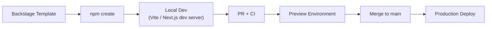
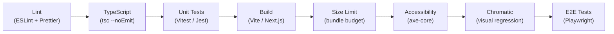
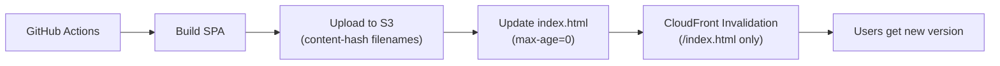
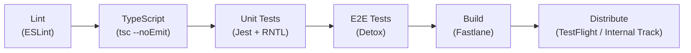

# 🌐 Frontend & Mobile CI/CD

  

---

## 📋 Table of Contents

1. [Frontend Golden Path](#1-frontend-golden-path)
2. [Monorepo Structure](#2-monorepo-structure)
3. [CI Pipeline Template](#3-ci-pipeline-template)
4. [CD for Single-Page Applications](#4-cd-for-single-page-applications)
5. [CD for Next.js Applications](#5-cd-for-nextjs-applications)
6. [Preview Environments](#6-preview-environments)
7. [Environment Variables](#7-environment-variables)
8. [Source Maps](#8-source-maps)
9. [Mobile CI Template](#9-mobile-ci-template)

---

## 🎯 1. Frontend Golden Path

The frontend golden path takes an engineer from zero to production deployment using standardized tooling:



### 1.1 Backstage Template Options

| Template | Framework | Rendering | Use Case |
|----------|-----------|-----------|----------|
| `spa-react` | React 18 + Vite | Client-side (SPA) | Internal tools, dashboards |
| `ssr-nextjs` | Next.js 14 (App Router) | SSR / SSG | Customer-facing web apps |
| `shared-lib` | TypeScript + tsup | Library (no UI) | Shared utilities, API clients |
| `design-system` | React + Storybook | Component library | `@{company}/ui` components |

### 1.2 Scaffolded Project Contents

Every scaffolded project includes:

| File / Directory | Purpose |
|-----------------|---------|
| `src/` | Application source code |
| `tests/` | Unit and integration tests |
| `e2e/` | Playwright E2E tests |
| `.github/workflows/ci.yml` | CI pipeline (pre-configured) |
| `.github/workflows/deploy.yml` | CD pipeline (pre-configured) |
| `Dockerfile` | Production container (Next.js only) |
| `.env.example` | Safe environment variable template |
| `turbo.json` | Turborepo pipeline config (monorepo) |
| `catalog-info.yaml` | Backstage service registration |

---

## 📏 2. Monorepo Structure

{Company} frontend projects use **Turborepo** for monorepo management with a standard directory layout:

```
frontend/
├── apps/
│   ├── customer-web/          # Next.js customer-facing app
│   ├── admin-dashboard/       # React SPA for internal ops
│   └── mobile/                # React Native app
├── packages/
│   ├── ui/                    # @{company}/ui - shared component library
│   ├── api-client/            # @{company}/api-client - typed API client
│   ├── config-eslint/         # @{company}/config-eslint - shared ESLint config
│   ├── config-typescript/     # @{company}/config-typescript - shared tsconfig
│   └── utils/                 # @{company}/utils - shared utility functions
├── turbo.json
├── package.json
├── pnpm-workspace.yaml
└── .github/
    └── workflows/
        ├── ci.yml
        └── deploy.yml
```

### 2.1 Package Naming Convention

| Package | npm Scope | Published? |
|---------|-----------|-----------|
| `@{company}/ui` | `@{company}` | Yes - internal registry |
| `@{company}/api-client` | `@{company}` | Yes - internal registry |
| `@{company}/config-eslint` | `@{company}` | Yes - internal registry |
| `@{company}/config-typescript` | `@{company}` | Yes - internal registry |
| `@{company}/utils` | `@{company}` | Yes - internal registry |

### 2.2 Turborepo Tasks

```json
{
  "$schema": "https://turbo.build/schema.json",
  "tasks": {
    "build": {
      "dependsOn": ["^build"],
      "outputs": [".next/**", "dist/**"]
    },
    "lint": {},
    "test": {
      "dependsOn": ["build"]
    },
    "typecheck": {},
    "dev": {
      "cache": false,
      "persistent": true
    }
  }
}
```

---

## 🔄 3. CI Pipeline Template

### 3.1 Pipeline Flow



### 3.2 GitHub Actions Workflow

```yaml
# .github/workflows/ci.yml
name: CI

on:
  pull_request:
    branches: [main]

concurrency:
  group: ci-${{ github.ref }}
  cancel-in-progress: true

jobs:
  lint:
    runs-on: ubuntu-latest
    steps:
      - uses: actions/checkout@v4
      - uses: pnpm/action-setup@v3
      - uses: actions/setup-node@v4
        with:
          node-version: 20
          cache: pnpm
      - run: pnpm install --frozen-lockfile
      - run: pnpm turbo lint

  typecheck:
    runs-on: ubuntu-latest
    steps:
      - uses: actions/checkout@v4
      - uses: pnpm/action-setup@v3
      - uses: actions/setup-node@v4
        with:
          node-version: 20
          cache: pnpm
      - run: pnpm install --frozen-lockfile
      - run: pnpm turbo typecheck

  test:
    runs-on: ubuntu-latest
    needs: [lint, typecheck]
    steps:
      - uses: actions/checkout@v4
      - uses: pnpm/action-setup@v3
      - uses: actions/setup-node@v4
        with:
          node-version: 20
          cache: pnpm
      - run: pnpm install --frozen-lockfile
      - run: pnpm turbo test -- --coverage
      - uses: codecov/codecov-action@v4

  build:
    runs-on: ubuntu-latest
    needs: [test]
    steps:
      - uses: actions/checkout@v4
      - uses: pnpm/action-setup@v3
      - uses: actions/setup-node@v4
        with:
          node-version: 20
          cache: pnpm
      - run: pnpm install --frozen-lockfile
      - run: pnpm turbo build

  size-limit:
    runs-on: ubuntu-latest
    needs: [build]
    steps:
      - uses: actions/checkout@v4
      - uses: pnpm/action-setup@v3
      - uses: actions/setup-node@v4
        with:
          node-version: 20
          cache: pnpm
      - run: pnpm install --frozen-lockfile
      - uses: andresz1/size-limit-action@v1
        with:
          github_token: ${{ secrets.GITHUB_TOKEN }}

  a11y:
    runs-on: ubuntu-latest
    needs: [build]
    steps:
      - uses: actions/checkout@v4
      - uses: pnpm/action-setup@v3
      - uses: actions/setup-node@v4
        with:
          node-version: 20
          cache: pnpm
      - run: pnpm install --frozen-lockfile
      - run: pnpm turbo build
      - run: pnpm exec axe-core-cli ./apps/customer-web/dist --exit

  chromatic:
    runs-on: ubuntu-latest
    needs: [build]
    steps:
      - uses: actions/checkout@v4
        with:
          fetch-depth: 0
      - uses: pnpm/action-setup@v3
      - uses: actions/setup-node@v4
        with:
          node-version: 20
          cache: pnpm
      - run: pnpm install --frozen-lockfile
      - uses: chromaui/action@latest
        with:
          projectToken: ${{ secrets.CHROMATIC_PROJECT_TOKEN }}
          workingDir: packages/ui

  e2e:
    runs-on: ubuntu-latest
    needs: [build]
    steps:
      - uses: actions/checkout@v4
      - uses: pnpm/action-setup@v3
      - uses: actions/setup-node@v4
        with:
          node-version: 20
          cache: pnpm
      - run: pnpm install --frozen-lockfile
      - run: pnpm turbo build
      - run: npx playwright install --with-deps chromium
      - run: pnpm turbo e2e
```

### 3.3 Bundle Size Budgets

```json
[
  {
    "path": "apps/customer-web/dist/assets/index-*.js",
    "limit": "250 kB",
    "gzip": true
  },
  {
    "path": "apps/customer-web/dist/assets/vendor-*.js",
    "limit": "150 kB",
    "gzip": true
  },
  {
    "path": "packages/ui/dist/index.js",
    "limit": "80 kB",
    "gzip": true
  }
]
```

---

## 🚀 4. CD for Single-Page Applications

SPAs are deployed to **S3 + CloudFront** with immutable asset caching.

### 4.1 Deployment Architecture



### 4.2 Cache Strategy

| Asset | S3 Path | Cache-Control | Rationale |
|-------|---------|---------------|-----------|
| `index.html` | `/index.html` | `max-age=0, must-revalidate` | Always fetch latest entry point |
| JS bundles | `/assets/index-a1b2c3.js` | `max-age=31536000, immutable` | Content-hashed - changes hash on update |
| CSS files | `/assets/styles-d4e5f6.css` | `max-age=31536000, immutable` | Content-hashed |
| Images | `/assets/logo-g7h8i9.png` | `max-age=31536000, immutable` | Content-hashed |
| `favicon.ico` | `/favicon.ico` | `max-age=86400` | Changes rarely |

### 4.3 CloudFront Invalidation

Only `index.html` needs invalidation on deploy. All other assets have new hashes, so they are fetched automatically.

```yaml
# deploy step
- name: Invalidate CloudFront
  run: |
    aws cloudfront create-invalidation \
      --distribution-id ${{ secrets.CF_DISTRIBUTION_ID }} \
      --paths "/index.html"
```

---

## 🚀 5. CD for Next.js Applications

Next.js applications with SSR/SSG run as containers deployed to **ECS or EKS** using rolling deploys.

### 5.1 Deployment Strategy

| Aspect | Configuration |
|--------|--------------|
| **Container registry** | ECR |
| **Orchestrator** | EKS (preferred) or ECS Fargate |
| **Deploy strategy** | Rolling update (maxUnavailable: 0, maxSurge: 25%) |
| **Health check** | `/api/health` returning 200 |
| **Rollback** | Automatic on failed health check (3 consecutive failures) |

### 5.2 Dockerfile

```dockerfile
FROM node:20-alpine AS base

FROM base AS deps
WORKDIR /app
COPY package.json pnpm-lock.yaml ./
RUN corepack enable pnpm && pnpm install --frozen-lockfile --prod

FROM base AS builder
WORKDIR /app
COPY . .
COPY --from=deps /app/node_modules ./node_modules
RUN corepack enable pnpm && pnpm build

FROM base AS runner
WORKDIR /app
ENV NODE_ENV=production
RUN addgroup -g 1001 -S nodejs && adduser -S nextjs -u 1001

COPY --from=builder /app/public ./public
COPY --from=builder --chown=nextjs:nodejs /app/.next/standalone ./
COPY --from=builder --chown=nextjs:nodejs /app/.next/static ./.next/static

USER nextjs
EXPOSE 3000
ENV PORT=3000
CMD ["node", "server.js"]
```

---

## 🚀 6. Preview Environments

Every PR gets a preview environment so reviewers can see changes live.

### 6.1 Preview Strategies by App Type

| App Type | Preview Platform | URL Pattern | Auto-Cleanup |
|----------|-----------------|-------------|-------------|
| **Next.js** | Vercel | `pr-{number}.preview.{company}.dev` | On PR close |
| **SPA (React + Vite)** | S3 + CloudFront (per-PR) | `pr-{number}.spa-preview.{company}.dev` | On PR close (GitHub Action) |
| **Storybook** | Chromatic | Link in PR checks | Retained for visual history |

### 6.2 PR Comment with Preview URL

The CI pipeline posts a comment on the PR with the preview URL:

```yaml
- name: Post preview URL
  uses: actions/github-script@v7
  with:
    script: |
      github.rest.issues.createComment({
        owner: context.repo.owner,
        repo: context.repo.repo,
        issue_number: context.issue.number,
        body: `## Preview Deployment\n\n🔗 **URL:** https://pr-${context.issue.number}.preview.${company}.dev\n\n_Deployed at ${new Date().toISOString()}_`
      })
```

### 6.3 Cleanup

```yaml
# .github/workflows/cleanup-preview.yml
name: Cleanup Preview

on:
  pull_request:
    types: [closed]

jobs:
  cleanup:
    runs-on: ubuntu-latest
    steps:
      - name: Delete S3 preview bucket contents
        run: |
          aws s3 rm s3://spa-preview-${{ github.event.number }} --recursive
      - name: Delete CloudFront distribution
        run: |
          # Platform script handles distribution teardown
          ./scripts/cleanup-preview.sh ${{ github.event.number }}
```

---

## 📏 7. Environment Variables

### 7.1 Allowlist Convention

Only variables prefixed with the framework-specific public prefix are embedded in the client bundle. All other variables are server-side only.

| Framework | Public Prefix | Example |
|-----------|--------------|---------|
| **Vite** | `VITE_` | `VITE_API_BASE_URL` |
| **Next.js** | `NEXT_PUBLIC_` | `NEXT_PUBLIC_SENTRY_DSN` |
| **React Native** | `EXPO_PUBLIC_` | `EXPO_PUBLIC_API_URL` |

### 7.2 Allowed Public Variables

| Variable | Safe for Client? | Example Value |
|----------|-----------------|---------------|
| `VITE_API_BASE_URL` | Yes | `https://api.{company}.dev` |
| `VITE_SENTRY_DSN` | Yes | `https://xxx@sentry.io/123` |
| `VITE_LAUNCHDARKLY_CLIENT_ID` | Yes | `client-id-xxx` |
| `VITE_ANALYTICS_ID` | Yes | `G-XXXXXXXXX` |
| `VITE_ENV` | Yes | `production` |

### 7.3 Forbidden in Client Bundles

The following must **never** appear in a client bundle. CI scans for these patterns and fails the build:

| Pattern | Why |
|---------|-----|
| `AWS_SECRET_ACCESS_KEY` | Cloud credentials |
| `DATABASE_URL` | Database connection string |
| `API_SECRET_KEY` | Server-side API secrets |
| `PRIVATE_KEY` | Signing keys |
| Any value matching `sk_live_*`, `ghp_*`, `xoxb-*` | Third-party secrets |

### 7.4 Build-Time Injection

Environment variables are injected at build time, not at runtime. Each environment (staging, production) triggers a separate build with different variables:

```yaml
# deploy.yml
- name: Build for production
  env:
    VITE_API_BASE_URL: https://api.{company}.com
    VITE_ENV: production
    VITE_SENTRY_DSN: ${{ secrets.SENTRY_DSN }}
  run: pnpm turbo build --filter=customer-web
```

---

## 🔒 8. Source Maps

### 8.1 Strategy

Source maps are generated during the build for debugging but are **never served to end users**. They are uploaded to Sentry for error deobfuscation and then deleted from the deployment artifact.

### 8.2 Upload to Sentry

```yaml
- name: Upload source maps to Sentry
  run: |
    npx @sentry/cli sourcemaps upload \
      --auth-token ${{ secrets.SENTRY_AUTH_TOKEN }} \
      --org {company} \
      --project customer-web \
      --release ${{ github.sha }} \
      ./dist/assets

- name: Delete source maps from artifact
  run: find ./dist -name "*.map" -delete
```

### 8.3 Verification

After deployment, verify that source maps are not publicly accessible:

```bash
curl -I https://app.{company}.com/assets/index-a1b2c3.js.map
# Expected: 403 Forbidden or 404 Not Found
```

---

## 🔄 9. Mobile CI Template

### 9.1 Pipeline Flow



### 9.2 GitHub Actions Workflow (iOS)

```yaml
# .github/workflows/mobile-ci.yml
name: Mobile CI

on:
  pull_request:
    branches: [main]
    paths:
      - "apps/mobile/**"

jobs:
  lint-and-test:
    runs-on: ubuntu-latest
    steps:
      - uses: actions/checkout@v4
      - uses: actions/setup-node@v4
        with:
          node-version: 20
      - run: pnpm install --frozen-lockfile
      - run: pnpm turbo lint --filter=mobile
      - run: pnpm turbo typecheck --filter=mobile
      - run: pnpm turbo test --filter=mobile -- --coverage

  detox-ios:
    runs-on: macos-14
    needs: [lint-and-test]
    steps:
      - uses: actions/checkout@v4
      - uses: actions/setup-node@v4
        with:
          node-version: 20
      - run: pnpm install --frozen-lockfile
      - run: brew tap wix/brew && brew install applesimutils
      - run: npx pod-install apps/mobile/ios
      - run: npx detox build --configuration ios.sim.release
      - run: npx detox test --configuration ios.sim.release --cleanup

  deploy-testflight:
    runs-on: macos-14
    needs: [detox-ios]
    if: github.ref == 'refs/heads/main'
    steps:
      - uses: actions/checkout@v4
      - uses: ruby/setup-ruby@v1
        with:
          ruby-version: "3.2"
      - run: bundle install
      - run: bundle exec fastlane ios beta
        env:
          MATCH_PASSWORD: ${{ secrets.MATCH_PASSWORD }}
          APP_STORE_CONNECT_API_KEY: ${{ secrets.ASC_API_KEY }}
```

### 9.3 Fastlane Configuration

```ruby
# apps/mobile/ios/fastlane/Fastfile
default_platform(:ios)

platform :ios do
  desc "Push a new beta build to TestFlight"
  lane :beta do
    setup_ci
    match(type: "appstore", readonly: true)
    increment_build_number(xcodeproj: "Mobile.xcodeproj")
    build_app(
      workspace: "Mobile.xcworkspace",
      scheme: "Mobile",
      export_method: "app-store"
    )
    upload_to_testflight(skip_waiting_for_build_processing: true)
  end
end
```

### 9.4 Mobile Release Channels

| Channel | Audience | Frequency | Gate |
|---------|----------|-----------|------|
| **Internal** | Engineering + QA | Every merge to `main` | CI green |
| **TestFlight / Internal Track** | Beta testers | Weekly | QA sign-off |
| **App Store / Play Store** | All users | Bi-weekly | PM + QA sign-off, staged rollout (10% → 50% → 100%) |

---
<div align="center">

⬅️ [Back to section](./README.md) · 🏠 [Back to root](../README.md)

</div>
