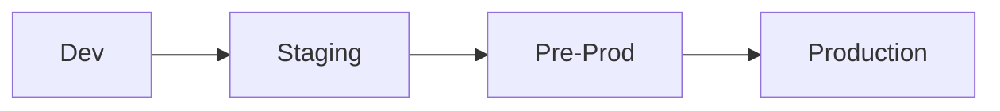
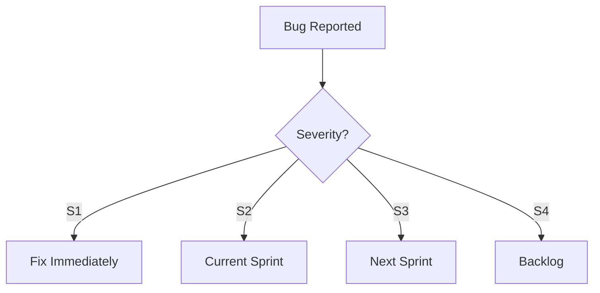

# ✅ Quality Assurance Standards

  

---

## 📋 Table of Contents

1. [QA Organizational Model](#1-qa-organizational-model)
2. [Test Environments](#2-test-environments)
3. [Test Data Management](#3-test-data-management)
4. [Regression Testing](#4-regression-testing)
5. [Manual & Exploratory Testing](#5-manual--exploratory-testing)
6. [Release Validation](#6-release-validation)
7. [Bug Triage & Severity](#7-bug-triage--severity)
8. [Performance Testing](#8-performance-testing)
9. [Security Testing](#9-security-testing)
10. [Mobile Device Testing](#10-mobile-device-testing)

---

## 🎯 1. QA Organizational Model

### 1.1 Philosophy

Quality is **developer-owned**. Every engineer is responsible for the quality of the code they ship. There is no separate QA team that acts as a gate between development and production.

### 1.2 Role of QA Engineers

QA Engineers at {Company} focus on **test infrastructure**, not manual test execution:

| QA Engineer Responsibility | Not QA Engineer Responsibility |
|---------------------------|-------------------------------|
| Build and maintain test frameworks | Execute manual test scripts |
| Create reusable test utilities and fixtures | Write test cases for individual features |
| Maintain device farms and test environments | Run regression suites by hand |
| Define testing standards and best practices | Act as a gate for deployments |
| Coach developers on testing techniques | Own feature quality |
| Automate flaky test detection and quarantine | Manually rerun failed tests |

### 1.3 Team Structure

- **Platform QA team (2-3 engineers):** Owns test infrastructure, CI test pipelines, BrowserStack integration, test data generators, and flaky test tooling.
- **Product teams:** Each team owns their own test suites (unit, integration, E2E). The QA engineer on the platform team provides consulting and tooling, not execution.

---

## 🧪 2. Test Environments

### 2.1 Environment Inventory

| Environment | Purpose | Data | Infra Owner | Data Owner |
|------------|---------|------|------------|-----------|
| **dev** | Local / feature branch testing | Synthetic only | Platform Engineering | Developer |
| **staging** | Integration testing, QA validation | Anonymised prod snapshot (monthly refresh) | Platform Engineering | QA Platform team |
| **pre-prod** | Release candidate validation, perf testing | Anonymised prod snapshot | Platform Engineering | QA Platform team |
| **prod** | Production | Real user data | Platform Engineering | Service teams |

**Visual overview:**



### 2.2 Namespace Isolation

- Each feature branch can spin up an **isolated namespace** in the `dev` cluster via Backstage self-service.
- Namespaces are named `dev-{branch-name}` and auto-destroyed after 7 days of inactivity.
- Shared infrastructure (databases, Kafka) uses **logical isolation** (separate schemas/topics per namespace).

### 2.3 Environment Parity

- Staging and pre-prod run the **same Terraform modules** as production with reduced instance counts.
- Feature flags in staging mirror production defaults unless explicitly overridden for testing.
- Infrastructure drift between environments is detected by **weekly Terraform plan diffs** and flagged in `#platform-support`.

---

## 📏 3. Test Data Management

### 3.1 Synthetic Data (Preferred)

Synthetic data generators are the **default** for all test environments:

```typescript
// Example: Order test data generator
import { faker } from '@faker-js/faker';

export function createTestOrder(overrides?: Partial<Order>): Order {
  return {
    id: faker.string.uuid(),
    customerId: faker.string.uuid(),
    items: [
      {
        name: faker.commerce.productName(),
        quantity: faker.number.int({ min: 1, max: 5 }),
        price: parseFloat(faker.commerce.price({ min: 5, max: 50 })),
      },
    ],
    status: 'PLACED',
    createdAt: faker.date.recent().toISOString(),
    ...overrides,
  };
}
```

### 3.2 Anonymised Production Snapshots

For staging and pre-prod:

- Snapshots are taken from production **monthly** via an automated pipeline.
- **PII scrubbing** runs before the snapshot is restored:

| Field | Anonymisation Method |
|-------|---------------------|
| Name | Faker-generated name |
| Email | `user_{hash}@test.{company}.com` |
| Phone | `+1555{random7}` |
| Address | Faker-generated address (same city/region) |
| Payment details | Completely removed |
| GPS coordinates | Jittered ±500m |

- The scrubbing pipeline is audited quarterly by the security team.

### 3.3 Prohibition

**Production data must never be used in `dev` environments.** This is enforced by network-level ACLs that prevent dev namespaces from connecting to production data stores.

---

## 🧪 4. Regression Testing

### 4.1 E2E Regression Suite

Each service team maintains an **E2E regression suite** covering their critical user journeys:

| Run Trigger | Suite | Scope |
|------------|-------|-------|
| **Nightly** (02:00 UTC) | Full regression | All E2E tests for all services |
| **Pre-release** (release branch cut) | Full regression + smoke | Full suite + cross-service integration flows |
| **Every PR** | Smoke subset | Top 5 critical paths per service |

### 4.2 Ownership

- The **service team** owns their regression tests. Tests live alongside the service code in the `e2e/` directory.
- The **Platform QA team** owns the nightly orchestration pipeline and the shared test infrastructure.

### 4.3 Flaky Test Policy

- A test that fails intermittently (>2 flaky failures in 7 days) is **quarantined** automatically.
- Quarantined tests are moved to a `@Quarantined` tag and excluded from blocking CI.
- The owning team has **1 sprint** to fix or delete a quarantined test. Unresolved quarantined tests are deleted after 2 sprints.

---

## 🧪 5. Manual & Exploratory Testing

### 5.1 Scheduled Sessions

| Trigger | Scope | Duration | Frequency |
|---------|-------|----------|-----------|
| **Quarterly exploratory** | Tier 1 critical flows (login, order, payment, delivery) | Half day | Quarterly |
| **Major release exploratory** | All flows touched by the release | Half day | Before every major release |
| **Feature bug bash** | New major feature | Half day | Before feature GA |

### 5.2 Exploratory Test Charters

Each exploratory session uses a **charter** template:

```
Charter: Explore [feature area]
Mission: Discover issues related to [specific concern]
Time box: [duration]
Environment: [staging / pre-prod]
Device/browser: [specific target]
```

### 5.3 Finding Documentation

- All findings are logged in Jira with the `exploratory` label.
- Each finding includes: steps to reproduce, expected vs actual, screenshots/video, severity assessment.
- Findings are reviewed in the next sprint planning and triaged using the severity definitions below.

---

## 🚀 6. Release Validation

### 6.1 Automated Gates Only

Release validation is **fully automated**. Manual gates slow down delivery and do not scale.

```mermaid
flowchart LR
    PR[PR Merged] --> CI[CI Pipeline]
    CI --> UNIT[Unit Tests ✅]
    UNIT --> INT[Integration Tests ✅]
    INT --> CONTRACT[Contract Tests ✅]
    CONTRACT --> SECURITY[SAST Scan ✅]
    SECURITY --> BUILD[Build Artifact]
    BUILD --> STAGING[Deploy to Staging]
    STAGING --> E2E[E2E Smoke ✅]
    E2E --> CANARY[Canary Deploy to Prod]
    CANARY --> MONITOR[Metrics Gate\n(error rate, latency)]
    MONITOR --> FULL[Full Rollout]
```

### 6.2 Exception: Payment Flows

Payment-related changes require **manual staging verification** before the first deploy of the sprint:

- A member of the payments team executes the payment happy path and one failure path on staging.
- Results are documented in the release ticket.
- This exception exists due to regulatory requirements and is reviewed annually.

### 6.3 Rollback Criteria

Automated rollback triggers (configured in the CD pipeline):

| Metric | Threshold | Action |
|--------|-----------|--------|
| Error rate (5xx) | >1% for 5 minutes | Auto-rollback |
| P99 latency | >2× baseline for 5 minutes | Auto-rollback |
| Crash-free rate (mobile) | <99.5% | Halt rollout, alert on-call |

---

## 📏 7. Bug Triage & Severity

### 7.1 Severity Definitions

| Severity | Definition | Example | Fix SLA |
|----------|-----------|---------|---------|
| **S1 - Critical** | Service down or data loss affecting all users | Payment processing failure, app crashes on launch, data corruption | **4 hours** (all-hands incident) |
| **S2 - Major** | Core feature broken for a segment of users | Orders fail for a specific region, push notifications not delivering on Android 14 | **1 sprint** (highest priority in next sprint) |
| **S3 - Moderate** | Non-core feature broken or degraded experience | Profile photo upload fails intermittently, slow loading on order history | **2 sprints** |
| **S4 - Minor** | Cosmetic issue or minor inconvenience | Misaligned text on settings screen, tooltip typo | **Backlog** (prioritized when capacity allows) |

### 7.2 Triage Process

1. Reporter assigns an initial severity in Jira.
2. The **on-call engineer** validates S1/S2 severity within 30 minutes during business hours.
3. The **team lead** reviews S3/S4 in sprint planning.
4. Disputed severity is escalated to the Engineering Manager.

**Visual overview:**



### 7.3 SLA Tracking

- SLA compliance is tracked on a **per-team dashboard** in Grafana.
- Teams below **90% SLA compliance** for S1/S2 over a rolling 30-day window are flagged in the engineering leadership review.

---

## ⚡ 8. Performance Testing

### 8.1 Ownership

Each service team owns performance testing for their service. The Platform QA team provides **templates and tooling**, not execution.

### 8.2 Tooling

| Tool | Use Case | Provided By |
|------|----------|------------|
| **k6** | Load testing, stress testing, soak testing | Platform-provided templates |
| **Gatling** | Complex scenario-based load tests (legacy services) | Platform-provided templates |
| **Grafana k6 Cloud** | Distributed load generation, result dashboards | Platform-managed account |

### 8.3 k6 Test Template

```javascript
import http from 'k6/http';
import { check, sleep } from 'k6';

export const options = {
  stages: [
    { duration: '2m', target: 50 },
    { duration: '5m', target: 50 },
    { duration: '2m', target: 100 },
    { duration: '5m', target: 100 },
    { duration: '2m', target: 0 },
  ],
  thresholds: {
    http_req_duration: ['p(95)<500', 'p(99)<1000'],
    http_req_failed: ['rate<0.01'],
  },
};

export default function () {
  const res = http.get('https://staging-api.{company}.com/v1/orders');
  check(res, {
    'status is 200': (r) => r.status === 200,
    'response time < 500ms': (r) => r.timings.duration < 500,
  });
  sleep(1);
}
```

### 8.4 Execution Schedule

- Performance tests run on **staging** during **off-peak hours** (02:00-06:00 UTC) to avoid impacting QA work.
- Each service must run a load test **before every major release** that changes data access patterns or adds new API endpoints.
- Results are stored in Grafana and compared against the previous baseline.

---

## 🔒 9. Security Testing

### 9.1 SAST - Static Application Security Testing

- **SonarCloud** runs on **every PR**.
- Security hotspots must be reviewed and resolved before merge.
- Critical and High vulnerabilities are **merge-blocking**.
- Cross-reference: [04-infrastructure-and-cloud/03-security.md](../04-infrastructure-and-cloud/03-security.md)

### 9.2 DAST - Dynamic Application Security Testing

- **OWASP ZAP** scans run **quarterly** against staging.
- Scans cover the OWASP Top 10 vulnerability categories.
- Findings are logged as Jira tickets with the `security` label and triaged using standard severity definitions.

### 9.3 Annual Penetration Test

- An **external security firm** conducts a penetration test annually.
- Scope includes: external-facing APIs, mobile apps (both platforms), ops portal.
- Findings are classified as Critical / High / Medium / Low.
- Critical and High findings must be remediated within **30 days**. Medium within **90 days**.

### 9.4 Dependency Scanning

- **Dependabot** (GitHub) and **Snyk** scan all dependencies for known CVEs.
- Critical CVEs (CVSS ≥ 9.0) must be patched within **48 hours**.
- The security team publishes a weekly vulnerability digest in `#security`.

---

## 🧪 10. Mobile Device Testing

### 10.1 Platform: BrowserStack

All mobile testing beyond local emulators/simulators uses **BrowserStack App Automate**.

### 10.2 Minimum Device Matrix

Every **release candidate** must pass on the following matrix:

#### Android

| OS Version | Devices | Screen Size |
|-----------|---------|-------------|
| Android 13 (API 33) | Samsung Galaxy S23, Pixel 7 | Medium (6.1"), Large (6.7") |
| Android 14 (API 34) | Samsung Galaxy S24, Pixel 8, Xiaomi Redmi Note 13 | Small (5.9"), Medium (6.2"), Large (6.7") |

#### iOS

| OS Version | Devices | Screen Size |
|-----------|---------|-------------|
| iOS 17.x | iPhone 15, iPhone SE 3rd gen | Small (4.7"), Standard (6.1") |
| iOS 18.x | iPhone 16 Pro, iPhone 16 | Standard (6.1"), Large (6.7") |

### 10.3 Test Execution

- Device matrix tests run on **every release candidate** (RC) build.
- Tests use the **Detox** (primary) or **Appium** (BrowserStack) test suites.
- A failure on **any device in the matrix** blocks the release.
- Device matrix is reviewed **quarterly** based on production analytics (devices representing >2% of active users are included).

---
<div align="center">

⬅️ [Back to section](./README.md) · 🏠 [Back to root](../README.md)

</div>
