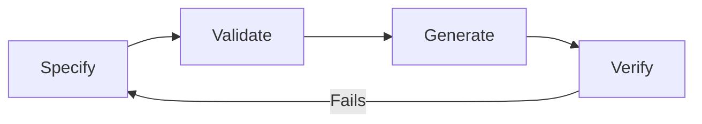

# 📜 Specification-Driven Development

  

---

## 🎯 1. Overview

In an agentic engineering organization, the specification is the primary artifact. Code is a derived output - generated from specs, validated against specs, and replaced when specs change. The engineer's role shifts from writing implementation code to defining precise, machine-readable specifications and verifying that generated output meets them.

This is not a theoretical shift. When AI agents can generate compliant code from a well-defined spec in minutes, the bottleneck moves from "how do I implement this?" to "how do I specify this correctly?" Engineers who master specification become force multipliers. Engineers who skip specification and jump to implementation create technical debt that no agent can untangle.

> **Rule:** Every new API, event schema, and infrastructure component must begin with a machine-readable specification before any implementation code is written.

---

## 📋 2. Types of Specifications

| Spec Type | Format | Purpose | Manifesto Reference |
|:----------|:-------|:--------|:--------------------|
| **API contracts** | OpenAPI 3.1 | Define REST endpoints, request/response schemas, error shapes, authentication | [API Standards](../02-architecture-and-api/02-api-standards.md) |
| **gRPC contracts** | Protocol Buffers (.proto) | Define service methods, message types, streaming patterns | [gRPC Standards](../02-architecture-and-api/05-grpc-standards.md) |
| **Event schemas** | AsyncAPI 3.0 + Avro | Define event topics, payload schemas, compatibility rules, partition keys | [Event Schema Evolution](../02-architecture-and-api/08-event-schema-evolution.md) |
| **Infrastructure** | Terraform / HCL | Define cloud resources, networking, permissions, and environment parity | [Cloud Architecture](../04-infrastructure-and-cloud/01-cloud-architecture.md) |
| **Database schemas** | SQL migrations (Flyway/Liquibase) | Define table structures, indexes, constraints, and migration sequences | [Database Migrations](../06-developer-guides/03-database-migrations.md) |
| **Test specifications** | Property-based test definitions | Define invariants and properties that must hold, not individual test cases | [Testing Pyramid](./01-testing-pyramid.md) |

---

## 🔄 3. The Spec-First Workflow

Every change follows a four-step cycle: specify, validate, generate, verify.

**Visual overview:**

### Step 1 - Specify

Write or update the machine-readable specification. This is the engineer's primary output.

- API changes start with an OpenAPI or proto file update
- Event changes start with an AsyncAPI or Avro schema update
- Infrastructure changes start with a Terraform module update
- The spec is committed and reviewed independently of any implementation

### Step 2 - Validate

Validate the specification before generating anything.

- **Schema validation** - the spec file is syntactically correct and conforms to its format standard
- **Compatibility check** - the change is backward-compatible (or follows the documented breaking change process)
- **Contract test** - the spec does not violate existing consumer contracts
- **CI gate** - spec validation runs as a required CI check. Specs that fail validation block the pipeline

### Step 3 - Generate

Generate implementation artifacts from the validated spec. This step is increasingly agent-driven.

- API server stubs and client SDKs generated from OpenAPI or proto files
- Event producer/consumer boilerplate generated from AsyncAPI schemas
- Infrastructure provisioned from Terraform plans
- Database migrations generated from schema diff tools
- Test scaffolds generated from property-based test definitions

### Step 4 - Verify

Verify that the generated (or hand-written) implementation conforms to the spec.

- Contract tests validate that the running service matches the spec
- Integration tests confirm cross-service behavior
- Property-based tests verify invariants hold across randomized inputs
- If verification fails, the fix goes back to Step 1 (update the spec) or Step 3 (fix the implementation)

---

## 🧑‍💻 4. How This Changes the Engineer's Role

| Traditional Role | Spec-Driven Role |
|:-----------------|:-----------------|
| Write implementation code line by line | Define specifications that constrain and guide code generation |
| Debug implementation logic | Debug spec ambiguity and contract violations |
| Manually keep docs in sync with code | Specs are the docs - generated docs are always in sync |
| Review code for correctness | Review specs for completeness and review generated code for compliance |
| Own the "how" (implementation details) | Own the "what" (contracts, invariants, boundaries) |

This does not eliminate the need for deep technical skills. Specifying a correct, backward-compatible, performant API contract requires the same architectural judgment as writing the implementation. The difference is that the specification captures that judgment in a reusable, machine-readable form.

---

## ⚠️ 5. Anti-Patterns

| Anti-Pattern | Why It Fails | Fix |
|:-------------|:-------------|:----|
| **Code-first, spec-later** | Specs written after implementation are documentation, not contracts. They drift immediately | Enforce spec-first in CI: block PRs that add endpoints without a corresponding spec update |
| **Specs without validation** | An unvalidated spec is a suggestion, not a contract. Generated code may diverge | Add spec linting and compatibility checks as required CI gates |
| **Over-specification** | Specifying internal implementation details (private methods, internal data structures) couples the spec to one implementation | Specs define boundaries (APIs, events, infra). Internal design remains the team's choice |
| **Ignoring generated code quality** | Treating generated code as untouchable black-box output | Generated code must pass the same linting, testing, and review standards as hand-written code |
| **Skipping property-based tests** | Relying only on example-based tests misses edge cases that agents introduce | Define properties and invariants. Let the test framework generate edge cases |

---

## 🔗 6. Cross-References

- [API Standards](../02-architecture-and-api/02-api-standards.md) - OpenAPI conventions, versioning, error shapes
- [gRPC Standards](../02-architecture-and-api/05-grpc-standards.md) - proto conventions and code generation
- [Event Schema Evolution](../02-architecture-and-api/08-event-schema-evolution.md) - Avro compatibility rules and the breaking change playbook
- [Context Engineering](../12-ai-engineering/01-context-engineering.md) - how specs feed into agent context for code generation
- [AI-Assisted SDLC](../12-ai-engineering/02-ai-assisted-sdlc.md) - where spec-driven development fits in the AI-assisted workflow

---

⬅️ [Back to section](./README.md) · 🏠 [Back to root](../README.md)

