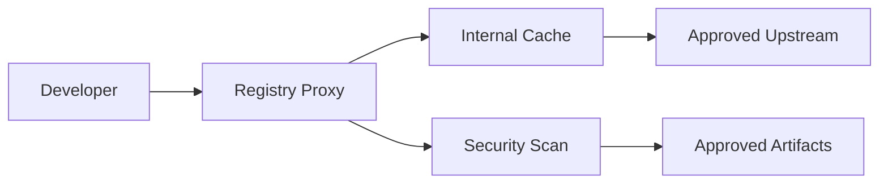

# 🔗 Supply Chain Security

  

---

## 🎯 1. Overview

Every dependency you add is code you trust but did not write. Supply chain attacks exploit this trust by compromising upstream packages, build tools, or registries. {Company} enforces strict dependency management, SBOM generation, and artifact verification to reduce this attack surface.

For CI pipeline security stages, see [CI Practices](./02-ci-practices.md). For container image policies, see [Security](../04-infrastructure-and-cloud/03-security.md).

---

## 📦 2. SBOM Generation

Every CI pipeline generates a Software Bill of Materials (SBOM) in CycloneDX format.

| Requirement | Standard |
|-------------|----------|
| **Format** | CycloneDX JSON (v1.5+) |
| **Generation point** | CI build stage, after dependency resolution |
| **Storage** | Immutable artifact store (S3 bucket with versioning) |
| **Retention** | Minimum 3 years |
| **Naming convention** | `{service-name}/{version}/sbom.cdx.json` |

### 2.1 SBOM Contents

| Field | Required | Source |
|-------|----------|--------|
| Component name and version | Yes | Build tool (Maven, npm, Go modules) |
| Package URL (purl) | Yes | Derived from package metadata |
| License | Yes | Detected by scanning tool |
| Hashes (SHA-256) | Yes | Computed during build |
| Supplier | Best effort | Package registry metadata |

---

## 🔍 3. Dependency Scanning

All repositories are scanned for known vulnerabilities in dependencies.

| Scanner | Scope | Trigger | Blocks PR? |
|---------|-------|---------|-----------|
| **Snyk Open Source** | Maven, npm, Go modules | Every PR + daily monitor | Yes (critical/high) |
| **Snyk Container** | Docker base images and OS packages | Every PR + weekly rescan | Yes (critical/high) |
| **OWASP Dependency-Check** | Known CVE database cross-reference | Weekly scheduled run | No (advisory) |

### 3.1 Vulnerability Response SLAs

| Severity | Remediation SLA | Escalation |
|----------|----------------|------------|
| Critical (CVSS 9.0+) | 48 hours | Security team + VP Engineering |
| High (CVSS 7.0 - 8.9) | 7 days | Security team lead |
| Medium (CVSS 4.0 - 6.9) | 30 days | Tracked in sprint |
| Low (CVSS 0.1 - 3.9) | 90 days | Backlog |

---

## ⚖️ 4. License Compliance

All dependencies must have a license compatible with {Company}'s approved license list.

| License Category | Status | Examples |
|-----------------|--------|----------|
| **Permissive** | Approved | MIT, Apache 2.0, BSD 2/3-Clause, ISC |
| **Weak copyleft** | Approved with review | LGPL, MPL 2.0 |
| **Strong copyleft** | Prohibited for linked code | GPL, AGPL |
| **No license** | Prohibited | Unlicensed packages |
| **Unknown** | Blocked until classified | Unrecognized license text |

License checks run in CI. A PR that introduces a prohibited or unknown license is blocked until resolved.

---

## 🏛️ 5. Trusted Registries

All production dependencies must originate from approved registries. Direct downloads from arbitrary URLs are prohibited.

**Visual overview:**

| Ecosystem | Approved Registry | Proxy |
|-----------|------------------|-------|
| **Java (Maven)** | Maven Central | Artifactory / Nexus |
| **Node (npm)** | npmjs.com | Artifactory / Nexus |
| **Go** | proxy.golang.org | Go module proxy |
| **Python (pip)** | pypi.org | Artifactory / Nexus |
| **Container images** | {Company} ECR | ECR pull-through cache |

### 5.1 New Dependency Approval

Adding a new direct dependency requires:

1. Verify the package is actively maintained (commit activity in last 6 months)
2. Check for known vulnerabilities (Snyk scan passes)
3. Verify license compatibility (approved category)
4. Review download/star count for ecosystem trust signals
5. For security-sensitive libraries (crypto, auth), security team review is required

---

## 📌 6. Version Pinning

| Artifact Type | Pinning Requirement | Example |
|--------------|-------------------|---------|
| **Maven dependencies** | Exact version in BOM | `<version>3.2.1</version>` |
| **npm dependencies** | Exact version (no ranges) | `"lodash": "4.17.21"` |
| **Go modules** | go.sum integrity verification | Automatic |
| **Docker base images** | Pin to digest | `amazoncorretto@sha256:abc123...` |
| **GitHub Actions** | Pin to commit SHA | `uses: actions/checkout@a1b2c3d` |
| **Terraform providers** | Exact version constraint | `version = "= 5.30.0"` |

Floating version ranges (`^`, `~`, `>=`) are prohibited in production dependency files. Lock files (`package-lock.json`, `go.sum`) must be committed to the repository.

---

## 🤖 7. Automated Dependency Updates

{Company} uses automated tooling to keep dependencies current.

| Tool | Scope | Frequency | Auto-merge? |
|------|-------|-----------|-------------|
| **Renovate** | All dependency types | Daily check | Patch versions only (if tests pass) |
| **Dependabot** | GitHub-native security alerts | Real-time | No (PR created for review) |

### 7.1 Update Rules

| Update Type | Process |
|-------------|---------|
| **Patch version** | Auto-merged if all CI checks pass |
| **Minor version** | PR created, reviewed by owning team within 1 week |
| **Major version** | PR created, requires explicit team review and testing |
| **Security patch** | Follows vulnerability SLA (bypasses normal cadence) |

---

⬅️ [Back to section](./README.md) · 🏠 [Back to root](../README.md)

