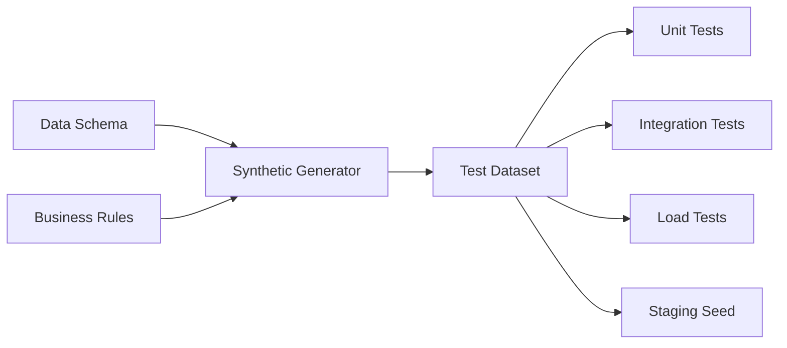

# 🧪 Test Data Management

  

---

## 🎯 1. Overview

Test environments that use stale, incomplete, or production-copied data produce unreliable results and create compliance risk. Every test environment must use purpose-built test data that is realistic enough to catch bugs but never contains real user information.

> **Rule:** Production data must never be copied directly into non-production environments. All test data must be synthetically generated or fully anonymized before use.

Good test data management reduces flaky tests, eliminates PII exposure in lower environments, and ensures that what you test is representative of what you ship.

---

## 📐 2. Test Data Strategies

Choose the right strategy based on the testing scenario:

| Strategy | Use Case | Tradeoff |
|----------|----------|----------|
| **Synthetic generation** | Unit tests, integration tests, load tests | Full control, no PII risk, may miss edge cases |
| **Anonymized subsets** | Staging, E2E tests | Realistic distributions, requires anonymization pipeline |
| **Fixture libraries** | Contract tests, schema validation | Fast, deterministic, limited coverage |
| **Seed scripts** | Local development, CI environments | Reproducible, version-controlled |

> **Rule:** Every service must provide a seed script that populates its local development environment with representative test data. This script must be version-controlled alongside the service code.

---

## 🔄 3. Synthetic Data Generation

Synthetic data is the preferred approach for most testing scenarios. It provides realistic data distributions without any connection to real users.

**Visual overview:**

**Requirements for synthetic generators:**

- Output must match production schema exactly (types, constraints, nullable fields)
- Generators must produce deterministic output given the same seed value
- Generators must support configurable volume (10 records for unit tests, 1M for load tests)
- Generators must be owned and maintained by the service team

---

## 🛡️ 4. PII Masking and Anonymization

When anonymized production subsets are used (staging or E2E only), the anonymization pipeline must apply the following transformations:

| Data Type | Masking Technique | Example |
|-----------|-------------------|---------|
| Names | Faker-generated replacement | "John Smith" -> "Alex Rivera" |
| Email | Domain replacement | "user@real.com" -> "user-3fa8@test.{company}.com" |
| Phone | Format-preserving randomization | "+1-555-0100" through "+1-555-0199" |
| Addresses | Synthetic address generation | Full replacement with valid-format fake data |
| Financial | Token replacement | Card numbers replaced with test tokens |
| Location | Coordinate jittering (500m radius) | Lat/lng shifted randomly |

> **Rule:** Anonymization must be irreversible. It must be impossible to derive original values from anonymized output. Hash-based pseudonymization alone is not sufficient - use replacement, not hashing.

---

## 🏗️ 5. Data Subset Creation

Full production-scale datasets are unnecessary for most test scenarios. Subset creation extracts a referentially-intact slice of data.

**Subset requirements:**

1. **Referential integrity** - All foreign key relationships must be preserved in the subset
2. **Edge case inclusion** - Subsets must include known edge cases (null values, maximum-length strings, boundary dates)
3. **Volume targets** - Subsets target 0.1% to 1% of production volume, configurable per environment
4. **Freshness** - Subsets are regenerated weekly via automated pipeline

---

## 🔗 6. Environment Parity

Test data must reflect the shape and constraints of production data. Environment parity failures are a leading cause of bugs that pass staging but fail in production.

| Dimension | Requirement |
|-----------|-------------|
| Schema version | Test data matches the deployed schema version |
| Data distributions | Statistical distributions approximate production (not uniform random) |
| Timezone coverage | Test data includes multiple timezones if production does |
| Localization | Test data includes multi-language and multi-currency records |
| Volume ratios | Relative table sizes reflect production ratios |

---

## 🔗 7. Cross-References

- [Privacy Engineering](../04-infrastructure-and-cloud/08-privacy-engineering.md) - Data classification, PII handling, anonymization standards

---

⬅️ [Back to section](./README.md) · 🏠 [Back to root](../README.md)

