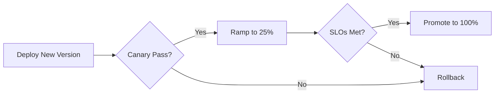

# 🚀 Progressive Delivery

  

---

## 🎯 1. Overview

Shipping code to production does not mean shipping code to users. Progressive delivery decouples deployment from release by gradually exposing changes to increasing percentages of traffic. If something goes wrong, you roll back before most users are affected.

> **Rule:** All production deployments of user-facing services must use at least one progressive delivery technique. Big-bang releases to 100% of traffic are prohibited.

---

## 📐 2. Strategy Selection

Choose the strategy based on risk, blast radius, and infrastructure support.

| Strategy | Risk level | Blast radius | Best for |
|----------|-----------|--------------|----------|
| **Canary** | Low | 1 - 5% of traffic | API changes, backend logic |
| **Blue-green** | Low | Instant cutover | Infrastructure changes, database migrations |
| **Feature flags** | Very low | Per-user or per-segment | UI features, experiments |
| **Shadow (dark launch)** | None | 0% (read-only fork) | Performance validation, ML model comparison |
| **Traffic splitting** | Medium | Configurable % | A/B testing, gradual rollout |

**Visual overview:**

---

## 🐤 3. Canary Deployments

Canary deployments route a small percentage of production traffic to the new version while the majority continues hitting the stable version.

### 3.1 Canary Stages

| Stage | Traffic % | Duration | Promotion criteria |
|-------|----------|----------|-------------------|
| **Stage 1** | 1% | 10 minutes | Error rate < 0.1%, p99 latency within SLO |
| **Stage 2** | 5% | 15 minutes | Same criteria + no alert fires |
| **Stage 3** | 25% | 30 minutes | Same criteria + business metrics stable |
| **Stage 4** | 100% | Promoted | Old version drained and terminated |

### 3.2 Automatic Rollback Triggers

| Signal | Threshold | Action |
|--------|-----------|--------|
| Error rate | > 1% for 2 minutes | Automatic rollback |
| p99 latency | > 2x baseline for 5 minutes | Automatic rollback |
| Crash loop | Any pod in CrashLoopBackOff | Automatic rollback |
| Alert fires | Any SEV-1 or SEV-2 alert | Automatic rollback |

> **Rule:** Canary analysis must be automated. Manual "looks good to me" promotion is not acceptable for canary stages 1 and 2.

---

## 🔵 4. Blue-Green Deployments

Blue-green maintains two identical production environments. Traffic switches from blue (current) to green (new) at the load balancer.

| Phase | Blue (current) | Green (new) |
|-------|---------------|-------------|
| **Pre-switch** | Serving 100% traffic | Deployed, smoke-tested, idle |
| **Switch** | Draining connections | Receiving 100% traffic |
| **Post-switch** | Standby (rollback target) | Active |
| **Cleanup** | Terminated after 24h stability | Becomes the new "blue" |

> **Rule:** The previous version must remain deployed and ready for instant rollback for at least 24 hours after a blue-green switch.

---

## 🌑 5. Shadow and Dark Launch

Shadow traffic duplicates production requests to the new version without affecting user responses. The shadow version processes requests but its responses are discarded. Implementation uses Envoy request mirroring at the service mesh layer.

> **Rule:** Shadow deployments must never write to production databases or trigger external side effects (emails, payments, webhooks).

---

## 📏 6. Rollback Criteria

Every deployment must define rollback criteria before it ships. This is not optional.

| Category | Metric | Rollback if |
|----------|--------|-------------|
| **Availability** | Success rate | Drops below SLO for 2 minutes |
| **Latency** | p99 response time | Exceeds 2x baseline |
| **Business** | Conversion rate, order rate | Drops > 5% vs control |
| **Errors** | New error types | Any new unhandled exception type |
| **Infrastructure** | CPU, memory | Sustained > 85% utilization |

### 6.1 Rollback Process

1. **Automatic:** The deployment controller detects SLO violation and reverts traffic
2. **Manual override:** On-call engineer triggers rollback via `kubectl rollout undo` or the deployment dashboard
3. **Post-rollback:** Incident ticket created, deployment is blocked until the root cause is fixed

---

## ⚠️ 7. Anti-Patterns

| Anti-pattern | Problem | Fix |
|-------------|---------|-----|
| **Ship to 100% immediately** | Maximum blast radius on failure | Use canary or blue-green |
| **Manual canary promotion** | Slow, error-prone, skipped on Fridays | Automate canary analysis |
| **No rollback plan** | Panic when metrics degrade | Define rollback criteria before deploy |
| **Shadow writes to prod** | Data corruption from duplicated side effects | Ensure shadow mode is read-only |
| **Canary without metrics** | Cannot detect regressions | Instrument canary with same metrics as prod |

---

## 🔗 8. Cross-References

- [CD Practices](./03-cd-practices.md) - Deployment pipeline stages that trigger progressive delivery
- [A/B Testing](./07-ab-testing.md) - Experimentation framework that uses traffic splitting

---

⬅️ [Back to section](./README.md) · 🏠 [Back to root](../README.md)

