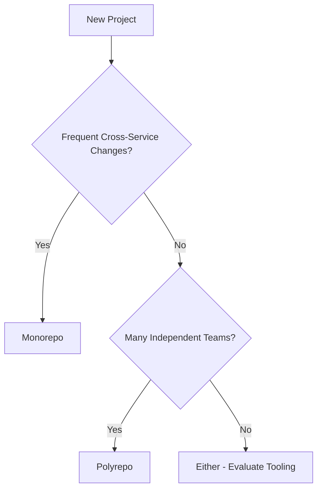

# 🗂️ Monorepo vs Polyrepo Strategy

  

---

## 🎯 1. Overview

The choice between a monorepo (all code in one repository) and polyrepo (one repository per service or library) affects developer experience, CI speed, dependency management, and team autonomy. There is no universally correct answer - the right choice depends on team structure, codebase size, and operational maturity.

> **Rule:** New projects must select a repository strategy using the decision framework in Section 3 and document the decision in an ADR. Changing strategy later is expensive - choose deliberately.

---

## 📐 2. Strategy Comparison

| Dimension | Monorepo | Polyrepo |
|-----------|----------|----------|
| **Atomic cross-service changes** | Single PR changes multiple services | Requires coordinated PRs across repos |
| **Code sharing** | Direct imports; always latest | Published packages; explicit versioning |
| **CI/CD complexity** | Needs affected-target detection | Each repo has a simple pipeline |
| **Dependency management** | Single lockfile; all services on same version | Each repo pins its own versions |
| **Team autonomy** | Shared rules, shared CI | Teams own their repo, tooling, and cadence |
| **Onboarding** | One clone, full context | Clone only what you need |
| **Git performance** | Degrades at scale without tooling | Always fast (small repos) |
| **Code review** | Cross-team visibility is easy | Cross-team changes require multi-repo PRs |

---

## 🧭 3. Decision Framework

Score each criterion for your situation. The total guides your choice.

| # | Criterion | Monorepo (0 pts) | Polyrepo (1 pt) |
|---|-----------|------------------|-----------------|
| 1 | Team count | < 5 teams | 5+ independent teams |
| 2 | Cross-service changes | Frequent (weekly) | Rare (monthly or less) |
| 3 | Shared libraries | Heavily shared codebase | Few shared dependencies |
| 4 | Deployment coupling | Services often deploy together | Services deploy independently |
| 5 | Tooling maturity | Team can invest in build tooling | Team needs simple, standard CI |
| 6 | Language diversity | Single language or two | Three or more languages |

| Score | Recommendation |
|-------|----------------|
| 0 - 2 | **Monorepo.** High code sharing and frequent cross-service changes justify the tooling investment. |
| 3 - 4 | **Either.** Evaluate tooling readiness. Monorepo with good tooling, or polyrepo with a shared library registry. |
| 5 - 6 | **Polyrepo.** Independent teams, diverse stacks, and rare cross-cutting changes favor per-service repos. |

**Visual overview:**

---

## 🏗️ 4. Monorepo Tooling

A monorepo without proper tooling is a slow, painful experience. These tools are mandatory if you choose monorepo.

| Concern | Tool | Purpose |
|---------|------|---------|
| **Build system** | Bazel, Nx, Turborepo | Affected-target detection, incremental builds |
| **CI optimization** | Custom or tool-native | Only build/test what changed |
| **Code ownership** | CODEOWNERS file | Per-directory ownership for review routing |
| **Virtual filesystem** | Git sparse checkout | Clone only relevant directories |
| **Dependency graph** | Build tool dependency analysis | Visualize and enforce module boundaries |

---

## 📦 5. Polyrepo Tooling

| Concern | Tool | Purpose |
|---------|------|---------|
| **Package registry** | Artifactory, npm registry, Maven Central | Publish and consume shared libraries |
| **Template repos** | GitHub template repositories | Consistent project scaffolding |
| **Dependency updates** | Renovate, Dependabot | Automated version bumps across repos |
| **Standards enforcement** | Shared CI actions, pre-commit hooks | Consistent linting, testing, and formatting |

---

## 🔄 6. Migration Paths

| Direction | Key steps |
|-----------|----------|
| **Polyrepo to monorepo** | Configure build tooling, move repos via `git subtree add`, update CI for affected-target detection |
| **Monorepo to polyrepo** | Extract via `git filter-repo`, publish shared code as packages, set up Renovate for dependency updates |

> **Rule:** Repository migrations must be incremental. Big-bang migrations that move everything at once create a high-risk cutover with no rollback path.

---

## ⚠️ 7. Anti-Patterns

| Anti-pattern | Problem | Fix |
|-------------|---------|-----|
| **Monorepo without build tooling** | Every PR triggers full CI; builds take 30+ minutes | Invest in Bazel, Nx, or Turborepo |
| **Polyrepo with tight coupling** | Services cannot deploy without coordinating across repos | Move tightly coupled services into a monorepo |
| **Shared libraries via Git submodules** | Complex, fragile, confusing for developers | Publish libraries as versioned packages |
| **Copy-paste instead of sharing** | Code duplication across repos diverges over time | Extract shared code into a library |
| **No CODEOWNERS** | PRs sit unreviewed; wrong people approve | Define per-directory owners |

---

## 🔗 8. Cross-References

- [Git Workflow](./05-git-workflow.md) - Branching strategy that applies to both monorepo and polyrepo
- [CI Practices](./02-ci-practices.md) - CI pipeline standards for all repository types
- [Code Review Guide](./06-code-review-guide.md) - Review process including CODEOWNERS routing

---

⬅️ [Back to section](./README.md) · 🏠 [Back to root](../README.md)

