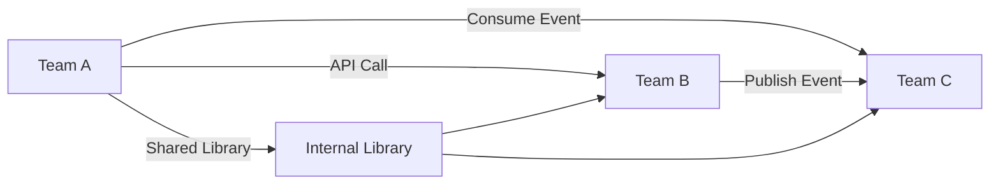

# 🤝 Cross-Team Dependency Management

  

---

## 🎯 1. Overview

When teams depend on each other's APIs, libraries, or data, uncoordinated changes break things. Cross-team dependencies are inevitable in a microservices architecture - the goal is not to eliminate them but to manage them through explicit contracts, clear communication, and automated compatibility checks.

> **Rule:** Any change that affects a consumer in another team must go through the breaking change governance process. Surprise breakages across team boundaries are treated as incidents.

---

## 📐 2. Dependency Types

| Type | Example | Risk | Governance |
|------|---------|------|-----------|
| **API dependency** | Team A calls Team B's REST/gRPC API | Breaking API changes strand consumers | Contract tests + versioning |
| **Event dependency** | Team A consumes events published by Team B | Schema changes break consumers | Schema registry + compatibility checks |
| **Library dependency** | Teams share an internal library | Incompatible version upgrades | Semantic versioning + automated updates |
| **Data dependency** | Team A reads Team B's database (anti-pattern) | Schema changes break queries | Eliminate via API or event |
| **Platform dependency** | All teams depend on shared infrastructure | Platform changes affect everyone | Platform SLOs + change windows |

**Visual overview:**

---

## 📝 3. Interface Contracts

Every cross-team dependency must have an explicit contract. Implicit dependencies - where one team "just knows" how another team's system works - are prohibited.

| Contract type | Format | Verification |
|--------------|--------|-------------|
| **REST API** | OpenAPI 3.1 specification | Consumer-driven contract tests (Pact) |
| **gRPC API** | Protobuf definition files | `buf breaking` compatibility check |
| **Events** | Avro/Protobuf schema in registry | Schema compatibility mode (BACKWARD) |
| **Shared library** | Semantic version + changelog | Automated dependency updates (Renovate) |

> **Rule:** If there is no machine-verifiable contract, the dependency does not exist as far as governance is concerned. Document it or it will break silently.

---

## 🚫 4. Breaking Change Governance

A breaking change is any change to a published interface that can cause a correctly-written consumer to fail.

### 4.1 Process

| Step | Owner | Timeline |
|------|-------|----------|
| **1. Announce** | Producer team | Post in #api-changes and email affected teams |
| **2. Impact assessment** | Producer + consumers | Identify all affected consumers and estimate migration effort |
| **3. Migration guide** | Producer team | Publish step-by-step migration instructions |
| **4. Migration window** | All teams | 30 days for internal APIs; 90 days for public APIs |
| **5. Sunset** | Producer team | Remove old version only after all consumers have migrated |

### 4.2 Escalation

| Scenario | Escalation path |
|----------|----------------|
| Consumer cannot migrate within the window | Producer and consumer leads negotiate an extension |
| Producer ships a breaking change without notice | Treated as a SEV-2 incident; producer team owns the remediation |
| Disagreement on whether a change is breaking | Architecture Review Board makes the final call |

---

## 🔄 5. API Compatibility Standards

| Change | Backward-compatible? | Action required |
|--------|---------------------|----------------|
| Add optional field to request | Yes | No governance needed |
| Add field to response | Yes | No governance needed |
| Remove field from response | No | Full breaking change process |
| Change field type | No | Full breaking change process |
| Add required field to request | No | Full breaking change process |
| Change error code for existing scenario | No | Full breaking change process |
| Add new endpoint | Yes | No governance needed |
| Remove endpoint | No | Full breaking change process |

---

## 📊 6. Dependency Tracking

{Company} tracks cross-team dependencies in the service catalog (Backstage). Every service must declare what it depends on, what consumes it, contract locations, SLOs, and escalation contacts.

> **Rule:** Undeclared dependencies discovered during an incident are added to the catalog as part of the post-incident review. Every dependency must be visible.

---

## 🛡️ 7. Reducing Dependency Risk

Key strategies: consumer-driven contracts (catch breaks in CI), event-driven decoupling (replace sync calls with async events), API versioning (coexist during migration), automated dependency updates (Renovate PRs), and dependency budgets (track and reduce cross-team dependencies).

---

## ⚠️ 8. Anti-Patterns

| Anti-pattern | Problem | Fix |
|-------------|---------|-----|
| **Shared database** | Any schema change can break other teams | Expose data via APIs or events |
| **Undocumented dependency** | Nobody knows it exists until it breaks | Register all dependencies in Backstage |
| **Surprise breaking changes** | Consumer discovers breakage in production | Enforce contract tests and governance process |
| **Chatty cross-team calls** | Service A makes 50 API calls to Service B per request | Aggregate into batch endpoints or events |
| **Circular dependencies** | Team A depends on B, B depends on A | Extract shared logic into a new service or library |

---

## 🔗 9. Cross-References

- [Code Review Guide](./06-code-review-guide.md) - Review requirements for cross-team interface changes
- [Deprecation Lifecycle](./08-deprecation-lifecycle.md) - Deprecation timelines for internal and public APIs

---

⬅️ [Back to section](./README.md) · 🏠 [Back to root](../README.md)

