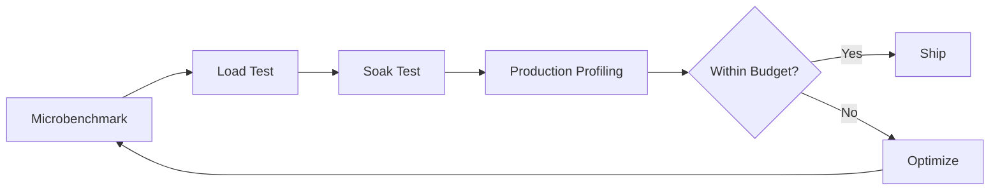

# ⚡ Performance Engineering

  

---

## 🎯 1. Overview

Performance is a feature, not an afterthought. Every service at {Company} must define, measure, and enforce performance budgets. Performance regressions caught in production are 10x more expensive to fix than those caught in CI. This guide establishes the framework for performance engineering across backend services.

> **Rule:** Every service must define latency and throughput budgets. CI pipelines must fail when budgets are exceeded.

---

## 📐 2. Performance Budget Framework

A performance budget is a quantitative limit on how slow or resource-intensive a service or endpoint is allowed to be.

| Budget Type | Metric | Example Target |
|-------------|--------|----------------|
| **Latency** | p50, p95, p99 response time | p95 < 200ms, p99 < 500ms |
| **Throughput** | Requests per second at target latency | 1,000 RPS at p95 < 200ms |
| **Resource** | CPU and memory per request | < 50ms CPU time, < 128MB heap per request |
| **Payload** | Response body size | < 100KB for API responses |
| **Database** | Query execution time | p95 < 50ms per query |
| **Startup** | Service cold start time | < 15 seconds to healthy |

### 2.1 Budget Definition

Every service must document budgets in its `service.yaml` or Backstage catalog entry:

```yaml
performance:
  latency:
    p95: 200ms
    p99: 500ms
  throughput:
    target_rps: 1000
  startup:
    max_seconds: 15
```

---

## 🧪 3. Performance Testing Strategy

**Visual overview:**



| Test Type | When | Tool | Duration |
|-----------|------|------|----------|
| **Microbenchmark** | PR pipeline | JMH (JVM), benchmark.js (Node) | < 2 min |
| **Load test** | Nightly or pre-release | k6, Gatling, or Locust | 10 - 30 min |
| **Soak test** | Weekly or pre-major release | k6 extended run | 2 - 4 hours |
| **Chaos + load** | Monthly game day | k6 + Litmus or Gremlin | 1 - 2 hours |
| **Production profiling** | Continuous | Async profiler, continuous profiling agent | Always on |

---

## 📊 4. Backend Budgets by Service Tier

| Tier | Description | p95 Latency | p99 Latency | Availability |
|------|-------------|-------------|-------------|--------------|
| **Tier 0** | Critical path, user-facing | < 100ms | < 250ms | 99.99% |
| **Tier 1** | User-facing, non-critical path | < 200ms | < 500ms | 99.95% |
| **Tier 2** | Internal, synchronous | < 500ms | < 1s | 99.9% |
| **Tier 3** | Async, batch, background | < 5s | < 30s | 99.5% |

---

## 🔧 5. Optimization Patterns

| Pattern | Problem It Solves | When to Use |
|---------|-------------------|-------------|
| **Connection pooling** | Database connection overhead | Always - default in golden path |
| **Response compression** | Large payload transfer time | API responses > 1KB |
| **Query optimization** | Slow database queries | When query p95 > 50ms |
| **Caching** | Repeated expensive computations | Read-heavy endpoints with stable data |
| **Async processing** | Long-running operations blocking requests | Any operation > 500ms |
| **Pagination** | Unbounded result sets | All list endpoints |
| **Circuit breaking** | Cascading failures from slow dependencies | All external service calls |

---

## 📋 6. CI Integration

Performance checks must be integrated into the CI pipeline:

| Check | Gate Type | Failure Action |
|-------|-----------|----------------|
| Microbenchmark regression > 10% | Hard gate | PR blocked |
| Load test p95 exceeds budget | Hard gate | Release blocked |
| Startup time exceeds budget | Soft gate | Warning + ticket |
| Payload size exceeds budget | Hard gate | PR blocked |
| N+1 query detection | Hard gate | PR blocked |

---

## ⚠️ 7. Anti-Patterns

| Anti-Pattern | Problem | Fix |
|-------------|---------|-----|
| No performance budget | Regressions go unnoticed until users complain | Define budgets in service.yaml |
| Load testing only before launch | Performance drifts over time | Nightly load tests in CI |
| Optimizing without profiling | Wasted effort on non-bottlenecks | Profile first, optimize second |
| Unbounded queries | Single query can exhaust database connections | Enforce pagination and query timeouts |
| Ignoring cold start | First requests after deploy are slow | Warm-up endpoints, readiness probes |

---
<div align="center">

⬅️ [Back to section](./README.md) · 🏠 [Back to root](../README.md)

</div>
