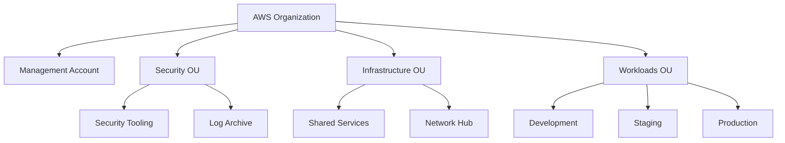

# ☁️ Cloud Architecture

  

---

## 🎯 1. Overview

This document describes the target deployment architecture - network topology, compute layout, data tier placement, and disaster recovery posture.

> **Principles (cloud-agnostic):** Patterns such as multi-AZ resilience, private network isolation, managed Kubernetes, infrastructure as code, and GitOps apply on any major cloud provider. **AWS is {Company}'s reference implementation** for the concrete services below; preserve the same security and reliability outcomes if you substitute regional equivalents.

| Platform capability | AWS (reference) | Examples elsewhere |
|---------------------|-----------------|---------------------|
| Container orchestration | Amazon EKS | Google GKE, Azure AKS |
| Relational database | Aurora PostgreSQL | Cloud SQL / AlloyDB, Azure Database for PostgreSQL |
| In-memory cache | ElastiCache (Redis) | Memorystore, Azure Cache for Redis |
| Event streaming | Amazon MSK | Managed Kafka (e.g., Confluent Cloud, Aiven), Google Pub/Sub, Azure Event Hubs |
| Edge TLS and APIs | CloudFront, API Gateway | Cloud CDN + API Gateway, Azure Front Door + API Management |
| Object storage and IaC state | S3, DynamoDB (locks) | Cloud Storage + Firestore, Blob Storage + Cosmos DB |

{Company} runs production on the AWS reference stack: compute on **Amazon EKS**, infrastructure in **Terraform**. Nothing is provisioned by hand.

> **From Section 2 onward:** Detailed account layout, subnets, and service names are the **reference implementation (AWS)**.

---

## ☁️ 2. AWS Account Structure

We use a **multi-account strategy** following AWS Organizations best practices:

```
AWS Organization (Root)
│
├── Management Account         (billing, org policies only - no workloads)
│
├── Security OU
│   ├── Security Tooling       (GuardDuty, SecurityHub, CloudTrail aggregation)
│   └── Log Archive            (centralized CloudTrail, S3 access logs)
│
├── Infrastructure OU
│   ├── Shared Services        (ECR, Artifactory, internal DNS, Vault)
│   └── Network Hub            (Transit Gateway, VPN, Direct Connect)
│
└── Workloads OU
    ├── Development            (dev environment)
    ├── Staging                (staging + QA environment)
    └── Production             (live traffic)
```

**Visual overview:**



### 2.1 Account Rules

- Production account has **no developer access** by default - only CI/CD pipelines and on-call engineers via break-glass access (with full audit trail)
- All accounts are enrolled in **AWS Config**, **CloudTrail**, and **GuardDuty**
- SCPs (Service Control Policies) prevent disabling security services in any account
- Root account MFA is mandatory; root account credentials are in a sealed vault

---

## ☁️ 3. Network Architecture

### 3.1 VPC Design (Per Environment)

Each environment account has a single VPC with the following subnet structure:

```
VPC: 10.{env}.0.0/16
│
├── Public Subnets (one per AZ)
│   ├── 10.{env}.0.0/24    (AZ-a) - ALB, NAT Gateway only
│   ├── 10.{env}.1.0/24    (AZ-b)
│   └── 10.{env}.2.0/24    (AZ-c)
│
├── Private Subnets - Application (one per AZ)
│   ├── 10.{env}.10.0/24   (AZ-a) - EKS worker nodes
│   ├── 10.{env}.11.0/24   (AZ-b)
│   └── 10.{env}.12.0/24   (AZ-c)
│
└── Private Subnets - Data (one per AZ)
    ├── 10.{env}.20.0/24   (AZ-a) - RDS, ElastiCache, MSK
    ├── 10.{env}.21.0/24   (AZ-b)
    └── 10.{env}.22.0/24   (AZ-c)
```

### 3.2 Traffic Flow

```
Internet
    │
    ▼
┌─────────────────────────────────┐
│  AWS WAF + AWS Shield           │ (DDoS protection, rate limiting)
└────────────────┬────────────────┘
                 │
┌────────────────▼────────────────┐
│  Amazon CloudFront              │ (CDN, TLS termination for public APIs)
└────────────────┬────────────────┘
                 │
┌────────────────▼────────────────┐
│  Amazon API Gateway             │ (External API management, auth)
└────────────────┬────────────────┘
                 │ (private subnet)
┌────────────────▼────────────────┐
│  Application Load Balancer      │ (per BFF service)
│  (internal, private subnet)     │
└────────────────┬────────────────┘
                 │
┌────────────────▼────────────────┐
│  EKS - Application Pods         │ (private application subnet)
│  (Istio service mesh)           │
└────────────────┬────────────────┘
                 │
┌────────────────▼────────────────┐
│  Data Tier                      │ (private data subnet)
│  RDS Aurora / ElastiCache / MSK │
└─────────────────────────────────┘
```

### 3.3 Security Groups

- All inbound traffic to EKS worker nodes is denied by default
- Only the ALB security group can reach pod ports
- Pods can only reach their own data store's security group
- No security group has a `0.0.0.0/0` inbound rule (WAF enforces this via SCP)

### 3.4 NAT Gateway

- One NAT Gateway per AZ (3 total per environment) for high availability
- All outbound internet traffic from pods routes through NAT Gateways
- Egress-only; no inbound from internet to private subnets

---

## ☁️ 4. Compute - Amazon EKS

### 4.1 Cluster Architecture

| Component | Decision |
|-----------|----------|
| EKS version | Latest N-1 (updated quarterly) |
| Node type | EC2 managed node groups (not Fargate) |
| Node OS | Bottlerocket (minimal, security-hardened) |
| CNI | AWS VPC CNI |
| Node sizing | `m6i.2xlarge` (default) + `r6i.4xlarge` (memory-intensive) |
| Cluster autoscaler | Karpenter (replaces cluster autoscaler) |

### 4.2 Cluster Per Environment

| Environment | Cluster | Namespaces |
|-------------|---------|------------|
| Dev | `platform-dev` | One namespace per service: `orders-dev`, `fulfillment-dev`, etc. |
| Staging | `platform-staging` | One namespace per service |
| Production | `platform-prod` | One namespace per service |

### 4.3 Namespace Standards

Every service namespace has:
- **Resource quotas** - CPU and memory limits enforced
- **Network policies** - deny all by default; explicit allow rules for each service-to-service path
- **Pod security standards** - `restricted` profile (no root, no privilege escalation)

### 4.4 Workload Standards

Every Kubernetes Deployment must have:

```yaml
spec:
  replicas: 3                        # Minimum for production
  strategy:
    type: RollingUpdate
    rollingUpdate:
      maxSurge: 1
      maxUnavailable: 0              # Zero-downtime deployments
  template:
    spec:
      affinity:
        podAntiAffinity:             # Spread across AZs
          requiredDuringSchedulingIgnoredDuringExecution:
          - topologyKey: "topology.kubernetes.io/zone"
      containers:
      - resources:
          requests:                  # Always set - required for scheduling
            cpu: "250m"
            memory: "512Mi"
          limits:
            cpu: "1000m"
            memory: "1Gi"
        readinessProbe:              # Required
          httpGet:
            path: /actuator/health/readiness
            port: 8080
          initialDelaySeconds: 20
          periodSeconds: 10
        livenessProbe:               # Required
          httpGet:
            path: /actuator/health/liveness
            port: 8080
          initialDelaySeconds: 30
          periodSeconds: 15
        securityContext:             # Required
          runAsNonRoot: true
          allowPrivilegeEscalation: false
          readOnlyRootFilesystem: true
```

### 4.5 Horizontal Pod Autoscaling

All production services must have an HPA configured:

```yaml
apiVersion: autoscaling/v2
kind: HorizontalPodAutoscaler
spec:
  minReplicas: 3
  maxReplicas: 50
  metrics:
  - type: Resource
    resource:
      name: cpu
      target:
        type: Utilization
        averageUtilization: 60
  - type: Pods
    pods:
      metric:
        name: kafka_consumer_lag     # Custom metric for Kafka consumers
      target:
        type: AverageValue
        averageValue: "1000"
```

---

## ☁️ 5. Data Tier Architecture

### 5.1 Amazon Aurora PostgreSQL

| Setting | Value |
|---------|-------|
| Engine | Aurora PostgreSQL 15 |
| Instance class | `db.r6g.2xlarge` (production) |
| Multi-AZ | Yes - writer + 2 readers |
| Failover | Automatic, < 30 seconds |
| Encryption | AES-256 at rest, TLS in transit |
| Backup | Continuous backups, 35-day retention |
| Deletion protection | Enabled (production) |
| Performance Insights | Enabled |
| Parameter group | Custom - `max_connections`, `shared_buffers` tuned per service |

### 5.2 Amazon ElastiCache for Redis

| Setting | Value |
|---------|-------|
| Engine | Redis 7 |
| Mode | Cluster mode enabled |
| Node type | `cache.r6g.large` (production) |
| Shards | 3 minimum |
| Replicas per shard | 2 |
| Encryption | At rest and in transit |
| Eviction policy | `allkeys-lru` for cache; `noeviction` for session data |

### 5.3 Amazon MSK (Kafka)

| Setting | Value |
|---------|-------|
| Kafka version | 3.5+ |
| Broker instance | `kafka.m5.2xlarge` |
| Brokers per AZ | 1 per AZ (3 total minimum) |
| Replication factor | 3 |
| Minimum in-sync replicas | 2 |
| Encryption | TLS in transit, at rest |
| Monitoring | Amazon MSK + Prometheus JMX exporter |

---

## ☁️ 6. Infrastructure as Code

### 6.1 Repository Structure

```
platform-infrastructure/
├── modules/                  # Reusable Terraform modules
│   ├── eks-cluster/
│   ├── rds-aurora/
│   ├── elasticache/
│   ├── msk/
│   ├── vpc/
│   └── iam-irsa/
├── environments/
│   ├── dev/
│   │   ├── main.tf
│   │   ├── variables.tf
│   │   └── terraform.tfvars
│   ├── staging/
│   └── production/
└── global/                   # Account-level resources (IAM, Route53 zones)
```

### 6.2 Terraform Standards

- **State:** S3 bucket + DynamoDB lock table, per environment
- **Versioning:** Pin all providers and modules with exact versions
- **Formatting:** `terraform fmt` enforced in CI
- **Validation:** `terraform validate` in CI
- **Security scan:** `tfsec` + `checkov` in CI
- **Plan review:** `terraform plan` output posted to PR as a comment; apply requires approval for staging/prod
- **Modules:** All modules version-tagged; services reference a version, not `latest`

### 6.3 Tagging Policy (Mandatory on All Resources)

```hcl
tags = {
  Environment   = "production"
  Service       = "orders-service"
  Team          = "orders"
  CostCenter    = "engineering-orders"
  ManagedBy     = "terraform"
  Repository    = "platform-infrastructure"
}
```

Non-tagged resources trigger a Config compliance alert.

---

## 🔥 7. Multi-Region & Disaster Recovery

### 7.1 Current Posture: Active-Passive

| Region | Role |
|--------|------|
| `eu-west-1` (Ireland) | Primary - active traffic |
| `eu-central-1` (Frankfurt) | Secondary - warm standby |

### 7.2 RTO / RPO by Service Tier

| Tier | Examples | RTO | RPO |
|------|---------|-----|-----|
| **Tier 1 - Critical** | Orders, Fulfillment, Payments | < 30 min | < 1 min |
| **Tier 2 - Important** | Provider/Customer Profile, Pricing | < 30 min | < 5 min |
| **Tier 3 - Standard** | Notifications, Reporting | < 2 hours | < 30 min |

> **Note:** The Tier 1 RTO target of 30 minutes aligns with the operational procedure in the disaster recovery playbook.

### 7.3 Failover Approach

- **Aurora Global Database** for Tier 1 services - cross-region read replica, < 1 second replication lag
- **Route 53 health checks** - automatic DNS failover when primary endpoint is unhealthy
- **MSK MirrorMaker 2** - Kafka topic replication to secondary region
- Failover runbooks are tested via **quarterly DR exercises**

---

## 💰 8. Cost Management

- All AWS costs are tagged and allocated to teams via cost center tags
- Monthly cost review per team - anomalies trigger Slack alerts
- **Cost guardrails:**
  - Dev environment scales down to zero outside working hours (Karpenter node termination schedule)
  - Staging runs at 50% of production sizing
  - No `reserved` instances without platform team review (use Savings Plans instead)
- Cost Explorer budgets with alerts at 80% and 100% of monthly budget

---

## 🔥 9. Backup & Restore Strategy

### Aurora PostgreSQL

| Setting | Value |
|---------|-------|
| Automated daily snapshots | Enabled (existing) |
| Point-in-time recovery | Enabled |
| Retention | 35 days |

### Restore Drills

| Service Tier | Drill Frequency | Procedure |
|--------------|-----------------|-----------|
| Tier 1 (Critical) | Quarterly | Restore to isolated namespace, run smoke tests, record RTO achieved |
| Tier 2 (Important) | Semi-annually | Restore to isolated namespace, run smoke tests, record RTO achieved |

**Target RTO for restore:**
- Tier 1: < 1 hour
- Tier 2: < 4 hours

### MSK (Kafka)

- Topic data is inherently replicated (replication factor 3)
- For disaster recovery: MirrorMaker 2 to secondary region (existing)
- **Consumer offset backup:** daily export to S3

### Redis (ElastiCache)

| Setting | Value |
|---------|-------|
| Automatic backups | Daily |
| Retention | 7 days |
| Tier 1 services | Multi-AZ with automatic failover enabled |

### S3

| Setting | Value |
|---------|-------|
| Versioning | Enabled (existing) |
| Cross-region replication | Enabled for Tier 1 buckets |
| S3 Object Lock | Enabled for compliance-critical data |

### Ransomware Protection

| Control | Implementation |
|---------|----------------|
| S3 Object Lock | Governance mode for all backup buckets |
| MFA Delete | Enabled on backup buckets |
| IAM delete restriction | Delete operations restricted to break-glass role only |

---

## 🌍 10. Cloud Provider Equivalence

This manifesto uses **AWS as the reference implementation**, but the architectural principles - multi-AZ resilience, private networking, managed data stores, infrastructure as code, and GitOps - apply to any major cloud provider. The table below maps each AWS service referenced in this document to its Azure and GCP equivalent, so teams on other clouds can adopt the same patterns with the appropriate substitution.

| AWS Service (Reference) | Azure Equivalent | GCP Equivalent |
|--------------------------|------------------|----------------|
| **ECS / EKS** (container orchestration) | Azure Kubernetes Service (AKS) | Google Kubernetes Engine (GKE) |
| **Aurora PostgreSQL / DynamoDB** (databases) | Azure Database for PostgreSQL / Cosmos DB | Cloud SQL, AlloyDB / Firestore |
| **ElastiCache for Redis** (caching) | Azure Cache for Redis | Memorystore for Redis |
| **MSK (Kafka) / SQS / SNS** (messaging) | Azure Event Hubs / Azure Service Bus | Google Pub/Sub / Cloud Tasks |
| **S3** (object storage) | Azure Blob Storage | Google Cloud Storage |
| **CloudFront** (CDN) | Azure Front Door / Azure CDN | Cloud CDN |
| **AWS IAM + IRSA** (identity and access) | Azure AD + Workload Identity | Google IAM + Workload Identity Federation |
| **Secrets Manager** (secrets) | Azure Key Vault | Google Secret Manager |
| **CloudWatch + X-Ray** (monitoring) | Azure Monitor + Application Insights | Cloud Monitoring + Cloud Trace |
| **CloudFormation / Terraform** (IaC) | Azure Resource Manager (ARM) / Terraform | Cloud Deployment Manager / Terraform |

### Using this table

- **Terraform is cloud-agnostic.** If you standardize on Terraform (recommended), most infrastructure code transfers across providers with provider and resource-name changes only.
- **Managed Kafka varies.** Azure Event Hubs offers a Kafka-compatible API surface, but the operational model differs from MSK or Confluent Cloud. Evaluate protocol compatibility before migrating event-driven workloads.
- **IAM models differ significantly.** AWS IRSA, Azure Workload Identity, and GCP Workload Identity Federation achieve the same goal (pod-level cloud credentials without static keys) but require provider-specific configuration. Plan for this when porting Kubernetes workloads.

---

<div align="center">

⬅️ [Back to section](./README.md) · 🏠 [Back to root](../README.md)

</div>
