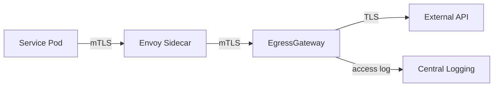

# 🔒 Security

  

---

## 🎯 1. Philosophy

Security is not a phase, a team, or a checklist. It is a practice that runs through every commit, every pipeline, and every architecture decision. **Shift left** — find and fix security issues at development time, not after they reach production.

The platform enforces security automatically where possible. Where human judgment is required, this document provides the rules.

---

## 🔒 2. Secrets Management

This is the most commonly violated security practice. Rules are absolute:

| Rule | Detail |
|------|--------|
| **No secrets in Git** | Ever. Not even in private repos. Gitleaks scans every commit. |
| **No secrets in environment variables** | Use AWS Secrets Manager + External Secrets Operator |
| **No secrets in logs** | Log masking is configured in the platform logging template |
| **No secrets in container images** | Never `COPY` a credentials file into a Dockerfile |
| **No secrets in Kubernetes manifests** | `Secret` objects in Git must only hold references, not values |

Secret violation = P1 security incident. Rotate immediately, then investigate.

---

## 🔒 3. Shift-Left Security in CI

### 3.1 Pipeline Security Stages (Mandatory)

| Stage | Tool | What It Catches | Blocks PR? |
|-------|------|----------------|-----------|
| Secret detection | **Gitleaks** | Credentials, API keys, tokens in code | Yes |
| Dependency scan | **Snyk** | CVEs in Maven dependencies | Yes (critical/high) |
| Static analysis | **SonarCloud** | SQL injection, XSS, deserialization risks | Yes (critical) |
| Container scan | **Snyk Container** | CVEs in base image and OS packages | Yes (critical/high) |
| IaC scan | **tfsec + Checkov** | Misconfigured AWS resources | Yes (high) |
| OWASP check | **OWASP Dependency-Check** | Known vulnerable libraries | Weekly, not per-PR |

### 3.2 Dependency Vulnerability Policy

| Severity | Action | Timeline |
|----------|--------|---------|
| Critical | Block deployment immediately | Fix within 24 hours |
| High | Block new deployments | Fix within 7 days |
| Medium | Tracked in Snyk | Fix within 30 days |
| Low | Logged | Fix in next maintenance window |

Snyk PRs for dependency updates are automatically raised — teams must not ignore them.

### 3.3 Base Image Policy

- All production container images must use `amazoncorretto:21-alpine` or an approved hardened base
- Images are rebuilt weekly to pick up OS-level security patches (automated pipeline)
- `latest` tag is **never** used for base images in Dockerfiles — always pin to a digest or version
- Images run as non-root (enforced by Kubernetes PodSecurityPolicy)

---

## 🔒 4. Authentication & Authorisation

### 4.1 External Authentication

- All external API endpoints require **JWT Bearer token** authentication
- JWTs are signed with RS256 (asymmetric); public key published at `/.well-known/jwks.json`
- Token validation happens at the **BFF layer** — downstream services receive a forwarded, already-validated identity context
- Token expiry: **15 minutes** for access tokens; no exceptions for convenience

### 4.2 Internal Service Authentication

- **All service-to-service calls use mTLS** via Istio — no exceptions
- Services do not implement their own mTLS; Istio's `STRICT` peer authentication mode enforces it
- `AuthorizationPolicy` objects restrict which services may call which — principle of least privilege

### 4.3 AWS IAM — IRSA

- Every pod has an associated IAM role via **IRSA (IAM Roles for Service Accounts)**
- Each role grants only the permissions that service needs — no wildcard permissions
- No static AWS credentials in any service (no `AWS_ACCESS_KEY_ID` env vars)
- IAM policies are defined in Terraform and reviewed in PRs

Example IRSA policy for orders-service:
```json
{
  "Version": "2012-10-17",
  "Statement": [
    {
      "Effect": "Allow",
      "Action": ["secretsmanager:GetSecretValue"],
      "Resource": "arn:aws:secretsmanager:eu-west-1:*:secret:/production/orders-service/*"
    },
    {
      "Effect": "Allow",
      "Action": ["s3:GetObject", "s3:PutObject"],
      "Resource": "arn:aws:s3:::{company}-orders-documents/*"
    }
  ]
}
```

### 4.4 Authorisation in Services

- Services must authorise the **requesting principal** against the **requested resource**
- Never trust data in the request body for identity — use the claims in the forwarded JWT
- Implement authorisation at the **service/domain layer**, not just at the API gateway:
  ```java
  // Bad: relies solely on gateway auth
  public Order getOrder(String orderId) {
      return orderRepository.findById(orderId);
  }

  // Good: checks the calling principal owns this resource
  public Order getOrder(String orderId, Principal caller) {
      Order order = orderRepository.findById(orderId).orElseThrow();
      if (!order.getCustomerId().equals(caller.getId()) && !caller.hasRole("ADMIN")) {
          throw new AccessDeniedException("Cannot access order " + orderId);
      }
      return order;
  }
  ```

---

## 🔒 5. Data Security

### 5.1 Encryption

| Layer | Standard |
|-------|---------|
| Data in transit | TLS 1.2 minimum; TLS 1.3 preferred |
| Data at rest (RDS) | AES-256 (AWS-managed KMS key) |
| Data at rest (S3) | SSE-S3 or SSE-KMS |
| Data at rest (EBS/node volumes) | AES-256 (AWS-managed) |
| Backups | Encrypted with same KMS key as source |

TLS 1.0 and 1.1 are disabled on all ALBs and API Gateways via SCP.

### 5.2 PII Handling

The platform handles customer and provider personal data. All engineers must understand our data classification:

| Class | Examples | Rules |
|-------|---------|-------|
| **Highly Sensitive** | Payment card data, national ID | Never store raw; tokenise |
| **Personal** | Name, email, phone, location history | Encrypt at rest; access logged |
| **Operational** | Order IDs, transaction statistics | Standard controls |
| **Public** | Provider ratings (aggregated) | No special controls |

- PII must never appear in logs — log masking is configured in the platform logging template for common field names
- PII must never be used as cache keys or URL parameters
- GDPR right-to-erasure requests are handled via a data deletion service (not manual DB ops)

### 5.3 Database Security

- RDS instances are **not publicly accessible** (enforced by SCP)
- Connections require TLS (enforced by `rds.force_ssl` parameter)
- Database credentials are rotated automatically every 30 days via Secrets Manager
- Read-only service accounts for read-only use cases
- No direct developer access to production databases — all queries go through audit-logged bastion access

---

## 🔒 6. Network Security

### 6.1 Zero-Trust Posture

No service trusts another based on network location alone. Every request must be authenticated:

- External → BFF: JWT authentication
- BFF → Internal service: mTLS (Istio) + forwarded JWT claims
- Service → Service: mTLS (Istio) + AuthorizationPolicy

### 6.2 Web Application Firewall

**AWS WAF** is deployed in front of all public endpoints with the following managed rule groups enabled:
- AWS Managed Rules — Common Rule Set
- AWS Managed Rules — Known Bad Inputs
- AWS Managed Rules — SQL Database
- IP reputation list (blocks known malicious IPs)
- Rate-based rules (anti-scraping, anti-credential-stuffing)

### 6.3 DDoS Protection

- **AWS Shield Standard** — on all infrastructure by default
- **AWS Shield Advanced** — on Tier 1 critical services (additional cost, justified for platform safety criticality)

---

## 🧪 7. Security Testing

### 7.1 SAST (Static Analysis)

- **SonarCloud** runs on every PR — blocks on critical security hotspots
- Findings are tracked and must be resolved within the SLA above

### 7.2 DAST (Dynamic Analysis)

- **OWASP ZAP** runs weekly against the staging environment
- Findings are triaged by the security team and assigned to owning teams

### 7.3 Penetration Testing

- Annual external penetration test of the full platform
- Scope includes API layer, mobile applications, admin portals
- Findings are treated as P1/P2 depending on severity and resolved within SLA

### 7.4 Dependency Audit

- Snyk scans all repositories daily
- OWASP Dependency Check runs weekly in CI
- An internal Dependabot configuration auto-raises PRs for dependency updates in all repos

---

## 🚨 8. Incident Response

### 8.1 Security Incident Classification

| Level | Example | Response |
|-------|---------|---------|
| **Critical** | Data breach, credential exposure | Immediate: Platform + Security + CTO within 30 min |
| **High** | Exploited vulnerability, account takeover | Same-day response team |
| **Medium** | Unpatched CVE, misconfiguration found | 7-day remediation |

### 8.2 Credential Exposure Protocol

If a secret is detected in a commit or log:
1. **Rotate the credential immediately** — do not wait for investigation
2. Revoke the exposed credential in the relevant system
3. Scan Git history for any downstream propagation
4. Open a P1 security incident ticket
5. Conduct a post-mortem within 5 business days

### 8.3 AWS GuardDuty

GuardDuty is enabled in all AWS accounts and monitors for:
- Credential theft and unusual API calls
- Cryptocurrency mining on EC2
- Unusual network traffic
- S3 bucket compromise

GuardDuty HIGH/CRITICAL findings page on-call immediately via PagerDuty.

---

## 📋 9. Compliance

| Framework | Status | Scope |
|-----------|--------|-------|
| **GDPR** | Ongoing | All customer/provider data processing |
| **PCI-DSS** | Level 2 | Payment processing (via tokenisation — offloaded to payment provider) |
| **SOC 2 Type II** | In progress | Platform infrastructure |

All compliance controls are mapped to the engineering practices in this manifesto. Audit evidence is collected automatically via AWS Config, CloudTrail, and Security Hub.

---

## 🔒 10. Secrets Rotation Policy

### 10.1 Rotation schedules

| Secret Type | Rotation Frequency | Mechanism |
|-------------|-------------------|-----------|
| DB passwords | Every **30 days** | AWS Secrets Manager automatic rotation (Lambda) |
| Third-party API keys | Every **90 days** | AWS Secrets Manager with configured rotation schedule |
| Service account tokens | Every **90 days** | AWS Secrets Manager automatic rotation |

### 10.2 Rotation failure alerting

| Component | Configuration |
|-----------|---------------|
| CloudWatch Alarm | Fires if the rotation Lambda fails or times out |
| Alert target | `#security-alerts` Slack channel via SNS → ChatBot |
| Escalation | If not acknowledged within 1 hour, page on-call security engineer via PagerDuty |

### 10.3 Emergency rotation (break-glass)

Any engineer can trigger immediate credential rotation via the **Secrets Emergency Rotation** runbook:

1. Open the rotation runbook in the operations wiki.
2. Identify the affected secret in AWS Secrets Manager.
3. Trigger immediate rotation via the console or CLI (`aws secretsmanager rotate-secret --secret-id <id>`).
4. Verify the dependent service picks up the new credential (check application logs for authentication errors).
5. **Notify the security team within 1 hour** with the reason for emergency rotation.
6. Open a follow-up incident ticket if the rotation was triggered by a suspected compromise.

### 10.4 Central dashboard

All rotation schedules are tracked in a **Grafana dashboard** (`Security → Secrets Rotation Status`) that shows:

- Last rotation date per secret
- Next scheduled rotation
- Failed rotations (with links to CloudWatch logs)
- Secrets approaching rotation deadline (amber at 7 days, red at overdue)

---

## 🔒 11. Container Runtime Security

### 11.1 Runtime threat detection — Falco

**Falco** is deployed as a DaemonSet on all EKS nodes, monitoring syscalls for anomalous behavior.

**Detection rules:**

| Rule | Severity | Description |
|------|----------|-------------|
| Unexpected process execution | Warning | Process not in the container's expected process tree |
| Shell spawned in container | Critical | `/bin/sh`, `/bin/bash`, or similar shells launched |
| Sensitive file access | Warning | Read/write to `/etc/shadow`, `/etc/passwd`, or mounted secrets |
| Network connection to unusual ports | Warning | Outbound connections to ports not in the declared allow-list |
| Crypto mining patterns | Critical | Detection of known mining binaries or CPU-intensive hash patterns |

### 11.2 Response

- **Warning-level alerts** → `#security-alerts` Slack channel for triage.
- **Critical-level alerts** → automatic pod termination + `#security-alerts` notification + PagerDuty page.
- All Falco events are shipped to the central SIEM for correlation and forensic analysis.

### 11.3 Admission control — Kyverno

**Kyverno** policies enforce the following at admission time (pod creation is rejected if any rule fails):

| Policy | Enforcement |
|--------|-------------|
| No privileged containers | `spec.containers[*].securityContext.privileged: false` |
| No host network | `spec.hostNetwork: false` |
| No host PID | `spec.hostPID: false` |
| Image source restriction | Image must originate from the {Company} ECR registry |
| Required labels | `app`, `team`, `platform.{company}.com/domain` must be present |
| Read-only root filesystem | `securityContext.readOnlyRootFilesystem: true` (exceptions via annotation) |

### 11.4 Image re-scanning

- All running container images in ECR are **re-scanned weekly** for newly published CVEs.
- New CVEs discovered in running images trigger an alert to the owning team.
- **SLA:** 7 days to patch or apply an approved mitigation (WAF rule, network restriction, etc.).
- Critical CVEs with known exploits follow the accelerated timeline in Section 3.2.

### 11.5 Pod Security Standards

| Environment | Pod Security Standard | Enforcement |
|-------------|----------------------|-------------|
| Production | `restricted` | Enforce (reject non-compliant pods) |
| Staging | `baseline` | Enforce |
| Development | `baseline` | Warn (allow but log violations) |

---

## 🔒 12. Network Egress Control

### 12.1 Default-deny egress

All production namespaces have a **NetworkPolicy** that denies all egress by default:

```yaml
apiVersion: networking.k8s.io/v1
kind: NetworkPolicy
metadata:
  name: default-deny-egress
  namespace: orders
spec:
  podSelector: {}
  policyTypes:
    - Egress
```

Specific egress rules are layered on top of this deny-all baseline.

### 12.2 Allowlists

Teams declare required external endpoints in their **Helm values**:

```yaml
egress:
  allowedExternalEndpoints:
    - host: api.stripe.com
      port: 443
    - host: maps.googleapis.com
      port: 443
```

The platform Helm chart translates these into `NetworkPolicy` rules. The platform team reviews and provisions the rules during PR review.

### 12.3 Istio EgressGateway

All external HTTPS traffic routes through a shared **Istio EgressGateway** for centralized logging and inspection:



The EgressGateway provides:

- **Access logging** — every external request is logged with source service, destination, response code, and latency.
- **TLS origination** — the gateway handles TLS to external endpoints; pods send plaintext to the sidecar.
- **Circuit breaking** — protects against cascading failures from slow external dependencies.

### 12.4 Allowed external domains

| Category | Examples |
|----------|----------|
| Package registries | Maven Central, npm registry, PyPI |
| Cloud APIs | AWS service endpoints (`*.amazonaws.com`) |
| Approved third-party APIs | Payment providers, mapping APIs, notification gateways |
| Monitoring | Datadog, PagerDuty |

Any new external dependency requires a **security review** and explicit addition to the allowlist.

### 12.5 Monitoring

| Metric | Alert Condition |
|--------|----------------|
| Egress traffic volume per service per destination | Spike >3x baseline in 15-minute window |
| Connections to non-allowlisted destinations | Any connection attempt (blocked by policy) |
| EgressGateway error rate | >1% 5xx responses in 5-minute window |
| Egress latency per destination | p99 >5s sustained for 10 minutes |

Unexpected destination alerts page the security on-call immediately.

---

## 🔒 13. KMS Key Management

### 13.1 Key Hierarchy

| Data Classification | Key Type | Managed By | Rotation |
|---------------------|----------|-----------|----------|
| **Public / Operational** | AWS-managed KMS key | AWS (automatic) | Automatic (annual) |
| **Personal (PII)** | Customer-managed CMK | Platform Engineering | Automatic (annual) |
| **Highly Sensitive** | Customer-managed CMK with restricted key policy | Platform Engineering + Security | Automatic (annual) |
| **Regulated** | BYOK (Bring Your Own Key) | Security team | Manual (per compliance schedule) |

### 13.2 Key Rotation

- All customer-managed CMKs have **automatic annual rotation** enabled
- Rotation creates a new backing key; the key ID and alias remain unchanged
- Previous key versions are retained for decryption of data encrypted with older versions
- Rotation status is monitored via CloudTrail and the Secrets Rotation Grafana dashboard

### 13.3 BYOK (Bring Your Own Key)

For regulated data requiring customer-controlled key material:

| Step | Action | Owner |
|------|--------|-------|
| 1 | Generate key material externally (HSM or approved key management tool) | Security team |
| 2 | Import key material into AWS KMS with expiration date | Platform Engineering |
| 3 | Document key provenance and chain of custody | Security team |
| 4 | Configure automatic re-import before expiration | Platform Engineering |

BYOK is only required for data subject to regulatory obligations (e.g., financial data, health records). Standard workloads use AWS-managed or CMK keys.

### 13.4 Separation of Duties

| Role | Permissions | Enforced By |
|------|-------------|-------------|
| **Key administrator** | Create, enable, disable, schedule deletion of CMKs | IAM policy: `kms:Create*`, `kms:Enable*`, `kms:Disable*`, `kms:ScheduleKeyDeletion` |
| **Key user** | Encrypt, decrypt, generate data keys | IAM policy: `kms:Encrypt`, `kms:Decrypt`, `kms:GenerateDataKey*` |

Key administrators **cannot** encrypt or decrypt data. Key users **cannot** manage key lifecycle. This separation is enforced via IAM policies attached to distinct IAM roles.

---

## 🔒 14. Privileged Access Management

### 14.1 JIT (Just-In-Time) Access

All privileged access to production infrastructure uses **temporary elevation** via AWS SSO:

| Parameter | Value |
|-----------|-------|
| **Maximum session duration** | 4 hours |
| **Approval required** | Yes — manager or security team approval via SSO request workflow |
| **Auto-expiry** | Sessions terminate automatically after the granted duration |
| **Scope** | Least-privilege role for the specific task (not broad admin access) |

### 14.2 Audit Logging

All privileged sessions are audit-logged to **CloudTrail**:

| What Is Logged | Detail |
|----------------|--------|
| Session start/end | Timestamp, IAM role assumed, source IP |
| API calls made | Every AWS API call during the elevated session |
| Resources accessed | S3 objects, RDS instances, Secrets Manager secrets |
| Console actions | AWS Management Console activity |

Audit logs are retained for **12 months** in a tamper-proof S3 bucket with Object Lock enabled.

### 14.3 Quarterly Access Certification

Every quarter, the security team reviews all standing privileges:

| Review Scope | Action |
|-------------|--------|
| IAM roles with persistent admin access | Justify or revoke |
| Service accounts with broad permissions | Scope down to least privilege |
| Break-glass credentials | Verify sealed and unused |
| SSO permission sets | Verify alignment with current team structure |

### 14.4 Break-Glass Access

Emergency access for critical production incidents when normal JIT access is unavailable:

| Parameter | Value |
|-----------|-------|
| **Credential storage** | Sealed credentials in AWS Secrets Manager (separate account) |
| **Access** | Requires two-person authorization (dual-key retrieval) |
| **Post-use review** | Mandatory review within 24 hours — all actions during break-glass session are audited |
| **Rotation** | Credentials are rotated immediately after each use |

Break-glass access triggers an automatic PagerDuty alert to the security team and creates a post-incident review ticket.

---

<div align="center">

⬅️ [Back to section](./README.md) · 🏠 [Back to root](../README.md)

</div>
