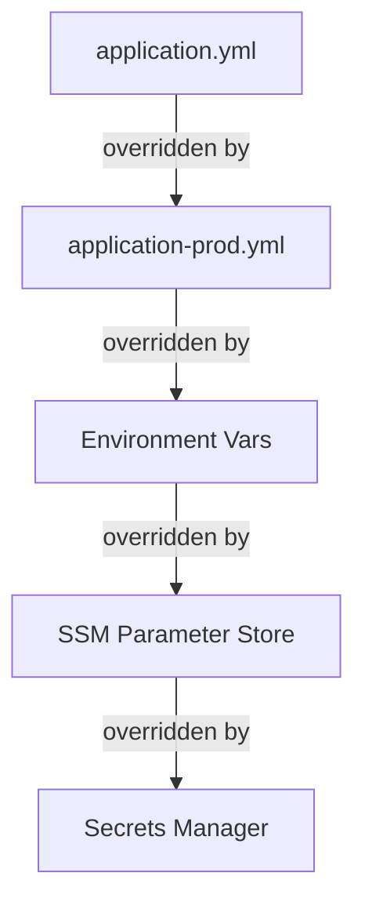

# ⚙️ Configuration Management

  

---

## 🎯 1. The Problem We're Solving

Configuration management fails in two common ways:

1. **Config in code** — database URLs, API keys, feature toggles buried in source code; changing config requires a deployment
2. **Config chaos** — different values in dev/staging/prod managed by hand; environment drift; "works in staging, broken in prod"

Our approach follows the **12-Factor App** principles: strict separation of config from code. Config is anything that varies between deployments (dev vs staging vs production). Code never does.

---

## ⚙️ 2. Where Each Type of Config Lives

| Config Type | Examples | Where It Lives | How It's Loaded |
|-------------|---------|---------------|----------------|
| **Secrets** | DB passwords, API keys, tokens | AWS Secrets Manager | External Secrets Operator → Kubernetes Secret → mounted as volume |
| **Environment config** | DB URLs, Kafka brokers, service URLs | AWS SSM Parameter Store | Spring Cloud AWS at startup |
| **Application tuning** | Pool sizes, timeouts, cache TTLs | Helm values → ConfigMap | Spring `application.yml` via env var |
| **Feature flags** | Unreleased feature toggles, kill switches | LaunchDarkly | SDK at runtime (no restart needed) |
| **Non-sensitive defaults** | Default page size, max retry count | `application.yml` in the repo | Spring Boot defaults |

**The golden rule:** If a value changes between environments, it must not be in `application.yml` committed to Git.

---

## ⚙️ 3. The Config Hierarchy

Spring Boot loads configuration in this order (later entries win):

```
1. application.yml (committed to Git — safe defaults, no secrets, no env-specific values)
2. application-{profile}.yml (committed to Git — profile-specific safe overrides)
3. Environment variables (set by Kubernetes via ConfigMap or Helm values)
4. AWS SSM Parameter Store (loaded at startup via Spring Cloud AWS)
5. AWS Secrets Manager (loaded at startup via External Secrets Operator)
```

**Visual overview:**



---

## ⚙️ 4. application.yml — What Belongs Here

Only values that are **safe to commit** and **the same in all environments**:

```yaml
# application.yml — committed to Git
spring:
  application:
    name: orders-service
  jpa:
    open-in-view: false              # Always false — not environment-specific
    properties:
      hibernate:
        dialect: org.hibernate.dialect.PostgreSQLDialect  # Always postgres
  kafka:
    consumer:
      auto-offset-reset: earliest    # Same everywhere
      enable-auto-commit: false      # Same everywhere

management:
  endpoints:
    web:
      exposure:
        include: health, info, prometheus

resilience4j:
  circuitbreaker:
    instances:
      pricingService:
        failureRateThreshold: 50     # Business decision — same everywhere
        waitDurationInOpenState: 30s
```

**What must NOT be here:**
```yaml
# ❌ Never in application.yml
spring:
  datasource:
    url: jdbc:postgresql://prod-db.{company}.com:5432/orders    # Production URL in code!
    username: orders_user
    password: my_secret_password                              # Secret in code!

external:
  pricing-service:
    url: http://pricing-service.production.svc.cluster.local  # Env-specific!
```

---

## ⚙️ 5. application-{profile}.yml — Profile Overrides

Use Spring profiles for local development defaults only:

```yaml
# application-local.yml — committed to Git (safe, local-only values)
spring:
  datasource:
    url: jdbc:postgresql://localhost:5432/orders
    username: orders_user
    password: local_password   # Local only — not a real secret

  kafka:
    bootstrap-servers: localhost:9092

aws:
  endpoint-override: http://localhost:4566   # LocalStack

logging:
  level:
    com.{company}: DEBUG   # Verbose logging locally

launchdarkly:
  offline: true
  default-flags:
    new-fulfillment-algorithm: false
```

**Don't create** `application-staging.yml` or `application-production.yml` — these environments get their config from Parameter Store and Secrets Manager, not committed files.

---

## 🔒 6. Secrets — AWS Secrets Manager

### 6.1 How It Works

```
AWS Secrets Manager
      │
      │ (synced every hour by External Secrets Operator)
      ▼
Kubernetes Secret (in-cluster)
      │
      │ (mounted as read-only volume)
      ▼
/var/run/secrets/orders-service/db-password   ← file, not env var
      │
      │ (Spring reads on startup)
      ▼
spring.datasource.password = {contents of file}
```

### 6.2 Creating a Secret

```bash
# Create via AWS CLI (done by Platform Engineering or via Terraform)
aws secretsmanager create-secret \
  --name /production/orders-service/db-password \
  --secret-string "your-secure-password-here"
```

In Terraform:
```hcl
resource "aws_secretsmanager_secret" "orders_db_password" {
  name        = "/production/orders-service/db-password"
  description = "PostgreSQL password for orders-service production"

  tags = {
    Service     = "orders-service"
    Environment = "production"
    ManagedBy   = "terraform"
  }
}
```

### 6.3 ExternalSecret Manifest

```yaml
# In platform-config repo: apps/production/orders-service-secrets.yaml
apiVersion: external-secrets.io/v1beta1
kind: ExternalSecret
metadata:
  name: orders-service-secrets
  namespace: orders-production
spec:
  refreshInterval: 1h
  secretStoreRef:
    name: aws-secrets-manager
    kind: ClusterSecretStore
  target:
    name: orders-service-secrets
    creationPolicy: Owner
  data:
  - secretKey: db-password
    remoteRef:
      key: /production/orders-service/db-password
  - secretKey: stripe-api-key
    remoteRef:
      key: /production/orders-service/stripe-api-key
```

### 6.4 Reading Secrets in Spring Boot

Mount the Kubernetes Secret as a volume (in Helm values):
```yaml
# values-production.yaml
volumeMounts:
  - name: secrets
    mountPath: /var/run/secrets/orders-service
    readOnly: true

volumes:
  - name: secrets
    secret:
      secretName: orders-service-secrets
```

Spring Boot reads files from a mounted volume automatically:
```yaml
# application.yml
spring:
  config:
    import: optional:configtree:/var/run/secrets/orders-service/
  datasource:
    password: ${db-password}   # Resolved from the mounted file
```

---

## ⚙️ 7. Environment Config — AWS SSM Parameter Store

Non-sensitive config that varies by environment (service URLs, Kafka brokers, etc.) lives in SSM:

### 7.1 Parameter Naming

```
/{environment}/{service}/{parameter}

Examples:
  /production/orders-service/pricing-service-url
  /production/orders-service/db-url
  /staging/orders-service/pricing-service-url
```

### 7.2 Creating Parameters

```bash
aws ssm put-parameter \
  --name /production/orders-service/pricing-service-url \
  --value "http://pricing-service.pricing.svc.cluster.local" \
  --type String

aws ssm put-parameter \
  --name /production/orders-service/db-url \
  --value "jdbc:postgresql://orders-aurora-cluster.cluster-xxx.eu-west-1.rds.amazonaws.com:5432/orders" \
  --type String  # Not SecureString — URL is not a secret
```

### 7.3 Reading in Spring Boot

```kotlin
// build.gradle.kts
implementation("io.awspring.cloud:spring-cloud-aws-starter-parameter-store")
```

```yaml
# application.yml
spring:
  config:
    import: optional:aws-parameterstore:/${spring.profiles.active}/orders-service/

# Values loaded from SSM automatically — reference like normal Spring properties
external:
  pricing-service:
    url: ${pricing-service-url}   # Loaded from /{environment}/orders-service/pricing-service-url
```

---

## ⚙️ 8. Feature Flags — LaunchDarkly

Feature flags are the only type of config that changes **without a restart or deployment**.

### 8.1 Client Setup

```java
@Configuration
public class LaunchDarklyConfig {

    @Bean
    public LDClient launchDarklyClient(@Value("${launchdarkly.sdk-key}") String sdkKey,
                                        @Value("${launchdarkly.offline:false}") boolean offline) {
        LDConfig config = new LDConfig.Builder()
            .offline(offline)           // true in local dev — uses default values
            .startWaitMillis(5000)
            .build();

        return new LDClient(sdkKey, config);
    }
}
```

### 8.2 Using Flags in Code

```java
@Service
public class OrderService {

    private final LDClient flagClient;

    public PriceEstimate estimatePrice(OrderRequest request) {
        // Build evaluation context from the user/order
        LDContext context = LDContext.builder(request.getCustomerId().value())
            .set("city", request.getCity())
            .set("vehicleType", request.getVehicleType().name())
            .build();

        // Evaluate the flag — third argument is the default (used if SDK can't connect)
        boolean useNewAlgorithm = flagClient.boolVariation(
            "pricing-new-algorithm-release",
            context,
            false   // Default OFF — safe fallback
        );

        if (useNewAlgorithm) {
            return newPricingAlgorithm.estimate(request);
        } else {
            return legacyPricingAlgorithm.estimate(request);
        }
    }
}
```

### 8.3 Flag Best Practices

```java
// ✅ Always provide a safe default (false for feature flags)
flagClient.boolVariation("new-feature", context, false);

// ✅ Evaluate flags at the call site — don't cache the result in a field
// (the flag value can change without a restart)
public void processOrder(Order order) {
    if (flagClient.boolVariation("enhanced-fulfillment", context, false)) { ... }
}

// ❌ Don't cache flags in a field — you'll miss changes
private final boolean useNewMatching = flagClient.boolVariation("...", false);  // Bad!

// ✅ In tests — use offline mode with overrides
@TestConfiguration
public class TestLaunchDarklyConfig {
    @Bean
    @Primary
    public LDClient testLdClient() {
        return new LDClient("test-key", new LDConfig.Builder()
            .offline(true)
            .build());
    }
}
```

---

## 📋 9. The Config Checklist

Before deploying a service, verify:

```
[ ] No database passwords or API keys in application.yml or Git
[ ] No environment-specific URLs in committed config files
[ ] All secrets created in AWS Secrets Manager (via Terraform)
[ ] All environment-specific URLs in SSM Parameter Store (via Terraform)
[ ] ExternalSecret manifest created for this service's namespace
[ ] Helm values reference secrets via volumeMount, not env vars
[ ] Local dev works with application-local.yml and docker-compose
[ ] Feature flags have sensible defaults (OFF for new features)
[ ] Secrets are rotated — No secret older than 90 days (API keys, third-party tokens) or 30 days (database passwords) in production — aligned with the secrets rotation policy in 03-security.md
```

---

## 🔄 10. Feature Flag Lifecycle

Feature flags are powerful but accumulate quickly. Without active management, the codebase fills with dead toggles, and LaunchDarkly becomes unnavigable. These rules keep the flag inventory clean.

### 10.1 Max Age

Flags older than **90 days** trigger an automated Slack notification to the flag owner. The notification includes a direct link to the flag in LaunchDarkly and the originating Jira ticket.

### 10.2 Orphan Detection

A **monthly script** scans LaunchDarkly for flags with **zero evaluations in 30 days**. These are considered orphans. Each orphan is filed as a cleanup ticket in Jira, assigned to the owning team, and tagged `feature-flag-cleanup`.

### 10.3 Ownership

Every flag **must have an owner** (team) recorded in LaunchDarkly's custom `owner` field. Flags without an owner are escalated to the responsible engineering manager within 48 hours. Unowned flags that remain unclaimed for 7 days are disabled in non-production environments.

### 10.4 Environment Lifecycle

Flags follow a strict promotion path:

1. **Dev** — flag created and tested
2. **Staging** — flag promoted and validated in integration
3. **Production** — flag promoted after staging validation

Production flags that are **not present in staging for >7 days** are flagged as anomalies and reported to the team lead. This prevents "production-only" flags that bypass the standard validation flow.

### 10.5 Cleanup Enforcement

Flags that are past their **planned removal date** (set when the flag is created) **block the team's next feature flag creation** until the overdue flag is cleaned up. This is enforced via a pre-creation webhook in LaunchDarkly that checks the team's outstanding cleanup debt.

---

## 🔍 11. Troubleshooting Config

```bash
# See what config Spring Boot has loaded (run locally or in a pod)
curl http://localhost:8080/actuator/env | python3 -m json.tool | grep "pricing"

# Check that secrets are synced from AWS to Kubernetes
kubectl -n orders-production get externalsecret orders-service-secrets
# STATUS should be "SecretSynced"

# Check what's in the Kubernetes Secret (base64 decoded)
kubectl -n orders-production get secret orders-service-secrets -o jsonpath='{.data.db-password}' | base64 -d

# Check SSM parameters
aws ssm get-parameter --name /production/orders-service/pricing-service-url

# Verify a running pod can see its secrets
kubectl -n orders-production exec -it {pod-name} -- cat /var/run/secrets/orders-service/db-password
```

---

<div align="center">

⬅️ [Back to section](./README.md) · 🏠 [Back to root](../README.md)

</div>
