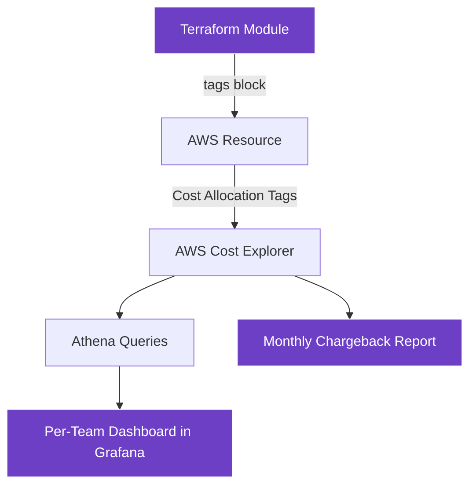
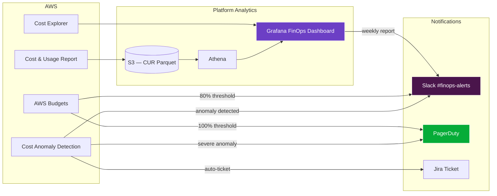
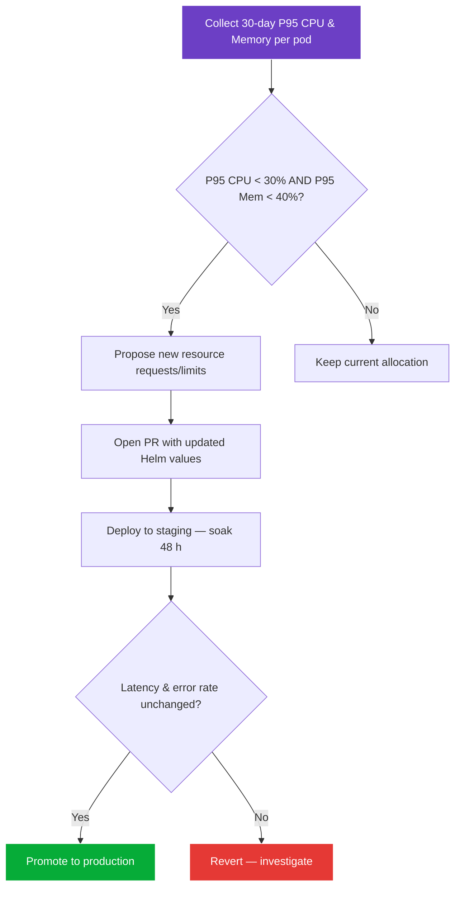

# 💰 FinOps and Cost Management

> **Platform Manifesto** · Infrastructure & Cloud

| Field | Value |
|-------|-------|
| **Status** | Active |
| **Owner** | Platform Engineering |
| **Last Updated** | 2026-03-31 |

---

## Table of Contents

1. [FinOps Philosophy](#1-finops-philosophy)
2. [Cost Allocation & Mandatory Tagging](#2-cost-allocation--mandatory-tagging)
3. [Budget Alerts](#3-budget-alerts)
4. [Cost Monitoring Flow](#4-cost-monitoring-flow)
5. [Rightsizing Program](#5-rightsizing-program)
6. [Savings Plans Strategy](#6-savings-plans-strategy)
7. [Spot Instances with Karpenter](#7-spot-instances-with-karpenter)
8. [Dev/Staging Optimization](#8-devstaging-optimization)
9. [Cost Anomaly Detection](#9-cost-anomaly-detection)
10. [Cost per Transaction](#10-cost-per-transaction)
11. [FinOps Review Cadence](#11-finops-review-cadence)

---

## 1. FinOps Philosophy

**Every engineer is a cost stakeholder.** Cloud spending is not an ops problem — it is a product decision. We treat infrastructure cost the same way we treat latency or uptime: as a metric that every team owns.

**Core principles:**

- **Visibility first** — you cannot optimize what you cannot see. Every resource must be tagged, every dollar attributed.
- **Engineer empowerment** — teams receive their own cost dashboards and are accountable for their spend.
- **Unit economics matter** — the ultimate metric is cost-per-transaction. Absolute spend is meaningless without business context.
- **Right-size continuously** — capacity that sits idle is money that could fund the next feature.
- **Automate guardrails** — budget alerts, anomaly detection, and policy-as-code prevent surprises before they hit the invoice.

---

## 2. Cost Allocation & Mandatory Tagging

Every AWS resource provisioned through Terraform **must** carry the following tags. The CI pipeline rejects any `terraform plan` that creates untagged resources.

| Tag Key | Description | Example Values | Enforced By |
|---------|-------------|----------------|-------------|
| `Service` | The microservice or shared component that owns this resource | `fulfillment-engine`, `pricing-service`, `shared-kafka` | Terraform CI |
| `Team` | The squad or team responsible | `fulfillment`, `payments`, `platform` | Terraform CI |
| `Environment` | Deployment environment | `production`, `staging`, `dev` | Terraform CI |
| `CostCenter` | Finance-allocated cost center code | `CC-ENG-001`, `CC-OPS-002` | Terraform CI |
| `ManagedBy` | How the resource is managed | `terraform`, `karpenter`, `manual` | Terraform CI |

### Tag Propagation



### Enforcement

- **Pre-commit hook** — `tflint` checks tag presence locally.
- **CI gate** — `terraform plan` output is parsed; resources missing any required tag fail the build.
- **Weekly drift scan** — a Lambda function queries AWS Config for untagged resources and files Jira tickets automatically.

---

## 3. Budget Alerts

Each team has dedicated AWS Budgets with two threshold alerts:

| Threshold | Action | Notification Channel |
|-----------|--------|----------------------|
| **80%** of monthly budget | Warning — review spend trends | `#finops-alerts` Slack channel + team lead email |
| **100%** of monthly budget | Critical — mandatory review within 24 h | `#finops-alerts` + VP Engineering email + PagerDuty info alert |

Budget definitions live in Terraform and are version-controlled:

```hcl
resource "aws_budgets_budget" "matching_team" {
  name         = "fulfillment-team-monthly"
  budget_type  = "COST"
  limit_amount = "12000"
  limit_unit   = "USD"
  time_unit    = "MONTHLY"

  cost_filters = {
    TagKeyValue = "user:Team$fulfillment"
  }

  notification {
    comparison_operator       = "GREATER_THAN"
    threshold                 = 80
    threshold_type            = "PERCENTAGE"
    notification_type         = "ACTUAL"
    subscriber_sns_topic_arns = [aws_sns_topic.finops_alerts.arn]
  }

  notification {
    comparison_operator       = "GREATER_THAN"
    threshold                 = 100
    threshold_type            = "PERCENTAGE"
    notification_type         = "ACTUAL"
    subscriber_sns_topic_arns = [aws_sns_topic.finops_critical.arn]
  }
}
```

---

## 4. Cost Monitoring Flow



---

## 5. Rightsizing Program

We run a **quarterly rightsizing review** as part of the FinOps cadence.

### Process



### Data Sources

- **VPA recommendations** — Kubernetes Vertical Pod Autoscaler runs in recommend-only mode across all namespaces.
- **Kubecost** — provides per-pod cost attribution.
- **CloudWatch Container Insights** — historical CPU/memory utilization.

### Rules of Engagement

| Rule | Detail |
|------|--------|
| Never reduce below VPA lower bound | Safety margin for traffic spikes |
| Staging soak for 48 h minimum | Catch regressions under realistic traffic |
| Max reduction per cycle: 30% | Avoid aggressive cuts that risk instability |
| Fulfillment engine excluded from auto-rightsizing | Latency-critical; reviewed manually |

---

## 6. Savings Plans Strategy

We use **Compute Savings Plans**, not instance-family Savings Plans.

| Decision | Rationale |
|----------|-----------|
| **Compute** over EC2 Instance | Karpenter may shift instance types; compute plans cover any instance family, region, or OS |
| **1-year, no upfront** | Balances discount (~20%) with flexibility — the platform is still scaling and instance mix changes quarterly |
| **Cover 60–70% of steady-state** | Remaining 30–40% is burst capacity handled by Spot and on-demand |
| **Re-evaluate quarterly** | Align plan purchases with the rightsizing review |

### Coverage Model

```
Steady-state compute (predictable)
├── 60–70% → Compute Savings Plans (20% discount)
└── 30–40% → Flexible capacity
    ├── Spot instances via Karpenter (60–70% discount)
    └── On-demand fallback (full price, <5% of total)
```

---

## 7. Spot Instances with Karpenter

Karpenter is the platform's node provisioner. It automatically selects the cheapest available instance type from a diversified pool and handles Spot interruptions gracefully.

### Karpenter NodePool Configuration

```yaml
apiVersion: karpenter.sh/v1beta1
kind: NodePool
metadata:
  name: default
spec:
  template:
    spec:
      requirements:
        - key: karpenter.sh/capacity-type
          operator: In
          values: ["spot", "on-demand"]
        - key: node.kubernetes.io/instance-type
          operator: In
          values:
            - m6i.xlarge
            - m6a.xlarge
            - m5.xlarge
            - c6i.xlarge
            - c6a.xlarge
            - r6i.xlarge
      nodeClassRef:
        name: default
  disruption:
    consolidationPolicy: WhenUnderutilized
    expireAfter: 720h
  limits:
    cpu: "1000"
    memory: 4000Gi
```

### Workload Placement Rules

| Workload Type | Capacity Type | Reason |
|---------------|---------------|--------|
| Stateless services (API gateways, pricing calculator) | Spot preferred | Tolerant of interruption; multiple replicas |
| Fulfillment engine | On-demand only | Latency-critical; mid-assignment interruption unacceptable |
| Kafka brokers | On-demand only | Stateful; rebalancing on interruption is expensive |
| Batch jobs (analytics, reports) | Spot only | Can retry; cost reduction is substantial |

---

## 8. Dev/Staging Optimization

Non-production environments do not need to run 24/7. We implement **scale-to-zero after hours** for dev and staging.

### Schedule

| Environment | Active Hours (GST) | Off-Hours Behavior |
|-------------|--------------------|--------------------|
| `dev` | 08:00 – 20:00 Mon–Fri | All deployments scaled to 0 replicas |
| `staging` | 07:00 – 23:00 Mon–Fri | Scaled to minimum (1 replica per service) |
| `production` | 24/7 | Full autoscaling |

### Implementation

A CronJob in each non-production cluster applies `kubectl scale` at scheduled times:

```yaml
apiVersion: batch/v1
kind: CronJob
metadata:
  name: scale-down-dev
spec:
  schedule: "0 20 * * 1-5"  # 8 PM, Mon–Fri
  jobTemplate:
    spec:
      template:
        spec:
          containers:
            - name: scaler
              image: bitnami/kubectl:latest
              command:
                - /bin/sh
                - -c
                - |
                  for ns in $(kubectl get ns -l env=dev -o name); do
                    kubectl scale deploy --all --replicas=0 -n ${ns##*/}
                  done
          restartPolicy: OnFailure
```

### Estimated Savings

| Optimization | Monthly Savings |
|--------------|-----------------|
| Dev scale-to-zero | ~$4,200 |
| Staging min-replica nights | ~$1,800 |
| Weekend dev shutdown | ~$2,400 |
| **Total** | **~$8,400/month** |

---

## 9. Cost Anomaly Detection

We use **AWS Cost Anomaly Detection** to catch unexpected spend spikes before they compound.

### Configuration

| Monitor | Scope | Alert Threshold |
|---------|-------|-----------------|
| Service-level | Each tagged `Service` | >20% above expected |
| Account-level | Entire AWS account | >$500/day above forecast |
| Linked account | Per-environment accounts | >15% above expected |

### Alert Flow

1. AWS Cost Anomaly Detection identifies a deviation.
2. SNS topic triggers a Lambda.
3. Lambda enriches the alert with tag metadata (team, service) and posts to `#finops-alerts` on Slack.
4. If the anomaly exceeds $1,000/day, a Jira ticket is auto-created and assigned to the owning team.
5. Team must acknowledge within 24 h or the alert escalates to the engineering manager.

### Common Root Causes

| Anomaly Pattern | Typical Cause | Playbook |
|-----------------|---------------|----------|
| EBS volume spike | Forgotten snapshots or unattached volumes | Run `aws ec2 describe-volumes --filters Name=status,Values=available` |
| NAT Gateway surge | Debug logging hitting external endpoints | Check CloudWatch NAT metrics; disable verbose logging |
| RDS cost jump | Unintended instance resize or storage autoscaling | Review recent Terraform applies |
| EC2 on-demand spike | Spot capacity unavailable; Karpenter fallback | Expand instance type diversity in NodePool |

---

## 10. Cost per Transaction

**Cost per transaction** is the north-star FinOps metric. It connects infrastructure spend to business value.

### Formula

```
Cost per Transaction = Total Monthly Cloud Spend / Total Monthly Completed Transactions
```

### Breakdown

| Cost Category | Included Components |
|---------------|---------------------|
| Compute | EKS nodes, Lambda invocations |
| Data | RDS, ElastiCache, S3, Kafka (MSK) |
| Network | NAT Gateway, ALB, data transfer |
| Observability | CloudWatch, Datadog/Grafana Cloud |
| Other | KMS, Secrets Manager, Route 53 |

### Targets

| Metric | Current | Target (Q3 2026) |
|--------|---------|-------------------|
| Cost per transaction | $0.038 | $0.028 |
| Infra spend as % of revenue | 6.2% | <5% |
| Spot coverage | 45% | 65% |

### Tracking

The cost-per-transaction metric is calculated weekly by a scheduled Athena query and displayed on the FinOps Grafana dashboard. It is reviewed in the monthly FinOps review meeting.

---

## 11. FinOps Review Cadence

| Cadence | Activity | Attendees |
|---------|----------|-----------|
| **Daily** | Automated anomaly scan + Slack digest | Platform Engineering (async) |
| **Weekly** | Cost-per-transaction trend review | FinOps lead |
| **Monthly** | Full FinOps review: spend by team, rightsizing actions, Savings Plan utilization | Platform Eng + team leads + Finance |
| **Quarterly** | Rightsizing cycle, Savings Plan purchase review, budget re-forecasting | VP Engineering + Finance |

### Monthly Review Agenda

1. Total spend vs. budget (per team).
2. Cost-per-transaction trend.
3. Top 5 cost movers (up and down).
4. Rightsizing candidates.
5. Anomaly postmortems.
6. Savings Plan utilization and coverage.
7. Action items for next month.

---

> Building the platform that sets the standard for engineering excellence.

← [Back to section](./README.md) · [Back to root](../README.md)
