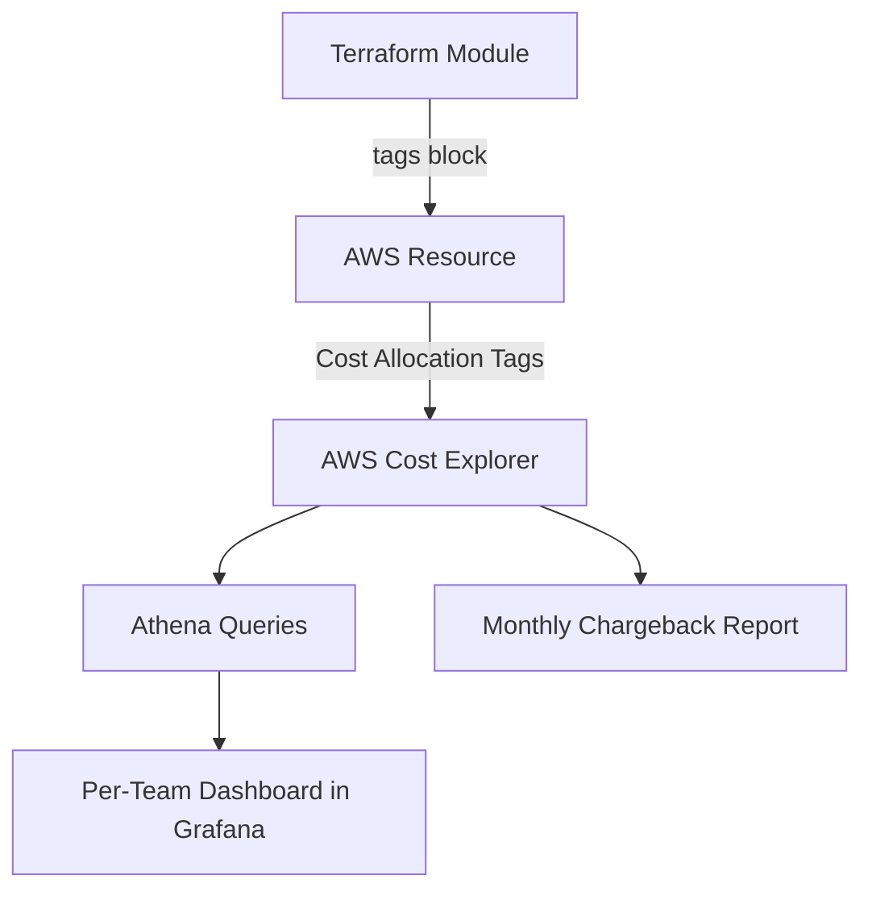
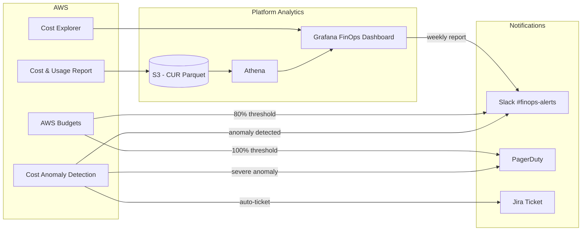
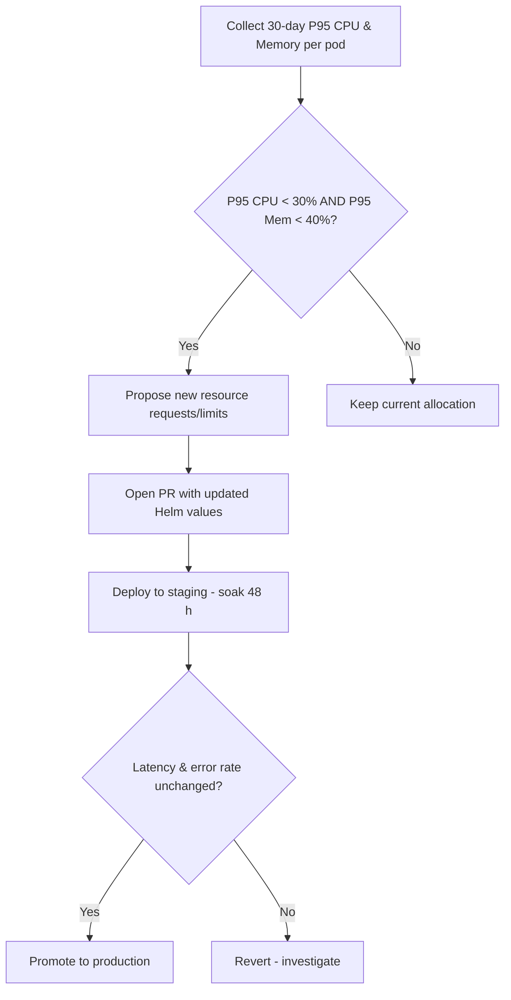

# 💰 FinOps

  

---

## 📋 Table of Contents

1. [FinOps Philosophy](#1-finops-philosophy)
2. [Cost Allocation & Mandatory Tagging](#2-cost-allocation--mandatory-tagging)
3. [Budget Alerts](#3-budget-alerts)
4. [Cost Monitoring Flow](#4-cost-monitoring-flow)
5. [Rightsizing Program](#5-rightsizing-program)
6. [Savings Plans Strategy](#6-savings-plans-strategy)
7. [Spot Instances with Karpenter](#7-spot-instances-with-karpenter)
8. [Dev/Staging Optimization](#8-devstaging-optimization)
9. [Cost Anomaly Detection](#9-cost-anomaly-detection)
10. [Cost per Transaction](#10-cost-per-transaction)
11. [FinOps Review Cadence](#11-finops-review-cadence)
12. [Cost Allocation Model](#12-cost-allocation-model)
13. [Real-Time Cost Visibility](#13-real-time-cost-visibility)
14. [Sustainability Lens](#14-sustainability-lens)

---

## 🎯 1. FinOps Philosophy

**Every engineer is a cost stakeholder.** Cloud spending is not an ops problem - it is a product decision. We treat infrastructure cost the same way we treat latency or uptime: as a metric that every team owns.

> **Principles (cloud-agnostic):** Tagging, budgets, showback or chargeback, rightsizing, commitment discounts, and anomaly detection apply on every hyperscaler. Sections that name **Cost Explorer**, **AWS Budgets**, **Savings Plans**, and **Cost Anomaly Detection** are **reference implementation (AWS)**; use **Google Cloud Billing** (reports, budgets, recommender) and **Microsoft Cost Management + Billing** for the same outcomes on other clouds.

**Core principles:**

- **Visibility first** - you cannot optimize what you cannot see. Every resource must be tagged, every dollar attributed.
- **Engineer empowerment** - teams receive their own cost dashboards and are accountable for their spend.
- **Unit economics matter** - the ultimate metric is cost-per-transaction. Absolute spend is meaningless without business context.
- **Right-size continuously** - capacity that sits idle is money that could fund the next feature.
- **Automate guardrails** - budget alerts, anomaly detection, and policy-as-code prevent surprises before they hit the invoice.

---

## 💰 2. Cost Allocation & Mandatory Tagging

**Reference implementation (AWS):** tagging flows into Cost Explorer and CUR; on GCP use **labels + Cloud Billing export to BigQuery**; on Azure use **cost allocation tags + Cost Management exports**.

Every AWS resource provisioned through Terraform **must** carry the following tags. The CI pipeline rejects any `terraform plan` that creates untagged resources.

| Tag Key | Description | Example Values | Enforced By |
|---------|-------------|----------------|-------------|
| `Service` | The microservice or shared component that owns this resource | `fulfillment-engine`, `pricing-service`, `shared-kafka` | Terraform CI |
| `Team` | The squad or team responsible | `fulfillment`, `payments`, `platform` | Terraform CI |
| `Environment` | Deployment environment | `production`, `staging`, `dev` | Terraform CI |
| `CostCenter` | Finance-allocated cost center code | `CC-ENG-001`, `CC-OPS-002` | Terraform CI |
| `ManagedBy` | How the resource is managed | `terraform`, `karpenter`, `manual` | Terraform CI |

### Tag Propagation



### Enforcement

- **Pre-commit hook** - `tflint` checks tag presence locally.
- **CI gate** - `terraform plan` output is parsed; resources missing any required tag fail the build.
- **Weekly drift scan** - a Lambda function queries AWS Config for untagged resources and files Jira tickets automatically.

---

## 💰 3. Budget Alerts

> **Substitution point:** **GCP Billing budgets** and **Azure budget alerts** provide the same 80%/100% (or custom) thresholds tied to labels or resource groups.

Each team has dedicated AWS Budgets with two threshold alerts:

| Threshold | Action | Notification Channel |
|-----------|--------|----------------------|
| **80%** of monthly budget | Warning - review spend trends | `#finops-alerts` Slack channel + team lead email |
| **100%** of monthly budget | Critical - mandatory review within 24 h | `#finops-alerts` + VP Engineering email + PagerDuty info alert |

Budget definitions live in Terraform and are version-controlled:

```hcl
resource "aws_budgets_budget" "matching_team" {
  name         = "fulfillment-team-monthly"
  budget_type  = "COST"
  limit_amount = "12000"
  limit_unit   = "USD"
  time_unit    = "MONTHLY"

  cost_filters = {
    TagKeyValue = "user:Team$fulfillment"
  }

  notification {
    comparison_operator       = "GREATER_THAN"
    threshold                 = 80
    threshold_type            = "PERCENTAGE"
    notification_type         = "ACTUAL"
    subscriber_sns_topic_arns = [aws_sns_topic.finops_alerts.arn]
  }

  notification {
    comparison_operator       = "GREATER_THAN"
    threshold                 = 100
    threshold_type            = "PERCENTAGE"
    notification_type         = "ACTUAL"
    subscriber_sns_topic_arns = [aws_sns_topic.finops_critical.arn]
  }
}
```

---

## 📡 4. Cost Monitoring Flow

**Reference implementation (AWS):** the diagram uses CUR, Cost Explorer, Cost Anomaly Detection, and AWS Budgets; map the same stages to **Cloud Billing export + BigQuery** or **Cost Management + exports** on other clouds.



---

## 💰 5. Rightsizing Program

We run a **quarterly rightsizing review** as part of the FinOps cadence.

### Process



### Data Sources

- **VPA recommendations** - Kubernetes Vertical Pod Autoscaler runs in recommend-only mode across all namespaces.
- **Kubecost** - provides per-pod cost attribution.
- **CloudWatch Container Insights** - historical CPU/memory utilization.

### Rules of Engagement

| Rule | Detail |
|------|--------|
| Never reduce below VPA lower bound | Safety margin for traffic spikes |
| Staging soak for 48 h minimum | Catch regressions under realistic traffic |
| Max reduction per cycle: 30% | Avoid aggressive cuts that risk instability |
| Fulfillment engine excluded from auto-rightsizing | Latency-critical; reviewed manually |

---

## 💰 6. Savings Plans Strategy

**Reference implementation (AWS):** **Compute Savings Plans** and **Reserved Instances**; equivalents include **GCP committed use discounts (CUDs)** and **Azure reservations / savings plans** - same idea: cover steady-state with a commitment, keep burst on flexible pricing.

We use **Compute Savings Plans**, not instance-family Savings Plans.

| Decision | Rationale |
|----------|-----------|
| **Compute** over EC2 Instance | Karpenter may shift instance types; compute plans cover any instance family, region, or OS |
| **1-year, no upfront** | Balances discount (~20%) with flexibility - the platform is still scaling and instance mix changes quarterly |
| **Cover 60-70% of steady-state** | Remaining 30-40% is burst capacity handled by Spot and on-demand |
| **Re-evaluate quarterly** | Align plan purchases with the rightsizing review |

### Coverage Model

```
Steady-state compute (predictable)
├── 60-70% → Compute Savings Plans (20% discount)
└── 30-40% → Flexible capacity
    ├── Spot instances via Karpenter (60-70% discount)
    └── On-demand fallback (full price, <5% of total)
```

---

## ☁️ 7. Spot Instances with Karpenter

Karpenter is the platform's node provisioner. It automatically selects the cheapest available instance type from a diversified pool and handles Spot interruptions gracefully.

### Karpenter NodePool Configuration

```yaml
apiVersion: karpenter.sh/v1beta1
kind: NodePool
metadata:
  name: default
spec:
  template:
    spec:
      requirements:
        - key: karpenter.sh/capacity-type
          operator: In
          values: ["spot", "on-demand"]
        - key: node.kubernetes.io/instance-type
          operator: In
          values:
            - m6i.xlarge
            - m6a.xlarge
            - m5.xlarge
            - c6i.xlarge
            - c6a.xlarge
            - r6i.xlarge
      nodeClassRef:
        name: default
  disruption:
    consolidationPolicy: WhenUnderutilized
    expireAfter: 720h
  limits:
    cpu: "1000"
    memory: 4000Gi
```

### Workload Placement Rules

| Workload Type | Capacity Type | Reason |
|---------------|---------------|--------|
| Stateless services (API gateways, pricing calculator) | Spot preferred | Tolerant of interruption; multiple replicas |
| Fulfillment engine | On-demand only | Latency-critical; mid-assignment interruption unacceptable |
| Kafka brokers | On-demand only | Stateful; rebalancing on interruption is expensive |
| Batch jobs (analytics, reports) | Spot only | Can retry; cost reduction is substantial |

---

## 💰 8. Dev/Staging Optimization

Non-production environments do not need to run 24/7. We implement **scale-to-zero after hours** for dev and staging.

### Schedule

| Environment | Active Hours (GST) | Off-Hours Behavior |
|-------------|--------------------|--------------------|
| `dev` | 08:00 - 20:00 Mon-Fri | All deployments scaled to 0 replicas |
| `staging` | 07:00 - 23:00 Mon-Fri | Scaled to minimum (1 replica per service) |
| `production` | 24/7 | Full autoscaling |

### Implementation

A CronJob in each non-production cluster applies `kubectl scale` at scheduled times:

```yaml
apiVersion: batch/v1
kind: CronJob
metadata:
  name: scale-down-dev
spec:
  schedule: "0 20 * * 1-5"  # 8 PM, Mon-Fri
  jobTemplate:
    spec:
      template:
        spec:
          containers:
            - name: scaler
              image: bitnami/kubectl:{version}
              command:
                - /bin/sh
                - -c
                - |
                  for ns in $(kubectl get ns -l env=dev -o name); do
                    kubectl scale deploy --all --replicas=0 -n ${ns##*/}
                  done
          restartPolicy: OnFailure
```

### Estimated Savings

| Optimization | Monthly Savings |
|--------------|-----------------|
| Dev scale-to-zero | ~$4,200 |
| Staging min-replica nights | ~$1,800 |
| Weekend dev shutdown | ~$2,400 |
| **Total** | **~$8,400/month** |

---

## 💰 9. Cost Anomaly Detection

We use **AWS Cost Anomaly Detection** to catch unexpected spend spikes before they compound.

> **Substitution point:** **GCP cost anomaly detection** (Recommender / billing alerts) and **Azure Cost Management anomaly rules** - automate the same triage and ticketing workflow.

### Configuration

| Monitor | Scope | Alert Threshold |
|---------|-------|-----------------|
| Service-level | Each tagged `Service` | >20% above expected |
| Account-level | Entire AWS account | >$500/day above forecast |
| Linked account | Per-environment accounts | >15% above expected |

### Alert Flow

1. AWS Cost Anomaly Detection identifies a deviation.
2. SNS topic triggers a Lambda.
3. Lambda enriches the alert with tag metadata (team, service) and posts to `#finops-alerts` on Slack.
4. If the anomaly exceeds $1,000/day, a Jira ticket is auto-created and assigned to the owning team.
5. Team must acknowledge within 24 h or the alert escalates to the engineering manager.

### Common Root Causes

| Anomaly Pattern | Typical Cause | Playbook |
|-----------------|---------------|----------|
| EBS volume spike | Forgotten snapshots or unattached volumes | Run `aws ec2 describe-volumes --filters Name=status,Values=available` |
| NAT Gateway surge | Debug logging hitting external endpoints | Check CloudWatch NAT metrics; disable verbose logging |
| RDS cost jump | Unintended instance resize or storage autoscaling | Review recent Terraform applies |
| EC2 on-demand spike | Spot capacity unavailable; Karpenter fallback | Expand instance type diversity in NodePool |

---

## 💰 10. Cost per Transaction

**Cost per transaction** is the north-star FinOps metric. It connects infrastructure spend to business value.

### Formula

```
Cost per Transaction = Total Monthly Cloud Spend / Total Monthly Completed Transactions
```

### Breakdown

| Cost Category | Included Components |
|---------------|---------------------|
| Compute | EKS nodes, Lambda invocations |
| Data | RDS, ElastiCache, S3, Kafka (MSK) |
| Network | NAT Gateway, ALB, data transfer |
| Observability | CloudWatch, Datadog/Grafana Cloud |
| Other | KMS, Secrets Manager, Route 53 |

### Targets

| Metric | Current | Target (Q3 2026) |
|--------|---------|-------------------|
| Cost per transaction | $0.038 | $0.028 |
| Infra spend as % of revenue | 6.2% | <5% |
| Spot coverage | 45% | 65% |

### Tracking

The cost-per-transaction metric is calculated weekly by a scheduled Athena query and displayed on the FinOps Grafana dashboard. It is reviewed in the monthly FinOps review meeting.

---

## 🔄 11. FinOps Review Cadence

| Cadence | Activity | Attendees |
|---------|----------|-----------|
| **Daily** | Automated anomaly scan + Slack digest | Platform Engineering (async) |
| **Weekly** | Cost-per-transaction trend review | FinOps lead |
| **Monthly** | Full FinOps review: spend by team, rightsizing actions, Savings Plan utilization | Platform Eng + team leads + Finance |
| **Quarterly** | Rightsizing cycle, Savings Plan purchase review, budget re-forecasting | VP Engineering + Finance |

### Monthly Review Agenda

1. Total spend vs. budget (per team).
2. Cost-per-transaction trend.
3. Top 5 cost movers (up and down).
4. Rightsizing candidates.
5. Anomaly postmortems.
6. Savings Plan utilization and coverage.
7. Action items for next month.

---

## 💰 12. Cost Allocation Model

### Showback vs Chargeback

| Model | Status | Description |
|-------|--------|-------------|
| **Showback** | Default | Teams see their costs in dashboards and reports but are not charged internally |
| **Chargeback** | Escalation | Considered for teams exceeding agreed budgets for two or more consecutive months |

### Allocation Method

| Cost Type | Allocation | Examples |
|-----------|------------|---------|
| **Direct costs** | Allocated to owning team via service tag | EC2, RDS, Redis, MSK per service |
| **Shared costs** | Allocated proportionally by compute spend | VPC, NAT Gateway, observability platform, platform team infrastructure |

### Reservations

**Reference implementation (AWS):** row names below; on GCP/Azure use CUDs, reservations, or partner agreements for the same workload classes.

| Commitment Type | Scope | Term |
|-----------------|-------|------|
| Compute Savings Plans | All EKS compute (existing) | 1-year, no upfront |
| RDS Reserved Instances | Tier 1 Aurora clusters | 1-year, no upfront |
| ElastiCache Reserved Nodes | Production Redis clusters | 1-year, no upfront |
| MSK Reserved Capacity | Production Kafka brokers | Evaluated annually |

### FinOps RACI

| Activity | Responsible | Accountable | Consulted | Informed |
|----------|-------------|-------------|-----------|----------|
| Tag enforcement | Platform team | FinOps lead | Team leads | VP Eng |
| Budget setting | FinOps lead | VP Eng | Team leads | CFO |
| Rightsizing | Team lead | Engineering Manager | Platform team | FinOps lead |
| Reservation purchasing | FinOps lead | VP Eng | Finance | Platform team |
| Anomaly investigation | Team lead | Engineering Manager | Platform team | FinOps lead |

---

## 📡 13. Real-Time Cost Visibility

Cost data should be accessible where engineers already work - not buried in a separate AWS console login. The platform embeds cost visibility into the tools teams use daily.

### AWS Cost Explorer in Backstage

**Reference implementation (AWS):** **Cost Explorer** widgets in Backstage; substitute **BigQuery billing views**, **Azure Cost Management workbooks**, or FinOps exports surfaced in the same portal.

AWS Cost Explorer dashboards are embedded directly in Backstage, segmented by team via the mandatory `Team` tag. Each team's Backstage home page includes a cost widget showing:

- Month-to-date spend vs. budget
- Daily spend trend (last 30 days)
- Top 5 cost drivers by service (EC2, RDS, MSK, etc.)
- Comparison to previous month

### Daily Cost Anomaly Alerts

Automated daily cost anomaly alerts flow through the following pipeline:

```
AWS Cost Anomaly Detection → SNS → Lambda (enrichment) → #finops-alerts Slack
```

Alerts include the anomaly amount, affected service/team (resolved via tags), and a direct link to the Cost Explorer filtered view. Teams are expected to acknowledge anomalies within 24 hours.

### Per-Service Cost Tags in Grafana

The FinOps Grafana dashboard includes a per-service cost panel that visualizes cost allocation using the mandatory `Service` tag. Engineers can filter by service name to see:

- Daily and monthly cost for their service
- Cost breakdown by AWS resource type
- Cost trend over the last 90 days

This enables service owners to correlate cost changes with deployments, traffic shifts, and scaling events.

---

## 🌱 14. Sustainability Lens

FinOps and sustainability overlap: wasted capacity burns budget and energy. This section is **guidance** for {Company}: you may adopt these practices incrementally and align them with your maturity, regulatory context, and product priorities. Nothing here replaces mandated tagging, budgets, or security and data-residency rules.

### Compute efficiency

- **Rightsize continuously** - treat sustainability as a side effect of the rightsizing program in [Section 5](#5-rightsizing-program). Smaller, well-matched instances do less idle work.
- **Prefer efficient architectures** - where workloads allow, evaluate **Graviton (ARM)** or other high-performance-per-watt options after the same performance and availability gates you use for any instance change.
- **Non-production scale-down** - extend the dev/staging patterns in [Section 8](#8-devstaging-optimization) so test and sandbox environments do not run idle compute overnight or on weekends.

### Region selection

When you choose or expand **AWS Regions**, weigh **latency**, **compliance**, and **data residency** first. Where those constraints allow a choice, also consider **grid carbon intensity** and public **AWS sustainability** documentation for regional energy mix and water stewardship. Document the tradeoff when you pick a higher-carbon region for non-negotiable latency or legal reasons.

### Storage lifecycle

- **Object storage** - use **S3 Intelligent-Tiering** or equivalent lifecycle policies so infrequently accessed data moves to colder tiers instead of sitting on hot storage.
- **Block and snapshot hygiene** - schedule reviews to delete **unused EBS volumes**, **orphaned snapshots**, and stale AMIs; align with FinOps anomaly playbooks when storage spend spikes.

### Monitoring

- Track **cost and utilization** as today, and add **carbon and energy signals** where your cloud provides them. On AWS, the **Customer Carbon Footprint Tool** helps you see estimated carbon emissions associated with your usage; surface summaries alongside cost in FinOps or sustainability dashboards where it helps decision-making.
- **Substitution point:** GCP and Azure publish their own carbon and sustainability reporting; map the same habit (one place to review cost, usage, and emissions trends) to those consoles or exports.

### Maturity

Sustainability targets are optional at {Company}. Start with visibility (reports and dashboards), then pilot one workload class (for example non-prod scale-down or storage lifecycle), then expand as leadership and teams set explicit goals.

---

<div align="center">

⬅️ [Back to section](./README.md) · 🏠 [Back to root](../README.md)

</div>
