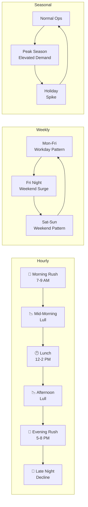
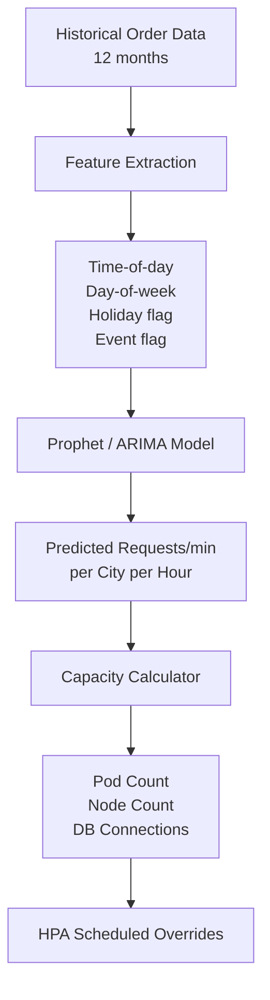
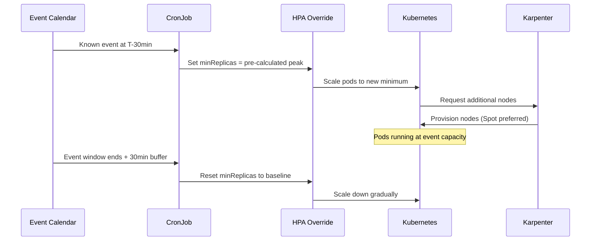
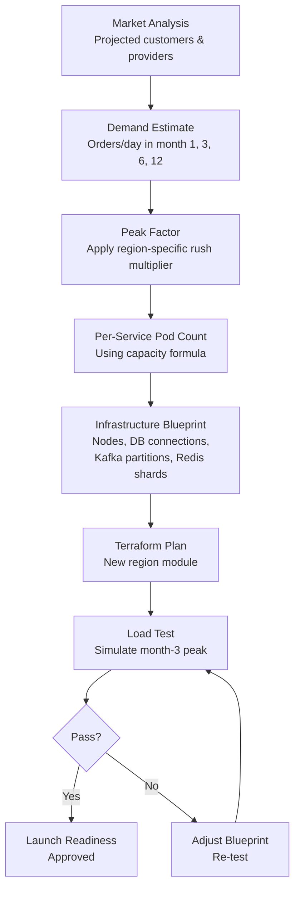

# 📊 Capacity Planning

  

---

## 📋 Table of Contents

1. [Why Capacity Planning Matters](#1-why-capacity-planning-matters)
2. [Demand Modeling](#2-demand-modeling)
3. [Per-Service Capacity Model](#3-per-service-capacity-model)
4. [Pre-Scaling Strategy](#4-pre-scaling-strategy)
5. [Kafka Partition Planning](#5-kafka-partition-planning)
6. [Database Capacity](#6-database-capacity)
7. [Load-Test-Driven Validation](#7-load-test-driven-validation)
8. [Capacity Review Cadence](#8-capacity-review-cadence)
9. [New Region Capacity Model](#9-new-region-capacity-model)

---

## 🎯 1. Why Capacity Planning Matters

Platform demand is **not random** - it is highly predictable. Rush hours, weekends, holidays, and promotional events create repeatable demand curves. Capacity planning exploits this predictability to ensure:

- **Customers always get served** - under-provisioned fulfillment infrastructure means dropped requests and lost revenue.
- **Providers stay connected** - WebSocket and location-ingestion infrastructure must handle peak concurrently-connected providers without degradation.
- **Costs stay controlled** - over-provisioning wastes money. Right-provisioning with pre-scaling for known peaks is the standard approach.
- **New region launches go smoothly** - every new region follows a capacity model that translates expected demand into infrastructure requirements before day one.

### Demand Characteristics

| Pattern | Example | Impact on Infrastructure |
|---------|---------|--------------------------|
| Daily rush hours | 7-9 AM, 5-8 PM | 3-4× baseline fulfillment load |
| Seasonal peaks | Holiday seasons, end-of-quarter | Sustained elevated demand |
| Weekend patterns | Friday-Saturday evenings | 2× baseline in high-activity zones |
| Promotional events | Flash sales, marketing campaigns | Shifted demand curve; 5× spikes during campaign windows |
| Holidays & events | NYE, major sporting events | Localized 10× spikes with <1 h ramp |

---

## 📊 2. Demand Modeling

### Demand Pattern Lifecycle



### Demand Forecast Pipeline



### Data Sources

| Source | Granularity | Retention |
|--------|-------------|-----------|
| Order events (Kafka) | Per-order | 12 months in S3 |
| Provider location pings | Per-second | 7 days hot, 90 days cold |
| API gateway request logs | Per-request | 30 days in CloudWatch, 12 months in S3 |
| Regional event calendar | Manual + scraped | Maintained by ops team |

---

## 📊 3. Per-Service Capacity Model

The capacity model translates **business demand** (orders/minute) into **infrastructure units** (pods → nodes).

### Conversion Table

| Service | Requests per Order | P99 Latency Target | Max RPS per Pod | Pod CPU Request | Pod Memory Request |
|---------|-------------------|---------------------|-----------------|-----------------|-------------------|
| API Gateway | 6 | 50 ms | 2,000 | 500m | 512Mi |
| Fulfillment Engine | 2 | 100 ms | 500 | 1,000m | 1Gi |
| Pricing Service | 3 | 80 ms | 1,200 | 500m | 512Mi |
| Order Service | 4 | 100 ms | 800 | 500m | 512Mi |
| Payment Service | 2 | 200 ms | 600 | 500m | 512Mi |
| Notification Service | 3 | 300 ms | 1,500 | 250m | 256Mi |
| Provider Location | 1/sec/provider | 30 ms | 3,000 | 500m | 512Mi |

### Capacity Formula

```
Peak orders/min × Requests per order = Required RPS
ceil(ceil(Required RPS / Max RPS per pod) × headroom factor) = Minimum pods
Minimum pods × Pod CPU / Node allocatable CPU = Minimum nodes
```

### Worked Example: Evening Rush

```
Peak: 800 orders/min
Fulfillment Engine: 800 × 2 = 1,600 RPS
Pods needed: ceil(ceil(1,600 / 500) × 1.2) = ceil(ceil(3.2) × 1.2) = ceil(4 × 1.2) = ceil(4.8) = 5 pods
Node capacity: 5 × 1000m / 3500m allocatable = 2 nodes (m6i.xlarge)
```

---

## 📊 4. Pre-Scaling Strategy

Kubernetes HPA reacts to load, but reaction time is too slow for demand spikes that ramp in minutes. We use **scheduled HPA overrides** for known demand events.

### HPA Override Architecture



### Pre-Scaling Calendar

| Event | Multiplier | Pre-Scale Lead Time | Services Affected |
|-------|------------|---------------------|-------------------|
| Daily morning rush | 3× | 30 min before | All |
| Daily evening rush | 4× | 30 min before | All |
| Friday night | 2.5× | 60 min before | Fulfillment, Order, Pricing |
| Seasonal peak | 5× | 45 min before | All |
| NYE | 10× | 2 h before midnight | All |
| Promotional event | 3-8× (manual) | 60 min before launch | Fulfillment, Order, Notification |

### Implementation

Pre-scaling configurations are stored as Kubernetes ConfigMaps and applied by CronJobs:

```yaml
apiVersion: v1
kind: ConfigMap
metadata:
  name: prescale-evening-rush
data:
  fulfillment-engine: "12"
  pricing-service: "8"
  order-service: "10"
  api-gateway: "6"
---
apiVersion: batch/v1
kind: CronJob
metadata:
  name: prescale-evening-rush
spec:
  schedule: "30 16 * * 1-5"  # 4:30 PM, Mon-Fri
  jobTemplate:
    spec:
      template:
        spec:
          containers:
            - name: prescaler
              image: {company}/hpa-override:{version}
              command: ["prescale", "--config", "prescale-evening-rush"]
          restartPolicy: OnFailure
```

---

## 📊 5. Kafka Partition Planning

Kafka partitions determine parallelism. Under-partitioned topics become bottlenecks; over-partitioned topics waste broker resources and increase rebalance time.

### Partition Sizing Formula

```
Partitions = max(
  ceil(Peak throughput MB/s / Per-partition throughput MB/s),
  Number of consumer instances at peak
)
```

### Topic Partition Plan

| Topic | Peak Msgs/sec | Avg Message Size | Partitions | Replication Factor | Retention |
|-------|---------------|------------------|------------|--------------------|-----------|
| `provider.location` | 50,000 | 200 B | 64 | 2 | 1 h |
| `order.events` | 5,000 | 2 KB | 32 | 3 | 72 h |
| `order.commands` | 3,000 | 1 KB | 16 | 3 | 24 h |
| `payment.events` | 2,000 | 1.5 KB | 16 | 3 | 168 h |
| `notification.requests` | 8,000 | 500 B | 32 | 2 | 4 h |
| `pricing.calculations` | 4,000 | 1 KB | 16 | 3 | 24 h |

### Partition Growth Policy

- Partitions can be increased but **never decreased** without topic recreation.
- Growth is reviewed quarterly alongside the capacity review.
- Any partition increase requires consumer group compatibility testing in staging.

---

## 📊 6. Database Capacity

### Aurora PostgreSQL

| Parameter | Production | Staging |
|-----------|-----------|---------|
| Instance class | `db.r6g.2xlarge` | `db.r6g.large` |
| Read replicas | 2 | 0 |
| Max connections | 2,000 | 200 |
| Storage autoscaling | 100 GB - 2 TB | 20 GB - 100 GB |
| Connection pooling | PgBouncer sidecar (transaction mode) | Direct |
| Backup retention | 35 days | 7 days |

**Connection budget:** Each microservice is allocated a connection pool ceiling to prevent connection exhaustion.

| Service | Max Pool Size | Typical Active |
|---------|---------------|----------------|
| Order Service | 100 | 40 |
| Payment Service | 80 | 30 |
| Pricing Service | 60 | 25 |
| Fulfillment Engine | 50 | 20 |
| All others (combined) | 200 | 80 |
| **Total** | **490** | **195** |

### Redis (ElastiCache)

| Cluster | Node Type | Nodes | Max Memory | Primary Use Case |
|---------|-----------|-------|------------|------------------|
| `provider-location` | `cache.r6g.xlarge` | 6 (3 shards × 2) | 78 GB | Geospatial provider index |
| `session-cache` | `cache.r6g.large` | 4 (2 shards × 2) | 26 GB | Session, pricing rules, region config |
| `distributed-lock` | `cache.r6g.medium` | 2 (1 shard × 2) | 6.5 GB | Redisson distributed locks |

---

## 🧪 7. Load-Test-Driven Validation

Every capacity model is validated by load testing before it is trusted. We use **Gatling** as the load testing framework.

### Load Test Strategy

| Test Type | Frequency | Duration | Target Load | Pass Criteria |
|-----------|-----------|----------|-------------|---------------|
| Baseline | Every release | 30 min | Current peak × 1.2 | P99 < target, 0 errors |
| Peak simulation | Monthly | 60 min | Predicted peak × 1.5 | P99 < 2× target, <0.1% errors |
| Spike test | Quarterly | 15 min ramp | 10× baseline in 5 min | Recovery <2 min, no data loss |
| Soak test | Quarterly | 8 h | Steady 1× baseline | No memory leaks, stable latency |

### Gatling Scenario Example

```scala
class FulfillmentEngineSimulation extends Simulation {

  val eveningRush = scenario("Evening Rush")
    .exec(
      http("Request Assignment")
        .post("/api/v1/fulfillment/request")
        .body(StringBody("""{"customerId":"${customerId}","dispatch":{"lat":40.7128,"lng":-74.0060}}"""))
        .check(status.is(200))
        .check(jsonPath("$.assignmentId").saveAs("assignmentId"))
    )
    .pause(200.milliseconds)
    .exec(
      http("Accept Assignment")
        .post("/api/v1/fulfillment/${assignmentId}/accept")
        .check(status.is(200))
    )

  setUp(
    eveningRush.inject(
      rampUsersPerSec(10).to(800).during(5.minutes),
      constantUsersPerSec(800).during(30.minutes),
      rampUsersPerSec(800).to(10).during(5.minutes)
    )
  ).protocols(httpProtocol)
   .assertions(
     global.responseTime.percentile(99).lt(100),
     global.failedRequests.percent.lt(0.1)
   )
}
```

### Results Flow

Load test results are stored in S3 and published to the `#capacity-planning` Slack channel. Failed tests block production capacity changes.

---

## 🔄 8. Capacity Review Cadence

| Cadence | Activity | Participants |
|---------|----------|--------------|
| **Weekly** | Automated capacity utilization report (Grafana → Slack) | Platform Engineering (async) |
| **Monthly** | Capacity review meeting: utilization trends, upcoming events, partition/DB growth | Platform Eng + service leads |
| **Quarterly** | Full capacity planning cycle: model refresh, load tests, Kafka/DB scaling decisions | Platform Eng + VP Engineering |
| **Pre-event** | Ad-hoc pre-scaling review for large events (concerts, national holidays) | Platform Eng + Ops |

### Monthly Review Checklist

- [ ] Review CPU/memory utilization vs. requests for each service.
- [ ] Check HPA scaling events - are we hitting maxReplicas too often?
- [ ] Review Kafka consumer lag trends per topic.
- [ ] Check Aurora connection pool utilization and query latency.
- [ ] Check Redis memory utilization and eviction rates.
- [ ] Review upcoming events for the next 30 days - do we need pre-scaling configs?
- [ ] Update capacity model with latest load test results.

---

## 📊 9. New Region Capacity Model

When the platform launches in a new region, the capacity model provides a **day-one infrastructure blueprint** based on projected demand.

### Region Sizing Workflow



### Region T-Shirt Sizing

| Size | Projected Orders/Day | Example Regions | EKS Nodes | Aurora Instance | Redis Shards |
|------|---------------------|----------------|-----------|-----------------|--------------|
| **S** | <5,000 | Small metro areas | 4 | db.r6g.large | 1 |
| **M** | 5,000-20,000 | Mid-size markets | 8 | db.r6g.xlarge | 2 |
| **L** | 20,000-100,000 | Major metro areas | 16 | db.r6g.2xlarge | 3 |
| **XL** | >100,000 | Multi-region aggregate | 32+ | db.r6g.4xlarge | 6 |

### Launch Checklist Infrastructure Items

- [ ] Terraform module for region deployed.
- [ ] Kafka topics created with correct partition counts.
- [ ] Aurora read replica in region's nearest AZ.
- [ ] Redis cluster warmed with region config and pricing rules.
- [ ] Gatling load test passes at projected month-3 peak.
- [ ] Pre-scaling CronJobs configured for region's rush hours.
- [ ] Monitoring dashboards provisioned in Grafana.
- [ ] PagerDuty escalation policy includes region ops lead.

### Related Documents

- [FinOps](./05-finops.md) - cost visibility, unit economics, and cloud spend guardrails
- [Deployment Architecture](./11-deployment-architecture.md) - GitOps, environments, and release mechanics

---
<div align="center">

⬅️ [Back to section](./README.md) · 🏠 [Back to root](../README.md)

</div>
