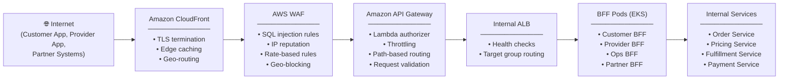
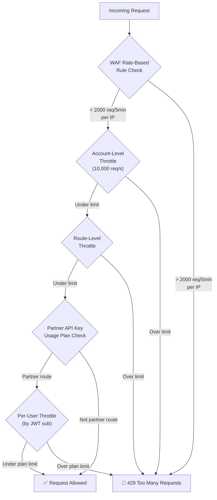
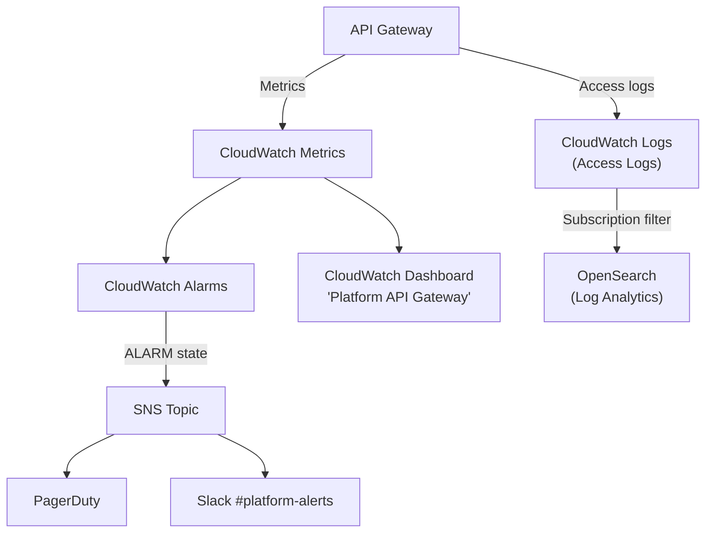

# 🚪 API Gateway Strategy

  

---

## 🎯 1. Overview

Amazon API Gateway sits at the edge of the platform. It is the **single entry point** for all external traffic - mobile apps, partner integrations, and internal operations dashboards alike.

API Gateway owns the following responsibilities at the edge:

| Concern | Description |
|---|---|
| **TLS Termination** | All external connections terminate TLS at CloudFront / API Gateway. Internal traffic uses mTLS. |
| **Authentication** | Lambda authorizer validates JWTs before requests reach any backend service. |
| **Rate Limiting** | Per-client throttling protects backend services from traffic spikes and abuse. |
| **Request Routing** | Path-based routing directs traffic to the correct BFF (Backend-for-Frontend) service. |
| **WAF Integration** | AWS WAF sits in front of API Gateway to block malicious payloads and bot traffic. |
| **API Versioning** | Stage-based versioning (v1, v2) with header-based version negotiation for partner APIs. |
| **Throttling** | Burst and sustained rate limits are enforced per API key (partners) and per user (customers/providers). |

> **Principle:** No external request reaches an internal microservice without passing through API Gateway. There are zero exceptions.

---

## 🚪 2. Architecture

The following diagram shows the full request path from the internet to internal platform services, and where each cross-cutting concern is handled.



**Key design decisions:**

- CloudFront handles TLS and edge caching - API Gateway never receives unencrypted traffic.
- WAF inspects every request *before* it reaches API Gateway, so malicious traffic is dropped early.
- API Gateway performs authentication and routing - the cheapest operations happen last to avoid wasting compute on blocked requests.
- BFF pods are the only services exposed to API Gateway. All internal services are only accessible within the VPC.

---

## 🚪 3. API Gateway Type Selection

We use **two** API Gateway types for different purposes:

| API Gateway Type | Use Case | Reason |
|---|---|---|
| **HTTP API** | BFF routing (customer, provider, ops apps) | Lower cost (~70% cheaper), lower latency (~60% faster), sufficient feature set |
| **REST API** | Partner APIs requiring usage plans | API key management, usage plans, per-key throttling, request/response transformation |

### When to use HTTP API (default)

- All platform-owned client apps (customer, provider, ops dashboard)
- Internal tools
- Any route that authenticates via JWT

### When to use REST API

- Partner integrations that require API key issuance
- Routes that need usage plans (tiered rate limits per partner)
- Routes requiring request/response mapping templates

> **Rule:** Default to HTTP API. REST API requires justification and Platform Engineering approval.

---

## 🚪 4. Routing Configuration

### Path-Based Routing

All external routes are mapped to the appropriate BFF service via path prefix:

| Path Prefix | Target | BFF Service | ALB Target Group |
|---|---|---|---|
| `/customer/*` | Customer-facing features | Customer BFF | `tg-customer-bff` |
| `/provider/*` | Provider-facing features | Provider BFF | `tg-provider-bff` |
| `/ops/*` | Operations dashboard | Ops BFF | `tg-ops-bff` |
| `/partner/*` | Partner integrations | Partner BFF | `tg-partner-bff` |

### Stage-Based Deployment

Each environment has its own API Gateway stage:

| Stage | Domain | Purpose |
|---|---|---|
| `dev` | `api-dev.{company}.app` | Development and integration testing |
| `staging` | `api-staging.{company}.app` | Pre-production validation |
| `prod` | `api.{company}.app` | Production traffic |

### Terraform Example - Route Configuration

```hcl
resource "aws_apigatewayv2_api" "platform_http_api" {
  name          = "{company}-platform-api"
  protocol_type = "HTTP"
  description   = "Platform HTTP API - routes to BFF services"

  cors_configuration {
    allow_origins = var.allowed_origins
    allow_methods = ["GET", "POST", "PUT", "DELETE", "OPTIONS"]
    allow_headers = ["Authorization", "Content-Type", "X-Request-ID"]
    max_age       = 3600
  }
}

resource "aws_apigatewayv2_integration" "customer_bff" {
  api_id             = aws_apigatewayv2_api.platform_http_api.id
  integration_type   = "HTTP_PROXY"
  integration_uri    = aws_lb_listener.customer_bff.arn
  integration_method = "ANY"
  connection_type    = "VPC_LINK"
  connection_id      = aws_apigatewayv2_vpc_link.internal.id
}

resource "aws_apigatewayv2_route" "customer_routes" {
  api_id    = aws_apigatewayv2_api.platform_http_api.id
  route_key = "ANY /customer/{proxy+}"
  target    = "integrations/${aws_apigatewayv2_integration.customer_bff.id}"

  authorization_type = "CUSTOM"
  authorizer_id      = aws_apigatewayv2_authorizer.jwt_authorizer.id
}

resource "aws_apigatewayv2_stage" "prod" {
  api_id      = aws_apigatewayv2_api.platform_http_api.id
  name        = "prod"
  auto_deploy = false

  default_route_settings {
    throttling_burst_limit = 5000
    throttling_rate_limit  = 10000
  }

  access_log_settings {
    destination_arn = aws_cloudwatch_log_group.apigw_access_logs.arn
    format = jsonencode({
      requestId      = "$context.requestId"
      ip             = "$context.identity.sourceIp"
      requestTime    = "$context.requestTime"
      httpMethod     = "$context.httpMethod"
      routeKey       = "$context.routeKey"
      status         = "$context.status"
      protocol       = "$context.protocol"
      responseLength = "$context.responseLength"
      latency        = "$context.integrationLatency"
    })
  }
}
```

---

## 🔒 5. Authentication

### Lambda Authorizer

All authenticated routes use a **Lambda authorizer** that validates JWTs issued by the Auth Service (backed by Amazon Cognito).

**Validation steps performed by the authorizer:**

1. Extract the `Authorization: Bearer <token>` header.
2. Decode the JWT header to determine the signing key ID (`kid`).
3. Fetch the public key from the JWKS endpoint (cached in Lambda memory).
4. **Validate the JWT signature** using RS256.
5. **Validate expiry** - reject tokens where `exp` < current time.
6. **Validate issuer** - `iss` must match the Cognito user pool.
7. **Validate audience** - `aud` must match the expected client ID.
8. Extract claims (`sub`, `role`, `tenant`) and return an IAM policy.

### Authorization Response

The authorizer returns an IAM policy document:

```json
{
  "principalId": "customer-uuid-1234",
  "policyDocument": {
    "Version": "2012-10-17",
    "Statement": [
      {
        "Action": "execute-api:Invoke",
        "Effect": "Allow",
        "Resource": "arn:aws:execute-api:eu-west-1:*:*/prod/ANY/customer/*"
      }
    ]
  },
  "context": {
    "userId": "customer-uuid-1234",
    "role": "customer",
    "tenant": "default"
  }
}
```

### Auth Result Caching

- **Cache TTL:** 300 seconds (5 minutes).
- **Cache key:** The full `Authorization` header value.
- Caching avoids invoking the Lambda authorizer on every request from the same user within the TTL window, reducing cost and latency.

> **Security note:** If a token is revoked, the revocation takes effect after the cache TTL expires. For immediate revocation (e.g., account compromise), the team must invalidate the API Gateway authorizer cache via API call.

---

## ⚖️ 6. Rate Limiting & Throttling

### Throttling Model



### Throttle Configuration

| Level | Burst Limit | Sustained Rate | Scope |
|---|---|---|---|
| **Account** | 10,000 req/s | 5,000 req/s | All routes combined |
| **Customer routes** | 3,000 req/s | 2,000 req/s | `/customer/*` |
| **Provider routes** | 3,000 req/s | 2,000 req/s | `/provider/*` |
| **Ops routes** | 1,000 req/s | 500 req/s | `/ops/*` |
| **Partner routes** | Per usage plan | Per usage plan | `/partner/*` |

### Partner Usage Plans

| Tier | Requests / Month | Burst | Rate (req/s) | Cost |
|---|---|---|---|---|
| **Free** | 10,000 | 10 | 5 | $0 |
| **Standard** | 500,000 | 100 | 50 | Negotiated |
| **Enterprise** | 5,000,000 | 1,000 | 500 | Negotiated |

> **Burst vs Sustained:** Burst limit allows short spikes (e.g., app launch). Sustained rate is the steady-state maximum. API Gateway uses the token bucket algorithm - burst fills the bucket, sustained is the refill rate.

---

## 🔒 7. WAF Integration

AWS WAF is attached to the CloudFront distribution that fronts API Gateway.

### Managed Rule Groups

| Rule Group | Purpose |
|---|---|
| `AWSManagedRulesCommonRuleSet` | OWASP Top 10 protections (XSS, path traversal, etc.) |
| `AWSManagedRulesSQLiRuleSet` | SQL injection detection and blocking |
| `AWSManagedRulesKnownBadInputsRuleSet` | Log4j, request smuggling, and other known exploits |
| `AWSManagedRulesAmazonIpReputationList` | Blocks requests from known-bad IP addresses |
| `AWSManagedRulesBotControlRuleSet` | Bot detection and classification |

### Custom Rules

| Rule | Action | Description |
|---|---|---|
| **Geo-blocking** | Block | Block traffic from countries where the platform does not operate |
| **Rate-based (IP)** | Block | Block IPs exceeding 2,000 requests per 5 minutes |
| **Anti-scraping** | Block | Block requests with missing or forged `User-Agent`, rapid sequential access to listing endpoints |
| **Payload size** | Block | Block requests with body > 10 MB |

### Rule Priority Order

1. IP reputation list (block known-bad IPs immediately)
2. Geo-blocking (drop disallowed regions)
3. Rate-based rules (block abusive IPs)
4. Managed rule sets (SQL injection, XSS, bad inputs)
5. Custom anti-scraping rules
6. Default: Allow

---

## 🚪 8. Request/Response Transformation

### Request Header Injection

API Gateway injects the following headers into every request forwarded to the backend:

| Header | Source | Purpose |
|---|---|---|
| `X-Request-ID` | Generated by API Gateway (`$context.requestId`) | Unique identifier for the request, used for tracing |
| `X-Correlation-ID` | Passed through from client, or generated if absent | End-to-end correlation across async flows |
| `X-Forwarded-For` | Client IP address | Preserves the original client IP for logging and geo-lookup |
| `X-{Company}-User-Id` | Extracted from JWT by Lambda authorizer | Authenticated user ID passed as a trusted header |
| `X-{Company}-User-Role` | Extracted from JWT by Lambda authorizer | User role (customer, provider, ops, partner) |

### Response Header Cleanup

API Gateway strips the following headers from responses before returning to clients:

- `X-Powered-By`
- `Server`
- Any header prefixed with `X-Internal-`
- `X-Amzn-Trace-Id` (replaced with the platform's own trace format)

### Payload Size Limits

| Direction | Limit | Enforcement |
|---|---|---|
| Request body | 10 MB | API Gateway + WAF |
| Response body | 10 MB | API Gateway |
| Request headers | 10 KB | API Gateway |
| URL length | 8,192 characters | API Gateway |

---

## 📡 9. Monitoring

### CloudWatch Metrics

| Metric | Description | Alert Threshold |
|---|---|---|
| `4XXError` rate | Client error rate (auth failures, bad requests, throttles) | > 5% of total requests |
| `5XXError` rate | Server error rate (backend failures, timeouts) | > 1% of total requests |
| `Latency` P50 | Median response latency | > 100 ms |
| `Latency` P99 | 99th percentile latency | > 2,000 ms |
| `Count` | Total request count | Anomaly detection (±3σ) |
| `IntegrationLatency` P99 | Backend response time | > 5,000 ms |
| `CacheHitCount` | Authorizer cache hits | Monitor for sudden drops |
| `CacheMissCount` | Authorizer cache misses | Monitor for sudden spikes |

### Monitoring Flow



### Alert Rules

| Alert | Condition | Severity | Action |
|---|---|---|---|
| High 5XX rate | `5XXError` > 1% for 5 minutes | P1 (Critical) | Page on-call engineer |
| High latency | P99 > 5 s for 10 minutes | P2 (High) | Notify Slack, investigate |
| Throttle spike | `ThrottleCount` > 1,000 in 1 minute | P3 (Medium) | Notify Slack |
| Auth failure spike | `4XXError` (401/403) > 10% for 5 minutes | P2 (High) | Notify Slack, check for attack |
| WAF block spike | WAF `BlockedRequests` > 5,000 in 5 minutes | P3 (Medium) | Review WAF logs |

---

## 💰 10. Cost Optimization

### API Caching (GET Endpoints)

API Gateway response caching is enabled for selected GET endpoints to reduce backend load and cost.

| Route Pattern | Cache TTL | Justification |
|---|---|---|
| `GET /customer/config` | 300 s | App config changes infrequently |
| `GET /customer/promotions` | 60 s | Promotions update hourly at most |
| `GET /partner/price-estimates` | 30 s | Price estimates change, but short caching is acceptable |
| `GET /ops/dashboard/summary` | 120 s | Dashboard data is aggregated, slight staleness is acceptable |

**Cache invalidation:** Caches can be invalidated via the `Cache-Control: max-age=0` header sent by authorized clients, or by deploying a new stage.

### Additional Cost Measures

| Measure | Impact |
|---|---|
| **HTTP API over REST API** | ~70% lower cost per request for BFF routes |
| **Payload compression** | Enable gzip compression to reduce data transfer costs |
| **Connection reuse** | Keep-alive connections to ALB targets reduce connection setup overhead |
| **Authorizer caching** | 300 s cache avoids ~95% of Lambda authorizer invocations |
| **Budget alerts** | AWS Budgets alert at 80% and 100% of monthly API Gateway spend target |

---

## ☁️ 11. Terraform Standards

### Rules

1. **All API Gateway configuration is managed in Terraform.** No console changes. Ever.
2. Changes are applied via CI/CD pipeline (`terraform plan` on PR, `terraform apply` on merge).
3. State is stored in S3 with DynamoDB locking.
4. Drift detection runs daily - any console-applied change triggers a P3 alert.

### Module Structure

```
modules/
  api-gateway/
    main.tf            # API, stages, deployment
    routes.tf          # Route definitions and integrations
    authorizer.tf      # Lambda authorizer configuration
    throttling.tf      # Rate limits and usage plans
    waf.tf             # WAF WebACL association
    monitoring.tf      # CloudWatch alarms and dashboard
    variables.tf       # Input variables
    outputs.tf         # Exported values (API endpoint, etc.)
```

### Terraform Snippet - Basic Route with Authorizer

```hcl
module "customer_bff_route" {
  source = "../../modules/api-gateway"

  api_name    = "{company}-platform-api"
  environment = var.environment
  route_key   = "ANY /customer/{proxy+}"

  integration_config = {
    type          = "HTTP_PROXY"
    uri           = module.customer_bff_alb.listener_arn
    connection_id = module.vpc_link.id
  }

  authorizer_config = {
    type                            = "REQUEST"
    authorizer_uri                  = module.jwt_authorizer_lambda.invoke_arn
    authorizer_result_ttl_in_seconds = 300
    identity_sources                = ["$request.header.Authorization"]
  }

  throttle_config = {
    burst_limit = 3000
    rate_limit  = 2000
  }

  tags = {
    Team        = "platform-engineering"
    Service     = "api-gateway"
    Environment = var.environment
    ManagedBy   = "terraform"
  }
}
```

---

<div align="center">

⬅️ [Back to section](./README.md) · 🏠 [Back to root](../README.md)

</div>
