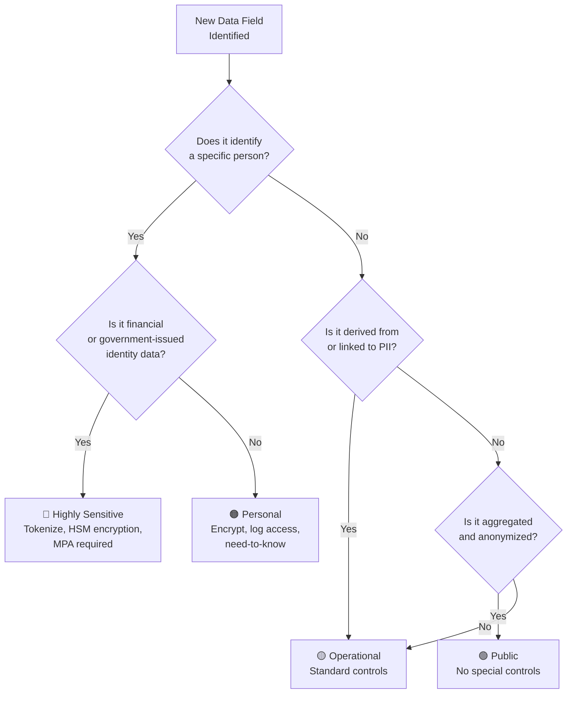
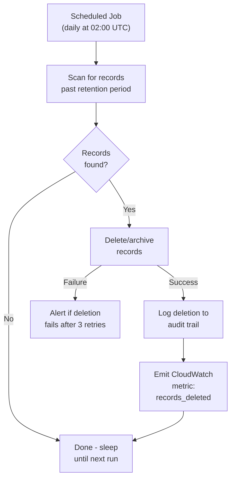
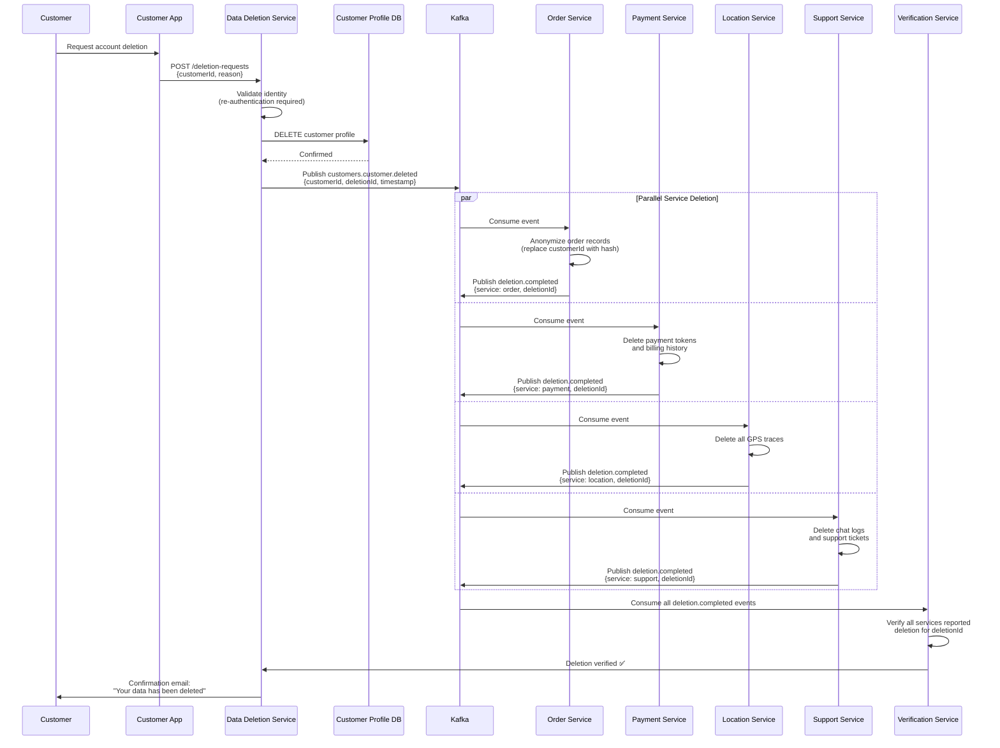
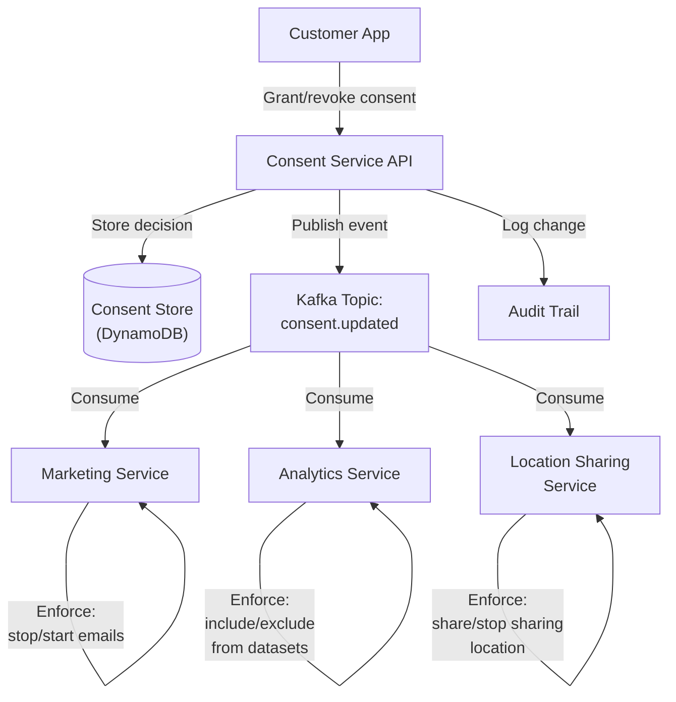

# 🛡️ Privacy Engineering

  

> **Disclaimer:** This document describes technical implementation patterns for privacy and compliance. It is not legal advice. Consult your organization's legal counsel.

---

## 🎯 1. Philosophy

**Privacy by design and by default.**

Every feature that collects or processes personal data must be evaluated for privacy impact *before* development begins - not after launch, not retroactively, not "when we get to it."

The platform handles **real-time location data for millions of people** - customers, providers, and operations staff across multiple countries. This is a profound responsibility. A location trace can reveal where someone lives, works, worships, and whom they visit. We treat this data with the gravity it demands.

### Core Principles

> **Principles (cloud-agnostic):** GDPR, PCI, retention, anonymization, consent, and cross-border transfer rules do not depend on a single cloud. Where this document names **AWS regions**, **CloudTrail**, **Config**, **DynamoDB**, or **SCPs**, treat them as **reference implementation (AWS)** and map to your provider's regions, audit logs, policy guardrails, and data stores.

| Principle | What It Means for the Platform |
|---|---|
| **Data Minimization** | Collect only what is necessary for the feature. If you don't need it, don't collect it. |
| **Purpose Limitation** | Data collected for order routing must not be repurposed for marketing without explicit consent. |
| **Storage Limitation** | Every data type has a defined retention period. Data is deleted automatically when the period expires. |
| **Integrity & Confidentiality** | PII is encrypted at rest and in transit. Access is logged and reviewed. |
| **Accountability** | Every service owner is responsible for the PII their service handles. Ignorance is not a defense. |

> **Non-negotiable:** No engineer should be able to query a customer's full location history from a production database. The system is designed to make this impossible without triggering alerts and requiring justification.

---

## 🛡️ 2. Data Classification

All data on the platform is classified into one of four levels. The classification determines the controls applied.

| Level | Examples | Controls |
|---|---|---|
| **Highly Sensitive** | Payment card data, national ID numbers, provider license images | Tokenized (never stored raw), HSM-backed encryption, access requires MPA (multi-party authorization) |
| **Personal** | Name, email, phone number, location history, order routes | Encrypted at rest (AES-256), access logged in audit trail, need-to-know access only |
| **Operational** | Order IDs, timestamps, service metrics, vehicle types | Standard encryption at rest, standard access controls |
| **Public** | Aggregated average ratings, region-level order counts, price range estimates | No special controls beyond standard infrastructure security |

### Classification Decision Flow



> **Rule:** When in doubt, classify higher. Downgrading requires a written justification reviewed by the Privacy Engineering lead and Legal.

---

## 🛡️ 3. Privacy Impact Assessment (PIA)

### When Is a PIA Required?

A PIA is required for any change that:

- Introduces **new PII collection** (a new field, a new data source)
- Changes **how existing PII is processed** (new service consumes PII it didn't before)
- Changes **data retention** (extending or shortening retention periods)
- Introduces **new cross-border data flows** (data moves to a new cloud region)
- Shares **PII with a third party** (new vendor, new partner integration)

### PIA Template

| Question | Expected Answer |
|---|---|
| **What data is being collected?** | Specific field names and data types |
| **Why is it needed?** | Business justification tied to a feature or legal requirement |
| **How long will it be retained?** | Defined retention period with automated deletion |
| **Who has access?** | Named teams/roles with IAM policy references |
| **Can we minimize?** | Can we achieve the goal with less data, anonymized data, or aggregated data? |
| **Are there cross-border implications?** | Does data leave the customer's region? |
| **What happens on deletion request?** | How is this data deleted when a customer exercises right to erasure? |

### PIA Review Process

1. Engineer fills out PIA template as part of the feature design document.
2. Privacy Engineering lead reviews within 3 business days.
3. Legal reviews if cross-border transfer or third-party sharing is involved.
4. Approved PIA is stored in the PIA registry (Confluence, linked from the Jira epic).
5. PIA is re-reviewed annually or when the feature changes significantly.

---

## 🛡️ 4. Anonymization Patterns

### k-Anonymity for Analytics

Before any data is exported for analytics or shared with external partners, it must be aggregated to ensure **k-anonymity** where k ≥ 5. This means any combination of quasi-identifiers in the dataset must match at least 5 individuals.

**Example:** Order origin/destination analytics are aggregated to H3 hexagon resolution 7 (~5 km²). If a hexagon has fewer than 5 orders in the time window, it is merged with adjacent hexagons.

### Pseudonymization for Internal Processing

For internal systems that need to process data across services without exposing raw PII:

- Replace PII fields with **opaque tokens** generated by the Privacy Service.
- Tokens are reversible **only** by the Privacy Service, which requires an authenticated request with a logged justification.
- Pseudonymized data can be processed by analytics pipelines, ML training jobs, and reporting services without exposing real PII.

### Differential Privacy for Location Analytics

For location-based analytics (heatmaps, demand forecasting):

- **Laplacian noise** is added to aggregated location counts before they are surfaced in dashboards or exported.
- The privacy budget (ε) is set to 1.0 per query, with a daily budget cap of 10.0.
- This prevents reconstruction of individual order routes from aggregate data, even with auxiliary information.

---

## 🛡️ 5. Data Retention & Deletion

### Retention Policies

| Data Type | Retention Period | Justification | Deletion Method |
|---|---|---|---|
| **Order data** (route, price, timestamps) | 7 years | Tax and regulatory compliance | Automated archival → deletion after 7 years |
| **Location history** (GPS traces) | 90 days | Dispute resolution, service quality | TTL-based deletion in DynamoDB |
| **Payment tokens** | Until customer deletes payment method | Required for recurring charges | Deleted via Payment Service on customer action |
| **Support chat logs** | 2 years | Dispute resolution, training | Automated deletion via scheduled job |
| **Provider license images** | Duration of provider engagement + 1 year | Regulatory requirement | Deleted on provider offboarding |
| **Anonymized analytics** | Indefinite | No PII, used for long-term trend analysis | Not deleted |

### Retention Enforcement Flow



> **Rule:** No data type may exist without a defined retention period. The `data-retention-registry` table in DynamoDB is the source of truth.

---

## 🛡️ 6. Right to Erasure (GDPR Article 17)

When a customer requests deletion of their account and personal data, the platform executes a **cross-service cascade deletion**.

### Deletion Sequence



### Key Design Decisions

- **Re-authentication required:** The customer must re-authenticate before deletion proceeds, to prevent unauthorized deletion.
- **Anonymization over hard-delete for orders:** Order records are anonymized (customer ID replaced with a non-reversible hash) rather than deleted, because order financial data has a 7-year regulatory retention requirement. The anonymized records cannot be linked back to the customer.
- **Kafka tombstone events:** After the `customers.customer.deleted` event is published, a **tombstone record** (null value with the customer ID as key) is published to the CDC pipeline. This ensures the deletion propagates to any downstream system consuming the CDC stream.
- **Verification step:** The Verification Service ensures *every* downstream service has confirmed deletion before the customer is notified. If any service fails to confirm within 72 hours, a P2 alert is raised.
- **SLA:** Deletion completes within 30 days (GDPR maximum), with a target of 72 hours.

---

## 🛡️ 7. Consent Management

### Consent Service Architecture



### Consent Types

| Consent Type | Description | Default | Revocable? |
|---|---|---|---|
| **Marketing communications** | Email/push notifications for promotions | Opt-out (not granted by default) | Yes, at any time |
| **Location sharing with contacts** | Share live order location with emergency contacts | Opt-in per order | Yes, at any time |
| **Data analytics participation** | Include customer's anonymized data in analytics | Opt-out | Yes, at any time |
| **Third-party data sharing** | Share data with partner companies | Opt-in (explicit) | Yes, at any time |

### Consent Event Schema

```json
{
  "eventType": "consent.updated",
  "customerId": "customer-uuid-1234",
  "consentType": "marketing",
  "granted": false,
  "timestamp": "2026-06-15T10:30:00Z",
  "source": "customer-app-settings",
  "version": 3
}
```

### Enforcement Rules

1. **No service may assume consent.** Every service must check the Consent Service (or its local cache of consent events) before processing data that depends on consent.
2. **Consent changes are eventually consistent.** Services consume the `consent.updated` Kafka topic and update their local state. Maximum propagation delay: 60 seconds.
3. **Consent is versioned.** Each consent change increments a version number. Services must process events in order and reject out-of-order updates.

---

## ⚠️ 8. PII in Logs and Caches

### Logging Rules

**PII must NEVER appear in application logs.** This is a non-negotiable, zero-tolerance rule.

| Rule | Implementation |
|---|---|
| **No PII in log messages** | Platform-provided Logback configuration includes a `PiiMaskingFilter` that detects and masks common PII patterns (email, phone, national ID). |
| **No PII in structured log fields** | Code reviews enforce that fields like `userId` use opaque IDs (UUIDs), not names or emails. |
| **No PII in exception messages** | Exception handlers must strip PII before logging. Use the `SafeException` wrapper. |
| **Log scanning** | A weekly automated scan of CloudWatch Logs searches for PII patterns. Matches trigger a P2 alert. |

### Logback PII Masking Configuration

```xml
<appender name="CONSOLE" class="ch.qos.logback.core.ConsoleAppender">
  <encoder class="net.logstash.logback.encoder.LogstashEncoder">
    <jsonGeneratorDecorator class="com.{company}.logging.PiiMaskingDecorator"/>
    <fieldNames>
      <timestamp>@timestamp</timestamp>
      <version>[ignore]</version>
    </fieldNames>
  </encoder>
</appender>
```

### Caching Rules

| Rule | Reason |
|---|---|
| **PII must not be used as Redis cache keys** | Cache keys appear in monitoring dashboards, slow-query logs, and memory dumps. Use hashed or tokenized identifiers. |
| **PII must not appear in Kafka message keys** | Keys are used for partitioning and are visible in topic metadata and consumer lag dashboards. Use opaque IDs. |
| **PII fields in Kafka message values must be minimal and documented** | Only include PII in the message value if it is strictly necessary for the consumer. Document which fields contain PII in the schema registry. |
| **PII must not appear in URL paths or query strings** | URLs appear in access logs, CDN logs, and browser history. Use request body for PII. |

---

## 🛡️ 9. Cross-Border Data Transfer

### Data Residency Rules

**Reference implementation (AWS):** concrete region IDs and SCP enforcement; define the same allow-lists with your cloud's policy mechanisms.

| Customer Region | Allowed AWS Regions | Enforcement |
|---|---|---|
| **European Union** | `eu-west-1` (Ireland), `eu-central-1` (Frankfurt) | SCP denies resource creation outside allowed regions |
| **Americas** | `us-east-1` (N. Virginia), `us-west-2` (Oregon) | SCP denies resource creation outside allowed regions |
| **Other regions** | `eu-west-1` (default), or region-specific as regulations require | Per-country assessment |

### Service Control Policy (SCP) Example

**Reference implementation (AWS):** SCPs; on GCP use **Organization policies / VPC Service Controls**; on Azure use **Azure Policy** at management-group scope for the same region lock.

```json
{
  "Version": "2012-10-17",
  "Statement": [
    {
      "Sid": "DenyNonEURegionsForEUAccount",
      "Effect": "Deny",
      "Action": "*",
      "Resource": "*",
      "Condition": {
        "StringNotEquals": {
          "aws:RequestedRegion": [
            "eu-west-1",
            "eu-central-1"
          ]
        }
      }
    }
  ]
}
```

### Transfer Impact Assessment

Before any new data flow that crosses regional boundaries, a **Transfer Impact Assessment (TIA)** is required:

1. What data is being transferred?
2. From which region to which region?
3. What is the legal basis for the transfer? (adequacy decision, SCCs, binding corporate rules)
4. Are there supplementary measures in place? (encryption in transit, access restrictions)
5. Has Legal approved?

> **Rule:** No cross-border data flow may be deployed to production without a completed TIA approved by Legal.

---

## 👁️ 10. Audit Trail

**Reference implementation (AWS):** CloudTrail, RDS audit, DynamoDB Streams as named below; use **GCP Cloud Audit Logs**, **Azure Activity / resource logs**, and equivalent DB audit features elsewhere.

### What Is Logged

| Layer | What Is Logged | Tool |
|---|---|---|
| **AWS-level access** | API calls to AWS services (S3, DynamoDB, RDS, etc.) | AWS CloudTrail |
| **Application-level PII access** | Every read/write to PII-containing endpoints | Application audit logger → CloudWatch Logs → OpenSearch |
| **Database-level access** | Queries to PII-containing tables | RDS audit log plugin / DynamoDB Streams |
| **Console access** | AWS Management Console logins and actions | CloudTrail + SSO audit logs |

### Application Audit Log Format

```json
{
  "timestamp": "2026-06-15T10:30:00Z",
  "actor": "engineer-uuid-5678",
  "actorRole": "support-agent",
  "action": "READ",
  "resource": "customer-profile",
  "resourceId": "customer-uuid-1234",
  "justification": "Support ticket PLAT-45231",
  "sourceIp": "10.0.5.42",
  "service": "customer-service",
  "result": "ALLOWED"
}
```

### Quarterly Access Review

Every quarter, the Security team conducts an access review:

1. Pull all PII access logs for the quarter.
2. Flag anomalies (bulk access, access outside working hours, access without support ticket).
3. Review flagged entries with the relevant team lead.
4. Revoke access for any engineer who no longer needs it (role change, team change, offboarding).
5. Publish review summary to the Privacy Engineering channel.

---

## 📋 11. Compliance Mapping

### GDPR Compliance

| GDPR Article | Requirement | Platform Control |
|---|---|---|
| Art. 5(1)(a) | Lawfulness, fairness, transparency | Privacy policy, consent management service |
| Art. 5(1)(b) | Purpose limitation | Data classification, PIA process |
| Art. 5(1)(c) | Data minimization | PIA template "Can we minimize?" question, code review checks |
| Art. 5(1)(e) | Storage limitation | Automated retention and TTL-based deletion |
| Art. 6 | Lawful basis for processing | Consent service, contractual necessity for order data |
| Art. 17 | Right to erasure | Cross-service deletion cascade (Section 6) |
| Art. 20 | Right to data portability | Data export API in Customer App settings |
| Art. 25 | Data protection by design | PIA required before development, privacy-first architecture |
| Art. 32 | Security of processing | Encryption at rest/in transit, access controls, audit trail |
| Art. 33 | Breach notification | Incident response plan, 72-hour notification SLA |
| Art. 35 | Data protection impact assessment | PIA process (Section 3) |
| Art. 44-49 | Cross-border transfers | Data residency rules, SCPs, TIA process (Section 9) |

### PCI-DSS Compliance

| PCI-DSS Requirement | Description | Platform Control |
|---|---|---|
| Req. 3 | Protect stored cardholder data | Payment data tokenized via PSP (Stripe/Checkout.com); the platform never stores raw card data |
| Req. 4 | Encrypt transmission of cardholder data | TLS 1.2+ for all external traffic; mTLS for internal |
| Req. 6 | Develop secure systems | SAST/DAST in CI pipeline, dependency scanning, code review |
| Req. 7 | Restrict access to cardholder data | IAM least privilege, MPA for payment service access |
| Req. 8 | Identify and authenticate access | SSO with MFA for all engineers, service-to-service mTLS |
| Req. 10 | Track and monitor access | CloudTrail, application audit logs, quarterly access review |
| Req. 11 | Regular security testing | Annual penetration test, quarterly vulnerability scans |
| Req. 12 | Maintain information security policy | This manifesto, security training, incident response plan |

### SOC 2 Trust Services Criteria Mapping

| Criteria | Category | Status |
|---|---|---|
| CC6.1 | Logical and physical access controls | ✅ Implemented |
| CC6.2 | System access authorization | ✅ Implemented |
| CC6.3 | Role-based access control | ✅ Implemented |
| CC7.1 | System monitoring | ✅ Implemented |
| CC7.2 | Incident detection and response | ✅ Implemented |
| CC8.1 | Change management | ✅ Implemented |
| A1.1 | Availability commitments | ✅ Implemented |
| PI1.1 | Processing integrity | ✅ Implemented |
| C1.1 | Confidentiality commitments | ✅ Implemented |
| P1.1-P8.1 | Privacy criteria | ✅ Implemented |

---

## 📋 12. Compliance Frameworks & Audit Readiness

### 12.1 Framework Coverage

| Framework | Status | Notes |
|-----------|--------|-------|
| **GDPR** | ✅ Implemented | Full compliance - see Sections 3-9 of this document |
| **PCI-DSS** | ✅ Implemented | Payment data tokenized via PSP; platform never stores raw card data |
| **SOC 2 Type II** | ✅ Implemented | Annual audit cycle; trust services criteria mapped in Section 11 |
| **ISO 27001** | 🟡 Target | Certification targeted within **12 months**; gap analysis complete, remediation in progress |

### 12.2 Compliance-as-Code

**Reference implementation (AWS):** Config rules and Security Hub standards below.

All compliance controls are codified and version-controlled:

- **AWS Config rules** - continuous compliance checks for resource configurations (encryption enabled, public access blocked, logging active)
- **Security Hub standards** - CIS AWS Foundations Benchmark and PCI-DSS standard enabled across all accounts
- **CloudTrail** - enabled in all regions, all accounts, with log file validation and S3 lifecycle policies for retention
- All of the above are **defined in Terraform** - no manual Security Hub or Config rule configuration

### 12.3 Continuous Control Monitoring

Automated evidence collection runs continuously for SOC 2 controls:

| Control Area | Automated Evidence |
|-------------|-------------------|
| **Access reviews** | IAM user/role inventory exported monthly; stale credentials flagged automatically |
| **Encryption verification** | AWS Config rule checks that all RDS, S3, EBS, and Secrets Manager resources have encryption enabled |
| **Incident response testing** | Quarterly tabletop exercises logged; post-incident reviews stored in Confluence with action items tracked in Jira |
| **Change management** | All infrastructure changes via Terraform PRs; audit trail from GitHub + ArgoCD |
| **Availability monitoring** | SLO dashboards with error budget tracking; incident timeline from PagerDuty |

### 12.4 Audit Readiness Cadence

| Activity | Frequency | Owner |
|----------|-----------|-------|
| **Internal audit prep** | Quarterly | Security team + Platform Engineering |
| **External audit (SOC 2)** | Annually | Security team + external auditor |
| **Evidence collection** | Continuous (automated via scripts) | Platform Engineering |
| **Control gap review** | Monthly | Security team |
| **Audit findings remediation** | Per finding SLA (Critical: 30 days, High: 60 days, Medium: 90 days) | Assigned team |

### 12.5 Gap Tracking

- Compliance gaps are tracked in **Jira** with the `compliance` label
- Each gap ticket includes: affected framework, control reference, current state, target state, remediation owner, and due date
- The security team reviews all open `compliance` tickets **monthly** in the compliance standup
- Gaps older than their SLA are escalated to the VP of Engineering

---

<div align="center">

⬅️ [Back to section](./README.md) · 🏠 [Back to root](../README.md)

</div>
