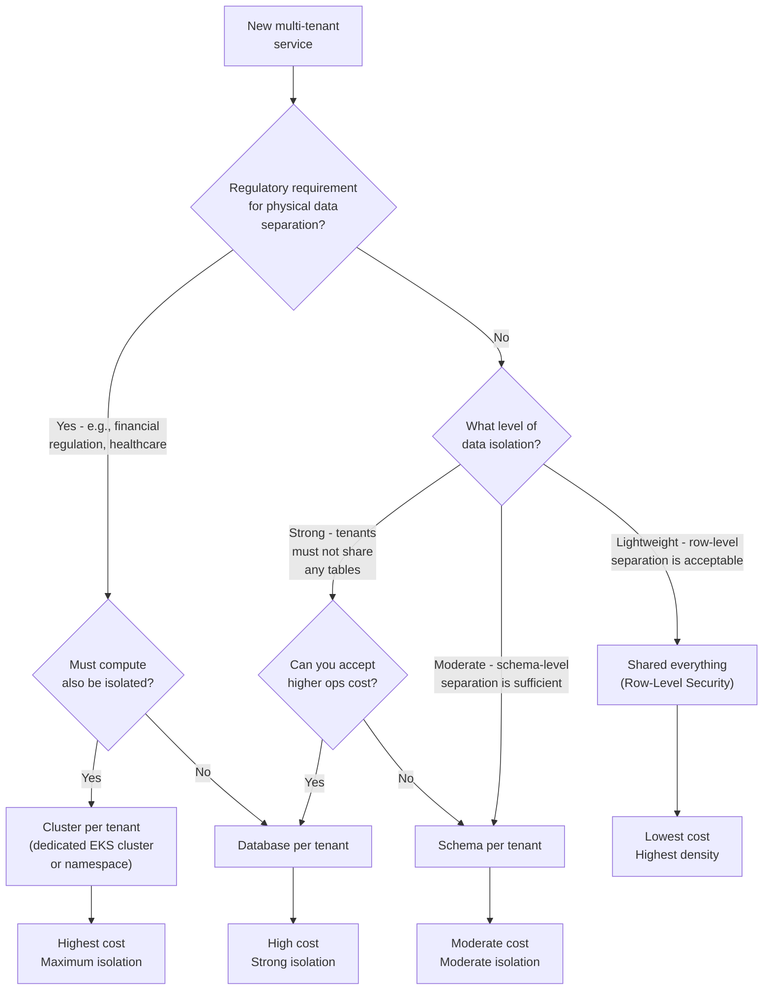
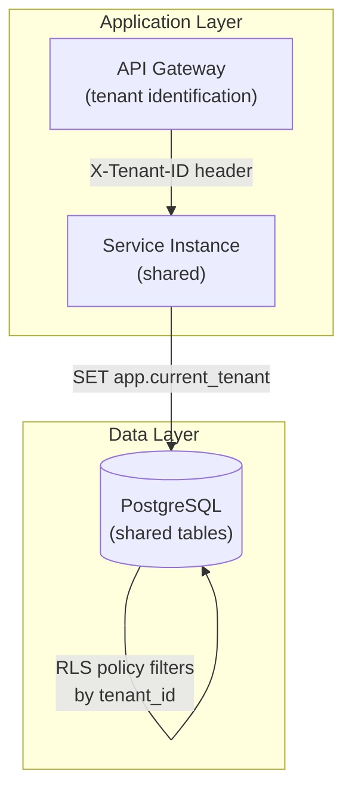
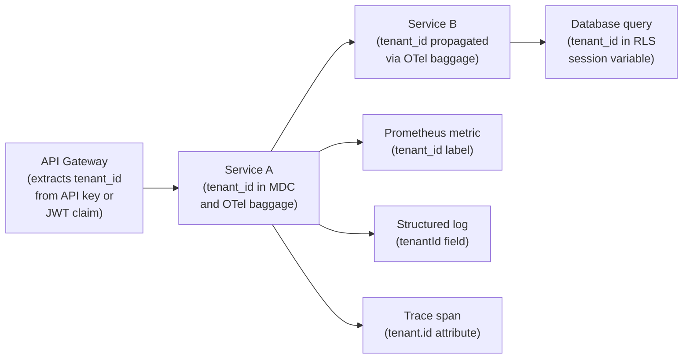
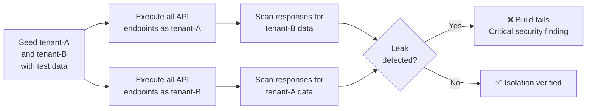

# 🏢 Multi-Tenancy Patterns

  

---

## 📋 Table of Contents

1. [When Multi-Tenancy Applies](#1-when-multi-tenancy-applies)
2. [Isolation Pattern Decision Tree](#2-isolation-pattern-decision-tree)
3. [Isolation Patterns](#3-isolation-patterns)
4. [Noisy-Neighbor Controls](#4-noisy-neighbor-controls)
5. [Per-Tenant Encryption](#5-per-tenant-encryption)
6. [Tenant-Aware Observability](#6-tenant-aware-observability)
7. [Testing](#7-testing)
8. [Tenant Lifecycle](#8-tenant-lifecycle)

---

## 🎯 1. When Multi-Tenancy Applies

Multi-tenancy is not a default. It is a deliberate architectural choice made when {Company} serves multiple distinct entities through shared infrastructure. The cost, complexity, and risk of multi-tenancy are only justified when the alternative (dedicated infrastructure per entity) is prohibitively expensive or operationally infeasible.

> **Principles (cloud-agnostic):** Isolation patterns (RLS, schema-per-tenant, DB-per-tenant, cluster-per-tenant), quotas, rate limits, and per-tenant observability are architecture-level concerns. **Spring Boot** connection snippets, **Aurora**, **EKS**, **KMS**, **MSK**, and **Amazon API Gateway** named later are **reference implementation** choices - keep the isolation properties when swapping runtime or cloud services.

### 1.1 Applicable Scenarios

| Scenario | Example |
|----------|---------|
| **B2B products** | {Company} platform offered to enterprise customers who each manage their own fleet |
| **Partner APIs** | Third-party integrations where each partner has independent usage, quotas, and SLAs |
| **White-label deployments** | {Company} platform branded and operated under a partner's identity |
| **Shared infrastructure for business units** | Multiple {Company} business lines (e.g., delivery, logistics, mobility) sharing platform services |

### 1.2 Not Applicable

| Scenario | Why Not |
|----------|---------|
| Single-product B2C app | All users share the same experience; user-level isolation is not multi-tenancy |
| Internal tooling | Single tenant (the engineering org); standard access controls suffice |

---

## 🏢 2. Isolation Pattern Decision Tree

The choice of isolation pattern depends on four factors: compliance requirements, data isolation needs, performance isolation needs, and cost tolerance. This decision tree guides the selection.



---

## 🧩 3. Isolation Patterns

### 3.1 Pattern Comparison

| Pattern | Data Isolation | Performance Isolation | Ops Complexity | Cost per Tenant | Best For |
|---------|---------------|----------------------|---------------|----------------|----------|
| **Shared everything (RLS)** | Row-level | Shared resources | Low | Lowest | High tenant count, low compliance requirements |
| **Schema per tenant** | Schema-level | Shared resources | Moderate | Moderate | Moderate tenant count, need for schema customization |
| **Database per tenant** | Full database | Shared compute | High | High | Regulated industries, strong isolation requirements |
| **Cluster per tenant** | Full stack | Full isolation | Highest | Highest | Maximum isolation, regulatory mandates |

### 3.2 Shared Everything (Row-Level Security)

The default and most cost-efficient pattern. All tenants share the same database, tables, and application instances. Isolation is enforced at the row level via PostgreSQL RLS policies.

**Architecture:**



**Implementation requirements:**

| Requirement | Detail |
|-------------|--------|
| `tenant_id` column | Every table that contains tenant-scoped data must include a `tenant_id` column (UUID, NOT NULL, indexed) |
| RLS policy | PostgreSQL RLS policy on every tenant-scoped table |
| Session variable | Application sets `app.current_tenant` session variable on every connection before executing queries |
| Migration safety | Flyway migrations must not break RLS policies; CI validates that all tenant-scoped tables have RLS enabled |

**PostgreSQL RLS policy:**

```sql
ALTER TABLE orders ENABLE ROW LEVEL SECURITY;

CREATE POLICY tenant_isolation ON orders
    USING (tenant_id = current_setting('app.current_tenant')::uuid);

ALTER TABLE orders FORCE ROW LEVEL SECURITY;
```

**Application connection setup (Spring Boot):**

**Reference implementation (Java / Spring Boot):**

```java
@Component
public class TenantConnectionPreparer implements ConnectionPreparedStatementCallback {

    @Override
    public void prepareConnection(Connection connection) throws SQLException {
        String tenantId = TenantContext.getCurrentTenant();
        try (var stmt = connection.createStatement()) {
            stmt.execute("SET app.current_tenant = '" + tenantId + "'");
        }
    }
}
```

### 3.3 Schema per Tenant

Each tenant gets a dedicated PostgreSQL schema within a shared database. Tables are structurally identical but physically separated.

| Aspect | Detail |
|--------|--------|
| **Schema naming** | `tenant_<tenant_id>` (e.g., `tenant_acme`, `tenant_globex`) |
| **Migrations** | Flyway runs per-schema migrations; a tenant provisioning job creates the schema and applies all migrations |
| **Connection routing** | Application sets the `search_path` to the tenant's schema on each request |
| **Cross-tenant queries** | Not possible without explicit `SET search_path` - natural isolation |

**Connection routing:**

```java
@Override
public void prepareConnection(Connection connection) throws SQLException {
    String tenantSchema = "tenant_" + TenantContext.getCurrentTenant();
    try (var stmt = connection.createStatement()) {
        stmt.execute("SET search_path TO " + tenantSchema);
    }
}
```

### 3.4 Database per Tenant

**Reference implementation (AWS):** dedicated **Aurora** cluster or **RDS** instance per tenant; same pattern with **Cloud SQL**, **Azure Database for PostgreSQL**, or self-managed Postgres where policy requires physical separation.

Each tenant gets a dedicated database (Aurora cluster or RDS instance). The application routes connections based on tenant identity.

| Aspect | Detail |
|--------|--------|
| **Provisioning** | Automated via Terraform module; new tenant → new Aurora cluster |
| **Connection routing** | Application maintains a tenant → datasource mapping; resolved at request time |
| **Migrations** | Flyway runs against each tenant database independently |
| **Cost** | Significantly higher - each tenant incurs a minimum Aurora cost |
| **When to use** | Regulated industries (fintech, healthcare) where data must not share physical storage |

### 3.5 Cluster per Tenant

**Reference implementation (AWS):** **EKS** namespace or cluster; apply the same soft vs hard boundary with **GKE**, **AKS**, or other CNCF-conformant clusters.

Maximum isolation. Each tenant gets a dedicated EKS namespace (soft isolation) or dedicated EKS cluster (hard isolation), plus dedicated database, cache, and message broker.

| Aspect | Detail |
|--------|--------|
| **Namespace isolation** | Dedicated Kubernetes namespace with `NetworkPolicy` restricting cross-namespace traffic, `ResourceQuota`, and `LimitRange` |
| **Cluster isolation** | Dedicated EKS cluster; used only when regulatory requirements mandate complete compute separation |
| **Provisioning** | Fully automated via Terraform + ArgoCD; tenant onboarding triggers infrastructure provisioning pipeline |
| **When to use** | Government contracts, financial regulations requiring physical isolation, tenants with extreme performance requirements |

---

## ⚖️ 4. Noisy-Neighbor Controls

In shared-resource patterns (RLS, schema per tenant), one tenant's traffic spike can degrade performance for all tenants. Noisy-neighbor controls prevent this.

### 4.1 Rate Limiting at API Gateway

Per-tenant rate limits are enforced at **Amazon API Gateway** (see [API Gateway Strategy](./07-api-gateway-strategy.md)):

| Tier | Rate Limit | Burst | Applies To |
|------|-----------|-------|-----------|
| **Standard** | 100 req/s | 200 req/s (10s window) | Default for all tenants |
| **Premium** | 500 req/s | 1,000 req/s (10s window) | Enterprise tenants with higher SLAs |
| **Custom** | Negotiated | Negotiated | Large partners with contractual rate limits |

Rate limits are configured per tenant in the API Gateway and identified via the `X-Tenant-ID` header or API key.

### 4.2 Kubernetes Resource Quotas

For shared-cluster deployments, per-tenant resource quotas prevent a single tenant's workload from consuming all cluster resources.

```yaml
apiVersion: v1
kind: ResourceQuota
metadata:
  name: tenant-acme-quota
  namespace: tenant-acme
spec:
  hard:
    requests.cpu: "4"
    requests.memory: 8Gi
    limits.cpu: "8"
    limits.memory: 16Gi
    pods: "20"
```

### 4.3 Fair-Share Scheduling

| Control | Implementation |
|---------|---------------|
| **Priority classes** | Tenant workloads use `PriorityClass` to ensure fair CPU scheduling |
| **Pod disruption budgets** | Each tenant namespace has a PDB to prevent mass eviction during cluster scaling |
| **Database connection pooling** | PgBouncer configured with per-tenant connection limits to prevent connection exhaustion |

---

## 🔒 5. Per-Tenant Encryption

**Reference implementation (AWS):** **KMS** key models below; mirror with **Cloud KMS**, **Azure Key Vault**, or HSM-backed keys per tenant.

### 5.1 Encryption Strategy

| Pattern | KMS Configuration | When to Use |
|---------|-------------------|-------------|
| **Shared KMS key** (default) | Single AWS KMS key encrypts data for all tenants | Default for non-regulated workloads; simpler key management |
| **Per-tenant KMS key** | Dedicated KMS key per tenant; tenant's data encrypted with their key | Regulated industries; tenant contractual requirements for key isolation |

### 5.2 Per-Tenant KMS Key Management

| Aspect | Detail |
|--------|--------|
| **Key provisioning** | Automated during tenant onboarding; Terraform creates a KMS key per tenant |
| **Key alias** | `alias/tenant/<tenant-id>/data` |
| **Key policy** | Only the tenant's service role and the KMS admin role can use the key |
| **Key rotation** | Automatic annual rotation enabled by default; aligned with the secrets rotation policy (`04-infrastructure-and-cloud/03-security.md`) |
| **Key deletion** | On tenant decommissioning, the key is scheduled for deletion (30-day waiting period) after data deletion is confirmed |

### 5.3 Encryption at Rest

| Data Store | Encryption Method |
|------------|------------------|
| Aurora/RDS | AWS KMS (cluster-level or per-tenant key via envelope encryption) |
| S3 | SSE-KMS with tenant-specific key prefix |
| ElastiCache (Redis) | Encryption at rest enabled; shared key (per-tenant keys not supported by ElastiCache) |
| Kafka (MSK) | SSE-KMS at the broker level; per-topic keys not supported - use application-level encryption for tenant isolation |

---

## 👁️ 6. Tenant-Aware Observability

Observability without tenant context is useless in a multi-tenant system. Every metric, log, and trace must carry tenant identity so operators can diagnose issues per tenant and track per-tenant SLOs.

### 6.1 Required Labels and Fields

| Signal | Required Field | Format |
|--------|---------------|--------|
| **Metrics** (Prometheus) | `tenant_id` label | `tenant_id="acme"` |
| **Logs** (structured JSON) | `tenantId` field | `"tenantId": "acme"` |
| **Traces** (OpenTelemetry) | `tenant.id` attribute | Baggage propagated across service boundaries |

### 6.2 Injecting Tenant Context

Tenant identity is extracted from the request at the API Gateway and propagated through the entire request lifecycle:



### 6.3 Per-Tenant Dashboards

Grafana dashboards include a `tenant_id` variable filter, allowing operators to view metrics for a specific tenant or across all tenants.

| Dashboard | Panels |
|-----------|--------|
| **Tenant Overview** | Request volume, error rate, P99 latency - per tenant |
| **Tenant SLO Tracking** | Availability and latency SLO burn rate per tenant |
| **Resource Consumption** | CPU, memory, DB connections, Kafka consumer lag - per tenant |
| **Noisy Neighbor Detection** | Top tenants by request volume, error rate, and resource consumption |

### 6.4 Per-Tenant SLO Tracking

Each tenant with a contractual SLA has a corresponding SLO tracked in Grafana:

| SLO | Target | Measurement |
|-----|--------|-------------|
| Availability | 99.9% (or per contract) | `1 - (5xx responses / total responses)` filtered by `tenant_id` |
| Latency P99 | < 500ms (or per contract) | P99 of response time filtered by `tenant_id` |
| Data freshness | Per data quality tier | Freshness metric filtered by `tenant_id` |

---

## 🧪 7. Testing

Multi-tenant systems require specific testing to validate that tenant isolation is never violated. A cross-tenant data leak is a critical security incident.

### 7.1 Isolation Tests

| Test Type | What It Validates | Where It Runs |
|-----------|------------------|---------------|
| **RLS policy test** | Queries with tenant A's context never return tenant B's data | Integration tests (Testcontainers + PostgreSQL) |
| **API isolation test** | API requests authenticated as tenant A cannot access tenant B's resources | Integration tests against the running service |
| **Cross-tenant leak detection** | Automated scan of all API responses for data belonging to a tenant other than the authenticated tenant | CI pipeline (dedicated test step) |
| **Schema isolation test** | Queries in tenant A's schema cannot read tenant B's schema | Integration tests (schema per tenant pattern) |

### 7.2 RLS Policy Integration Test

```java
@Test
void rlsPreventsAccessToOtherTenantData() {
    setTenantContext("tenant-a");
    orderRepository.save(new Order("order-1", "tenant-a"));

    setTenantContext("tenant-b");
    orderRepository.save(new Order("order-2", "tenant-b"));

    setTenantContext("tenant-a");
    List<Order> tenantAOrders = orderRepository.findAll();

    assertThat(tenantAOrders).hasSize(1);
    assertThat(tenantAOrders.get(0).getTenantId()).isEqualTo("tenant-a");
    assertThat(tenantAOrders).noneMatch(o -> o.getTenantId().equals("tenant-b"));
}
```

### 7.3 Cross-Tenant Leak Detection in CI

A dedicated CI step creates two test tenants, seeds data for both, and then exercises every API endpoint as each tenant. Any response containing data from the other tenant fails the build.



---

## 🔄 8. Tenant Lifecycle

### 8.1 Lifecycle Stages

```mermaid
statechart-v2
    [*] --> Provisioning : Tenant onboarded
    Provisioning --> Active : Infrastructure ready
    Active --> Suspended : Non-payment / policy violation
    Suspended --> Active : Issue resolved
    Suspended --> Decommissioning : Tenant requests termination
    Active --> Decommissioning : Tenant requests termination
    Decommissioning --> [*] : Data deleted & infrastructure torn down
```

### 8.2 Provisioning

| Step | Action | Automation |
|------|--------|-----------|
| 1 | Tenant record created in tenant management service | API call |
| 2 | Database / schema / RLS policy provisioned | Terraform + Flyway |
| 3 | KMS key created (if per-tenant encryption) | Terraform |
| 4 | API Gateway rate limits configured | Amazon API Gateway / Terraform (per [API Gateway Strategy](./07-api-gateway-strategy.md)) |
| 5 | Kubernetes namespace + resource quotas created (if applicable) | ArgoCD |
| 6 | Monitoring dashboards provisioned | Grafana provisioning API |
| 7 | Tenant marked as `ACTIVE` | Tenant management service |

### 8.3 Configuration

Each tenant has a configuration record that controls tenant-specific behavior:

| Field | Purpose | Example |
|-------|---------|---------|
| `tenantId` | Unique identifier | `acme-corp` |
| `displayName` | Human-readable name | `Acme Corporation` |
| `tier` | Service tier (Standard, Premium, Custom) | `premium` |
| `rateLimitOverride` | Custom rate limit (if different from tier default) | `500 req/s` |
| `encryptionKeyArn` | KMS key ARN (null if using shared key) | `arn:aws:kms:...` |
| `dataResidencyRegion` | Required AWS region for data storage | `eu-west-1` |
| `features` | Enabled feature flags for this tenant | `["advanced-analytics", "custom-branding"]` |

### 8.4 Decommissioning

Tenant decommissioning follows a strict process to ensure data is exported (if requested) and then permanently deleted.

| Step | Action | Detail |
|------|--------|--------|
| 1 | **Notify tenant** | Confirm termination date and offer data export |
| 2 | **Data export** | Export tenant data in a portable format (JSON/CSV) to a secure S3 bucket; provide download link to tenant |
| 3 | **Suspend access** | Revoke API keys; disable tenant authentication |
| 4 | **Delete data** | Drop tenant schema/database, delete S3 objects, purge Kafka consumer group offsets, delete Redis keys |
| 5 | **Delete encryption key** | Schedule KMS key deletion (30-day waiting period) |
| 6 | **Tear down infrastructure** | Remove Kubernetes namespace, API Gateway configuration, monitoring dashboards |
| 7 | **Audit log** | Record decommissioning completion in the audit trail |
| 8 | **Mark decommissioned** | Tenant record updated to `DECOMMISSIONED`; retained for billing reconciliation for 90 days, then purged |

---

<div align="center">

⬅️ [Back to section](./README.md) · 🏠 [Back to root](../README.md)

</div>
