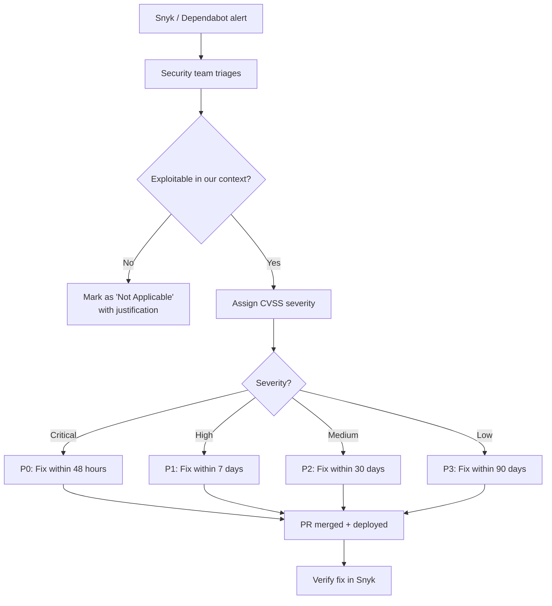
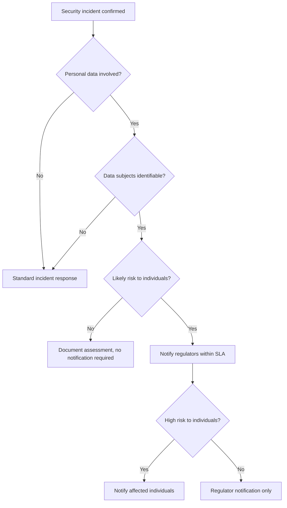
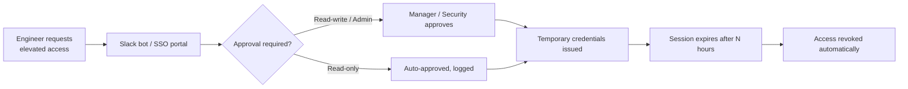

# 🔐 Security Operations

  

---

## 📋 Table of Contents

1. [Threat Modeling](#1-threat-modeling)
2. [Vulnerability Management](#2-vulnerability-management)
3. [SIEM & Security Analytics](#3-siem--security-analytics)
4. [Penetration Testing](#4-penetration-testing)
5. [Bug Bounty Program](#5-bug-bounty-program)
6. [Supply Chain Security](#6-supply-chain-security)
7. [Security Incident Response](#7-security-incident-response)
8. [OWASP API Top 10 Control Mapping](#8-owasp-api-top-10-control-mapping)
9. [Brute Force Protection](#9-brute-force-protection)
10. [Security Training](#10-security-training)
11. [WAF Operations](#11-waf-operations)
12. [DDoS Protection](#12-ddos-protection)
13. [Key Management (KMS)](#13-key-management-kms)
14. [Privileged Access Management (PAM)](#14-privileged-access-management-pam)
15. [Insider Threat Monitoring](#15-insider-threat-monitoring)

---

> **Principles (cloud-agnostic):** Threat modeling, vulnerability SLAs, SIEM correlation, pentesting, incident response, WAF governance, DDoS playbooks, key hierarchy, JIT privileged access, and insider-threat logging apply regardless of vendor. Sections naming **AWS Security Lake**, **Shield**, **SSO**, **CloudTrail**, **KMS**, and **S3** are **reference implementation (AWS)**.

## 🔐 1. Threat Modeling

### 1.1 STRIDE Per New Service

Every new service must complete a STRIDE threat model before its [Production Readiness Review](../06-developer-guides/02-golden-path.md). The model is documented in `docs/threats.md` within the service repository.

| STRIDE Category | Question to Answer | Example Threat |
|-----------------|-------------------|----------------|
| **Spoofing** | Can an attacker impersonate a user or service? | Forged `X-{company}-User-Id` header from outside the mesh |
| **Tampering** | Can an attacker modify data in transit or at rest? | Man-in-the-middle on internal gRPC call |
| **Repudiation** | Can an actor deny performing an action? | User disputes a payment they authorized |
| **Information Disclosure** | Can sensitive data leak? | PII in logs, error messages exposing stack traces |
| **Denial of Service** | Can the service be overwhelmed? | Unbounded query without pagination |
| **Elevation of Privilege** | Can a user gain unauthorized access? | IDOR - accessing another tenant's resources |

### 1.2 Quarterly Platform-Wide Review

The Security team conducts a quarterly review of the platform threat landscape. Inputs include:

- New services deployed since last review
- Architecture changes (new data flows, new third-party integrations)
- Recent incident post-mortems with security implications
- Industry threat intelligence updates

### 1.3 Threat Model Template

```markdown
# Threat Model: {Service Name}

## Data Flow Diagram
(Mermaid diagram of service boundaries, data stores, external entities)

## Assets
| Asset | Sensitivity | Storage |
|-------|------------|---------|
| User PII | High | RDS (encrypted at rest) |
| Payment tokens | Critical | Secrets Manager |

## Threats (STRIDE)
| ID | Category | Threat | Likelihood | Impact | Mitigation |
|----|----------|--------|-----------|--------|------------|
| T1 | Spoofing | ... | Medium | High | mTLS + AuthorizationPolicy |

## Residual Risks
(Accepted risks with justification and compensating controls)
```

---

## 🔐 2. Vulnerability Management

### 2.1 CVE Triage Workflow

**Visual overview:**



### 2.2 SLA Table

| CVSS Score | Severity | Remediation SLA | Escalation |
|------------|----------|----------------|------------|
| 9.0 - 10.0 | **Critical** | 48 hours | VP Engineering + CISO notified immediately |
| 7.0 - 8.9 | **High** | 7 days | Security team lead notified |
| 4.0 - 6.9 | **Medium** | 30 days | Tracked in team sprint |
| 0.1 - 3.9 | **Low** | 90 days | Backlog grooming |

### 2.3 Snyk as System of Record

Snyk is the source of truth for all vulnerability data. Every repository has Snyk monitoring enabled via the platform CI template.

| Integration | Purpose |
|-------------|---------|
| **Snyk Open Source** | Dependency vulnerabilities (Maven, npm, Go) |
| **Snyk Container** | Docker image vulnerabilities |
| **Snyk IaC** | Terraform / Kubernetes misconfiguration |
| **Snyk Code** | Static analysis for security issues |

---

## 🔐 3. SIEM & Security Analytics

**Reference implementation (AWS):** **Security Lake** as the central store; alternatives include **Chronicle**, **Sentinel**, **Splunk/Datadog** security lake patterns, or **S3 + OpenSearch** with the same source coverage.

### 3.1 Architecture

| Component | Service | Purpose |
|-----------|---------|---------|
| **Log aggregation** | AWS Security Lake | Centralized security log store (CloudTrail, VPC Flow Logs, WAF logs) |
| **Analytics** | OpenSearch Security Analytics | Detection rules, correlation, dashboards |
| **Alerting** | PagerDuty | Security alert routing |

### 3.2 SOC Model

| Coverage | Staffing | Response |
|----------|----------|----------|
| **Business hours** (9 AM - 6 PM) | Platform Security team (2 engineers) | Investigate and triage within 30 minutes |
| **After hours** | PagerDuty on-call rotation | Acknowledge within 15 minutes, escalate if Sev1 |
| **Weekends / Holidays** | PagerDuty on-call | Same as after hours |

### 3.3 Detection Engineering Backlog

The security team maintains a backlog of detection rules prioritized by MITRE ATT&CK coverage:

| Priority | Detection Rule | MITRE Technique |
|----------|---------------|-----------------|
| P0 | Impossible travel (login from two countries within 1 hour) | T1078 - Valid Accounts |
| P0 | Secrets Manager bulk read (> 10 secrets in 5 minutes) | T1552 - Unsecured Credentials |
| P1 | IAM policy change outside Terraform | T1098 - Account Manipulation |
| P1 | Unusual outbound data transfer (> 1 GB to unknown IP) | T1041 - Exfiltration Over C2 |
| P2 | New admin user created outside provisioning pipeline | T1136 - Create Account |

---

## 🧪 4. Penetration Testing

### 4.1 Schedule

| Type | Frequency | Scope | Performed By |
|------|-----------|-------|-------------|
| **External penetration test** | Annual | Production APIs, web apps, mobile apps | Third-party firm (rotating vendors) |
| **Internal red team** | Quarterly | Internal services, infrastructure, social engineering | Internal security team + external consultants |

### 4.2 Remediation SLA

Penetration test findings follow the same SLA as CVE vulnerabilities:

| Finding Severity | SLA | Retest Required? |
|-----------------|-----|-----------------|
| Critical | 48 hours | Yes - within 1 week of fix |
| High | 7 days | Yes - within 2 weeks of fix |
| Medium | 30 days | Yes - next quarterly test |
| Low | 90 days | No - verified in next annual test |

### 4.3 Mandatory Retest

Every Critical and High finding must be retested by the original tester (or an equivalent) to confirm the fix is effective. The retest result is documented alongside the original finding.

---

## 🔐 5. Bug Bounty Program

### 5.1 Platform

{Company} operates a private bug bounty program via **HackerOne** (or **Bugcrowd** - selected during program setup).

### 5.2 Scope

| In Scope | Out of Scope |
|----------|-------------|
| Production APIs (`api.{company}.com`) | Staging / development environments |
| Customer-facing web application | Internal tools (admin dashboard) |
| Mobile applications (iOS + Android) | Third-party services (Stripe, SendGrid) |
| Authentication and authorization flows | Social engineering attacks |

### 5.3 Payout Tiers

| Severity | CVSS Range | Payout (USD) | Examples |
|----------|-----------|-------------|----------|
| **Critical** | 9.0 - 10.0 | $5,000 - $15,000 | RCE, auth bypass, mass data exfiltration |
| **High** | 7.0 - 8.9 | $2,000 - $5,000 | Privilege escalation, IDOR with PII exposure |
| **Medium** | 4.0 - 6.9 | $500 - $2,000 | Stored XSS, CSRF on sensitive action |
| **Low** | 0.1 - 3.9 | $100 - $500 | Reflected XSS, information disclosure (non-PII) |

---

## 🔐 6. Supply Chain Security

### 6.1 SBOM Generation

Every CI pipeline generates a **Software Bill of Materials** (SBOM) in **CycloneDX** format:

```yaml
# CI step
- name: Generate SBOM
  run: |
    cyclonedx-cli convert \
      --input-file build/reports/bom.json \
      --output-file sbom.cdx.json \
      --output-format json
    aws s3 cp sbom.cdx.json s3://sbom-store/${SERVICE_NAME}/${VERSION}/sbom.cdx.json
```

**Reference implementation (AWS):** SBOM upload to **S3**; use **GCS**, **Azure Blob**, or artifact registry with immutable versioning on other clouds.

### 6.2 Container Signing

All production container images are signed using **cosign** (Sigstore):

```bash
cosign sign --key awskms:///alias/container-signing \
  ${ECR_REGISTRY}/${SERVICE_NAME}:${VERSION}
```

### 6.3 SLSA Level 2

{Company} targets **SLSA Level 2** for all production artifacts:

| SLSA Requirement | Implementation |
|-----------------|---------------|
| **Source versioned** | Git (GitHub) |
| **Build service** | GitHub Actions (hosted runners) |
| **Build as code** | `.github/workflows/*.yml` checked into repo |
| **Provenance generated** | SLSA GitHub Actions generator |
| **Provenance non-forgeable** | Signed by GitHub OIDC identity |

### 6.4 Verify-at-Deploy

The deployment pipeline verifies the container signature before deploying to production:

```bash
cosign verify --key awskms:///alias/container-signing \
  ${ECR_REGISTRY}/${SERVICE_NAME}:${VERSION}
```

If verification fails, the deployment is blocked and the security team is notified.

---

## 🚨 7. Security Incident Response

Security incidents have a distinct playbook from operational incidents. The key differences are evidence preservation, potential law enforcement coordination, and regulatory notification requirements.

### 7.1 Severity Classification

| Severity | Definition | Examples |
|----------|-----------|----------|
| **SEV1** | Active data breach or ongoing attack | Unauthorized data access, credential compromise, active intrusion |
| **SEV2** | Confirmed vulnerability actively exploited | Zero-day in production dependency, malware on build server |
| **SEV3** | Security event requiring investigation | Anomalous access pattern, failed penetration test finding |
| **SEV4** | Low-risk security issue | Expired certificate, minor misconfiguration |

### 7.2 Evidence Preservation

Before any remediation, preserve evidence:

1. **Snapshot affected systems** - EBS snapshots, RDS snapshots, container image tags
2. **Export logs** - CloudTrail, VPC Flow Logs, application logs for the incident window
3. **Capture memory** - If malware is suspected, take a memory dump before terminating the instance
4. **Lock down credentials** - Rotate, do not delete, compromised credentials (preserves audit trail)
5. **Document timeline** - All actions taken during incident response

### 7.3 Law Enforcement Coordination

If the incident involves criminal activity (ransomware, insider theft, data extortion):

1. Legal counsel makes the decision to engage law enforcement.
2. Share only what is authorized by legal.
3. Preserve chain of custody for all evidence.

### 7.4 Breach Notification Decision Tree

**Visual overview:**



### 7.5 Regulatory Notification Timelines

| Regulation | Notification Deadline | Notify To |
|------------|----------------------|-----------|
| **GDPR** (EU) | 72 hours from awareness | Lead supervisory authority |
| **CCPA** (California) | "Expeditiously" - target 72 hours | California Attorney General (if > 500 residents) |
| **HIPAA** (US healthcare) | 60 days | HHS + affected individuals |
| **PCI DSS** | 24 hours (for card brands) | Acquiring bank + card brands |
| **SOC 2** | No fixed timeline, but "promptly" | Auditor notification |

---

## 📋 8. OWASP API Top 10 Control Mapping

| # | OWASP API Risk | {Company} Control |
|---|---------------|-------------------|
| 1 | **Broken Object-Level Authorization** | Tenant isolation enforced at repository layer; `@TenantScoped` annotation on all queries; automated IDOR tests in CI |
| 2 | **Broken Authentication** | BFF handles authentication; backend trusts mTLS + `X-{company}-User-Id`; no direct user auth in backend services |
| 3 | **Broken Object Property-Level Authorization** | DTOs expose only allowed fields; `@JsonView` for role-based serialization; response schema tests |
| 4 | **Unrestricted Resource Consumption** | API Gateway rate limiting (per-user, per-IP); pagination enforced (max 100 items); request body size limit **10 MB** at API Gateway (see [API Gateway Strategy](./07-api-gateway-strategy.md)); WAF may apply stricter defaults in front of the gateway |
| 5 | **Broken Function-Level Authorization** | RBAC enforced via Spring `@PreAuthorize`; AuthorizationPolicy in Istio mesh; admin endpoints on separate path |
| 6 | **Unrestricted Access to Sensitive Business Flows** | Progressive CAPTCHA on sensitive flows (checkout, password reset); velocity checks on high-value operations |
| 7 | **Server-Side Request Forgery (SSRF)** | Allowlist for outbound URLs; no user-controlled URLs in server-side fetches; IMDSv2 enforced on all EC2/EKS |
| 8 | **Security Misconfiguration** | Snyk IaC scans in CI; CIS benchmarks for EKS; no default credentials; Actuator endpoints locked down |
| 9 | **Improper Inventory Management** | Backstage as service catalog (source of truth); unused APIs flagged by traffic analysis; deprecation lifecycle enforced |
| 10 | **Unsafe Consumption of APIs** | Validate all responses from third-party APIs; timeout + circuit breaker on all outbound calls; TLS verification enabled |

---

## 🔐 9. Brute Force Protection

### 9.1 Account Lockout

| Threshold | Action | Duration |
|-----------|--------|----------|
| 5 failed login attempts | Account temporarily locked | 15 minutes |
| 10 failed attempts (cumulative) | Account locked + email notification to user | 1 hour (or manual unlock by support) |
| 20 failed attempts (cumulative) | Account locked + security team alerted | Manual unlock only |

### 9.2 Progressive CAPTCHA

| Condition | CAPTCHA Type |
|-----------|-------------|
| 1st-3rd attempt | No CAPTCHA |
| 4th-5th attempt | Invisible reCAPTCHA (risk-based) |
| 6th+ attempt | Visible CAPTCHA challenge |

### 9.3 Risk-Based Authentication

| Signal | Risk Score Impact | Additional Step |
|--------|------------------|----------------|
| New device | +30 | Email verification code |
| New country | +50 | SMS/email MFA challenge |
| Impossible travel (< 1h between countries) | +80 | MFA + security team alert |
| Tor exit node | +40 | CAPTCHA + MFA |
| Known malicious IP (threat intel) | +90 | Block + alert |

---

## 🔐 10. Security Training

### 10.1 Mandatory Training

| Program | Frequency | Audience | Compliance Tracked? |
|---------|-----------|----------|-------------------|
| **Secure SDLC** | Annual | All engineers | Yes - completion required for continued commit access |
| **OWASP Top 10** | Annual (part of Secure SDLC) | All engineers | Yes |
| **Phishing simulations** | Quarterly | All employees | Yes - reported to CISO |
| **New-joiner security orientation** | Within first 2 weeks | All new hires | Yes - HR tracks |

### 10.2 Optional Training

| Program | Frequency | Audience |
|---------|-----------|----------|
| Capture-the-flag (CTF) events | Bi-annual | Volunteers |
| Cloud security deep-dive | Annual | Platform + DevOps engineers |
| Incident response tabletop | Bi-annual | Engineering leads + on-call |

---

## 🔐 11. WAF Operations

### 11.1 Ownership

The **Security team** owns and operates WAF rules. Engineering teams escalate false positives to Security via #security-support.

### 11.2 Rule Review

| Activity | Frequency | Owner |
|----------|-----------|-------|
| Review managed rule group updates | Monthly | Security team |
| Review custom rules | Monthly | Security team |
| False positive tuning | As reported (48h SLA) | Security team |
| Rate limiting rule review | Quarterly | Security + Platform |

### 11.3 Custom Rule Governance

| Action | Process |
|--------|---------|
| Add new custom rule | PR to WAF-as-code repo → Security review → Deploy to staging → 48h observation → Production |
| Modify existing rule | Same as above |
| Emergency rule (active attack) | Security team deploys immediately → PR created retroactively within 24h |

### 11.4 False Positive Tuning SLA

| Severity | SLA | Action |
|----------|-----|--------|
| Blocking production traffic | 4 hours | Emergency rule adjustment |
| Intermittent false positives | 48 hours | Rule tuning |
| Low-impact false positives | 1 sprint | Scheduled fix |

---

## 🔐 12. DDoS Protection

### 12.1 Shield Advanced

**Reference implementation (AWS):** **Shield Standard / Advanced** with CloudFront and Route 53; equivalents include **GCP Cloud Armor** with global LB, **Azure DDoS Protection** with Front Door / Application Gateway, or CDN vendor advanced mitigation.

AWS Shield Advanced is enabled for all Tier 1 services:

| Protected Resource | Shield Advanced? | Auto-Mitigation? |
|-------------------|-----------------|-------------------|
| CloudFront distributions (customer-facing) | Yes | Yes |
| Application Load Balancers (Tier 1 APIs) | Yes | Yes |
| Route 53 hosted zones | Yes | Yes |
| Internal ALBs (Tier 2/3) | No (Shield Standard only) | N/A |

### 12.2 DDoS Runbook

| Step | Action | Owner |
|------|--------|-------|
| 1 | Alert fires: abnormal traffic volume detected | Automated (CloudWatch) |
| 2 | Confirm attack vs. legitimate traffic spike | On-call engineer |
| 3 | Engage AWS Shield Response Team (SRT) | On-call engineer (via AWS support) |
| 4 | Apply CloudFront geo-restrictions if attack is geographically concentrated | Security team |
| 5 | Scale origin (increase EKS replica count, RDS read replicas) | Platform team |
| 6 | Monitor mitigation effectiveness | On-call + Security |
| 7 | Post-event review within 48 hours | Security + Platform |

### 12.3 Post-Event Review

Every DDoS event (confirmed or suspected) triggers a post-event review documenting:

- Attack vector and duration
- Traffic volume (peak and sustained)
- Mitigation actions taken and their effectiveness
- Customer impact
- Improvements for next time

---

## 🔐 13. Key Management (KMS)

**Reference implementation (AWS):** **KMS** aliases and CMK model; map tiers to **Cloud KMS** or **Azure Key Vault** with the same separation of duties.

### 13.1 Key Hierarchy

| Data Tier | CMK Alias | Rotation | Used For |
|-----------|-----------|----------|----------|
| **Tier 1 - Critical** | `alias/tier1-critical` | Annual (automatic) | Payment data, authentication secrets |
| **Tier 2 - Sensitive** | `alias/tier2-sensitive` | Annual (automatic) | PII, user data at rest |
| **Tier 3 - Internal** | `alias/tier3-internal` | Annual (automatic) | Application config, non-sensitive data |
| **Container signing** | `alias/container-signing` | Annual (manual ceremony) | cosign image signatures |
| **Backup encryption** | `alias/backup-encryption` | Annual (automatic) | RDS snapshots, S3 backup buckets |

### 13.2 Separation of Duties

| Role | Can Create Keys | Can Use Keys | Can Manage Key Policy |
|------|----------------|-------------|----------------------|
| Security team | Yes | No | Yes |
| Platform team | No | Yes (Tier 2, 3) | No |
| Application team | No | Yes (Tier 3 only) | No |
| CISO / VP Eng | No | No | Yes (Tier 1 only, with Security) |

### 13.3 BYOK Option

For regulated customers requiring Bring-Your-Own-Key (BYOK):

1. Customer provides a 256-bit AES key wrapped with {Company}'s KMS public key.
2. Key is imported into a dedicated CMK with `EXTERNAL` origin.
3. Customer retains the ability to revoke by requesting key deletion.
4. Rotation is customer-managed (annual recommendation).

---

## 🔐 14. Privileged Access Management (PAM)

### 14.1 JIT Access via AWS SSO

**Reference implementation (AWS):** **IAM Identity Center (SSO)**; use **Google Cloud Workforce Identity**, **Azure Entra ID Privileged Identity Management**, or **Okta** JIT with the same approval, duration, and audit requirements.

All privileged access is just-in-time (JIT) via AWS SSO temporary elevation:

| Access Level | Duration | Approval | Audit |
|-------------|----------|----------|-------|
| **Read-only prod** | 4 hours max | Self-service (logged) | CloudTrail |
| **Read-write prod** | 2 hours max | Manager approval via Slack bot | CloudTrail + Security alert |
| **Database admin** | 1 hour max | Security team approval | CloudTrail + DB audit log |
| **KMS key admin** | 1 hour max | CISO approval | CloudTrail + KMS audit |

### 14.2 Access Request Flow

**Visual overview:**



### 14.3 Quarterly Access Certification

Every quarter, engineering managers certify that their team members' access is appropriate:

1. Manager receives a list of all access grants for their team.
2. Each grant is marked **Retain** or **Revoke**.
3. Unreviewed grants are automatically revoked after 14 days.
4. Results are reported to the CISO.

---

## 🔐 15. Insider Threat Monitoring

### 15.1 Universal Admin Action Logging

| Log Source | Events Captured | Retention |
|-----------|----------------|-----------|
| **CloudTrail** | All AWS API calls (management + data events for S3/KMS) | 1 year (S3), 90 days (CloudTrail console) |
| **Kubernetes audit log** | All `kubectl exec`, `kubectl port-forward`, RBAC changes | 1 year (Security Lake) |
| **Database audit log** | All DDL, DML by admin users, queries returning > 1000 rows | 1 year (S3) |
| **GitHub audit log** | Repository access, permission changes, secret scanning | 1 year (GitHub Enterprise) |
| **SSO access log** | All privileged access grants and revocations | 1 year (Security Lake) |

### 15.2 Anomaly Alerting

| Anomaly | Detection Method | Response |
|---------|-----------------|----------|
| Bulk data download (> 10K rows) | DB audit log + threshold alert | Security team reviews |
| Off-hours production access | SSO access log + time-based rule | Alert to manager |
| Code repository mass clone | GitHub audit log + velocity check | Security team reviews |
| Secrets Manager bulk read | CloudTrail + threshold alert | P0 security investigation |
| Unusual outbound data transfer | VPC Flow Logs + volume anomaly | Block + investigate |

---

<div align="center">

⬅️ [Back to section](./README.md) · 🏠 [Back to root](../README.md)

</div>
