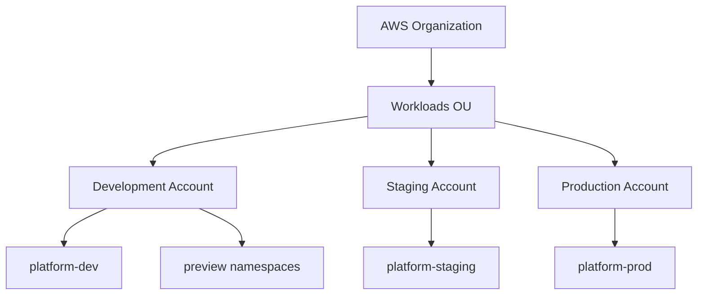
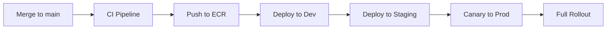
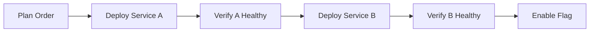
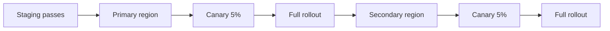

# 🚀 Deployment Architecture

  

---

## 🎯 1. Overview

This document describes the deployment architecture - how many environments exist, what role each plays, how artifacts flow between them, and the operational rules that govern production releases. It connects the infrastructure topology (where workloads run) with the delivery pipeline (how code gets there).

> **Companion documents:** [CD Practices](../03-engineering-practices/03-cd-practices.md) covers pipeline mechanics, feature flags, canary analysis thresholds, and rollback strategies. [Cloud Architecture](./01-cloud-architecture.md) covers VPCs, EKS clusters, data tier, and disaster recovery. This document sits between them - the architectural view of how environments are structured and how artifacts move through them.

---

## 🏗️ 2. Environment Landscape

{Company} operates **three long-lived environments** plus **ephemeral preview environments**. Every environment runs structurally identical infrastructure - same Kubernetes manifests, same Helm chart shape, same service mesh - differing only in scale and configuration values.

| Environment | AWS Account | EKS Cluster | Purpose | Who Has Access |
|-------------|-------------|-------------|---------|----------------|
| **Preview** | Development | `platform-dev` (shared) | Per-PR validation in an isolated namespace | PR author + reviewers |
| **Dev** | Development | `platform-dev` | Post-merge integration testing | All engineers |
| **Staging** | Staging | `platform-staging` | Pre-production validation, E2E, load tests | Engineers + QA |
| **Production** | Production | `platform-prod` | Live customer traffic | CI/CD pipelines + on-call (break-glass) |

### 2.1 Account-to-Environment Mapping

Each environment runs in a dedicated [AWS account](./01-cloud-architecture.md) under the Workloads OU. This provides hard blast-radius isolation - a misconfigured IAM policy in dev cannot affect production.

**Visual overview:**



### 2.2 Environment Parity Rules

- **No snowflakes.** If a service behaves differently in staging than production, that is a parity bug, not a configuration choice.
- **No environment-specific code paths.** Application code must not branch on `ENV` or similar variables. Use [feature flags](../03-engineering-practices/03-cd-practices.md) for conditional behavior.
- **Same image everywhere.** The container image built in CI is the exact image promoted through all environments. We never rebuild between environments.
- **Smaller, not different.** Dev and staging run fewer replicas and smaller instance sizes, but the topology (number of AZs, subnet layout, service mesh config) is identical.

### 2.3 Preview Environments

Preview environments are ephemeral namespaces on the dev EKS cluster, created automatically when a PR is opened and destroyed when the PR is closed or merged.

| Aspect | Detail |
|--------|--------|
| Namespace naming | `preview-pr-{number}` |
| Shared dependencies | Access dev-cluster databases and Kafka with isolated schemas/topics: `preview_{pr_number}_{resource}` |
| Lifetime | Auto-terminated after 24 hours of PR inactivity |
| Concurrency limit | 10 per team |
| URL pattern | `https://preview-pr-{number}.dev.{company}.internal` |

Use preview environments for multi-service integration validation, UI review with product or design, and database migration testing. Do not use them for changes fully covered by unit and integration tests.

---

## 📦 3. Artifact Promotion Flow

Artifacts (container images) are built once and promoted through environments. We promote **artifacts**, not code. For full pipeline stage details and quality gates at each step, see [CD Practices - Pipeline Stages](../03-engineering-practices/03-cd-practices.md).

**Visual overview:**



### 3.1 Promotion Stages

| Stage | Trigger | What Must Pass | Rollback |
|-------|---------|----------------|----------|
| **Build** | Merge to `main` | Compile, unit tests, lint, SAST, container scan | N/A |
| **Dev** | Automatic after build | Smoke tests, Pact can-i-deploy check | Automatic revert in dev namespace |
| **Staging** | Automatic after dev | Integration tests, E2E suite, performance regression | Automatic rollback via ArgoCD |
| **Production** | Automatic after staging | Canary analysis (see [thresholds](../03-engineering-practices/03-cd-practices.md)) | Automatic abort via Argo Rollouts |

Every gate is automated. Manual approval gates are only inserted for high-risk changes as defined by the [Change Risk Rubric](../03-engineering-practices/03-cd-practices.md).

### 3.2 Image Tagging Strategy

Every image pushed to ECR receives two tags:

| Tag | Format | Purpose |
|-----|--------|---------|
| **Git SHA** | `sha-a1b2c3d` | Immutable identifier for traceability |
| **Semantic version** | `v2.14.3` | Human-readable, used in release notes and service catalog |

The `platform-config` repository (GitOps source of truth) always references the **Git SHA tag**, never `latest`. This guarantees that every deployment is traceable to a specific commit.

---

## 🔐 4. Environment Access & the GitOps Control Plane

### 4.1 Access Model

| Environment | Access Method | Approval |
|-------------|--------------|----------|
| **Dev** | Direct `kubectl` via SSO | None (all engineers) |
| **Staging** | Direct `kubectl` via SSO | None (all engineers) |
| **Production** | Break-glass access only | PagerDuty incident or on-call rotation |

Production has **no standing developer access**. All production changes flow through the GitOps pipeline. Break-glass access is logged, time-bounded (4 hours max), and triggers a Slack notification to `#security-alerts`.

### 4.2 GitOps Repository Structure

All environment state is declared in the `platform-config` Git repository. No direct `kubectl apply` in production - every change is a Git PR.

```
platform-config/
├── base/
│   ├── orders-service/
│   │   ├── deployment.yaml
│   │   ├── service.yaml
│   │   ├── hpa.yaml
│   │   └── rollout.yaml
│   └── fulfillment-service/
├── environments/
│   ├── dev/
│   │   ├── orders-service/
│   │   │   ├── values.yaml
│   │   │   └── kustomization.yaml
│   │   └── fulfillment-service/
│   ├── staging/
│   └── production/
└── scripts/
    ├── promote.sh
    └── rollback.sh
```

- **Base manifests** define the common deployment shape (resource requests, probes, security context, rollout strategy).
- **Environment overlays** set the image tag, replica count, resource limits, and external config references.
- ArgoCD watches each environment directory and reconciles the cluster to match. Drift detection alerts on any divergence between Git state and cluster state.

---

## 🔄 5. Coordinated Multi-Service Deployments

Most deployments are single-service and flow through the standard pipeline independently. But some changes span multiple services and require coordination.

### 5.1 When Coordination is Required

| Scenario | Coordination Required | Approach |
|----------|----------------------|----------|
| Independent service change | No | Standard pipeline, deploy anytime |
| Backward-compatible API addition | No | Deploy provider first, then consumer |
| Breaking API change | Yes | Expand-contract over multiple deploys |
| Shared schema migration | Yes | Deploy migration first, then services |
| New event schema version | Partial | Deploy consumer first (must handle both versions), then producer |

### 5.2 Coordinated Deployment Process

For changes that require coordination:

1. **Plan in the PR description** - list all services involved, deployment order, and rollback plan
2. **Deploy in dependency order** - each service goes through the full pipeline independently, but human coordination determines the sequence
3. **Use feature flags as the bridge** - deploy all services with new code behind flags, then enable the flag to activate the change atomically across services
4. **Never deploy breaking changes in a single step** - use [expand-contract](../06-developer-guides/03-database-migrations.md) for schemas and [API versioning](../02-architecture-and-api/02-api-standards.md) for contracts

**Visual overview:**



### 5.3 Deployment Order Rules

| Change Type | Deploy First | Deploy Second |
|-------------|-------------|---------------|
| New API endpoint | Provider (the service exposing the API) | Consumer (the service calling it) |
| New event type | Consumer (must handle the new event) | Producer (starts emitting the event) |
| Deprecated API removal | Consumer (stop calling the old API) | Provider (remove the endpoint) |
| Shared library upgrade | Library publish | All consuming services |

---

## 🆕 6. New Service Deployment

Deploying a new service to production for the first time follows a stricter process than updates to existing services.

### 6.1 Prerequisites

Before a new service can be deployed, it must pass a Production Readiness Review (PRR). The full checklist is in [CD Practices - Service Readiness Checklist](../03-engineering-practices/03-cd-practices.md). The deployment-specific requirements are:

- [ ] Entry in `platform-config` repository with base manifests and all environment overlays
- [ ] Namespace created in all three EKS clusters with resource quotas and network policies
- [ ] Service registered in [Backstage service catalog](../01-platform-standards/04-service-catalog.md)
- [ ] HPA configured with min 3 replicas (production)
- [ ] At least one Grafana dashboard with deployment annotation support
- [ ] PagerDuty routing configured and on-call rotation assigned
- [ ] Runbook documented and linked from service catalog
- [ ] Load test executed in staging proving the service handles 2x expected peak

### 6.2 First Deployment Flow

New service deployments are always classified as **high-risk** regardless of code complexity:

1. Deploy to dev - validate health checks, smoke tests
2. Deploy to staging - run full E2E suite, load test
3. Deploy to production with **manual promotion gate** at 50%
4. Tech Lead and Engineering Manager approve in ArgoCD UI
5. Promote to 100%
6. Monitor for 1 hour (double the standard 30-minute window)

After the first successful production deployment, subsequent deployments follow the standard automated pipeline.

---

## 🚑 7. Hotfix & Emergency Deployment

When a critical production issue requires an immediate fix, the standard pipeline is too slow. The hotfix process trades some safety for speed while preserving auditability.

### 7.1 When to Use the Hotfix Process

Use the hotfix process **only** when all of these are true:
- There is an active P1 or P2 incident
- The fix cannot wait for the standard pipeline (~20-30 minutes)
- The Incident Commander has approved the hotfix

### 7.2 Hotfix Flow

```
[P1/P2 Incident active]
        │
        ▼
[Branch from main: hotfix/{incident-id}]
        │
        ▼
[Minimal fix - smallest possible change]
        │
        ▼
[CI runs (unit tests + build only - skip E2E)]
        │
        ▼
[Deploy directly to production]
  - Canary at 5% for 5 minutes (halved from standard)
  - If metrics OK, promote to 100%
        │
        ▼
[Merge hotfix branch to main]
  - Standard pipeline runs for dev/staging catch-up
        │
        ▼
[Post-incident review]
  - Why did the standard pipeline not catch this?
  - Add test coverage for the failure mode
```

### 7.3 Hotfix Rules

- Hotfixes skip staging but **never** skip canary analysis in production
- The hotfix branch must be merged to `main` within 24 hours
- Every hotfix triggers a post-incident review item to add test coverage that would have caught the issue earlier
- Hotfix deployments are flagged in the `#deployments` channel with a `HOTFIX` label

---

## 🌍 8. Multi-Region Deployment

{Company} runs an **active-passive** multi-region setup, with a path toward active-active for Tier 1 services. For the full DR strategy, see [Disaster Recovery Playbook](../05-operational-excellence/07-disaster-recovery-playbook.md).

| Region | Role | Workloads |
|--------|------|-----------|
| Primary (`eu-west-1`) | Active - all traffic | All services |
| Secondary (`eu-central-1`) | Warm standby | Tier 1 services only (Orders, Fulfillment, Payments) |

### 8.1 Regional Deployment Flow

Production deployments target the **primary region first**. The secondary region follows automatically after the primary reaches 100% healthy rollout:

**Visual overview:**



### 8.2 Regional Deployment Rules

- Secondary region deployments use the **same canary analysis** as primary - no shortcuts
- If the primary region deployment fails canary, the secondary region deployment is **not triggered**
- If the secondary region deployment fails canary, the primary region keeps running the new version (the secondary rolls back to the previous version and an alert is raised)
- Data tier replication (Aurora Global Database, MSK MirrorMaker 2) is independent of application deployment - see [Cloud Architecture](./01-cloud-architecture.md)

---

## 📊 9. Deployment SLAs

| Metric | Target | Measured By |
|--------|--------|-------------|
| **Pipeline duration** (merge to production) | < 30 minutes | GitHub Actions + ArgoCD timestamps |
| **Canary duration** (5% to 100%) | < 25 minutes (standard) | Argo Rollouts metrics |
| **Rollback time** (detection to recovery) | < 2 minutes (canary), < 5 minutes (post-rollout) | PagerDuty + ArgoCD |
| **Deployment success rate** | > 95% (canary passes first attempt) | DORA dashboard |
| **Hotfix pipeline duration** | < 15 minutes | GitHub Actions + ArgoCD timestamps |

These targets are reviewed monthly in the engineering metrics review. Teams that consistently miss targets investigate pipeline bottlenecks, test reliability, or infrastructure issues. Deployment frequency targets by maturity level are defined in [CD Practices](../03-engineering-practices/03-cd-practices.md).

---

## 📋 10. Deployment Governance Summary

| Rule | Detail | Enforcement |
|------|--------|-------------|
| No manual deployments to production | All changes via GitOps pipeline | ArgoCD sync policy + no `kubectl` access |
| No rebuilds between environments | Same ECR image tag promoted through all stages | CI pipeline tags once, environments reference SHA |
| No skipping environments | Every artifact must pass dev and staging before production | ArgoCD Application dependency chain |
| Freeze windows respected | No production deployments during peak or incidents | ArgoCD sync policy override + deployment calendar |
| Break-glass access audited | All production access logged and time-bounded | AWS CloudTrail + Slack alerts |
| Hotfixes merged back | Hotfix branches merged to `main` within 24 hours | PR bot reminder after 12 hours |

For canary analysis thresholds, rollback strategies, feature flag lifecycle, and the change risk rubric, see [CD Practices](../03-engineering-practices/03-cd-practices.md).

---

<div align="center">

⬅️ [Back to section](./README.md) · 🏠 [Back to root](../README.md)

</div>
