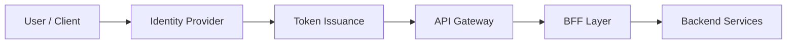

# 🔑 Identity Management

  

---

## 🎯 1. Overview

{Company} uses a centralized identity provider (IdP) for all authentication flows. Every user and service identity is managed through a single trust boundary that issues standards-based tokens. This document defines identity provider architecture, token lifecycle, session management, and OAuth2/OIDC integration patterns.

For authentication enforcement at the API layer, see [Security](./03-security.md).

---

## 🏗️ 2. Identity Provider Architecture

All authentication flows terminate at a centralized IdP. No service implements its own login or token issuance.

**Visual overview:**

| Component | Responsibility |
|-----------|---------------|
| **Identity Provider** | User authentication, MFA enforcement, token issuance |
| **API Gateway** | Token validation at the edge (signature, expiry, audience) |
| **BFF Layer** | Scope and role enforcement, resource-level authorization |
| **Backend Services** | Trust propagated identity context via mTLS |

### 2.1 Supported Identity Providers

| Provider Type | Use Case | Protocol |
|--------------|----------|----------|
| **Corporate IdP** | Employee access to internal tools | SAML 2.0 / OIDC |
| **Customer IdP** | End-user authentication | OIDC |
| **Machine Identity** | Service-to-service authentication | OAuth2 Client Credentials |

---

## 🔄 3. OAuth2 Flows

Each client type uses the appropriate OAuth2 flow. No client type may use a flow not listed for it.

| Client Type | OAuth2 Flow | Token Storage |
|-------------|------------|---------------|
| **Web app (server-rendered)** | Authorization Code + PKCE | Server-side session |
| **Single-page application** | Authorization Code + PKCE | In-memory only (no localStorage) |
| **Mobile application** | Authorization Code + PKCE | Secure enclave / keychain |
| **Backend service** | Client Credentials | Rotated via secrets manager |
| **CLI / developer tool** | Device Authorization | OS keychain |

The Implicit flow is prohibited for all client types.

---

## 🪪 4. OIDC Integration

All user-facing authentication uses OpenID Connect (OIDC) on top of OAuth2.

| OIDC Requirement | Standard |
|-----------------|----------|
| **Discovery endpoint** | `/.well-known/openid-configuration` |
| **JWKS endpoint** | `/.well-known/jwks.json` |
| **Signing algorithm** | RS256 (asymmetric) |
| **ID token claims** | `sub`, `email`, `name`, `groups`, `tenant_id` |
| **Userinfo endpoint** | Available but not used at runtime (claims in token) |

### 4.1 Required Token Claims

| Claim | Source | Purpose |
|-------|--------|---------|
| `sub` | IdP | Unique user identifier |
| `iss` | IdP | Token issuer validation |
| `aud` | IdP | Audience restriction |
| `exp` | IdP | Token expiry enforcement |
| `tenant_id` | IdP (custom) | Multi-tenant data isolation |
| `roles` | IdP (custom) | RBAC enforcement |

---

## ⏱️ 5. Token Lifecycle

| Token Type | TTL | Refresh | Storage |
|-----------|-----|---------|---------|
| **Access token** | 15 minutes | Via refresh token | In-memory (client) |
| **Refresh token** | 24 hours | One-time use, rotated on each refresh | Secure storage (server or keychain) |
| **ID token** | 15 minutes | Not refreshed (re-issued with access token) | In-memory (client) |
| **Client credentials token** | 1 hour | Re-requested from IdP | In-memory (service) |

### 5.1 Token Revocation

| Event | Action |
|-------|--------|
| User logout | Revoke refresh token at IdP |
| Password change | Revoke all refresh tokens for the user |
| Account lockout | Revoke all tokens and active sessions |
| Suspected compromise | Revoke all tokens + force re-authentication |

---

## 🔐 6. Session Management

| Parameter | Value |
|-----------|-------|
| **Idle timeout** | 30 minutes |
| **Absolute timeout** | 8 hours |
| **Concurrent sessions** | Max 5 per user (oldest session terminated) |
| **Session storage** | Server-side (Redis) with encrypted session data |
| **Session fixation prevention** | New session ID issued on every authentication |

### 6.1 Single Sign-On (SSO)

| Requirement | Standard |
|-------------|----------|
| **Protocol** | OIDC (preferred) or SAML 2.0 |
| **Session propagation** | IdP session cookie (HttpOnly, Secure, SameSite=Strict) |
| **Single logout** | OIDC back-channel logout for all relying parties |
| **MFA enforcement** | Required for all internal tools and admin interfaces |

---

## 🌐 7. Identity Federation

For B2B integrations where partner organizations manage their own identities:

| Federation Pattern | Use Case | Protocol |
|-------------------|----------|----------|
| **Inbound federation** | Partner employees access {Company} admin tools | SAML 2.0 with partner IdP |
| **Outbound federation** | {Company} services authenticate to partner APIs | OAuth2 Client Credentials |
| **Just-in-time provisioning** | Federated user created on first login | SCIM 2.0 (automated) or manual approval |

All federated identities are mapped to {Company} roles and tenant boundaries. No federated user receives broader access than an equivalent local user.

---

⬅️ [Back to section](./README.md) · 🏠 [Back to root](../README.md)

