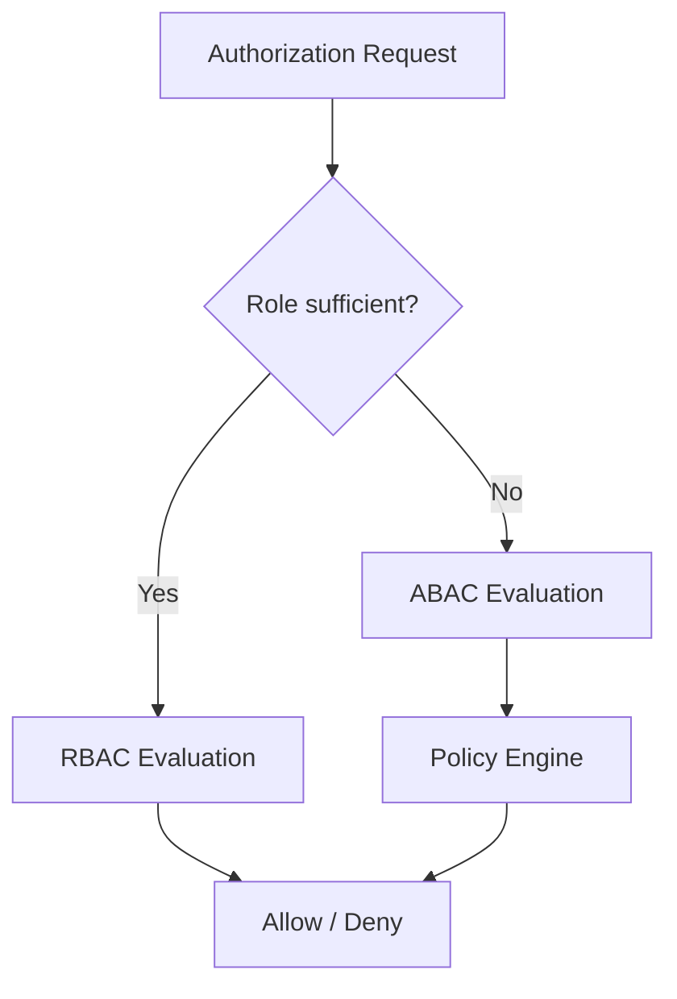
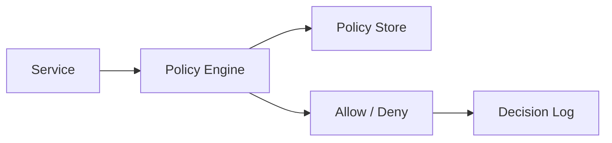

# 🛡️ Authorization Patterns

  

---

## 🎯 1. Overview

Authorization determines what an authenticated principal is allowed to do. {Company} uses a layered authorization model: coarse-grained checks at the API gateway and BFF, fine-grained policy enforcement within services. This document defines the decision framework for RBAC vs ABAC, role hierarchy design, permission models, and policy engine integration.

For authentication patterns, see [Security](./03-security.md). For API gateway authorization enforcement, see [API Gateway Strategy](./07-api-gateway-strategy.md).

---

## 🔀 2. RBAC vs ABAC Decision Framework

Use the simplest model that meets the requirement. Start with RBAC and escalate to ABAC only when attribute-based conditions are necessary.

| Criterion | Use RBAC | Use ABAC |
|-----------|----------|----------|
| **Access based on job function** | Yes | Overkill |
| **Time-based access** | No | Yes |
| **Resource-owner access** | No | Yes |
| **Multi-tenant isolation** | Partial (tenant role) | Yes (tenant attribute) |
| **Regulatory constraints** | Basic | Yes (jurisdiction, data class) |
| **Complexity tolerance** | Low | Higher |

**Visual overview:**

---

## 👥 3. Role Hierarchy

{Company} uses a fixed, non-overlapping role hierarchy. Custom roles per service are prohibited - use platform-defined roles with service-specific permissions.

| Role | Scope | Typical Permissions |
|------|-------|-------------------|
| **super-admin** | Platform-wide | Full access (break-glass only) |
| **org-admin** | Organization / tenant | Manage users, billing, settings |
| **team-lead** | Team-scoped | Approve deployments, manage team config |
| **developer** | Service-scoped | Read/write to owned services |
| **viewer** | Read-only | Dashboard and report access |
| **service-account** | Machine identity | API access per granted scopes |

### 3.1 Role Assignment Rules

| Rule | Enforcement |
|------|-------------|
| Roles are assigned through the IdP, never in application code | IdP group sync |
| No user holds super-admin permanently | JIT elevation required |
| Role changes require manager approval | IdP workflow |
| Quarterly access review certifies all role assignments | Security team |

---

## 📋 4. Permission Model

Permissions follow a `resource:action` naming convention. Services declare their permissions in a central registry.

| Permission Format | Example | Scope |
|------------------|---------|-------|
| `resource:action` | `orders:read` | Single resource type |
| `resource:action:constraint` | `orders:read:own` | Resource with ownership constraint |
| `resource:*` | `orders:*` | All actions on a resource (admin only) |

### 4.1 Permission Boundaries

| Boundary | Purpose |
|----------|---------|
| **Tenant boundary** | No principal can access data outside their tenant |
| **Service boundary** | Permissions are scoped to the declaring service |
| **Data classification** | PII access requires explicit `pii:read` permission |

---

## ⚙️ 5. Policy Engine Integration

For attribute-based decisions that exceed RBAC, {Company} uses a policy engine evaluated at request time.

| Component | Technology | Purpose |
|-----------|-----------|---------|
| **Policy language** | OPA Rego or Cedar | Define authorization rules as code |
| **Policy storage** | Git repository (versioned, reviewed) | Source of truth for all policies |
| **Policy distribution** | OPA sidecar or embedded library | Low-latency evaluation |
| **Decision logging** | Structured logs to central SIEM | Audit trail for all decisions |

### 5.1 Policy Evaluation Flow

**Visual overview:**

### 5.2 Policy Testing

| Requirement | Standard |
|-------------|----------|
| Unit tests for every policy rule | Mandatory in CI |
| Integration tests with sample requests | Run on every policy PR |
| Policy dry-run before production deployment | Evaluate against production traffic shadow |

---

## 🔒 6. Enforcement Points

Authorization is enforced at multiple layers. No single layer is sufficient alone.

| Layer | Mechanism | Granularity |
|-------|-----------|-------------|
| **API Gateway** | JWT audience and scope validation | Coarse (route-level) |
| **BFF** | Role-based endpoint access | Medium (endpoint-level) |
| **Service** | Policy engine evaluation, resource ownership check | Fine (resource-level) |
| **Data layer** | Row-level security, tenant-scoped queries | Finest (record-level) |

---

## 📊 7. Audit and Compliance

| Requirement | Implementation |
|-------------|---------------|
| All authorization decisions are logged | Structured log with principal, resource, action, decision |
| Denied requests include the reason | Policy engine returns denial reason |
| Audit logs are immutable | Shipped to SIEM with tamper-proof retention |
| Quarterly access reviews | Automated report of permission usage vs grants |
| Unused permissions flagged | Permissions not exercised in 90 days trigger review |

---

⬅️ [Back to section](./README.md) · 🏠 [Back to root](../README.md)

