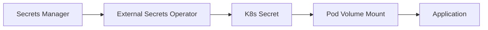

# 🗝️ Secrets Management

  

---

## 🎯 1. Overview

Secrets are the most sensitive assets in the platform. A single leaked credential can compromise an entire environment. This document defines secret classification, storage patterns, injection methods, rotation policies, and emergency procedures. All teams must follow these standards without exception.

For high-level security policy and secrets rules, see [Security](./03-security.md).

---

## 📋 2. Secret Types and Classification

| Secret Type | Classification | Rotation Frequency | Example |
|-------------|---------------|-------------------|---------|
| **Database credentials** | Critical | 30 days (automated) | Aurora RDS passwords |
| **API keys (third-party)** | High | 90 days | Payment gateway, mapping APIs |
| **Service account tokens** | High | 90 days (automated) | Inter-service OAuth2 clients |
| **TLS certificates** | High | 90 days (automated via cert-manager) | mTLS, ingress certificates |
| **Encryption keys** | Critical | Annual (KMS-managed) | KMS CMK backing keys |
| **SSH keys** | High | 90 days | Bastion access (limited use) |
| **Webhook signing secrets** | Medium | 180 days | Event delivery verification |

---

## 🏗️ 3. Secrets Storage Patterns

All secrets are stored in a managed secrets store. No alternative storage is permitted for production secrets.

> **Substitution point:** Storage below uses **AWS Secrets Manager** and **SSM Parameter Store**; map to **GCP Secret Manager**, **Azure Key Vault**, **HashiCorp Vault**, or equivalent with the same access controls and audit logging.

| Storage | Use Case | Access Pattern |
|---------|----------|---------------|
| **AWS Secrets Manager** | Application secrets (DB creds, API keys) | External Secrets Operator syncs to K8s |
| **AWS SSM Parameter Store** | Non-sensitive configuration, feature flags | Direct SDK access or env injection |
| **KMS** | Encryption key material | Encrypt/decrypt API calls |

### 3.1 Prohibited Storage Locations

| Location | Why It Is Prohibited |
|----------|---------------------|
| Git repositories | Permanent history exposure, even after deletion |
| Environment variables (hardcoded) | Visible in process listings and crash dumps |
| Container images | Baked into immutable layers, visible via `docker inspect` |
| Kubernetes `Secret` manifests in Git | Base64 is encoding, not encryption |
| Local files on nodes | No access control, no rotation, no audit trail |

---

## 💉 4. Secret Injection Patterns

**Visual overview:**

| Pattern | Mechanism | When to Use |
|---------|-----------|-------------|
| **Volume mount** | ESO syncs secret to K8s Secret, mounted as file | Default for all applications |
| **Init container** | Fetch secret at startup, write to shared volume | Legacy apps that cannot use mounted files |
| **SDK direct fetch** | Application calls Secrets Manager API via IRSA | Dynamic secrets that change mid-lifecycle |

### 4.1 Injection Rules

| Rule | Rationale |
|------|-----------|
| Never pass secrets as command-line arguments | Visible in `/proc` and process listings |
| Prefer file mounts over environment variables | Env vars persist in crash dumps and child processes |
| Use separate secrets per environment | No shared credentials between staging and production |
| One secret per purpose | Do not bundle unrelated secrets into a single entry |

---

## 🔄 5. Rotation Policies

| Secret Type | Rotation Period | Mechanism | Downtime |
|-------------|----------------|-----------|----------|
| **Database credentials** | 30 days | Secrets Manager Lambda rotation | Zero (dual-credential strategy) |
| **Third-party API keys** | 90 days | Manual rotation with Secrets Manager update | Zero (overlap window) |
| **Service account tokens** | 90 days | Automated OAuth2 client rotation | Zero |
| **TLS certificates** | 90 days | cert-manager automatic renewal | Zero |

### 5.1 Dual-Credential Rotation

Database credential rotation uses a dual-credential strategy to avoid downtime:

1. Secrets Manager creates a new credential (version `AWSPENDING`)
2. Rotation Lambda sets the new password in the database
3. Both old and new credentials work during the transition window
4. After verification, the new credential becomes `AWSCURRENT`
5. Applications pick up the new credential on next secret refresh

---

## 🚨 6. Emergency Rotation

When a secret is suspected compromised, any engineer can trigger emergency rotation:

| Step | Action | Owner |
|------|--------|-------|
| 1 | Identify the compromised secret | Discovering engineer |
| 2 | Trigger immediate rotation via CLI or console | Discovering engineer |
| 3 | Verify dependent services authenticate successfully | On-call engineer |
| 4 | Notify security team within 1 hour | Discovering engineer |
| 5 | Open P1 security incident | Security team |
| 6 | Conduct post-mortem within 5 business days | Security + owning team |

---

## 📊 7. Monitoring and Alerting

| Metric | Alert Condition | Severity |
|--------|----------------|----------|
| Secret age exceeds rotation policy | Overdue by 24 hours | P1 |
| Rotation Lambda failure | Any invocation failure | P1 |
| Unusual secret access pattern | > 10 reads in 5 minutes from unexpected principal | P0 |
| Secret not accessed in 90 days | Potential orphaned secret | P3 (review) |
| New IAM principal accessing secret | First-time access from unknown role | P2 |

All secret access events are logged via CloudTrail and shipped to the central SIEM for correlation and alerting.

---

⬅️ [Back to section](./README.md) · 🏠 [Back to root](../README.md)

